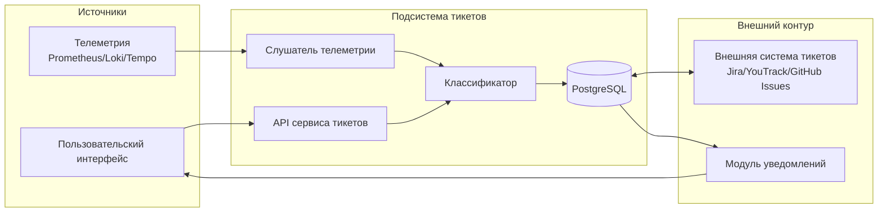

# ADR-IMPL.OPS.ticket-management-system-architecture

**Дата:** 2026-05-18  
**Статус:** Принято

## Контекст

В VEDO Core отсутствовал формальный канал сбора обратной связи от пользователей. Сообщения о сбоях, деградации производительности и предложениях поступали разрозненно (личные сообщения, письма, чаты), из-за чего терялись, не получали единых приоритетов и не попадали в управляемый цикл обработки.

Бизнес-требования к подсистеме уже зафиксированы в `vision.md` и в спецификации `requirements/REQ-FUN.INTEGRATION.ticket-management.md` (требования `T-01`-`T-42`):
- создание тикета авторизованным пользователем через интерфейс (сайдбар -> Помощь -> Поддержка);
- классификация по категориям (ошибка, производительность, вопрос, предложение, документация, доступ);
- автоматическое обогащение метаданными (версия, окружение, `trace_id`, контекст запроса, вложения);
- автоматическое создание тикетов из телеметрии (алерты, логи, метрики, аномалии);
- единый бэкенд для ручных и автоматических тикетов;
- уведомления пользователю об изменении состояния;
- архитектурная готовность к двусторонней синхронизации с внешней системой тикетов.

Единое решение для ручных и автоматических тикетов необходимо, чтобы:
- сохранять один источник истины по жизненному циклу;
- применять общие правила приоритезации, эскалации и дедупликации;
- строить сводную аналитику для поддержки и продуктового управления;
- исключить расхождение состояний между «пользовательскими» и «телеметрическими» инцидентами.

## Требование-источник

- [vision.md](vision.md)
- [ticket-management-system.md](requirements/REQ-FUN.INTEGRATION.ticket-management.md) — `T-01`-`T-42`

## Решение

Принять единую подсистему управления тикетами VEDO Core как отдельный операционный контур с единым хранилищем, единым жизненным циклом и обязательной трассируемостью каждого изменения состояния.

### 1) Компоненты подсистемы

| Компонент | Технология | Назначение |
|----------|------------|------------|
| API сервиса тикетов | Go, REST | Приём, создание, обновление, просмотр тикетов и комментариев |
| Слушатель телеметрии | Go, Kafka или HTTP | Приём событий наблюдаемости и запуск автоматического создания тикетов |
| Классификатор | Python (правила; при необходимости модель) | Категоризация, назначение приоритета, дедупликация, поиск типовых решений |
| Хранилище | PostgreSQL | Тикеты, метаданные, история состояний, комментарии, связи с внешними системами |
| Синхронизатор | Go | Асинхронный обмен с внешними системами тикетов (исходящие операции и входящие вебхуки) |
| Модуль уведомлений | Go | Email, встроенные уведомления, WebSocket; для P0/P1 — Slack/PagerDuty |

### 2) Потоки данных

### 3) Технологические принципы

- Ручные и автоматические тикеты хранятся в одной модели данных с полем `source` (`manual`/`telemetry`).
- Классификация и приоритезация выполняются автоматически по правилам; использование модели допускается как расширение без изменения контракта API.
- Дедупликация выполняется по сигнатуре (`service`, `error_type`, `error_hash`, `category`) в окне 24 часа.
- Обогащение метаданными выполняется при создании: версия продукта, окружение, `trace_id`, URL, `user_agent`, идентификатор пользователя, вложения.
- Интеграция с внешней системой — асинхронная и двусторонняя: исходящие операции через очередь синхронизации, входящие изменения через вебхуки или опрос.
- Эскалация для P0/P1 выполняется по операционной политике поддержки и маршрутизируется в Slack/PagerDuty.

### 4) Минимальная модель данных тикета

| Поле | Тип | Назначение |
|------|-----|------------|
| `id` | UUID | Внутренний идентификатор тикета |
| `number` | BIGINT | Единая сквозная нумерация |
| `source` | ENUM(`manual`,`telemetry`) | Источник создания |
| `status` | ENUM(`new`,`in_review`,`in_progress`,`resolved`,`closed`,`reopened`) | Состояние жизненного цикла |
| `category` | ENUM | Категория обращения |
| `severity` | ENUM(`critical`,`high`,`medium`,`low`) | Серьёзность |
| `priority` | ENUM(`p0`,`p1`,`p2`,`p3`) | Операционный приоритет |
| `title` | TEXT | Краткое описание |
| `description` | TEXT | Подробности проблемы/предложения |
| `metadata` | JSONB | Версия, окружение, `trace_id`, URL, `user_agent`, служебные признаки |
| `reporter_user_id` | UUID, NULL | Автор ручного тикета |
| `external_ref` | JSONB, NULL | Связь с внешней системой (ключ проекта, номер, ссылка) |
| `duplicate_of` | UUID, NULL | Ссылка на родительский тикет при дедупликации |
| `created_at`,`updated_at`,`closed_at` | TIMESTAMP | Аудит изменений |

## Рассмотренные альтернативы

| Альтернатива | Причина отклонения |
|--------------|--------------------|
| **A: Использовать внешнюю систему тикетов как единственное хранилище (без собственного бэкенда)** | Невозможно надёжно реализовать автоматические тикеты из телеметрии и единое обогащение метаданными; ограниченный контроль жизненного цикла и аналитики; высокая зависимость от внешнего поставщика. |
| **B: Поддерживать только ручные тикеты (без автоматических)** | Теряется проактивное обнаружение массовых и инфраструктурных проблем; увеличивается время до реакции; часть инцидентов остаётся незамеченной пользователем. |
| **C: Хранить автоматические тикеты отдельно от ручных** | Разделяются нумерация, правила эскалации и отчётность; усложняется анализ причин и повторяемости; растёт риск дублирования и рассинхронизации процессов. |

## Последствия

**Положительные последствия:**
- Единый источник истины по тикетам и их жизненному циклу.
- Проактивное обнаружение проблем через телеметрию.
- Повышение качества поддержки за счёт автоматической классификации и маршрутизации.
- Накопление измеримых данных для продуктовой приоритезации.

**Отрицательные последствия:**
- Добавляется новый операционный контур (развёртывание, мониторинг, сопровождение).
- Синхронизация с внешними системами требует отдельной очереди и обработки ошибок.
- Возможны дубли тикетов при повторных событиях и сетевых сбоях.

**Меры снижения рисков:**
- Дедупликация по сигнатуре и временному окну 24 часа.
- Идемпотентность операций создания и синхронизации (ключ идемпотентности на событие).
- Мониторинг очереди синхронизации и повторные попытки с ограничением.
- Аудит состояния синхронизации и периодическая сверка внешних ссылок.

## Связанные ADR

- `ADR-DES.INFRA.otel-observability-strategy` — источники телеметрии и трассируемость.
- `ADR-DES.INFRA.critical-alerts-strategy` — критичность сигналов и правила эскалации.
- `ADR-DES.OPS.support-sla-and-escalation-strategy` — SLA, маршрутизация P0/P1, роли эскалации.
- `ADR-DES.DATA.storage-stack-strategy` — использование PostgreSQL как операционного хранилища.
- `ADR-DES.API.protocol-stack-strategy` — REST/WebSocket контракт для пользовательского контура.

---
