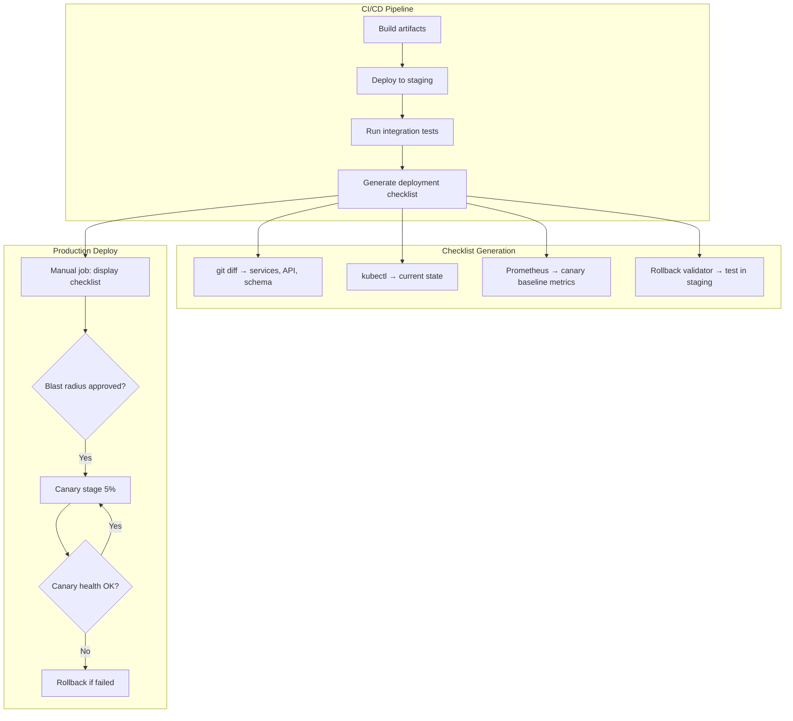

# ADR-IMPL.PROCESS.deployment-checklist-mandate

**Дата:** 2026-05-17  
**Статус:** Принято

## Контекст

VEDO Core использует GitLab CI для production deployment (согласно `ADR-IMPL.PROCESS.gitlab-ci-cd-strategy`). Текущий процесс включает manual job для production deploy, но инженер видит только:

```
Deploy to production? (manual)
  ✅ Allow
  ❌ Cancel
```

Отсутствует информация о:
- **Blast radius** — какие сервисы, БД, API, tenant затронуты
- **Canary status** — текущий процент трафика, метрики canary vs baseline
- **Rollback path** — команда отката, RTO/RPO оценка, подтверждение тестирования

**Индустриальные инциденты, предотвратимые лучшей видимостью деплоя:**

| Компания | Год | Инцидент | Что не хватило |
|----------|-----|----------|----------------|
| **Knight Capital** | 2012 | $460M потеря за 45 мин из-за некорректного деплоя торгового алгоритма | Blast radius (затронуты все серверы), canary (0% тестирования), kill switch (нет быстрого отката) |
| **GitLab** | 2017 | Удаление production БД при репликации, 18 часов восстановления | Rollback path (не был протестирован), blast radius (не оценена зона поражения) |
| **Atlassian** | 2022 | Carbon-баг — нерабочие 24 часа, $3.5M direct cost | Canary monitoring (баг обнаружен только после 100% раскатки), rollback (занял часы) |

**Почему существующие инструменты не решают проблему:**

- **ArgoCD** — используется для GitOps, но его ApplicationSet и Notifications не дают структурированного checklist перед deploy; не интегрирован с GitLab CI manual gates
- **Spinnaker** — слишком тяжёл для текущего стека; не оправдывает стоимость внедрения для MVP
- **Grafana дашборды** — инженер должен вручную переключаться между дашбордами для canary, БД, API метрик

**Архитектурные компоненты, необходимые для реализации:**

- **Checklist Generator** — Python-скрипт, собирающий данные из git diff, kubectl, Prometheus
- **Canary Metrics Aggregator** — запросы к Prometheus для сравнения canary vs baseline
- **Rollback Validator** — проверка rollback команды в staging перед production
- **CLI Renderer** — вывод checklist в ASCII-box формате в терминал CI/CD
- **Override Handler** — протокол manual override для soft block условий

## Требование-источник

- [Deployment Checklist Specification v1.0](deployment-checklist.md) — техническая спецификация: форматы полей, блокинг критерии, шаблоны CI, примеры
- [ADR-IMPL.PROCESS.gitlab-ci-cd-strategy](#adr-implprocessgitlab-ci-cd-strategy) — базовый CI/CD pipeline
- [ADR-DES.PROCESS.deployment-strategy-policy](#adr-desprocessdeployment-strategy-policy) — canary/blue-green стратегии
- [ADR-DES.PROCESS.major-version-migration-strategy](#adr-desprocessmajor-version-migration-strategy) — rollback для major-версий
- [ADR-DES.PROCESS.deployment-integrity-strategy](#adr-desprocessdeployment-integrity-strategy) — проверка целостности артефактов
- `human/milestones/001-init/artifacts/ci-cd-procedures.md` — процедуры CI/CD

---

## Решение

**Принцип:** "Deployment requires explicit risk visibility before execution" — ни один production deploy не выполняется без заполненного и утверждённого checklist.

**Четыре обязательных блока checklist:**

| Блок | Ключевые поля | Hard block condition |
|------|---------------|---------------------|
| 0: Идентификация | Deploy ID, commit, окружение, инициатор, тип деплоя | Missing required field |
| 1: Blast radius | Затронутые сервисы, схемы БД, breaking API, tenant %, feature flags | Schema changes без rollback plan; >3 сервисов без SRE Lead approval |
| 2: Canary status | Error rate, latency p99, health checks, business metrics, новые алерты | Error rate > baseline ×2; latency > baseline ×1.5; любой P0/P1 алерт |
| 3: Rollback path | Тип, команда, RTO, RPO, тест в staging, auto-trigger | Rollback не тестирован за 7 дней; RTO > target |
| 4: Compliance | Change request, approvals, window, evidence, audit trail | Нет compliance evidence; вне deployment window |

**Blocking criteria:**
- **Hard block** (7 условий) — deploy невозможен, pipeline останавливается
- **Soft block** (5 условий) — требует manual override с approval SRE Lead

**MVP минимальный набор:** 8 полей (deploy id, commit, environment, affected_services, db_schema_changes, breaking_api_changes, canary_pct, rollback_command)

**Архитектурная схема:**



**Форматы отображения:**
- **CLI (ASCII table)** — primary для SRE/DevOps в терминале CI/CD
- **GitLab CI output** — интеграция с existing pipeline, colored PASS/BLOCK
- **ChatOps (Slack)** — опционально, для быстрых approval

**Автоматическое заполнение:**
- **Blast radius** — из `git diff` (затронутые файлы → сервисы), из MR description (schema changes, API breakage), из `kubectl` (текущие реплики)
- **Canary metrics** — из Prometheus (error rate, latency, health checks)
- **Rollback команда** — из `helm history` (текущий revision)
- **Rollback тест** — из staging CI/CD (дата последнего успешного rollback drill)

**Canary integration:**
Checklist не просто показывает статус, но и управляет canary этапами:
1. После утверждения blast radius → canary 5%
2. Через 12 мин мониторинга → сравнение метрик (checklist обновляется)
3. Если метрики OK → manual approval для следующего этапа
4. Если не OK → auto-rollback + уведомление

## Rollback Integration

Checklist связан с `ADR-DES.PROCESS.rollback-data-strategy` через блок 3 (Rollback Path):

| Поле | Связь с Rollback Data Strategy |
|------|-------------------------------|
| `rollback_type` | Определяет стратегию: code-only для patch/minor, code+data для major с миграциями |
| `rollback_command` | Должна быть предварительно проверена в staging (rollback drill) |
| `rollback_rpo_min` | Соответствует политике RPO из rollback-data-strategy: TBox 5 мин, ABox 15 мин |
| `post_rollback_verification` | Использует проверки целостности данных (counts, checksum) определённые в rollback-data-strategy |

Обязательное условие: если `db_schema_changes` непуст, то `rollback_type` не может быть `code-only` — требуется `code+data` с проверенной миграцией отката.

## Рассмотренные альтернативы

**Альтернатива A (Baseline): Оставить как есть — manual job без checklist**

| Достоинства | Недостатки |
|-------------|------------|
| Нулевая стоимость внедрения | Инженер не видит blast radius, canary метрики, rollback path |
| Не требует изменений в CI/CD | Риск: Knight Capital — deploy без оценки последствий |
| Не замедляет deploy | Нет истории решений (почему deploy был утверждён) |

**Причина отклонения:** Не решает проблему visibility. Инженер не имеет информации для принятия решения.

**Альтернатива Б: Использовать ArgoCD + ApplicationSet + Notifications**

| Достоинства | Недостатки |
|-------------|------------|
| Готовое решение для GitOps | Добавляет новый компонент в стек (ArgoCD) |
| Встроенные health checks | Не интегрируется нативно с GitLab CI manual gates |
| Notifications в Slack | Требует отдельного обучения команды |

**Причина отклонения:** ArgoCD не решает задачу structured checklist перед deploy. GitLab CI manual jobs — текущий стандарт; добавление ArgoCD только для checklist избыточно.

**Альтернатива В: Только ChatOps (Slack) без CLI/GitLab интеграции**

| Достоинства | Недостатки |
|-------------|------------|
| Быстрая разработка (бот) | Не все SRE работают из Slack |
| Удобно для approval | Нет истории в CI/CD — сложнее аудит |
| | Slack может быть недоступен при инциденте |

**Причина отклонения:** Checklist должен быть частью CI/CD pipeline (история, артефакты, audit trail). Slack — дополнительный канал, не замена.

**Альтернатива Г: Полностью автоматический canary без manual approval**

| Достоинства | Недостатки |
|-------------|------------|
| Быстрее: не ждёт человека | Для major-версий и schema changes нужен human decision |
| Меньше операционной нагрузки | Auto-promote может пропустить бизнес-метрики (не только технические) |

**Причина отклонения:** Для критических деплоев (major version, schema changes, breaking API) требуется человеческое решение. Полная автоматизация — future goal, не MVP.

**Альтернатива Д: Web UI дашборд (Grafana + custom plugin)**

| Достоинства | Недостатки |
|-------------|------------|
| Визуально богаче CLI | Требует разработки Grafana plugin или custom UI |
| Доступен всем (не только SRE) | Инженер всё равно должен открыть браузер — дополнительный шаг |
| | CLI достаточен для MVP; Web UI — post-MVP enhancement |

**Причина отклонения:** Слишком тяжело для MVP. CLI-вывод в терминале CI/CD — минимально достаточное решение.

## Последствия

**Положительные последствия:**

- Инженер видит полную картину риска перед deploy: blast radius, canary метрики, rollback path — на одном экране
- Canary метрики в реальном времени — не нужно переключаться между Grafana дашбордами
- Rollback path верифицирован до deploy, а не после — снижение MTTR при инциденте
- Соответствие SRE best practices (Google SRE book, Chapter 10: "Deployment")
- Аудит всех production деплоев с полным контекстом (почему был утверждён, какие риски)
- Снижение MTTD при canary проблемах — автоматическое сравнение метрик на каждом этапе

**Отрицательные последствия и меры снижения:**

| Последствие | Описание | Мера снижения |
|-------------|----------|---------------|
| Увеличение времени deploy | Инженер должен прочитать и подтвердить checklist (+2-5 мин) | Автоматизация заполнения (90% полей из git diff, Prometheus, kubectl). Человек подтверждает, не вводит |
| Checklist fatigue | Инженер нажимает approve не глядя | Randomize порядок hard block условий. Confirmation text для critical полей. Audit пропущенных approvals (кто approve быстрее 10 сек) |
| Неточность blast radius | git diff может не отразить полную зону поражения (например, transitive dependencies) | Developer обязан дополнить в MR description. SRE проверяет перед deploy. Со временем — обучение модели |
| Дополнительная разработка | Checklist generator, canary collector, CLI renderer | MVP реализуется как Python-скрипты в репозитории (3-5 дней разработки). Постепенное расширение |
| Override без причины | SRE может override soft block без достаточного основания | Каждый override фиксируется в audit trail. Еженедельный review override причин |

**Compliance Mapping:**

| Стандарт | Требование | Реализация |
|----------|------------|------------|
| **Google SRE Book Ch.10** | "Deployment should include rollout planning, monitoring, and rollback" | Checklist с canary stages и rollback path |
| **SOC2 CC7.1** | "Changes must be authorized and tested before production" | Approvals в блоке 4; rollback test в блоке 3 |
| **OWASP ASVS V4** | "Access control verification" | Blast radius включает tenant impact оценку |

## Ссылки

- [Deployment Checklist Specification v1.0](deployment-checklist.md) — technical specification: 4 field blocks, display formats, CI configuration, auto-fill templates, error handling
- [ADR-IMPL.PROCESS.gitlab-ci-cd-strategy](#adr-implprocessgitlab-ci-cd-strategy) — базовый CI/CD pipeline для GitLab CI
- [ADR-DES.PROCESS.deployment-strategy-policy](#adr-desprocessdeployment-strategy-policy) — canary, blue-green, rolling стратегии (определяет canary этапы)
- [ADR-DES.PROCESS.major-version-migration-strategy](#adr-desprocessmajor-version-migration-strategy) — rollback requirements для major-версий (блок 3)
- [ADR-DES.PROCESS.deployment-integrity-strategy](#adr-desprocessdeployment-integrity-strategy) — проверка целостности артефактов (блок 4 compliance)
- [ADR-DES.PROCESS.rollback-data-strategy](#adr-desprocessrollback-data-strategy) — политика RTO/RPO для data rollback (блок 3)
- `human/milestones/001-init/artifacts/ci-cd-procedures.md` — процедуры CI/CD

---
