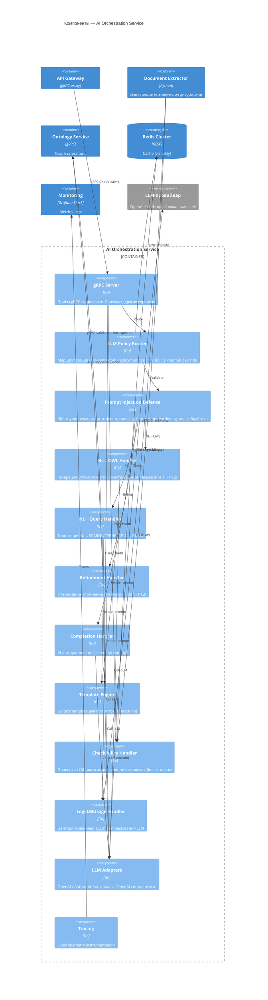

# C4 Architecture — VEDO Core

## Диаграммы компонентов

### AI Orchestration Service

```mermaid
C4Component
    title Компоненты — AI Orchestration Service

    Container_Boundary(aiOrch, "AI Orchestration Service") {
        Component(grpc_server, "gRPC Server", "Go", "Приём gRPC-запросов от Gateway и других сервисов")
        Component(policy_router, "LLM Policy Router", "Go", "Маршрутизация LLM-запросов: deployment type × visibility × admin override")
        Component(prompt_defense, "Prompt Injection Defense", "Go", "Многоуровневая защита: фильтрация, system prompt hardening, пост-обработка")
        Component(nl_to_owl, "NL→OWL Handler", "Go", "Генерация OWL-онтологии из естественного языка (F14.1, F14.2)")
        Component(nl_query, "NL→Query Handler", "Go", "Трансляция NL→SPARQL/CYPHER (F10.1, F10.2)")
        Component(refinement, "Refinement Handler", "Go", "Итеративное уточнение онтологии с diff (F14.2)")
        Component(completion, "Completion Handler", "Go", "AI-автодополнение (server-streaming)")
        Component(template_engine, "Template Engine", "Go", "Go text/template для промптов (shared/llm)")
        Component(check_policy, "CheckPolicy Handler", "Go", "Проверка LLM-политик для внешних сервисов (doc-extractor)")
        Component(log_usage, "LogLLMUsage Handler", "Go", "Централизованный аудит использования LLM")
        Component(llm_adapters, "LLM Adapters", "Go", "OpenAI / Anthropic / локальные OpenAI-совместимые")
        Component(tracing, "Tracing", "Go", "OpenTelemetry instrumentation")
    }

    Container(apiGw, "API Gateway", "gRPC proxy")
    Container(documentExtractor, "Document Extractor", "Python", "Извлечение онтологии из документов")
    Container(ontology, "Ontology Service", "gRPC", "Graph operations")
    ContainerDb(redis, "Redis Cluster", "RESP", "Cache (visibility)")
    Container(monitoring, "Monitoring", "Grafana Stack", "Metrics, logs")
    System_Ext(llmProvider, "LLM-провайдер", "OpenAI / Anthropic / локальная LLM")

    Rel(apiGw, grpc_server, "gRPC (/api/v1/ai/*)")
    Rel(documentExtractor, check_policy, "gRPC CheckPolicy")
    Rel(documentExtractor, log_usage, "gRPC LogLLMUsage")
    Rel(grpc_server, policy_router, "Route")
    Rel(policy_router, prompt_defense, "Validate")
    Rel(prompt_defense, nl_to_owl, "NL→OWL")
    Rel(prompt_defense, nl_query, "NL→Query")
    Rel(prompt_defense, refinement, "Refine")
    Rel(prompt_defense, completion, "Complete")
    Rel(grpc_server, check_policy, "Policy check")
    Rel(grpc_server, log_usage, "Usage audit")
    Rel(nl_to_owl, template_engine, "Render prompt")
    Rel(nl_query, template_engine, "Render prompt")
    Rel(refinement, template_engine, "Render prompt")
    Rel(nl_to_owl, llm_adapters, "Call LLM")
    Rel(nl_query, llm_adapters, "Call LLM")
    Rel(refinement, llm_adapters, "Call LLM")
    Rel(completion, llm_adapters, "Call LLM (stream)")
    Rel(llm_adapters, llmProvider, "HTTP API")
    Rel(nl_query, ontology, "gRPC (validation, introspection)")
    Rel(refinement, ontology, "gRPC ApplySequence")
    Rel(check_policy, redis, "Cache visibility")
    Rel(policy_router, redis, "Cache visibility")
    Rel(tracing, monitoring, "Traces")

    UpdateLayoutConfig($c4ShapeInRow="3", $c4BoundaryInRow="1")
```
