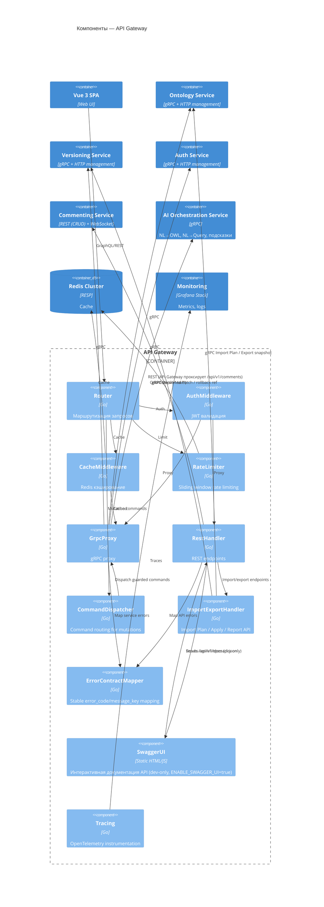

# C4 Architecture — VEDO Core

## Диаграммы компонентов

### API Gateway

```mermaid
C4Component
    title Компоненты — API Gateway

    Container_Boundary(gateway, "API Gateway") {
        Component(router, "Router", "Go", "Маршрутизация запросов")
        Component(auth_middleware, "AuthMiddleware", "Go", "JWT валидация")
        Component(cache_middleware, "CacheMiddleware", "Go", "Redis кэширование")
        Component(rate_limiter, "RateLimiter", "Go", "Sliding window rate limiting")
        Component(grpc_proxy, "GrpcProxy", "Go", "gRPC proxy")
        Component(rest_handler, "RestHandler", "Go", "REST endpoints")
        Component(command_dispatcher, "CommandDispatcher", "Go", "Command routing for mutations")
        Component(import_export_handler, "ImportExportHandler", "Go", "Import Plan / Apply / Report API")
        Component(error_contract_mapper, "ErrorContractMapper", "Go", "Stable error_code/message_key mapping")
        Component(swagger, "SwaggerUI", "Static HTML/JS", "Интерактивная документация API (dev-only, ENABLE_SWAGGER_UI=true)")
        Component(tracing, "Tracing", "Go", "OpenTelemetry instrumentation")
    }

    Container(spa, "Vue 3 SPA", "Web UI")
    Container(ontology, "Ontology Service", "gRPC + HTTP management")
    Container(versioning, "Versioning Service", "gRPC + HTTP management")
    Container(auth, "Auth Service", "gRPC + HTTP management")
    Container(commenting, "Commenting Service", "REST (CRUD) + WebSocket")
    Container(aiOrch, "AI Orchestration Service", "gRPC", "NL→OWL, NL→Query, подсказки")
    ContainerDb(redis, "Redis Cluster", "RESP", "Cache")
    Container(monitoring, "Monitoring", "Grafana Stack", "Metrics, logs")

    Rel(spa, router, "GraphQL/REST")
    Rel(router, auth_middleware, "Auth")
    Rel(router, cache_middleware, "Cache")
    Rel(router, rate_limiter, "Limit")
    Rel(router, command_dispatcher, "Mutation commands")
    Rel(auth_middleware, grpc_proxy, "Proxy")
    Rel(auth_middleware, rest_handler, "Proxy")
    Rel(rest_handler, import_export_handler, "Import/export endpoints")
    Rel(rest_handler, error_contract_mapper, "Map API errors")
    Rel(command_dispatcher, grpc_proxy, "Dispatch guarded commands")
    Rel(cache_middleware, grpc_proxy, "Cached")
    Rel(cache_middleware, redis, "Cache")
    Rel(rate_limiter, redis, "Counters")
    Rel(grpc_proxy, ontology, "gRPC")
    Rel(grpc_proxy, aiOrch, "gRPC (/api/v1/ai/*)")
    Rel(grpc_proxy, versioning, "gRPC")
    Rel(grpc_proxy, auth, "gRPC")
    Rel(rest_handler, commenting, "REST (API Gateway проксирует /api/v1/comments)")
    Rel(import_export_handler, ontology, "gRPC Import Plan / Export snapshot")
    Rel(import_export_handler, versioning, "gRPC Versioned batch / rollback ref")
    Rel(grpc_proxy, error_contract_mapper, "Map service errors")
    Rel(rest_handler, swagger, "Serves /api/v1/docs (dev only)")
    Rel(swagger, rest_handler, "Reads /api/v1/openapi.json")
    Rel(tracing, monitoring, "Traces")

    UpdateLayoutConfig($c4ShapeInRow="3", $c4BoundaryInRow="1")
```
