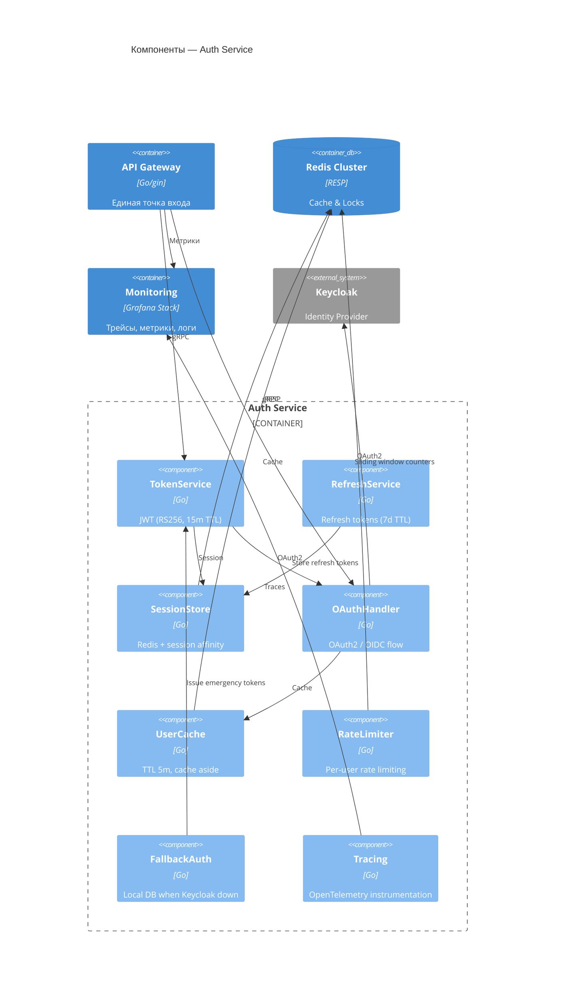

# C4 Architecture — VEDO Core

## Диаграммы компонентов

### Auth Service

```mermaid
C4Component
    title Компоненты — Auth Service

    Container_Boundary(auth, "Auth Service") {
        Component(token_service, "TokenService", "Go", "JWT (RS256, 15m TTL)")
        Component(refresh_service, "RefreshService", "Go", "Refresh tokens (7d TTL)")
        Component(session_store, "SessionStore", "Go", "Redis + session affinity")
        Component(oauth_handler, "OAuthHandler", "Go", "OAuth2 / OIDC flow")
        Component(user_cache, "UserCache", "Go", "TTL 5m, cache aside")
        Component(rate_limiter, "RateLimiter", "Go", "Per-user rate limiting")
        Component(fallback_auth, "FallbackAuth", "Go", "Local DB when Keycloak down")
        Component(tracing, "Tracing", "Go", "OpenTelemetry instrumentation")
    }

    Container(api_gw, "API Gateway", "Go/gin", "Единая точка входа")
    ContainerDb(redis, "Redis Cluster", "RESP", "Cache & Locks")
    Container(monitoring, "Monitoring", "Grafana Stack", "Трейсы, метрики, логи")
    System_Ext(keycloak, "Keycloak", "Identity Provider")

    Rel(api_gw, token_service, "gRPC")
    Rel(api_gw, oauth_handler, "gRPC")
    Rel(token_service, session_store, "Session")
    Rel(session_store, redis, "RESP")
    Rel(refresh_service, session_store, "Store refresh tokens")
    Rel(token_service, oauth_handler, "OAuth2")
    Rel(oauth_handler, keycloak, "OAuth2")
    Rel(oauth_handler, user_cache, "Cache")
    Rel(user_cache, redis, "Cache")
    Rel(rate_limiter, redis, "Sliding window counters")
    Rel(fallback_auth, token_service, "Issue emergency tokens")
    Rel(tracing, monitoring, "Traces")
    Rel(api_gw, monitoring, "Метрики")

    UpdateLayoutConfig($c4ShapeInRow="3", $c4BoundaryInRow="1")
```
