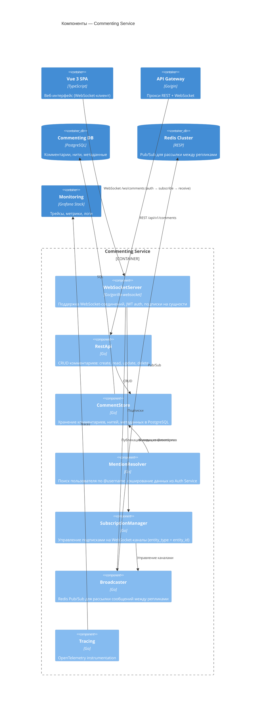

# C4 Architecture — VEDO Core

## Диаграммы компонентов

### Commenting Service

```mermaid
C4Component
    title Компоненты — Commenting Service

    Container_Boundary(commenting, "Commenting Service") {
        Component(ws_server, "WebSocketServer", "Go/gorilla-websocket", "Поддержка WebSocket-соединений, JWT auth, подписки на сущности")
        Component(rest_api, "RestApi", "Go", "CRUD комментариев: create, read, update, delete")
        Component(comment_store, "CommentStore", "Go", "Хранение комментариев, нитей, метаданных в PostgreSQL")
        Component(mention_resolver, "MentionResolver", "Go", "Поиск пользователя по @username, кэширование данных из Auth Service")
        Component(subscription_manager, "SubscriptionManager", "Go", "Управление подписками на WebSocket-каналы (entity_type + entity_id)")
        Component(broadcaster, "Broadcaster", "Go", "Redis Pub/Sub для рассылки сообщений между репликами")
        Component(tracing, "Tracing", "Go", "OpenTelemetry instrumentation")
    }

    Container(spa, "Vue 3 SPA", "TypeScript", "Веб-интерфейс (WebSocket-клиент)")
    Container(api_gw, "API Gateway", "Go/gin", "Прокси REST + WebSocket")
    ContainerDb(commentingDb, "Commenting DB", "PostgreSQL", "Комментарии, нити, метаданные")
    ContainerDb(redis, "Redis Cluster", "RESP", "Pub/Sub для рассылки между репликами")
    Container(monitoring, "Monitoring", "Grafana Stack", "Трейсы, метрики, логи")

    Rel(api_gw, rest_api, "REST /api/v1/comments")
    Rel(spa, ws_server, "WebSocket /ws/comments (auth → subscribe → receive)")
    Rel(rest_api, comment_store, "CRUD")
    Rel(ws_server, subscription_manager, "Подписки")
    Rel(ws_server, broadcaster, "Публикация новых комментариев")
    Rel(subscription_manager, broadcaster, "Управление каналами")
    Rel(broadcaster, redis, "Pub/Sub")
    Rel(mention_resolver, comment_store, "Валидация @mentions")
    Rel(comment_store, commentingDb, "SQL")
    Rel(tracing, monitoring, "Traces")

    UpdateLayoutConfig($c4ShapeInRow="3", $c4BoundaryInRow="1")
```
