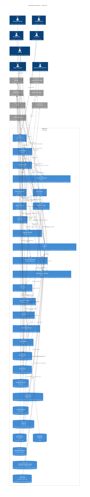

# C4 Architecture — VEDO Core

## Диаграмма контейнеров

```mermaid
C4Container
    title Диаграмма контейнеров — VEDO Core

    Person(uk, "Инженер знаний", "Создаёт и редактирует онтологии")
    Person(ua, "ИТ-архитектор", "Моделирует структуры")
    Person(ud, "Разработчик", "Интегрирует через REST API")
    Person(da, "Аналитик", "Просматривает граф")
    Person(devops, "DevOps", "Разворачивает, backup/restore, мониторинг")
    Person(support, "Support Engineer", "Диагностика, emergency операции")
    Person(ext, "Внешний пользователь", "Просматривает без авторизации")

    System_Boundary(vedo, "VEDO Core") {
        Container(spa, "Vue 3 SPA", "TypeScript/Vue 3", "Веб-интерфейс")
        Container(apiGw, "API Gateway", "Go/gin", "Единая точка входа, JWT, маршрутизация")
        Container(ontology, "Ontology Service", "Rust/Actix-web", "Graph operations, TBox/ABox, Neo4j driver")
        Container(documentExtractor, "Document Extractor", "Python", "Извлечение OWL-онтологии из документов через LLM: парсинг форматов, генерация последовательности шагов, предпросмотр")
        Container(versioning, "Versioning Service", "Rust/Tokio", "Git-like versioning")
        Container(auth, "Auth Service", "Go/gin", "JWT, OAuth2")
        Container(metrics, "Metrics Service", "Python/FastAPI", "Metrics collection")
        Container(publisher, "Publisher Service", "Rust/Actix-web", "Snapshot creation, publication CRUD")
        Container(publishBrowse, "Browse UI", "Vue 3 SPA", "Публичная навигация и поиск")
        Container(publicBrowseApi, "Public Browse API", "Rust/Actix-web", "Неавторизованные read-only endpoints для навигации и поиска")
        Container(cli, "vedo-cli", "Go", "CLI-утилита администрирования: backup/restore, diagnose, emergency, decommission, airgap, MR, support (Single binary, не контейнеризируется)")
        Container(commenting, "Commenting Service", "Go/gorilla-websocket", "Комментарии к сущностям онтологии с real-time доставкой через WebSocket")
        Container(aiOrch, "AI Orchestration Service", "Go/gRPC", "AI-оркестрация: NL→OWL, NL→Query, подсказки, рефайнмент, LLM Policy Router, Prompt Injection защита, CheckPolicy/LogLLMUsage")
        Container(ticketApi, "Ticket API", "Go/REST", "Создание, обновление, просмотр тикетов")
        Container(ticketTelemetry, "Telemetry Listener", "Go/Kafka или HTTP", "Автоматическое создание тикетов по телеметрии")
        Container(ticketClassifier, "Classifier", "Python", "Классификация, дедупликация, приоритезация")
        Container(ticketSync, "Ticket Synchronizer", "Go", "Двусторонняя синхронизация с внешней системой тикетов")
        Container(ticketNotifier, "Ticket Notifier", "Go", "Уведомления: email, in-app, эскалации P0/P1")
        ContainerDb(neo4j, "Neo4j Cluster", "Cypher", "3 core + 2 read replica, рабочая онтология")
        ContainerDb(publishNeo4j, "Public Neo4j", "Cypher", "Read-only копия для публичного доступа")
        ContainerDb(postgres, "PostgreSQL Cluster", "SQL/JSONB", "Primary + 2 standby (Version Store)")
        ContainerDb(supportDb, "Support DB", "PostgreSQL", "Отдельный кластер: support metadata, tenant info, break-glass audit")
        ContainerDb(commentingDb, "Commenting DB", "PostgreSQL", "Комментарии, нити, метаданные")
        ContainerDb(ticketDb, "Ticket DB", "PostgreSQL", "Тикеты, история, метаданные, синхронизация")
        ContainerDb(redis, "Redis Cluster", "RESP", "3 master + 3 replica")
        ContainerDb(rabbitmq, "RabbitMQ", "AMQP", "Events")
        ContainerDb(replicaStore, "Хранилище реплик", "S3/MinIO-compatible", "WAL, snapshots, off-site copy")
        ContainerDb(immutableBackup, "Immutable Backup Storage", "S3/MinIO + WORM/Object Lock", "Immutable backup копия, изолированные credentials")
        ContainerDb(vault, "Vault / KMS", "HashiCorp Vault / encFS", "Key management, secrets, encryption keys")
    }

    System_Ext(keycloak, "Keycloak", "Identity Provider")
    System_Ext(industry, "Отраслевая система", "ERP/PLM/MES")
    System_Ext(monitoring, "Grafana Stack", "Prometheus + Loki + Tempo")
    System_Ext(vcs, "Git-репозиторий", "GitHub/GitLab")
    System_Ext(gitlabIssues, "GitLab", "Внешняя система тикетов (Issues)")
    System_Ext(smtpGateway, "SMTP-шлюз", "Почтовая доставка уведомлений")
    System_Ext(llmProvider, "LLM-провайдер", "OpenAI / Anthropic / локальная LLM")

    Rel(uk, spa, "Использует")
    Rel(ua, spa, "Использует")
    Rel(ud, apiGw, "REST API")
    Rel(da, spa, "Просматривает")
    Rel(devops, spa, "Управляет")
    Rel(devops, cli, "Администрирует", "CLI")
    Rel(support, cli, "Диагностирует", "CLI")
    Rel(devops, monitoring, "Мониторит")
    Rel(ext, publishBrowse, "Просматривает без авторизации")

    Rel(spa, apiGw, "GraphQL/REST")
    Rel(spa, ticketApi, "Создаёт и просматривает тикеты", "HTTPS/REST")
    Rel(publishBrowse, publicBrowseApi, "HTTPS GET, navigation/search")
    Rel(publicBrowseApi, publishNeo4j, "Read-only Cypher, allowlisted queries")

    Rel(apiGw, ontology, "gRPC")
    Rel(apiGw, documentExtractor, "HTTP прокси (/extract-from-document)")
    Rel(apiGw, aiOrch, "gRPC (/api/v1/ai/*)")
    Rel(apiGw, versioning, "gRPC")
    Rel(apiGw, auth, "HTTP/JWT")
    Rel(apiGw, publisher, "gRPC")
    Rel(apiGw, commenting, "REST (комментарии CRUD)")
    Rel(apiGw, ticketApi, "REST (/support/tickets)")
    Rel(apiGw, redis, "Кэширование запросов")

    Rel(spa, commenting, "WebSocket /ws/comments", "JWT auth on connect")

    Rel(cli, apiGw, "gRPC (MR, экспорт)")
    Rel(documentExtractor, ontology, "gRPC ApplySequence")
    Rel(documentExtractor, aiOrch, "gRPC CheckPolicy/LogLLMUsage")
    Rel(documentExtractor, llmProvider, "HTTP API (генерация sequence)")
    Rel(aiOrch, llmProvider, "HTTP API (NL→OWL, NL→Query, completion)")
    Rel(aiOrch, ontology, "gRPC (NL-запросы, валидация)")
    Rel(aiOrch, redis, "Кэширование visibility онтологий")
    Rel(aiOrch, monitoring, "Traces")
    Rel(cli, ontology, "Diagnostics (health/ready)")
    Rel(cli, versioning, "Diagnostics")
    Rel(cli, auth, "Diagnostics")
    Rel(cli, publisher, "Diagnostics")
    Rel(cli, commenting, "Diagnostics")
    Rel(cli, aiOrch, "Diagnostics")
    Rel(cli, ticketApi, "Управляет тикетами (CRUD)", "REST/CLI")
    Rel(cli, neo4j, "Backup/restore")
    Rel(cli, postgres, "Backup/restore")
    Rel(cli, supportDb, "Support queries")
    Rel(cli, replicaStore, "Write/verify backups")
    Rel(cli, immutableBackup, "Write/verify immutable copies")
    Rel(cli, vault, "Key management, encrypt/decrypt")
    Rel(cli, keycloak, "OIDC ROPG+TOTP, refresh_token", "HTTPS")

    Rel(ontology, neo4j, "Cypher")
    Rel(publisher, neo4j, "Read-only snapshot data")
    Rel(publisher, publishNeo4j, "Copy snapshot data")
    Rel(versioning, postgres, "SQL")
    Rel(monitoring, ticketTelemetry, "Передаёт алерты/события", "Webhook/API")
    Rel(ticketTelemetry, ticketApi, "Создаёт автотикеты", "Internal REST")
    Rel(ticketApi, ticketClassifier, "Классификация/дедупликация", "HTTP/gRPC")
    Rel(ticketApi, ticketDb, "SQL")
    Rel(ticketApi, ticketSync, "Ставит задачи синхронизации", "Queue/DB")
    Rel(ticketSync, ticketDb, "Читает/обновляет статус синхронизации", "SQL")
    Rel(ticketSync, gitlabIssues, "Синхронизирует issue и комментарии", "HTTPS/Webhook")
    Rel(ticketApi, ticketNotifier, "Публикует события тикета", "Event/Queue")
    Rel(ticketNotifier, smtpGateway, "Отправляет email", "SMTP/TLS")
    Rel(ticketNotifier, spa, "Доставляет in-app уведомления", "WebSocket")
    Rel(metrics, rabbitmq, "Consume")
    Rel(auth, keycloak, "OAuth2")
    Rel(industry, apiGw, "REST API")

    Rel(metrics, monitoring, "Metrics")
    Rel(ontology, monitoring, "Traces")
    Rel(versioning, monitoring, "Traces")
    Rel(versioning, vcs, "Экспорт онтологий")
    Rel(publisher, monitoring, "Traces")
    Rel(publicBrowseApi, monitoring, "Traces")

    UpdateLayoutConfig($c4ShapeInRow="5", $c4BoundaryInRow="2")
```
