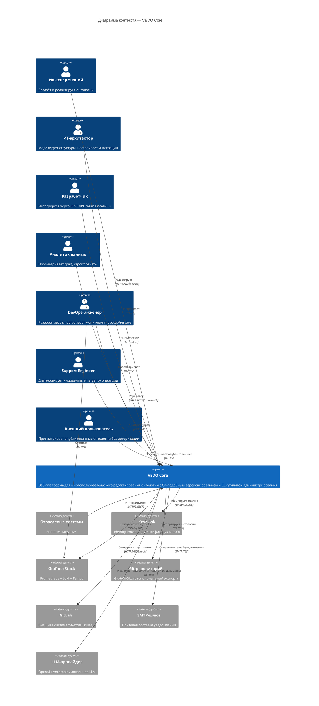

# C4 Architecture — VEDO Core

## Оглавление

- [Диаграмма контекста](#диаграмма-контекста)

---

## Диаграмма контекста

```mermaid
C4Context
    title Диаграмма контекста — VEDO Core

    Person(uk, "Инженер знаний", "Создаёт и редактирует онтологии")
    Person(ua, "ИТ-архитектор", "Моделирует структуры, настраивает интеграции")
    Person(ud, "Разработчик", "Интегрирует через REST API, пишет плагины")
    Person(da, "Аналитик данных", "Просматривает граф, строит отчёты")
    Person(devops, "DevOps-инженер", "Разворачивает, настраивает мониторинг, backup/restore")
    Person(support, "Support Engineer", "Диагностирует инциденты, emergency операции")
    Person(ext, "Внешний пользователь", "Просматривает опубликованные онтологии без авторизации")

    System(vedo, "VEDO Core", "Веб-платформа для многопользовательского редактирования онтологий с Git-подобным версионированием и CLI-утилитой администрирования")

    System_Ext(industry, "Отраслевые системы", "ERP, PLM, MES, LMS")
    System_Ext(keycloak, "Keycloak", "Identity Provider (аутентификация и SSO)")
    System_Ext(monitoring, "Grafana Stack", "Prometheus + Loki + Tempo")
    System_Ext(vcs, "Git-репозиторий", "GitHub/GitLab (опциональный экспорт)")
    System_Ext(gitlabIssues, "GitLab", "Внешняя система тикетов (Issues)")
    System_Ext(smtpGateway, "SMTP-шлюз", "Почтовая доставка уведомлений")
    System_Ext(llmProvider, "LLM-провайдер", "OpenAI / Anthropic / локальная LLM")

    Rel(uk, vedo, "Редактирует", "HTTPS/WebSocket")
    Rel(ua, vedo, "Настраивает", "HTTPS")
    Rel(ud, vedo, "Вызывает API", "HTTPS/REST")
    Rel(da, vedo, "Просматривает", "HTTPS")
    Rel(devops, vedo, "Управляет", "K8s API/SSH + vedo-cli")
    Rel(support, vedo, "Диагностирует", "vedo-cli")
    Rel(devops, monitoring, "Смотрит", "HTTPS")
    Rel(ext, vedo, "Просматривает опубликованные", "HTTPS")

    Rel(industry, vedo, "Интегрируется", "HTTPS/REST")
    Rel(vedo, keycloak, "Валидирует токены", "OAuth2/OIDC")
    Rel(vedo, monitoring, "Экспортирует метрики", "OTLP/gRPC")
    Rel(vedo, vcs, "Экспортирует онтологии", "SSH/Git")
    Rel(vedo, gitlabIssues, "Синхронизирует тикеты", "HTTPS/Webhook")
    Rel(vedo, smtpGateway, "Отправляет email-уведомления", "SMTP/TLS")
    Rel(vedo, llmProvider, "Извлекает структуру онтологии из документа", "HTTPS")

    UpdateLayoutConfig($c4ShapeInRow="3", $c4BoundaryInRow="1")
```
