# C4 Architecture — VEDO Core

## Диаграмма развёртывания

### SaaS (MVP) — Cloud Deployment

```mermaid
C4Deployment
    title Диаграмма развёртывания — VEDO Core SaaS

    Deployment_Node(cloud, "Cloud Provider", "Yandex Cloud / AWS") {
        Deployment_Node(k8s, "Kubernetes Cluster (K3s)") {
            Container(spa, "Vue 3 SPA", "TypeScript", "Frontend")
            Container(publishBrowse, "Browse UI", "Vue 3", "Публичная навигация")
            Container(public_browse_api, "Public Browse API", "Rust", "Read-only navigation/search")
            Container(api_gw, "API Gateway", "Go/gin", "Routing, Auth")
            Container(ontology, "Ontology Service", "Rust", "Graph CRUD")
            Container(versioning, "Versioning Service", "Rust", "Git-like")
            Container(auth, "Auth Service", "Go", "JWT, OAuth2")
            Container(publisher, "Publisher Service", "Rust", "Snapshot, publication")
            Container(commenting, "Commenting Service", "Go", "Комментарии, WebSocket")
            Container(ticketApi, "Ticket API", "Go", "Тикеты: CRUD и жизненный цикл")
            Container(ticketTelemetry, "Telemetry Listener", "Go", "Автотикеты из телеметрии")
            Container(ticketClassifier, "Classifier", "Python", "Классификация и дедупликация")
            Container(ticketSync, "Ticket Synchronizer", "Go", "Двусторонняя синхронизация issue")
            Container(ticketNotifier, "Ticket Notifier", "Go", "Email/in-app уведомления")
            Container(documentExtractor, "Document Extractor", "Python", "Извлечение онтологии из документов через LLM")
        }
        Deployment_Node(db, "Data Layer") {
                    ContainerDb(neo4j, "Neo4j", "Cypher", "Triple Store (working)")
            ContainerDb(publishNeo4j, "Public Neo4j", "Cypher", "Read-only copy (published)")
            ContainerDb(postgres, "PostgreSQL", "SQL/JSONB", "Version Store")
            ContainerDb(supportDb, "Support DB", "PostgreSQL", "Support metadata, break-glass audit")
            ContainerDb(commentingDb, "Commenting DB", "PostgreSQL", "Комментарии, нити")
            ContainerDb(ticketDb, "Ticket DB", "PostgreSQL", "Тикеты, история, синхронизация")
            ContainerDb(replica_store, "Хранилище реплик", "S3/MinIO-compatible", "WAL, snapshots")
            ContainerDb(immutableBackup, "Immutable Backup Storage", "S3/MinIO + WORM", "Immutable backup, изолированные credentials")
            ContainerDb(vault, "Vault / KMS", "HashiCorp Vault", "Key management")
            ContainerDb(redis, "Redis", "RESP", "Cache")
            ContainerDb(rabbitmq, "RabbitMQ", "AMQP", "Events")
        }
        Deployment_Node(observability, "Observability") {
            ContainerDb(prometheus, "Prometheus", "TSDB", "Metrics")
            ContainerDb(grafana, "Grafana", "Dashboards", "Uptime")
            ContainerDb(tempo, "Tempo", "Traces", "Distributed")
        }
        Deployment_Node(admin, "Admin Workstation / Server") {
            Container(cli, "vedo-cli", "Go", "Single binary: linux/amd64, linux/arm64, darwin/amd64, darwin/arm64, windows/amd64. Не контейнеризируется.")
        }
    }

    System_Ext(keycloak, "Keycloak", "Identity Provider")
    System_Ext(erp, "ERP / PLM", "External Systems")
    System_Ext(gitlabIssues, "GitLab", "Внешняя система тикетов (Issues)")
    System_Ext(smtpGateway, "SMTP-шлюз", "Почтовая доставка уведомлений")
    System_Ext(llmProvider, "LLM-провайдер", "OpenAI / Anthropic / локальная LLM")

    Rel(api_gw, ontology, "gRPC")
    Rel(api_gw, versioning, "gRPC")
    Rel(api_gw, auth, "gRPC")
    Rel(api_gw, publisher, "gRPC")
    Rel(api_gw, commenting, "REST /api/v1/comments")
    Rel(api_gw, ticketApi, "REST /support/tickets")
    Rel(api_gw, documentExtractor, "HTTP прокси (/extract-from-document)")
    Rel(spa, commenting, "WebSocket /ws/comments")
    Rel(spa, ticketApi, "HTTPS/REST")
    Rel(commenting, commentingDb, "SQL")
    Rel(ticketApi, ticketDb, "SQL")
    Rel(ticketApi, ticketClassifier, "HTTP/gRPC")
    Rel(ticketTelemetry, ticketApi, "Internal REST")
    Rel(ticketSync, ticketDb, "SQL")
    Rel(ticketSync, gitlabIssues, "HTTPS/Webhook")
    Rel(ticketNotifier, smtpGateway, "SMTP/TLS")
    Rel(ticketApi, ticketNotifier, "Event/Queue")
    Rel(publisher, neo4j, "Read-only")
    Rel(publisher, publishNeo4j, "Copy snapshot")
    Rel(publishBrowse, public_browse_api, "HTTPS GET")
    Rel(public_browse_api, publishNeo4j, "Read-only Cypher")
    Rel(ontology, neo4j, "Cypher")
    Rel(versioning, postgres, "SQL")
    Rel(neo4j, replica_store, "Snapshots / replica artifacts")
    Rel(postgres, replica_store, "WAL/archive replicas")
    Rel(api_gw, redis, "Cache")
    Rel(auth, keycloak, "OAuth2")
    Rel(erp, api_gw, "REST API")
    Rel(documentExtractor, llmProvider, "HTTP API (генерация последовательности шагов)")

    Rel(cli, api_gw, "gRPC (MR, export)")
    Rel(cli, neo4j, "Backup/restore")
    Rel(cli, postgres, "Backup/restore")
    Rel(cli, supportDb, "Support queries")
    Rel(cli, replica_store, "Write/verify backups")
    Rel(cli, immutableBackup, "Write/verify immutable copies")
    Rel(cli, vault, "Key management")
```

### On-Premise — Enterprise Deployment

```mermaid
C4Deployment
    title Диаграмма развёртывания — VEDO Core On-Premise

    Deployment_Node(dc, "Data Center", "Isolated network") {
        Deployment_Node(k8s, "Kubernetes Cluster") {
            Container(spa, "Vue 3 SPA", "Frontend")
            Container(publishBrowse, "Browse UI", "Vue 3", "Публичная навигация")
            Container(public_browse_api, "Public Browse API", "Rust", "Read-only navigation/search")
            Container(api_gw, "API Gateway", "Go/gin")
            Container(ontology, "Ontology Service", "Rust")
            Container(versioning, "Versioning Service", "Rust")
            Container(publisher, "Publisher Service", "Rust", "Snapshot, publication")
            Container(commenting, "Commenting Service", "Go", "Комментарии, WebSocket")
            Container(ticketApi, "Ticket API", "Go", "Тикеты: CRUD и жизненный цикл")
            Container(ticketTelemetry, "Telemetry Listener", "Go", "Автотикеты из телеметрии")
            Container(ticketClassifier, "Classifier", "Python", "Классификация и дедупликация")
            Container(ticketSync, "Ticket Synchronizer", "Go", "Двусторонняя синхронизация issue")
            Container(ticketNotifier, "Ticket Notifier", "Go", "Email/in-app уведомления")
            Container(documentExtractor, "Document Extractor", "Python", "Извлечение онтологии из документов через LLM")
        }
        Deployment_Node(storage, "Storage (Customer Provided)") {
            ContainerDb(neo4j, "Neo4j Enterprise", "Existing", "Working ontology")
            ContainerDb(publishNeo4j, "Public Neo4j", "Existing", "Read-only published")
            ContainerDb(postgres, "PostgreSQL", "Existing", "Version Store")
            ContainerDb(supportDb, "Support DB", "PostgreSQL", "Support metadata")
            ContainerDb(commentingDb, "Commenting DB", "PostgreSQL", "Комментарии, нити")
            ContainerDb(ticketDb, "Ticket DB", "PostgreSQL", "Тикеты, история, синхронизация")
            ContainerDb(replica_store, "Хранилище реплик", "MinIO/S3/NAS", "WAL, snapshots")
            ContainerDb(immutableBackup, "Immutable Backup Storage", "MinIO + Object Lock / NAS", "Immutable backup")
            ContainerDb(vault, "Vault / KMS", "encFS + key mgmt", "Key management")
            ContainerDb(redis, "Redis", "Existing")
        }
        Deployment_Node(monitoring, "Monitoring") {
            ContainerDb(grafana, "Grafana", "Existing")
            ContainerDb(prometheus, "Prometheus", "Existing")
        }
        Deployment_Node(admin, "Admin Workstation / Server") {
            Container(cli, "vedo-cli", "Go", "Single binary: linux/amd64, linux/arm64, darwin/amd64, darwin/arm64, windows/amd64. Не контейнеризируется.")
        }
    }

    System_Ext(keycloak, "Keycloak", "Local IdP")
    System_Ext(ldap, "LDAP / AD", "User Directory")
    System_Ext(backup, "Backup Storage", "Nightly backup")
    System_Ext(gitlabIssues, "GitLab", "Внешняя система тикетов (Issues)")
    System_Ext(smtpGateway, "SMTP-шлюз", "Почтовая доставка уведомлений")
    System_Ext(llmProvider, "LLM-провайдер", "OpenAI / Anthropic / локальная LLM (опционально для on-premise)")

    Rel(api_gw, ontology, "Internal")
    Rel(api_gw, versioning, "Internal")
    Rel(api_gw, publisher, "Internal")
    Rel(api_gw, commenting, "REST /api/v1/comments")
    Rel(api_gw, ticketApi, "REST /support/tickets")
    Rel(api_gw, documentExtractor, "HTTP прокси (/extract-from-document)")
    Rel(spa, commenting, "WebSocket /ws/comments")
    Rel(spa, ticketApi, "HTTPS/REST")
    Rel(commenting, commentingDb, "SQL")
    Rel(ticketApi, ticketDb, "SQL")
    Rel(ticketApi, ticketClassifier, "HTTP/gRPC")
    Rel(ticketTelemetry, ticketApi, "Internal REST")
    Rel(ticketSync, ticketDb, "SQL")
    Rel(ticketSync, gitlabIssues, "HTTPS/Webhook")
    Rel(ticketNotifier, smtpGateway, "SMTP/TLS")
    Rel(ticketApi, ticketNotifier, "Event/Queue")
    Rel(publisher, publishNeo4j, "Copy snapshot")
    Rel(publishBrowse, public_browse_api, "HTTPS GET")
    Rel(public_browse_api, publishNeo4j, "Read-only Cypher")
    Rel(ontology, neo4j, "Cypher")
    Rel(versioning, postgres, "SQL")
    Rel(neo4j, replica_store, "Snapshots / replica artifacts")
    Rel(postgres, replica_store, "WAL/archive replicas")
    Rel(keycloak, api_gw, "OAuth2")
    Rel(ldap, keycloak, "Sync")
    Rel(backup, replica_store, "Off-site/cold copy")
    Rel(documentExtractor, llmProvider, "HTTP API (генерация последовательности шагов)")

    Rel(cli, api_gw, "gRPC (MR, export)")
    Rel(cli, neo4j, "Backup/restore")
    Rel(cli, postgres, "Backup/restore")
    Rel(cli, supportDb, "Support queries")
    Rel(cli, replica_store, "Write/verify backups")
    Rel(cli, immutableBackup, "Write/verify immutable copies")
    Rel(cli, vault, "Key management, encrypt/decrypt")
```

### Local Development — Docker Compose

```mermaid
C4Deployment
    title Диаграмма развёртывания — VEDO Core Local Development

    Deployment_Node(workstation, "Developer Workstation", "macOS / Linux / Windows") {
        Deployment_Node(docker, "Docker Compose", "Single node, hot reload") {
            Container(spa, "Vue 3 SPA", "TypeScript", "Port 3000, Vite dev server")
            Container(publishBrowse, "Browse UI", "Vue 3", "Port 3010, публичная навигация")
            Container(public_browse_api, "Public Browse API", "Rust", "Port 9096, read-only")
            Container(api_gw, "API Gateway", "Go/gin", "Port 8080, debug enabled")
            Container(ontology, "Ontology Service", "Rust", "Port 9090, debug enabled")
            Container(versioning, "Versioning Service", "Rust", "Port 9091, debug enabled")
            Container(auth, "Auth Service", "Go", "Port 9093, debug enabled")
            Container(metrics, "Metrics Service", "Python", "Port 9094, debug enabled")
            Container(publisher, "Publisher Service", "Rust", "Port 9095, debug enabled")
            Container(commenting, "Commenting Service", "Go", "Port 9096, WebSocket, debug enabled")
            Container(ticketApi, "Ticket API", "Go", "Port 9097, debug enabled")
            Container(ticketTelemetry, "Telemetry Listener", "Go", "Port 9098, debug enabled")
            Container(ticketClassifier, "Classifier", "Python", "Port 9099, debug enabled")
            Container(ticketSync, "Ticket Synchronizer", "Go", "Port 9100, debug enabled")
            Container(ticketNotifier, "Ticket Notifier", "Go", "Port 9101, debug enabled")
            Container(documentExtractor, "Document Extractor", "Python", "Port 9102, debug enabled")
        }
        Deployment_Node(databases, "Data Layer (Local)") {
            ContainerDb(neo4j, "Neo4j", "Cypher", "Ports 7687/7474, рабочая онтология")
            ContainerDb(publishNeo4j, "Public Neo4j", "Cypher", "Ports 7688/7475, опубликованные")
            ContainerDb(postgres, "PostgreSQL", "SQL/JSONB", "Port 5432")
            ContainerDb(supportDb, "Support DB", "PostgreSQL", "Port 5433, support metadata")
            ContainerDb(commentingDb, "Commenting DB", "PostgreSQL", "Port 5434, комментарии, нити")
            ContainerDb(ticketDb, "Ticket DB", "PostgreSQL", "Port 5435, тикеты и история")
            ContainerDb(replica_store, "MinIO", "S3-compatible", "Port 9000/9001, локальные снапшоты")
            ContainerDb(immutableBackup, "MinIO (WORM)", "S3 + Object Lock", "Port 9002/9003, immutable backup")
            ContainerDb(redis, "Redis", "RESP", "Port 6379")
            ContainerDb(rabbitmq, "RabbitMQ", "AMQP", "Ports 5672/15672")
        }
        Deployment_Node(support, "Local Support Services") {
            Container(keycloak, "Keycloak", "OAuth2/OIDC", "Port 8180, local dev realm")
            Container(grafana, "Grafana", "Dashboards", "Port 3001, local dashboards")
            Container(vault, "Vault (dev)", "Key management", "Port 8200, dev mode")
            Container(cli, "vedo-cli", "Go", "Local build под целевую платформу, debug enabled. Single binary (linux/amd64, linux/arm64, darwin/amd64, darwin/arm64, windows/amd64)")
        }
    }

    Rel(spa, api_gw, "http://localhost:8080")
    Rel(publishBrowse, public_browse_api, "localhost:9096")
    Rel(api_gw, ontology, "localhost:9090")
    Rel(api_gw, versioning, "localhost:9091")
    Rel(api_gw, auth, "localhost:9093")
    Rel(api_gw, metrics, "localhost:9094")
    Rel(api_gw, publisher, "localhost:9095")
    Rel(api_gw, commenting, "localhost:9096")
    Rel(api_gw, ticketApi, "localhost:9097")
    Rel(spa, commenting, "localhost:9096/ws")
    Rel(spa, ticketApi, "localhost:9097")
    Rel(api_gw, documentExtractor, "localhost:9102")
    Rel(commenting, commentingDb, "localhost:5434")
    Rel(ticketApi, ticketDb, "localhost:5435")
    Rel(ticketApi, ticketClassifier, "localhost:9099")
    Rel(ticketTelemetry, ticketApi, "localhost:9097")
    Rel(ticketSync, ticketDb, "localhost:5435")
    Rel(ticketApi, ticketNotifier, "localhost:9101")
    Rel(publisher, neo4j, "localhost:7687")
    Rel(publisher, publishNeo4j, "localhost:7688")
    Rel(public_browse_api, publishNeo4j, "localhost:7688")
    Rel(ontology, neo4j, "localhost:7687")
    Rel(versioning, postgres, "localhost:5432")
    Rel(metrics, rabbitmq, "localhost:5672")
    Rel(auth, keycloak, "localhost:8180")
    Rel(metrics, grafana, "localhost:3001")

    Rel(cli, api_gw, "localhost:8080")
    Rel(cli, neo4j, "localhost:7687")
    Rel(cli, postgres, "localhost:5432")
    Rel(cli, supportDb, "localhost:5433")
    Rel(cli, replica_store, "localhost:9000")
    Rel(cli, immutableBackup, "localhost:9002")
    Rel(cli, vault, "localhost:8200")
```

### Feature Matrix: Local vs Production

| Feature | Local Dev | Production |
|---------|-----------|------------|
| Neo4j | Single, no clustering | 3+1 cluster |
| PostgreSQL | Single, no replication | Primary + 2 standby |
| Support DB | Separate local instance | Separate cluster, Multi-AZ |
| Redis | Single, no cluster | 3+3 cluster |
| Replica Store | Local MinIO (port 9000) | S3/MinIO HA |
| Immutable Backup | Local MinIO WORM (port 9002) | S3/MinIO + Object Lock, изолированные credentials |
| Vault/KMS | ❌ Не входит в milestone 001 docker-compose. Для local dev используются `~/.vedo/config.yaml` или `VEDO_CLI_TOKEN` env. Подробнее: [ci-cd-requirements.md](requirements/REQ-FUN.PROCESS.ci-cd-requirements.md) | HashiCorp Vault / encFS |
| Auth | Embedded Keycloak | External Keycloak |
| Monitoring | Embedded Grafana | External Grafana stack |
| Commenting Service | Port 9096, WebSocket, debug enabled | Production, HA |
| Commenting DB | Separate local PostgreSQL (port 5434) | Отдельная БД в кластере Support |
| Publisher Service | Included | Included |
| Public Browse API | Included | Included |
| Public Neo4j | Separate local instance | Separate read-only instance |
| Ticket API | Included (debug mode) | Production, HA |
| Ticket DB | Separate local PostgreSQL (таблицы в support/ticket контуре) | Отдельная БД/схема в кластере Support |
| Ticket Synchronizer | Stub/mock внешнего контура | Двусторонняя синхронизация с GitLab Issues |
| SMTP integration | Local SMTP sink / mock | SMTP-шлюз организации (TLS) |
| Backup | Manual via `vedo-cli backup` | Automated 3-2-1 with `vedo-cli backup/verify` |
| vedo-cli | Local build под целевую платформу, debug enabled | Single binary (linux/amd64, linux/arm64, darwin/amd64, darwin/arm64, windows/amd64), admin workstation |
| Debug ports | Exposed | Disabled |
| Document Extractor | Port 9102, debug enabled | Production, LLM API key from Vault |
| Hot reload | Source mounts | Not applicable |
