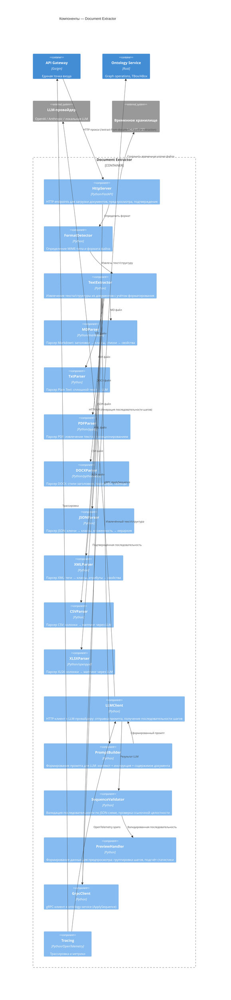

# C4 Architecture — VEDO Core

## Диаграммы компонентов

### Document Extractor

```mermaid
C4Component
    title Компоненты — Document Extractor

    Container_Boundary(docExtractor, "Document Extractor") {
        Component(http_server, "HttpServer", "Python/FastAPI", "HTTP endpoints для загрузки документов, предпросмотра, подтверждения")
        Component(format_detector, "FormatDetector", "Python", "Определение MIME-типа и формата файла")
        Component(text_extractor, "TextExtractor", "Python", "Извлечение текста/структуры из документов с учётом форматирования")
        Component(md_parser, "MDParser", "Python/markdown", "Парсер Markdown: заголовки → классы, списки → свойства")
        Component(txt_parser, "TxtParser", "Python", "Парсер Plain Text: сплошной текст → LLM")
        Component(pdf_parser, "PDFParser", "Python/pypdf", "Парсер PDF: извлечение текста с позиционированием")
        Component(docx_parser, "DOCXParser", "Python/python-docx", "Парсер DOCX: стили заголовков, параграфы, таблицы")
        Component(json_parser, "JSONParser", "Python", "Парсер JSON: ключи → классы, вложенность → иерархия")
        Component(xml_parser, "XMLParser", "Python", "Парсер XML: теги → классы, атрибуты → свойства")
        Component(csv_parser, "CSVParser", "Python", "Парсер CSV: колонки → маппинг через LLM")
        Component(xlsx_parser, "XLSXParser", "Python/openpyxl", "Парсер XLSX: колонки → маппинг через LLM")
        Component(llm_client, "LLMClient", "Python", "HTTP-клиент к LLM-провайдеру: отправка промпта, получение последовательности шагов")
        Component(prompt_builder, "PromptBuilder", "Python", "Формирование промпта для LLM: контекст + инструкция + содержимое документа")
        Component(sequence_validator, "SequenceValidator", "Python", "Валидация последовательности по JSON-схеме, проверка ссылочной целостности")
        Component(preview_handler, "PreviewHandler", "Python", "Формирование данных для предпросмотра: группировка шагов, подсчёт статистики")
        Component(grpc_client, "GrpcClient", "Python", "gRPC-клиент к ontology-service (ApplySequence)")
        Component(tracing, "Tracing", "Python/OpenTelemetry", "Трассировка и метрики")
    }

    Container(api_gw, "API Gateway", "Go/gin", "Единая точка входа")
    Container(ontology, "Ontology Service", "Rust", "Graph operations, TBox/ABox")
    System_Ext(llmProvider, "LLM-провайдер", "OpenAI / Anthropic / локальная LLM")
    System_Ext(file_storage, "Временное хранилище", "Local FS / S3", "Временное хранение загруженных файлов (TTL 24ч)")

    Rel(api_gw, http_server, "HTTP прокси (/extract-from-document, /confirm-extraction)")
    Rel(http_server, format_detector, "Определить формат")
    Rel(format_detector, text_extractor, "Извлечь текст/структуру")
    Rel(text_extractor, md_parser, "MD файл")
    Rel(text_extractor, txt_parser, "TXT файл")
    Rel(text_extractor, pdf_parser, "PDF файл")
    Rel(text_extractor, docx_parser, "DOCX файл")
    Rel(text_extractor, json_parser, "JSON файл")
    Rel(text_extractor, xml_parser, "XML файл")
    Rel(text_extractor, csv_parser, "CSV файл")
    Rel(text_extractor, xlsx_parser, "XLSX файл")
    Rel(text_extractor, prompt_builder, "Извлечённый текст/структура")
    Rel(prompt_builder, llm_client, "Сформированный промпт")
    Rel(llm_client, llmProvider, "HTTP API (генерация последовательности шагов)")
    Rel(llm_client, sequence_validator, "Результат LLM")
    Rel(sequence_validator, preview_handler, "Валидированная последовательность")
    Rel(http_server, file_storage, "Сохранить временную копию файла")
    Rel(http_server, grpc_client, "Подтверждённая последовательность")
    Rel(grpc_client, ontology, "gRPC ApplySequence")
    Rel(tracing, api_gw, "Трассировка")
    Rel(tracing, llm_client, "OpenTelemetry spans")

    UpdateLayoutConfig($c4ShapeInRow="4", $c4BoundaryInRow="1")
```
