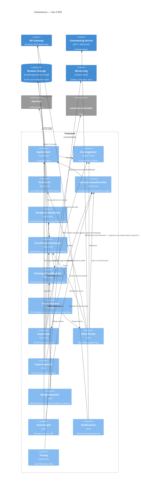

# C4 Architecture — VEDO Core

## Диаграммы компонентов

### Frontend

```mermaid
C4Component
    title Компоненты — Vue 3 SPA

    Container_Boundary(frontend, "Frontend") {
        Component(apollo_client, "ApolloClient", "TypeScript", "GraphQL client")
        Component(ontology_store, "OntologyStore", "Apollo Client", "Управление графом")
        Component(draft_store, "DraftStore", "TypeScript", "Local draft state for entity forms")
        Component(version_context, "VersionContextProvider", "TypeScript", "Ontology/branch/head/dirty context")
        Component(navigation_state, "NavigationStateStore", "TypeScript", "Selected entity, filters, expanded nodes")
        Component(error_presentation, "ErrorPresentationLayer", "TypeScript", "field/node/toast/modal error rendering")
        Component(ontology_type_registry, "OntologyUiTypeRegistry", "TypeScript", "Icons/colors/actions for ontology types")
        Component(theme_provider, "ThemeProvider", "TypeScript", "CSS variables, light/dark, customer overrides")
        Component(graph_view, "GraphView", "Vue Flow", "2D/3D визуализация")
        Component(editor_panels, "EditorPanels", "Vue", "TBox/ABox редакторы")
        Component(import_export_ui, "ImportExportUI", "Vue", "Import Plan, Apply, Report")
        Component(merge_request_ui, "MergeRequestUI", "Vue", "Merge Request: создание, ревью, слияние")
        Component(versioning_ui, "VersioningUI", "Vue", "Коммиты, ветки, diff")
        Component(notifications, "Notifications", "Vue", "WebSocket уведомления")
        Component(tracing, "Tracing", "TypeScript", "OpenTelemetry SDK")
    }

    Container(api_gateway, "API Gateway", "GraphQL/REST/WebSocket")
    Container(commenting, "Commenting Service", "REST + WebSocket", "Комментарии")
    ContainerDb(browser_storage, "Browser Storage", "localStorage/sessionStorage", "Drafts and navigation state")
    Container(monitoring, "Monitoring", "Grafana Stack", "Трейсы, метрики, логи")
    System_Ext(keycloak, "Keycloak", "Authentication")
    System_Ext(customer_overrides, "customer-overrides/", "Files", "Theme/logo/i18n overrides")

    Rel(apollo_client, api_gateway, "GraphQL/REST")
    Rel(apollo_client, ontology_store, "Queries")
    Rel(apollo_client, keycloak, "Authenticate")
    Rel(apollo_client, error_presentation, "Structured error contract")
    Rel(graph_view, ontology_store, "Display")
    Rel(graph_view, navigation_state, "Read selected entity")
    Rel(graph_view, ontology_type_registry, "Node semantics")
    Rel(editor_panels, ontology_store, "Mutations")
    Rel(editor_panels, draft_store, "Read/write form drafts")
    Rel(editor_panels, version_context, "Save in active branch")
    Rel(editor_panels, error_presentation, "Field/entity errors")
    Rel(import_export_ui, apollo_client, "Plan/apply/report")
    Rel(import_export_ui, version_context, "Create versioned batch")
    Rel(import_export_ui, error_presentation, "Import report errors")
    Rel(merge_request_ui, apollo_client, "GraphQL")
    Rel(merge_request_ui, navigation_state, "Preserve context")
    Rel(versioning_ui, apollo_client, "GraphQL")
    Rel(versioning_ui, version_context, "Head/branch/dirty state")
    Rel(notifications, commenting, "WebSocket /ws/comments — подписка на комментарии сущности")
    Rel(notifications, api_gateway, "REST (CRUD комментариев через API Gateway)")

    Rel(draft_store, browser_storage, "Persist drafts")
    Rel(navigation_state, browser_storage, "Persist UI context")
    Rel(version_context, apollo_client, "Read VersionContextReadModel")
    Rel(error_presentation, ontology_type_registry, "Terminology/help labels")
    Rel(theme_provider, customer_overrides, "Load overrides")
    Rel(theme_provider, graph_view, "Design tokens")
    Rel(theme_provider, editor_panels, "Design tokens")
    Rel(tracing, monitoring, "Traces")

    UpdateLayoutConfig($c4ShapeInRow="3", $c4BoundaryInRow="1")
```
