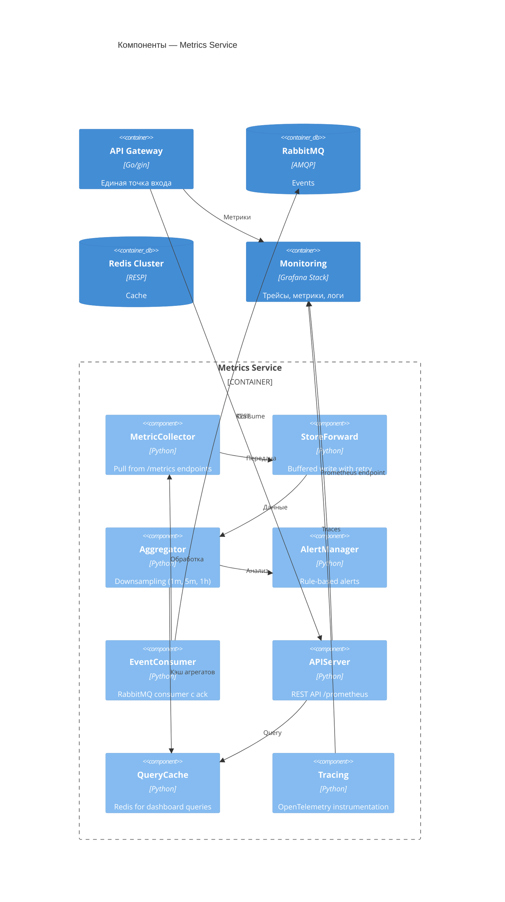

# C4 Architecture — VEDO Core

## Диаграммы компонентов

### Metrics Service

```mermaid
C4Component
    title Компоненты — Metrics Service

    Container_Boundary(metrics, "Metrics Service") {
        Component(metric_collector, "MetricCollector", "Python", "Pull from /metrics endpoints")
        Component(store_forward, "StoreForward", "Python", "Buffered write with retry")
        Component(aggregator, "Aggregator", "Python", "Downsampling (1m, 5m, 1h)")
        Component(alert_manager, "AlertManager", "Python", "Rule-based alerts")
        Component(event_consumer, "EventConsumer", "Python", "RabbitMQ consumer с ack")
        Component(api_server, "APIServer", "Python", "REST API /prometheus")
        Component(query_cache, "QueryCache", "Python", "Redis for dashboard queries")
        Component(tracing, "Tracing", "Python", "OpenTelemetry instrumentation")
    }

    Container(api_gw, "API Gateway", "Go/gin", "Единая точка входа")
    ContainerDb(rabbitmq, "RabbitMQ", "AMQP", "Events")
    ContainerDb(redis, "Redis Cluster", "RESP", "Cache")
    Container(monitoring, "Monitoring", "Grafana Stack", "Трейсы, метрики, логи")

    Rel(api_gw, api_server, "REST")
    Rel(event_consumer, rabbitmq, "Consume")
    Rel(event_consumer, metric_collector, "Обработка")
    Rel(metric_collector, store_forward, "Передача")
    Rel(store_forward, aggregator, "Данные")
    Rel(aggregator, alert_manager, "Анализ")
    Rel(aggregator, query_cache, "Кэш агрегатов")
    Rel(api_server, query_cache, "Query")
    Rel(api_server, monitoring, "Prometheus endpoint")
    Rel(tracing, monitoring, "Traces")
    Rel(api_gw, monitoring, "Метрики")

    UpdateLayoutConfig($c4ShapeInRow="3", $c4BoundaryInRow="1")
```
