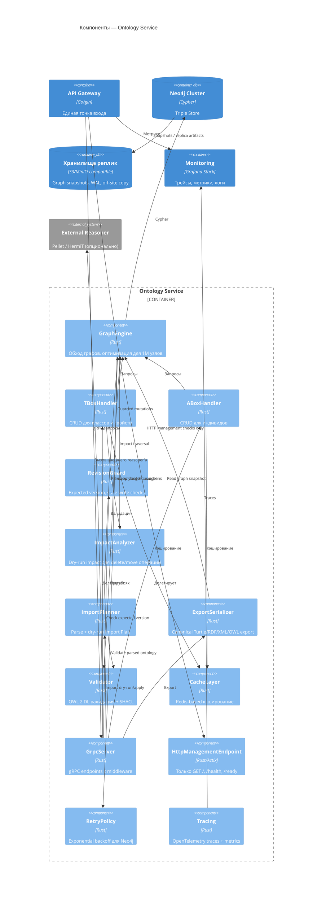

# C4 Architecture — VEDO Core

## Диаграммы компонентов

### Ontology Service

```mermaid
C4Component
    title Компоненты — Ontology Service

    Container_Boundary(ontology, "Ontology Service") {
        Component(graph_engine, "GraphEngine", "Rust", "Обход графов, оптимизация для 1M узлов")
        Component(tbox_handler, "TBoxHandler", "Rust", "CRUD для классов и свойств")
        Component(abox_handler, "ABoxHandler", "Rust", "CRUD для индивидов")
        Component(revision_guard, "RevisionGuard", "Rust", "Expected version, stale write checks")
        Component(impact_analyzer, "ImpactAnalyzer", "Rust", "Dry-run impact для delete/move операций")
        Component(import_planner, "ImportPlanner", "Rust", "Parse + dry-run Import Plan")
        Component(export_serializer, "ExportSerializer", "Rust", "Canonical Turtle/RDF/XML/OWL export")
        Component(validator, "Validator", "Rust", "OWL 2 DL валидация + SHACL")
        Component(cache_layer, "CacheLayer", "Rust", "Redis-based кэширование")
        Component(grpc_server, "GrpcServer", "Rust", "gRPC endpoints с middleware")
        Component(http_management_endpoint, "HttpManagementEndpoint", "Rust/Actix", "Только GET /, /health, /ready")
        Component(retry_policy, "RetryPolicy", "Rust", "Exponential backoff для Neo4j")
        Component(tracing, "Tracing", "Rust", "OpenTelemetry traces + metrics")
    }

    Container(api_gw, "API Gateway", "Go/gin", "Единая точка входа")
    ContainerDb(neo4j, "Neo4j Cluster", "Cypher", "Triple Store")
    ContainerDb(replicaStore, "Хранилище реплик", "S3/MinIO-compatible", "Graph snapshots, WAL, off-site copy")
    Container(monitoring, "Monitoring", "Grafana Stack", "Трейсы, метрики, логи")
    System_Ext(reasoner, "External Reasoner", "Pellet / HermiT (опционально)")

    Rel(api_gw, grpc_server, "gRPC запросы")
    Rel(api_gw, http_management_endpoint, "HTTP management checks only")
    Rel(grpc_server, revision_guard, "Check expected version")
    Rel(grpc_server, tbox_handler, "Делегирует")
    Rel(grpc_server, abox_handler, "Делегирует")
    Rel(grpc_server, import_planner, "Import dry-run/apply")
    Rel(grpc_server, export_serializer, "Export")
    Rel(revision_guard, graph_engine, "Guarded mutations")
    Rel(tbox_handler, graph_engine, "Запросы")
    Rel(abox_handler, graph_engine, "Запросы")
    Rel(tbox_handler, impact_analyzer, "Preview dangerous actions")
    Rel(impact_analyzer, graph_engine, "Impact traversal")
    Rel(import_planner, validator, "Validate parsed ontology")
    Rel(import_planner, graph_engine, "Plan/apply batch changes")
    Rel(export_serializer, graph_engine, "Read graph snapshot")
    Rel(tbox_handler, cache_layer, "Кэширование")
    Rel(abox_handler, cache_layer, "Кэширование")
    Rel(graph_engine, validator, "Валидация")
    Rel(validator, reasoner, "Вызов внешнего reasoner'а")
    Rel(graph_engine, retry_policy, "При сбоях")
    Rel(graph_engine, neo4j, "Cypher")
    Rel(neo4j, replicaStore, "Snapshots / replica artifacts")
    Rel(tracing, monitoring, "Traces")
    Rel(api_gw, monitoring, "Метрики")

    UpdateLayoutConfig($c4ShapeInRow="3", $c4BoundaryInRow="1")
```
