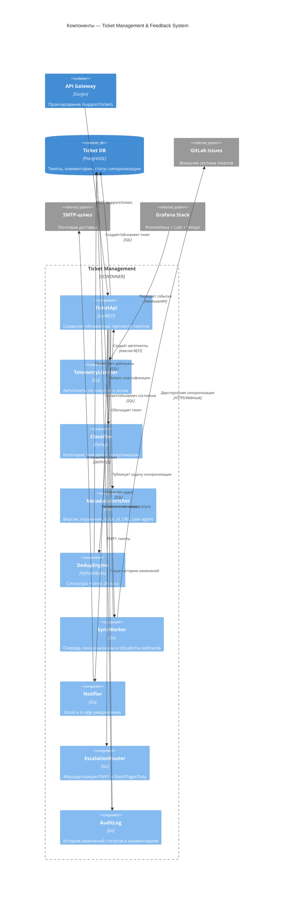

# C4 Architecture — VEDO Core

## Диаграммы компонентов

### Ticket Management & Feedback System

_Референс: `ADR-IMPL.OPS.ticket-management-system-architecture`, `ADR-IMPL.STACK.ticketing-language-strategy`._

