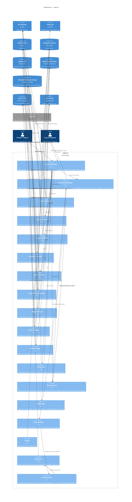

# C4 Architecture — VEDO Core

## Диаграммы компонентов

### vedo-cli

```mermaid
C4Component
    title Компоненты — vedo-cli

    Container_Boundary(cli, "vedo-cli") {
        Component(command_router, "CommandRouter", "Go", "Маршрутизация подкоманд: backup, diagnose, emergency, support, ticket, mr, decommission, airgap, tenant, export")
        Component(auth_session, "AuthSessionManager", "Go", "Управление сессией аутентификации: OIDC ROPG+TOTP login, кэширование refresh_token в ~/.vedo/config.yaml, service account токены, проверка срока действия")
        Component(backup_manager, "BackupManager", "Go", "Backup/restore TBox (canonical Turtle), ABox (dump+WAL), Version Store (pg_dump+WAL), LFS (S3)")
        Component(backup_verify, "BackupVerifier", "Go", "Верификация backup: целостность, совместимость версии, spot checks, RTO/RPO")
        Component(diagnose_engine, "DiagnoseEngine", "Go", "Сбор диагностики: trace из Tempo, логи из Loki, метрики из Prometheus по trace_id")
        Component(emergency_handler, "EmergencyHandler", "Go", "Read-only mode (≤ 60s), kill --service (≤ 120s), emergency clear")
        Component(support_console, "SupportConsole", "Go", "Support API: tenant-info, audit-trail, list-backups, emergency-access request")
        Component(decommission_handler, "DecommissionHandler", "Go", "Full decommission: export → purge → crypto-erase → verify-purge")
        Component(airgap_manager, "AirgapManager", "Go", "Air-gap подготовка: image bundle, advisory bundle, offline package")
        Component(tenant_manager, "TenantManager", "Go", "Seed tenant с canonical profile, миграции, restore drill")
        Component(ticket_manager, "TicketManager", "Go", "CRUD тикетов, комментарии, close/reopen через Ticket API")
        Component(mr_manager, "MrManager", "Go", "Управление Merge Request: create, list, review, merge — через API Gateway gRPC")
        Component(security_guard, "SecurityGuard", "Go", "MFA guardrails, typed confirmation, environment guard, cool-down, проверка MFA-статуса через AuthSessionManager")
        Component(audit_logger, "AuditLogger", "Go", "Аудит всех CLI действий, структурированный лог, WORM-совместимый вывод")
        Component(config_manager, "ConfigManager", "Go", "Управление конфигурацией: environments, credentials, backup targets")
        Component(tracing, "Tracing", "Go", "OpenTelemetry instrumentation")
        Component(vault_client, "VaultClient", "Go", "gRPC-клиент к HashiCorp Vault для управления ключами и секретами")
        Component(credential_chain, "CredentialChain", "Go", "Резолвер цепочки credentials: Vault → AWS Secrets Manager → env → plain-text (air-gapped fallback)")
    }

    Container(api_gw, "API Gateway", "Go/gin", "gRPC (MR, экспорт)")
    Container(ticket_api, "Ticket API", "Go/REST", "Подсистема тикетов VEDO Core")
    ContainerDb(neo4j, "Neo4j Cluster", "Cypher", "Triple Store")
    ContainerDb(postgres, "PostgreSQL Cluster", "SQL/JSONB", "Version Store")
    ContainerDb(support_db, "Support DB", "PostgreSQL", "Support metadata, tenant info")
    ContainerDb(replica_store, "Хранилище реплик", "S3/MinIO-compatible", "WAL, snapshots, off-site copy")
    ContainerDb(immutable_backup, "Immutable Backup Storage", "S3/MinIO + WORM", "Immutable backup, изолированные credentials")
    ContainerDb(vault, "Vault / KMS", "HashiCorp Vault", "Key management, secrets")
    Container(monitoring, "Monitoring", "Grafana Stack", "Трейсы, метрики, логи")
    System_Ext(keycloak, "Keycloak", "Identity Provider: аутентификация, MFA (TOTP), service accounts")

    Person(devops_user, "DevOps / Support", "Администрирование системы")
    Person(support_user, "Support Engineer", "Диагностика, emergency")

    Rel(devops_user, command_router, "CLI")
    Rel(support_user, command_router, "CLI")

    Rel(command_router, auth_session, "Login, check session")
    Rel(auth_session, keycloak, "OIDC ROPG+TOTP, refresh_token", "HTTPS")
    Rel(auth_session, security_guard, "Provide MFA status per session")
    Rel(security_guard, auth_session, "Verify MFA freshness for A/B ops")
    Rel(auth_session, config_manager, "Read/write refresh_token")

    Rel(command_router, backup_manager, "backup/restore")
    Rel(command_router, backup_verify, "backup verify")
    Rel(command_router, diagnose_engine, "diagnose")
    Rel(command_router, emergency_handler, "emergency")
    Rel(command_router, support_console, "support")
    Rel(command_router, decommission_handler, "decommission")
    Rel(command_router, airgap_manager, "airgap")
    Rel(command_router, tenant_manager, "tenant")
    Rel(command_router, ticket_manager, "ticket")
    Rel(command_router, mr_manager, "mr")

    Rel(backup_manager, neo4j, "Read/write backup")
    Rel(backup_manager, postgres, "Read/write backup")
    Rel(backup_manager, replica_store, "Write backup")
    Rel(backup_manager, immutable_backup, "Write immutable copy")
    Rel(backup_manager, vault, "Encrypt/decrypt keys")
    Rel(backup_verify, replica_store, "Read/verify")
    Rel(backup_verify, immutable_backup, "Read/verify")

    Rel(diagnose_engine, neo4j, "Health check")
    Rel(diagnose_engine, postgres, "Health check")
    Rel(diagnose_engine, api_gw, "Health check")
    Rel(diagnose_engine, monitoring, "Trace/log/metric query")

    Rel(emergency_handler, api_gw, "Set readonly/kill mode")

    Rel(support_console, support_db, "CRUD support metadata")
    Rel(support_console, vault, "Read emergency keys")

    Rel(decommission_handler, neo4j, "Purge data")
    Rel(decommission_handler, postgres, "Purge data")
    Rel(decommission_handler, replica_store, "Verify purge")
    Rel(decommission_handler, immutable_backup, "Exclude from retention")
    Rel(decommission_handler, vault, "Delete keys")

    Rel(airgap_manager, immutable_backup, "Prepare offline bundle")

    Rel(tenant_manager, neo4j, "Seed canonical data")
    Rel(tenant_manager, postgres, "Seed canonical data")
    Rel(tenant_manager, api_gw, "Create tenant config")

    Rel(ticket_manager, ticket_api, "REST: create/list/get/update/comment/close/reopen/delete")
    Rel(ticket_manager, support_db, "Write audit link (ticket_id, actor, channel=cli)")

    Rel(mr_manager, api_gw, "gRPC: create/list/review/merge MR")

    Rel(command_router, security_guard, "Guard check")
    Rel(command_router, audit_logger, "Log CLI action")

    Rel(config_manager, credential_chain, "Resolve connection credentials")
    Rel(credential_chain, vault_client, "Primary secrets source")

    Rel(vault_client, vault, "gRPC: read/write secrets")

    Rel(tracing, monitoring, "Traces")

    UpdateLayoutConfig($c4ShapeInRow="4", $c4BoundaryInRow="2")
```
