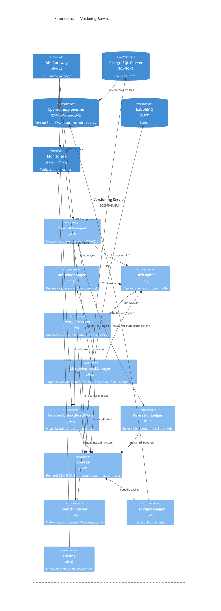

# C4 Architecture — VEDO Core

## Диаграммы компонентов

### Versioning Service

```mermaid
C4Component
    title Компоненты — Versioning Service

    Container_Boundary(versioning, "Versioning Service") {
        Component(commit_manager, "CommitManager", "Rust", "Создание коммитов, хэши SHA-256")
        Component(branch_manager, "BranchManager", "Rust", "Ветвление, слияние (3-way merge)")
        Component(diff_engine, "DiffEngine", "Rust", "Семантический diff для Turtle")
        Component(merge_resolver, "MergeResolver", "Rust", "Автоматическое разрешение конфликтов")
        Component(mr_manager, "MergeRequestManager", "Rust", "Управление Merge Request'ами: создание, ревью, слияние")
        Component(version_context_read_model, "VersionContextReadModel", "Rust", "Head, branch, dirty state projection")
        Component(operation_ledger, "OperationLedger", "Rust", "Reversible operation / rollback refs")
        Component(storage, "Storage", "Rust", "PostgreSQL + JSONB, оптимизированные запросы")
        Component(event_publisher, "EventPublisher", "Rust", "Публикация событий (Outbox pattern)")
        Component(backup_manager, "BackupManager", "Rust", "Scheduled backups")
        Component(tracing, "Tracing", "Rust", "OpenTelemetry instrumentation")
    }

    Container(api_gw, "API Gateway", "Go/gin", "Единая точка входа")
    ContainerDb(postgres, "PostgreSQL Cluster", "SQL/JSONB", "Version Store")
    ContainerDb(replicaStore, "Хранилище реплик", "S3/MinIO-compatible", "Version Store WAL, snapshots, off-site copy")
    ContainerDb(rabbitmq, "RabbitMQ", "AMQP", "Events")
    Container(monitoring, "Monitoring", "Grafana Stack", "Трейсы, метрики, логи")

    Rel(api_gw, commit_manager, "gRPC запросы")
    Rel(api_gw, version_context_read_model, "Read version context")
    Rel(commit_manager, diff_engine, "Вычисляет diff")
    Rel(commit_manager, operation_ledger, "Register operation refs")
    Rel(commit_manager, storage, "Persist")
    Rel(storage, postgres, "SQL")
    Rel(branch_manager, commit_manager, "Использует")
    Rel(branch_manager, version_context_read_model, "Update branch projection")
    Rel(branch_manager, diff_engine, "Слияние")
    Rel(merge_resolver, diff_engine, "Использует")
    Rel(merge_resolver, storage, "Persist merge result")
    Rel(mr_manager, branch_manager, "Управляет ветками")
    Rel(mr_manager, diff_engine, "Semantic Diff для MR")
    Rel(mr_manager, storage, "Persist MR state")
    Rel(api_gw, mr_manager, "gRPC запросы MR")
    Rel(version_context_read_model, storage, "Read head/dirty state")
    Rel(operation_ledger, storage, "Persist rollback refs")
    Rel(commit_manager, event_publisher, "Events")
    Rel(event_publisher, rabbitmq, "AMQP")
    Rel(backup_manager, storage, "Periodic backup")
    Rel(backup_manager, replicaStore, "Write backup replicas")
    Rel(postgres, replicaStore, "WAL/archive replicas")
    Rel(tracing, monitoring, "Traces")
    Rel(api_gw, monitoring, "Метрики")

    UpdateLayoutConfig($c4ShapeInRow="3", $c4BoundaryInRow="1")
```
