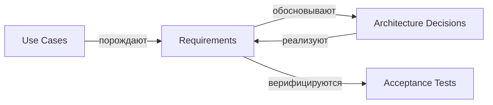

# Требования (Requirements) — VEDO Core

В этой директории хранятся требования к системе VEDO Core. Каждый файл описывает одну связанную группу требований — функциональных или нефункциональных.

Классификация требований выполнена с опорой на рекомендации Карла Вигерса (Karl Wiegers, «Software Requirements», 3rd ed.): требования разделяются по **уровню** (бизнес → пользовательские → функциональные → нефункциональные → ограничения), **атрибутам качества** (FURPS+) и **приоритетам** (MoSCoW).

---

## Правила именования файлов

Файлы именуются по шаблону `<REQ-ID>.md`.

**Примеры:**
- `REQ-FUN.API.protocol-stack.md`
- `REQ-NFR.DATA.account-closure-retention.md`
- `REQ-CON.INFRA.deployment-model.md`

---

## Классификация требований

Каждое требование классифицируется по трём независимым измерениям:

### 1. Уровень (Wiegers: Business / User / Functional / Non-functional / Constraint)

| Уровень | Метка | Описание | Пример |
|---------|-------|----------|--------|
| **Бизнес-требования** | `BIZ` | Стратегические цели, OKR, бизнес-ценность, обоснование продукта | «Обеспечить выход на regulated-рынки к 2027» |
| **Пользовательские требования** | `USR` | Сценарии использования (use cases), задачи пользователей, UI-потоки | «Редактор может создать класс за 90 секунд» |
| **Функциональные требования** | `FUN` | Поведение системы, API, бизнес-логика, обработка данных | «Система сохраняет коммит в историю версий» |
| **Нефункциональные требования (NFR)** | `NFR` | Атрибуты качества: производительность, безопасность, юзабилити, надёжность, сопровождаемость | «Время ответа API < 500 мс при P95» |
| **Ограничения** | `CON` | Технические, нормативные, организационные рамки | «Использовать PostgreSQL 15+, Neo4j 5+» |

### 2. Атрибут качества (FURPS+)

| Категория | Метка | Описание | Пример требования |
|-----------|-------|----------|------------------|
| **Functionality** | `FUNC` | Корректность, полнота, безопасность, совместимость | «Система проверяет SHACL-формы при сохранении» |
| **Usability** | `USE` | Обучаемость, эффективность, запоминаемость, удовлетворённость | «Время первой задачи — 90 секунд для новичка» |
| **Reliability** | `REL` | Доступность, отказоустойчивость, восстанавливаемость | «SLA 99.9%, RTO 1 час, RPO 15 минут» |
| **Performance** | `PERF` | Скорость, пропускная способность, ёмкость | «Пул соединений к Neo4j: max 100» |
| **Supportability** | `SUPP` | Наблюдаемость, диагностика, сопровождаемость, автоматизация | «Все L1-операции логируются в immutable audit log» |
| **+ Design / Implementation** | `IMPL` | Ограничения реализации, CI/CD, стек технологий | «CLI реализовать на Rust» |
| **+ Interface** | `IFACE` | Протоколы, контракты, API-совместимость | «REST для внешнего API, gRPC для внутреннего» |
| **+ Physical / Deployment** | `PHYS` | Инфраструктура, сетевая топология, окружения | «Поддержка air-gapped развёртывания» |

### 3. Приоритет (MoSCoW)

| Приоритет | Метка | Описание |
|-----------|-------|----------|
| **Must have** | `P0` | Без требования релиз невозможен |
| **Should have** | `P1` | Важно, но можно отложить до следующего релиза |
| **Could have** | `P2` | Желательно, если позволяет время и бюджет |
| **Won't have** | `P3` | Зафиксировано как намерение на будущее |

---

## Формат идентификатора требования

```
REQ-<LEVEL>.<AREA>.<semantic-tag>
```

Где:

| Компонент | Значения | Описание |
|-----------|----------|----------|
| `LEVEL` | `BIZ` | `USR` | `FUN` | `NFR` | `CON` | Уровень по Вигерсу |
| `AREA` | `API` | `DATA` | `INFRA` | `SECURITY` | `UI` | `PROCESS` | `INTEGRATION` | `STACK` | `OPS` | `DOC` | `SUP` | Предметная область (совпадает с ADR) |
| `semantic-tag` | kebab-case, 2–5 слов | Суть требования (отражает имя файла) |

**Правила формирования semantic-tag:**
- Только латиница, дефисы, строчные буквы
- 2–5 слов, отражающих суть требования
- Совпадает с именем файла (файл: `REQ-LEVEL.AREA.semantic-tag.md`)

**Примеры:**
- `REQ-NFR.SECURITY.bola-bfla-negative-tests` — требование безопасности
- `REQ-FUN.API.protocol-stack` — функциональное требование к протокольному стеку
- `REQ-CON.INFRA.deployment-model` — ограничение по модели развёртывания
- `REQ-USR.UI.time-to-first-task` — пользовательское требование ко времени первой задачи

---

## Структура файла требований

Каждый файл (.md) может содержать одно или несколько требований. Рекомендуемая структура:

```markdown
# Название группы требований

## Назначение

Краткое описание цели данной группы требований.

---

## Требование: REQ-NFR.PERF.connection-pool — Пул соединений Neo4j

| Атрибут | Значение |
|---------|----------|
| **Уровень** | NFR |
| **Атрибут качества** | Performance |
| **Приоритет** | P0 |
| **Статус** | УТВЕРЖДЕНО |
| **Источник** | ADR-DES.DATA.storage-stack-strategy |
| **Критерии приёмки** | … |

### Описание

…

### Детали

…
```

### Обязательные атрибуты каждого требования

- **ID** — уникальный семантический идентификатор (REQ-LEVEL.AREA.semantic-tag)
- **Название** — краткое описание сути требования
- **Уровень** — BIZ / USR / FUN / NFR / CON
- **Атрибут качества** — FURPS+ категория (для NFR)
- **Приоритет** — P0 / P1 / P2 / P3
- **Статус** — `[ЧЕРНОВИК | УТВЕРЖДЕНО | ИЗМЕНЕНО | ЗАМЕНЕНО | УСТАРЕЛО]`
- **Описание** — суть требования
- **Критерии приёмки** — проверяемое условие выполнения

### Рекомендуемые опциональные атрибуты

- **Источник** — ссылки на ADR, use case, stakeholder request
- **Обоснование** — почему это требование существует
- **Зависимости** — от каких требований/ADR зависит
- **Риски** — что может пойти не так
- **History** — дата создания, даты изменений

---

## Правила

1. **Уникальность ID** — каждый `REQ-ID` должен быть уникальным в рамках проекта
2. **Только семантические ID** — числовые суффиксы запрещены; semantic-tag отражает суть требования и совпадает с именем файла
3. **Имя файла = `REQ-ID.md`** — имя файла строго соответствует идентификатору требования
4. **LEVEL соответствует уровню по Вигерсу:** `BIZ` — бизнес-цели, `USR` — пользовательские истории/UC, `FUN` — поведение системы, `NFR` — атрибуты качества, `CON` — ограничения
5. **Одно требование — одна проверяемая формулировка:** избегать составных требований (compound requirements)
6. **Критерии приёмки обязательны** для P0 и P1 требований
7. **Требование должно быть тестируемым** — формулировка должна допускать однозначный PASS/FAIL
8. **Связанность с ADR:** если требование привело к архитектурному решению, ADR содержит поле `Требование-источник` со ссылкой на REQ-ID
9. **Изменение требований:** при изменении утверждённого требования статус меняется на `ИЗМЕНЕНО`; в `ЗАМЕНЕНО` указывается новый ID
10. **Устаревшие требования** не удаляются, а помечаются статусом `УСТАРЕЛО` с указанием причины

---

## Матрица применимости: требование → ADR

Каждый ADR ссылается на требования-источники. Каждое требование может порождать один или несколько ADR. Связь «многие ко многим».



---

## Список требований

### API

| ID | Файл | Заголовок | Уровень | Атрибут | Приоритет |
|----|------|-----------|---------|---------|-----------|
| `REQ-FUN.API.protocol-stack` | `REQ-FUN.API.protocol-stack.md` | Протокольный стек API | FUN | Interface | P0 |
| `REQ-FUN.API.graphql-sparql` | `REQ-FUN.API.graphql-sparql.md` | GraphQL + SPARQL запросы | FUN | Interface | P0 |
| `REQ-FUN.API.integration` | `REQ-FUN.API.integration.md` | Спецификация API и интеграций | FUN | Interface | P0 |
| `REQ-FUN.API.unified-root-endpoint` | `REQ-FUN.API.unified-root-endpoint.md` | Единый корневой endpoint | FUN | Interface | P0 |
| `REQ-NFR.API.backward-compatibility` | `REQ-NFR.API.backward-compatibility.md` | Обратная совместимость API | NFR | Functionality | P0 |
| `REQ-NFR.API.compatibility-sla` | `REQ-NFR.API.compatibility-sla.md` | SLA совместимости API | NFR | Reliability | P1 |
| `REQ-NFR.API.compatibility-testing` | `REQ-NFR.API.compatibility-testing.md` | Тестирование совместимости | NFR | Functionality | P1 |
| `REQ-NFR.API.coverage-gate` | `REQ-NFR.API.coverage-gate.md` | Gate покрытия API | NFR | Functionality | P1 |
| `REQ-FUN.API.write-idempotency` | `REQ-FUN.API.write-idempotency.md` | Идемпотентность записи | FUN | Interface | P0 |
| `REQ-FUN.API.rest-versioning` | `REQ-FUN.API.rest-versioning.md` | REST API версионирование | FUN | Interface | P0 |
| `REQ-FUN.API.graphql-deprecation-policy` | `REQ-FUN.API.graphql-deprecation-policy.md` | GraphQL deprecation policy | FUN | Interface | P0 |
| `REQ-FUN.API.grpc-protobuf-compatibility` | `REQ-FUN.API.grpc-protobuf-compatibility.md` | gRPC/Protobuf совместимость | FUN | Interface | P1 |
| `REQ-NFR.API.sparql-compatibility` | `REQ-NFR.API.sparql-compatibility.md` | SPARQL API совместимость | NFR | Functionality | P1 |
| `REQ-FUN.API.on-premise-lts` | `REQ-FUN.API.on-premise-lts.md` | LTS для on-premise API | FUN | Interface | P2 |
| `REQ-FUN.API.cypher-query-language` | `REQ-FUN.API.cypher-query-language.md` | CYPHER язык запросов | FUN | Interface | P1 |

### UI / UX

| ID | Файл | Заголовок | Уровень | Атрибут | Приоритет |
|----|------|-----------|---------|---------|-----------|
| `REQ-USR.UI.usability-metrics` | `REQ-USR.UI.usability-metrics.md` | Метрики удобства использования | USR | Usability | P0 |
| `REQ-USR.UI.gui-implementation` | `REQ-USR.UI.gui-implementation.md` | Реализация GUI | USR | Usability | P0 |
| `REQ-NFR.UI.accessibility` | `REQ-NFR.UI.accessibility.md` | Доступность (WCAG) | NFR | Usability | P0 |
| `REQ-NFR.UI.data-loss-prevention` | `REQ-NFR.UI.data-loss-prevention.md` | Защита от потери данных | NFR | Reliability | P0 |
| `REQ-USR.UI.critical-errors` | `REQ-USR.UI.critical-errors.md` | UX критических ошибок | USR | Usability | P0 |
| `REQ-USR.UI.graph-navigation` | `REQ-USR.UI.graph-navigation.md` | Навигация по графу | USR | Usability | P0 |
| `REQ-NFR.UI.error-feedback` | `REQ-NFR.UI.error-feedback.md` | Обратная связь об ошибках | NFR | Usability | P0 |
| `REQ-USR.UI.ontology-mental-model` | `REQ-USR.UI.ontology-mental-model.md` | Ментальная модель онтологии | USR | Usability | P0 |
| `REQ-USR.UI.tbox-editor` | `REQ-USR.UI.tbox-editor.md` | TBox редактор | USR | Functionality | P0 |
| `REQ-USR.UI.abox-editor` | `REQ-USR.UI.abox-editor.md` | ABox редактор | USR | Functionality | P0 |
| `REQ-USR.UI.sparql-gui-search` | `REQ-USR.UI.sparql-gui-search.md` | SPARQL поиск через GUI | USR | Usability | P0 |
| `REQ-USR.UI.ux-review-process` | `REQ-USR.UI.ux-review-process.md` | Процесс UX-ревью | USR | Usability | P1 |
| `REQ-USR.UI.delight-features` | `REQ-USR.UI.delight-features.md` | UX Delight функции | USR | Usability | P1 |
| `REQ-USR.UI.dangerous-actions-recovery` | `REQ-USR.UI.dangerous-actions-recovery.md` | Восстановление опасных действий | USR | Usability | P1 |
| `REQ-USR.UI.import-export` | `REQ-USR.UI.import-export.md` | Импорт/экспорт | USR | Functionality | P1 |
| `REQ-NFR.UI.incident-communication-sla` | `REQ-NFR.UI.incident-communication-sla.md` | SLA коммуникации инцидентов | NFR | Usability | P1 |
| `REQ-USR.UI.degraded-mode-ux` | `REQ-USR.UI.degraded-mode-ux.md` | UX режима деградации | USR | Usability | P1 |
| `REQ-USR.UI.customization` | `REQ-USR.UI.customization.md` | Кастомизация UI | USR | Usability | P2 |
| `REQ-USR.UI.decommission-usability` | `REQ-USR.UI.decommission-usability.md` | UX деактивации | USR | Usability | P1 |
| `REQ-NFR.UI.wcag-mvp-scenarios` | `REQ-NFR.UI.wcag-mvp-scenarios.md` | WCAG MVP сценарии | NFR | Usability | P0 |

### Security

| ID | Файл | Заголовок | Уровень | Атрибут | Приоритет |
|----|------|-----------|---------|---------|-----------|
| `REQ-NFR.SECURITY.security-requirements` | `REQ-NFR.SECURITY.security-requirements.md` | Требования безопасности | NFR | Functionality | P0 |
| `REQ-NFR.SECURITY.bola-bfla-negative-tests` | `REQ-NFR.SECURITY.bola-bfla-negative-tests.md` | BOLA/BFLA негативные тесты | NFR | Functionality | P0 |
| `REQ-NFR.SECURITY.parser-query-fuzz-gates` | `REQ-NFR.SECURITY.parser-query-fuzz-gates.md` | Фаззинг-гейты парсеров | NFR | Functionality | P1 |
| `REQ-NFR.SECURITY.privileged-access-control` | `REQ-NFR.SECURITY.privileged-access-control.md` | Привилегированный доступ | NFR | Functionality | P0 |
| `REQ-NFR.SECURITY.incident-secret-rotation` | `REQ-NFR.SECURITY.incident-secret-rotation.md` | Ротация секретов | NFR | Functionality | P0 |
| `REQ-NFR.SECURITY.emergency-policy-disable` | `REQ-NFR.SECURITY.emergency-policy-disable.md` | Аварийное отключение политик | NFR | Reliability | P0 |
| `REQ-NFR.SECURITY.authorization-regression-gates` | `REQ-NFR.SECURITY.authorization-regression-gates.md` | Гейты регрессии авторизации | NFR | Functionality | P0 |
| `REQ-NFR.SECURITY.organization-access-model` | `REQ-NFR.SECURITY.organization-access-model.md` | Модель доступа организации | NFR | Functionality | P0 |
| `REQ-NFR.SECURITY.sca-sbom-gating` | `REQ-NFR.SECURITY.sca-sbom-gating.md` | SCA/SBOM gating | NFR | Supportability | P0 |
| `REQ-NFR.SECURITY.cli-mfa` | `REQ-NFR.SECURITY.cli-mfa.md` | MFA в CLI | NFR | Functionality | P1 |
| `REQ-NFR.SECURITY.enforced-in-code` | `REQ-NFR.SECURITY.enforced-in-code.md` | Enforcement границ в коде, не в промпте | NFR | Security | P0 |
| `REQ-NFR.SECURITY.llm-tool-least-privilege` | `REQ-NFR.SECURITY.llm-tool-least-privilege.md` | Минимальные привилегии и изоляция инструментов LLM | NFR | Security | P0 |
| `REQ-NFR.SECURITY.llm-write-human-approval` | `REQ-NFR.SECURITY.llm-write-human-approval.md` | HITL для LLM-сгенерированных изменений данных | NFR | Security | P0 |
| `REQ-NFR.SECURITY.llm-content-screening` | `REQ-NFR.SECURITY.llm-content-screening.md` | Скрининг сторонних данных (indirect prompt injection) | NFR | Security | P1 |
| `REQ-NFR.SECURITY.llm-output-screening` | `REQ-NFR.SECURITY.llm-output-screening.md` | Скрининг исходящих LLM-ответов (PII/canary/allow-list) | NFR | Security | P1 |
| `REQ-NFR.SECURITY.llm-excessive-agency-control` | `REQ-NFR.SECURITY.llm-excessive-agency-control.md` | Контроль автономии LLM (Autonomy × Authority) | NFR | Security | P1 |
| `REQ-NFR.SECURITY.llm-dependency-fail-mode` | `REQ-NFR.SECURITY.llm-dependency-fail-mode.md` | Fail-mode для внешних LLM-зависимостей | NFR | Reliability | P1 |

### Data / Storage

| ID | Файл | Заголовок | Уровень | Атрибут | Приоритет |
|----|------|-----------|---------|---------|-----------|
| `REQ-FUN.DATA.storage-stack` | `REQ-FUN.DATA.storage-stack.md` | Стек хранения данных | FUN | Interface | P0 |
| `REQ-NFR.DATA.account-closure-retention` | `REQ-NFR.DATA.account-closure-retention.md` | Хранение при закрытии аккаунта | NFR | Reliability | P0 |
| `REQ-NFR.DATA.secure-erase` | `REQ-NFR.DATA.secure-erase.md` | Безопасное удаление | NFR | Functionality | P0 |
| `REQ-NFR.DATA.backup-retention` | `REQ-NFR.DATA.backup-retention.md` | Политика хранения бэкапов | NFR | Reliability | P0 |
| `REQ-NFR.DATA.backup-format` | `REQ-NFR.DATA.backup-format.md` | Формат бэкапов | NFR | Supportability | P0 |
| `REQ-NFR.DATA.backup-storage` | `REQ-NFR.DATA.backup-storage.md` | Хранилище бэкапов | NFR | Reliability | P0 |
| `REQ-NFR.DATA.decommission-export` | `REQ-NFR.DATA.decommission-export.md` | Экспорт при деактивации | NFR | Functionality | P0 |
| `REQ-NFR.DATA.decommission-archive-retention` | `REQ-NFR.DATA.decommission-archive-retention.md` | Архив деактивации | NFR | Reliability | P1 |
| `REQ-NFR.DATA.decommission-notification-policy` | `REQ-NFR.DATA.decommission-notification-policy.md` | Уведомление о деактивации | NFR | Functionality | P0 |
| `REQ-NFR.DATA.partial-data-rollback` | `REQ-NFR.DATA.partial-data-rollback.md` | Частичный откат данных | NFR | Reliability | P1 |
| `REQ-NFR.DATA.rollback-data-policy` | `REQ-NFR.DATA.rollback-data-policy.md` | Политика отката данных | NFR | Reliability | P0 |
| `REQ-NFR.DATA.rollback-data-loss-rpo` | `REQ-NFR.DATA.rollback-data-loss-rpo.md` | RPO при откате | NFR | Reliability | P0 |

### Versioning / Migration

| ID | Файл | Заголовок | Уровень | Атрибут | Приоритет |
|----|------|-----------|---------|---------|-----------|
| `REQ-FUN.DATA.versioning` | `REQ-FUN.DATA.versioning.md` | Git-подобный контроль версий | FUN | Functionality | P0 |
| `REQ-FUN.DATA.major-version-migration` | `REQ-FUN.DATA.major-version-migration.md` | Миграция мажорных версий | FUN | Functionality | P0 |
| `REQ-FUN.DATA.major-version-policy` | `REQ-FUN.DATA.major-version-policy.md` | Политика мажорных версий | FUN | Functionality | P0 |
| `REQ-NFR.DATA.migration-automation` | `REQ-NFR.DATA.migration-automation.md` | Автоматизация миграций | NFR | Supportability | P1 |
| `REQ-NFR.DATA.migration-integrity-checks` | `REQ-NFR.DATA.migration-integrity-checks.md` | Проверки целостности миграций | NFR | Reliability | P0 |
| `REQ-NFR.DATA.migration-maintenance-window` | `REQ-NFR.DATA.migration-maintenance-window.md` | Окно обслуживания миграций | NFR | Reliability | P1 |
| `REQ-NFR.DATA.migration-preparation` | `REQ-NFR.DATA.migration-preparation.md` | Подготовка миграций | NFR | Supportability | P1 |
| `REQ-FUN.DATA.migration-rollback` | `REQ-FUN.DATA.migration-rollback.md` | Откат миграций | FUN | Functionality | P0 |
| `REQ-NFR.DATA.migration-runbook` | `REQ-NFR.DATA.migration-runbook.md` | Runbook миграций | NFR | Supportability | P1 |
| `REQ-NFR.DATA.rollback-prevention` | `REQ-NFR.DATA.rollback-prevention.md` | Предотвращение отката | NFR | Reliability | P1 |
| `REQ-NFR.DATA.rollback-runbook` | `REQ-NFR.DATA.rollback-runbook.md` | Runbook отката | NFR | Supportability | P1 |

### Infrastructure / Deployment

| ID | Файл | Заголовок | Уровень | Атрибут | Приоритет |
|----|------|-----------|---------|---------|-----------|
| `REQ-CON.INFRA.deployment-model` | `REQ-CON.INFRA.deployment-model.md` | Модель развёртывания | CON | Physical | P0 |
| `REQ-CON.INFRA.deployment-geography` | `REQ-CON.INFRA.deployment-geography.md` | География развёртывания | CON | Physical | P1 |
| `REQ-CON.INFRA.deployment-strategy` | `REQ-CON.INFRA.deployment-strategy.md` | Стратегия развёртывания | CON | Physical | P0 |
| `REQ-CON.INFRA.deployment-tiers` | `REQ-CON.INFRA.deployment-tiers.md` | Эталонная архитектура тиров | CON | Physical | P1 |
| `REQ-CON.INFRA.network-requirements` | `REQ-CON.INFRA.network-requirements.md` | Сетевые требования | CON | Physical | P0 |
| `REQ-CON.INFRA.air-gapped-deployment` | `REQ-CON.INFRA.air-gapped-deployment.md` | Air-gapped развёртывание | CON | Physical | P1 |
| `REQ-CON.INFRA.containerization` | `REQ-CON.INFRA.containerization.md` | Стратегия контейнеризации | CON | Implementation | P0 |
| `REQ-NFR.INFRA.availability-slo` | `REQ-NFR.INFRA.availability-slo.md` | SLO доступности | NFR | Reliability | P0 |
| `REQ-NFR.INFRA.control-plane-isolation` | `REQ-NFR.INFRA.control-plane-isolation.md` | Изоляция control plane | NFR | Functionality | P0 |
| `REQ-NFR.INFRA.edge-region-failover` | `REQ-NFR.INFRA.edge-region-failover.md` | Edge/региональный failover | NFR | Reliability | P1 |
| `REQ-NFR.INFRA.fault-scenarios` | `REQ-NFR.INFRA.fault-scenarios.md` | Сценарии отказов | NFR | Reliability | P0 |
| `REQ-NFR.INFRA.sla-recovery` | `REQ-NFR.INFRA.sla-recovery.md` | SLA восстановления | NFR | Reliability | P0 |
| `REQ-NFR.INFRA.client-environment-support` | `REQ-NFR.INFRA.client-environment-support.md` | Поддержка клиентских окружений | NFR | Supportability | P1 |
| `REQ-CON.INFRA.environment-configuration` | `REQ-CON.INFRA.environment-configuration.md` | Конфигурация окружений | CON | Implementation | P0 |
| `REQ-NFR.INFRA.sustainability-energy-efficiency` | `REQ-NFR.INFRA.sustainability-energy-efficiency.md` | Энергоэффективность | NFR | Physical | P2 |
| `REQ-NFR.INFRA.support-metadata-isolation` | `REQ-NFR.INFRA.support-metadata-isolation.md` | Изоляция метаданных поддержки | NFR | Reliability | P1 |
| `REQ-FUN.INFRA.deployment-integrity` | `REQ-FUN.INFRA.deployment-integrity.md` | Целостность развёртывания | FUN | Reliability | P0 |
| `REQ-FUN.INFRA.runbook-procedures` | `REQ-FUN.INFRA.runbook-procedures.md` | Runbook процедуры | FUN | Supportability | P1 |
| `REQ-NFR.INFRA.runbook-usability` | `REQ-NFR.INFRA.runbook-usability.md` | Юзабилити runbook | NFR | Usability | P1 |
| `REQ-NFR.INFRA.runbook-ownership-drill-evidence` | `REQ-NFR.INFRA.runbook-ownership-drill-evidence.md` | Владение и учения по runbook | NFR | Supportability | P1 |
| `REQ-FUN.INFRA.vedo-cli-specification` | `REQ-FUN.INFRA.vedo-cli-specification.md` | Спецификация vedo-cli | FUN | Implementation | P0 |
| `REQ-USR.INFRA.cli-admin-tool` | `REQ-USR.INFRA.cli-admin-tool.md` | CLI для администрирования | USR | Supportability | P0 |
| `REQ-USR.INFRA.cli-design-guidelines` | `REQ-USR.INFRA.cli-design-guidelines.md` | Дизайн-гайдлайны CLI | USR | Usability | P1 |

### Observability / Monitoring

| ID | Файл | Заголовок | Уровень | Атрибут | Приоритет |
|----|------|-----------|---------|---------|-----------|
| `REQ-NFR.OPS.observability-stack` | `REQ-NFR.OPS.observability-stack.md` | Стек наблюдаемости | NFR | Supportability | P0 |
| `REQ-NFR.OPS.critical-alerts` | `REQ-NFR.OPS.critical-alerts.md` | Критичные алерты | NFR | Supportability | P0 |
| `REQ-NFR.OPS.metrics` | `REQ-NFR.OPS.metrics.md` | Метрики | NFR | Supportability | P0 |
| `REQ-NFR.OPS.log-retention` | `REQ-NFR.OPS.log-retention.md` | Хранение логов | NFR | Supportability | P0 |
| `REQ-NFR.OPS.alert-fatigue` | `REQ-NFR.OPS.alert-fatigue.md` | Усталость от алертов | NFR | Supportability | P1 |
| `REQ-NFR.OPS.llm-agent-observability` | `REQ-NFR.OPS.llm-agent-observability.md` | Специализированная observability для LLM-pipelines | NFR | Supportability | P1 |

### Performance

| ID | Файл | Заголовок | Уровень | Атрибут | Приоритет |
|----|------|-----------|---------|---------|-----------|
| `REQ-NFR.PERF.performance` | `REQ-NFR.PERF.performance.md` | Спецификация производительности | NFR | Performance | P0 |
| `REQ-NFR.PERF.canonical-workload-profile` | `REQ-NFR.PERF.canonical-workload-profile.md` | Канонический профиль нагрузки | NFR | Performance | P0 |

### CI/CD / Process

| ID | Файл | Заголовок | Уровень | Атрибут | Приоритет |
|----|------|-----------|---------|---------|-----------|
| `REQ-FUN.PROCESS.ci-cd-requirements` | `REQ-FUN.PROCESS.ci-cd-requirements.md` | Требования CI/CD | FUN | Implementation | P0 |
| `REQ-FUN.PROCESS.ci-cd-procedures` | `REQ-FUN.PROCESS.ci-cd-procedures.md` | Процедуры CI/CD | FUN | Implementation | P0 |
| `REQ-FUN.PROCESS.deployment-checklist` | `REQ-FUN.PROCESS.deployment-checklist.md` | Чеклист развёртывания | FUN | Supportability | P0 |
| `REQ-FUN.PROCESS.preprod-release-gates` | `REQ-FUN.PROCESS.preprod-release-gates.md` | Pre-prod гейты | FUN | Functionality | P0 |
| `REQ-NFR.PROCESS.rollout-safety-gates` | `REQ-NFR.PROCESS.rollout-safety-gates.md` | Safety gates rollout | NFR | Reliability | P0 |
| `REQ-FUN.PROCESS.incident-response-slo` | `REQ-FUN.PROCESS.incident-response-slo.md` | SLO реагирования | FUN | Supportability | P0 |
| `REQ-FUN.PROCESS.escalation-matrix` | `REQ-FUN.PROCESS.escalation-matrix.md` | Матрица эскалации | FUN | Supportability | P1 |
| `REQ-FUN.PROCESS.e2e-testing` | `REQ-FUN.PROCESS.e2e-testing.md` | E2E тестирование | FUN | Functionality | P0 |
| `REQ-FUN.PROCESS.uat-specification` | `REQ-FUN.PROCESS.uat-specification.md` | UAT спецификация | FUN | Functionality | P1 |
| `REQ-FUN.PROCESS.linting-static-analysis` | `REQ-FUN.PROCESS.linting-static-analysis.md` | Линтинг и статический анализ | FUN | Implementation | P0 |
| `REQ-FUN.PROCESS.architecture-decomposition` | `REQ-FUN.PROCESS.architecture-decomposition.md` | Декомпозиция архитектуры | FUN | Implementation | P0 |
| `REQ-FUN.PROCESS.architecture-documentation` | `REQ-FUN.PROCESS.architecture-documentation.md` | Документирование архитектуры | FUN | Supportability | P0 |

### Stack / Technology

| ID | Файл | Заголовок | Уровень | Атрибут | Приоритет |
|----|------|-----------|---------|---------|-----------|
| `REQ-CON.STACK.backend-service-stack` | `REQ-CON.STACK.backend-service-stack.md` | Стек языков микросервисов | CON | Implementation | P0 |
| `REQ-CON.STACK.frontend-stack` | `REQ-CON.STACK.frontend-stack.md` | Фронтенд стек | CON | Implementation | P0 |
| `REQ-CON.STACK.version-support-policy` | `REQ-CON.STACK.version-support-policy.md` | Политика поддержки версий | CON | Supportability | P0 |
| `REQ-CON.STACK.ui-design-tool` | `REQ-CON.STACK.ui-design-tool.md` | Инструмент дизайна UI | CON | Implementation | P0 |
| `REQ-CON.STACK.documentation-tool` | `REQ-CON.STACK.documentation-tool.md` | Инструмент документации | CON | Supportability | P0 |
| `REQ-CON.STACK.ontology-publishing` | `REQ-CON.STACK.ontology-publishing.md` | Публикация онтологий | CON | Functionality | P1 |

### Collaboration / Integration

| ID | Файл | Заголовок | Уровень | Атрибут | Приоритет |
|----|------|-----------|---------|---------|-----------|
| `REQ-FUN.INTEGRATION.collaboration` | `REQ-FUN.INTEGRATION.collaboration.md` | Совместная работа | FUN | Functionality | P0 |
| `REQ-FUN.INTEGRATION.collaboration-quality-metrics` | `REQ-FUN.INTEGRATION.collaboration-quality-metrics.md` | Метрики качества коллаборации | FUN | Functionality | P1 |
| `REQ-FUN.INTEGRATION.saga-pattern` | `REQ-FUN.INTEGRATION.saga-pattern.md` | Saga паттерн | FUN | Reliability | P0 |
| `REQ-FUN.INTEGRATION.ticket-management` | `REQ-FUN.INTEGRATION.ticket-management.md` | Система тикетов | FUN | Functionality | P1 |

### Documentation / Support

| ID | Файл | Заголовок | Уровень | Атрибут | Приоритет |
|----|------|-----------|---------|---------|-----------|
| `REQ-NFR.DOC.localization-language-policy` | `REQ-NFR.DOC.localization-language-policy.md` | Языковая политика | NFR | Usability | P0 |
| `REQ-NFR.DOC.documentation-training` | `REQ-NFR.DOC.documentation-training.md` | Обучение и документация | NFR | Supportability | P1 |
| `REQ-USR.DOC.user-guide-graphql-navigation` | `REQ-USR.DOC.user-guide-graphql-navigation.md` | Руководство по GraphQL навигации | USR | Usability | P1 |
| `REQ-USR.DOC.user-guide-sparql-gui` | `REQ-USR.DOC.user-guide-sparql-gui.md` | Руководство по SPARQL GUI | USR | Usability | P1 |
| `REQ-NFR.SUP.support-sla` | `REQ-NFR.SUP.support-sla.md` | SLA поддержки | NFR | Supportability | P0 |

### Constraints / Cross-cutting

| ID | Файл | Заголовок | Уровень | Атрибут | Приоритет |
|----|------|-----------|---------|---------|-----------|
| `REQ-CON.CROSS.constraints` | `REQ-CON.CROSS.constraints.md` | Технические ограничения | CON | — | P0 |
| `REQ-FUN.CROSS.sequences` | `REQ-FUN.CROSS.sequences.md` | Диаграммы последовательностей | FUN | Functionality | P0 |
| `REQ-NFR.CROSS.usability-metrics` | `REQ-NFR.CROSS.usability-metrics.md` | Метрики юзабилити | NFR | Usability | P1 |

---

## Связанные артефакты

| Артефакт | Расположение | Назначение |
|----------|-------------|------------|
| **Architecture Decision Records (ADR)** | `human/artifacts/adr/` | Архитектурные решения, обоснованные требованиями |
| **Use Cases** | `human/artifacts/use-cases.md` | Сценарии использования, порождающие требования |
| **Constraints** | `human/constraints/` | Исходные технические и бизнес-ограничения |
| **Диаграммы последовательностей** | `human/artifacts/sequences/` | Sequence-диаграммы для ключевых потоков |

---

## reference: Карл Вигерс (Wiegers) — рекомендации по работе с требованиями

Ключевые принципы, применённые в этом документе:

| Принцип | Реализация в VEDO Core |
|---------|----------------------|
| **Разделение уровней** | BIZ → USR → FUN → NFR → CON |
| **FURPS+ атрибуты качества** | Каждое NFR отнесено к категории FURPS+ |
| **MoSCoW приоритеты** | P0–P3 для каждого требования |
| **Проверяемость (testable)** | Обязательные критерии приёмки |
| **Трассируемость (traceability)** | REQ-ID → ADR → Test |
| **Атомарность (atomic)** | Запрет составных требований |
| **Семантические идентификаторы** | ID отражает суть, а не номер |
| **Файл = ID** | Имя файла строго соответствует REQ-ID |
| **Управление изменениями** | Статусы: ЧЕРНОВИК → УТВЕРЖДЕНО → ИЗМЕНЕНО / ЗАМЕНЕНО / УСТАРЕЛО |
| **Однородная структура** | Единый шаблон для всех требований |

---

*Последнее обновление: 2026-07-21*
