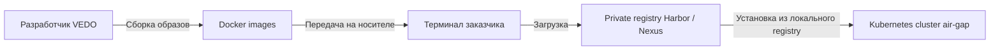

# Изолированное развертывание без интернета (Air-Gapped Deployment)

| Атрибут | Значение |
|---------|----------|
| **ID** | REQ-CON.INFRA.air-gapped-deployment |
| **Уровень** | CON |
| **Атрибут качества** | Physical |
| **Приоритет** | P1 |
| **Статус** | УТВЕРЖДЕНО |
| **Источник** | — |
| **Критерии приёмки** | — |

---

## Назначение

Фиксирует ответ на вопрос S1.2: требуется ли работа VEDO Core в изолированной среде без доступа в интернет.

Изолированная среда (air-gapped environment) - это среда, полностью отключенная от интернета. Такие требования возникают в государственных информационных системах, оборонной промышленности, финансовых системах с высоким уровнем защиты и кластерных ЦОД, где физически нет доступа во внешнюю сеть.

Ключевой факт: ПО VEDO Core распространяется под лицензией MIT, что не накладывает ограничений на модификацию и распространение. Сервер лицензий не требуется: нет trial logic и online license checks. Вопрос air-gap сводится к технической возможности работы offline, а не к юридической.

## Готовность к автономной работе

| Компонент | Зависимость от интернета | Возможность работы offline | Модификация для air-gap |
|-----------|--------------------------|----------------------------|-------------------------|
| Код VEDO Core | Нет, не вызывает внешние API | Да | Не требуется |
| Neo4j | Нет, не проверяет лицензию online | Да | Не требуется |
| PostgreSQL | Нет | Да | Не требуется |
| Redis | Нет | Да | Не требуется |
| RabbitMQ / Kafka | Нет | Да | Не требуется |
| Keycloak / SSO | Может проверять внешний IdP или LDAP | Да, если LDAP локальный | Не требуется |
| Docker Hub / GitHub | Требуется при развертывании | Нет | Образы должны быть загружены в локальный registry |
| Grafana / Prometheus | Grafana может проверять обновления | Да | Отключить проверки версий и обновлений |

Вывод: VEDO Core полностью готов к работе в air-gap, но процесс установки требует модификации. Вместо загрузки образов и charts из интернета нужно загрузить container images в локальный private registry, например Harbor или Nexus.

## Процесс установки в air-gap



## Процедура установки

На машине с доступом в интернет загружаются необходимые образы:

```bash
docker pull neo4j:5-enterprise
docker pull postgres:15
docker pull redis:7
docker pull vedo/core:latest
docker pull vedo/versioning:latest
```

Образы сохраняются в файлы для переноса:

```bash
docker save -o neo4j.tar neo4j:5-enterprise
docker save -o vedo-core.tar vedo/core:latest
```

После переноса в изолированную среду образы загружаются в локальный registry:

```bash
docker load -i neo4j.tar
docker tag neo4j:5-enterprise harbor.local/library/neo4j:5-enterprise
docker push harbor.local/library/neo4j:5-enterprise
```

Установка через Helm выполняется без обращения в интернет:

```bash
helm install vedo-core ./helm-chart/ --set global.registry=harbor.local/library
```

## Конфигурация Helm

```yaml
global:
  registry: harbor.local/library
  imagePullPolicy: IfNotPresent

neo4j:
  image:
    repository: neo4j
    tag: 5-enterprise

vedo:
  image:
    repository: vedo/core
    tag: latest
  features:
    enable_version_check: false
    enable_telemetry: false
```

## Поведение во время работы в air-gap

| Аспект | Поведение в air-gap | Настройка |
|--------|---------------------|-----------|
| Аутентификация пользователей | Работает через локальный Keycloak или локальный LDAP | Keycloak realm в автономном режиме |
| Обновления ПО | Не автоматические | Администратор загружает образы на физическом носителе |
| Метрики / мониторинг | Работает локально через Prometheus + Grafana | Отключить external update checks |
| Алерты PagerDuty / Slack | Не работают, требуют интернета | Использовать email alerts через SMTP внутри контура |
| Документация | Внешние ссылки могут быть недоступны | Предоставлять docs на борту через локальный documentation server |
| Лицензирование MIT | Интернет-активация не требуется | Не требуется |

## Компоненты, которым по умолчанию нужен исходящий доступ

| Компонент | Что делает по умолчанию | Что менять в air-gap |
|-----------|-------------------------|----------------------|
| Docker / Kubernetes | `docker pull` images | Использовать локальный registry |
| Helm | `helm repo add` и загрузка charts из интернета | Скачать charts заранее и устанавливать локально |
| Git для version store | `git clone`, если используется внешний URL | Использовать offline mode и локальные repositories |
| Keycloak | Может использовать external IdP | Использовать локальный realm или локальный LDAP |
| Version/update check | `curl` к `api.github.com` или аналогам | Отключить в конфигурации |

## Offline-конфигурация

```yaml
VEDO_OFFLINE_MODE: "true"
VEDO_DISABLE_TELEMETRY: "true"
VEDO_DISABLE_VERSION_CHECK: "true"
VEDO_DEFAULT_IMPORT_FROM_PATH: "/import"
```

## Backup и restore в air-gap

Backup не требует интернета:

```bash
vedo-cli backup --all --output /mnt/backup/vedo-full-$(date +%Y%m%d)
```

Restore также выполняется offline:

```bash
vedo-cli restore --input /mnt/backup/vedo-full-20250101 --no-internet-check
```

Backup policy в air-gap:

- Backup не отправляется во внешний cloud S3.
- Используется MinIO или S3-compatible object storage внутри контура.
- Restore должен поддерживать `--no-internet-check`.

## Формулировка для заказчика

VEDO Core полностью поддерживает работу в air-gapped environment без доступа в интернет.

Для развертывания в air-gap требуется:

- Локальный Docker registry, например Harbor или Nexus, для хранения образов.
- Локальное зеркало Helm charts или ручная загрузка charts.
- Offline mode: `VEDO_OFFLINE_MODE=true`.
- Отключение version check и telemetry.
- Email alerts через SMTP внутри контура вместо PagerDuty или Slack.
- Локальная документация вместо online docs.

Не работают в air-gap:

- Автоматическое обновление версий из интернета.
- Внешние webhooks, включая PagerDuty и Slack.
- Online documentation.

Лицензия MIT не требует интернет-активации. При обновлении версии администратор загружает новые images на физическом носителе и импортирует их в local registry.

VEDO предоставляет scripts для предварительной загрузки образов (`vedo prepare-airgap`) и Helm commands для установки без интернета.

Целевой административный интерфейс для этого сценария - `vedo-cli airgap prepare` и `vedo-cli airgap verify`. Старое имя `vedo prepare-airgap` считается shorthand/legacy alias, если оно понадобится для совместимости документации, но новые требования и runbooks должны ссылаться на `vedo-cli`.

## Бизнес-правила

- VEDO Core должен поддерживать работу в air-gapped режиме для on-premise deployments.
- Лицензия MIT означает, что online license server и activation checks не требуются.
- Vendor retirement не требует специального MVP-процесса, потому что заказчики могут продолжить эксплуатацию ПО под MIT license или fork, если vendor support завершится.
- Runtime services не должны требовать исходящий доступ в интернет.
- Установка в air-gap должна использовать локальный registry: Harbor, Nexus или аналог.
- Helm charts должны устанавливаться из локальной директории или локального chart mirror.
- `VEDO_OFFLINE_MODE=true` по умолчанию отключает telemetry, version checks и external imports.
- PagerDuty и Slack alerts недоступны в air-gap; SMTP внутри security perimeter является default alert channel.
- Документация должна быть доступна локально для air-gapped customers.
- Backups должны использовать local storage или MinIO/S3-compatible storage внутри периметра.
- Restore должен поддерживать offline mode с `--no-internet-check`.
- Updates выполняются вручную: images и charts переносятся в isolated environment администратором.
