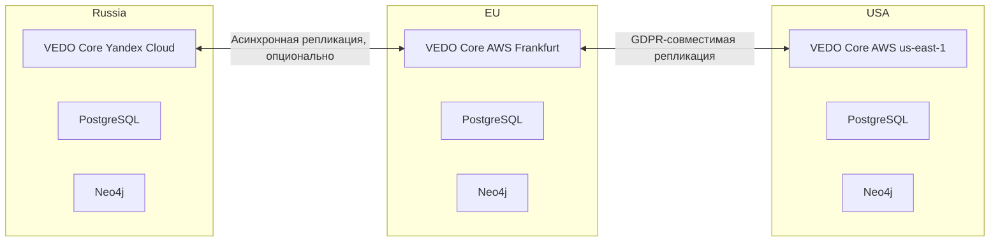

# География развёртывания

| Атрибут | Значение |
|---------|----------|
| **ID** | REQ-CON.INFRA.deployment-geography |
| **Уровень** | CON |
| **Атрибут качества** | Physical |
| **Приоритет** | P1 |
| **Статус** | УТВЕРЖДЕНО |
| **Источник** | — |
| **Критерии приёмки** | — |

---

## Что описывает

Фиксирует ответ на вопрос S1.1: есть ли ограничения по географии развёртывания VEDO Core для РФ, ЕС, США и других регионов.

VEDO Core проектируется как географически гибкая платформа: один код, разные регионы. Ограничения связаны не с программной архитектурой, а с правовыми требованиями, такими как 152-ФЗ и GDPR, а также с требованиями заказчика.

## Общая стратегия

| Регион | Возможность развёртывания | Ограничения | Специфические требования |
|--------|---------------------------|-------------|--------------------------|
| Россия | Да, включено в MVP | Данные должны храниться на серверах на территории РФ | 152-ФЗ, ПДн, ФСТЭК для госзаказчиков |
| ЕС | Да, P2 | Данные обязаны храниться в ЕС | GDPR audit, Data Processing Agreement |
| США | Да, P2 | Cloud Act, HIPAA для медицинских данных | SOC 2 Type II для enterprise |
| Другие страны | По требованию | Нет локальных сертификаций по умолчанию | Адаптация под местное законодательство |

VEDO Core не запрещает размещение данных в любом регионе. Ограничения вводятся заказчиком, например коммерческая тайна, или регулятором, например 152-ФЗ или GDPR. В отсутствие явных требований VEDO Core может быть развёрнут в любом облаке.

Endpoint `/emergency/login` (break-glass доступ) поддерживается во всех регионах развёртывания, так как не зависит от внешнего IdP/Keycloak и является частью базового стека VEDO Core. Shamir-части Emergency Admin пароля не содержат ПДн и могут храниться за пределами региона data residency доверенными лицами security-команды. Подробнее: `human/artifacts/requirements/REQ-NFR.SECURITY.security-requirements.md`.

## Развёртывание в России

### Рекомендуемые провайдеры

| Провайдер | Наличие ЦОД в РФ | Совместимость с 152-ФЗ | Сертификаты | Рекомендация |
|-----------|------------------|------------------------|-------------|--------------|
| Yandex Cloud | Да, Москва, Владивосток и другие | Да | ФСТЭК, 152-ФЗ | Для госзаказчиков |
| VK Cloud (MCS) | Да, Москва | Частично | Нет ФСТЭК | Для коммерческих клиентов |
| Selectel | Да, Москва, Санкт-Петербург | Частично | Нет ФСТЭК | Для коммерческих клиентов |
| AWS | Нет российского региона | Нет | Нет | Не использовать для РФ data residency |

### Требования

- Физическое размещение серверов на территории РФ согласно 152-ФЗ, статья 18, часть 5.
- Для госзаказчиков может требоваться ФСТЭК-режим.
- Возможность предоставления ключей шифрования по требованию ФСБ применима редко и только для особо важных систем.
- Для автоматизированных систем ПДн требуется соответствие мерам защиты, минимум 4-й уровень, если применимо.

### Пример конфигурации

```yaml
region: ru-central1
data_residency: "Russia"
encryption:
  at_rest: "AES-256 (ключи в Yandex KMS)"
  in_transit: "TLS 1.3"
gdpr_compliance: false
fstek_mode: true
```

## Развёртывание в Европейском союзе

### Рекомендуемые провайдеры

| Провайдер | Регионы | Соответствие GDPR | Рекомендация |
|-----------|---------|-----------------|--------------|
| AWS eu-central-1 | Frankfurt | Да | Основной |
| Google Cloud europe-west3 | Frankfurt | Да | Альтернатива |
| Azure germanywestcentral | Frankfurt | Да | Альтернатива |
| Yandex Cloud | Нет EU региона | Нет | Не использовать для EU data residency |

### Требования GDPR

- Персональные данные хранятся только в ЕС, по умолчанию `eu-central-1`.
- Удаление персональных данных выполняется через 30 дней или по Right to be forgotten request.
- С каждым клиентом подписывается Data Processing Agreement.
- Должна быть возможность экспорта всех данных пользователя для data portability.

### Пример конфигурации

```yaml
region: eu-central-1
data_residency: "EU"
gdpr_compliance: true
retention_policy:
  personal_data: 30d
  audit_logs: 1y
encryption:
  at_rest: "AES-256 (AWS KMS)"
```

## Развёртывание в США

### Рекомендуемые провайдеры

| Провайдер | Регионы | Особенности | Рекомендация |
|-----------|---------|-------------|--------------|
| AWS us-east-1 | Вирджиния | HIPAA, SOC 2 Type II | Основной |
| Google Cloud us-central1 | Айова | HIPAA | Альтернатива |

### Требования

- Cloud Act может давать властям доступ к данным.
- HIPAA требуется для медицинских данных и требует Business Associate Agreement.
- SOC 2 Type II нужен для enterprise contracts.

## Мультирегиональное развёртывание

VEDO Core может разворачиваться в нескольких регионах как отдельные региональные инсталляции.



## Правила межрегиональной синхронизации данных

| Тип данных | Синхронизация | Обоснование |
|------------|---------------|-------------|
| ПДн пользователей | Запрещена трансграничная передача | GDPR, 152-ФЗ |
| Модели онтологий: TBox, обезличенные | Разрешена | Нет ПДн |
| Логи | Запрещена | Могут содержать ПДн |

Персональные данные и логи не должны синхронизироваться за пределы региона data residency. Обезличенные TBox модели могут синхронизироваться по согласованию.

## Подключение нового региона

| Этап | Длительность | Действие |
|------|--------------|----------|
| Анализ требований | 2 недели | Понимание локальных законов, сходство с GDPR или 152-ФЗ |
| Выбор провайдера | 1 неделя | AWS, Azure или локальный провайдер |
| Адаптация конфигурации | 1 неделя | Настройка региона и deployment parameters |
| Тестирование | 2 недели | Проверка сетевой задержки и compliance |
| Документация | 1 неделя | Инструкции для заказчика |

Добавление нового региона занимает до 6 недель.

## On-premise Vault (опционально)

Заказчик может использовать HashiCorp Vault для хранения токенов `vedo-cli` и emergency-ключей, но это **не является обязательным требованием** VEDO Core. Поддерживается также файловое хранение с ограничением прав доступа (`chmod 600 ~/.vedo/config.yaml`).

Vault не входит в `docker-compose.yaml` на milestone 001. Для production и on-premise Vault настраивается отдельно. Подробнее: `human/artifacts/requirements/REQ-FUN.PROCESS.ci-cd-requirements.md`.

## Базовая оценка стоимости

| Регион | Провайдер | CPU: 4 vCPU, 16 GB | Storage: 1 TB SSD | Дополнительные сертификаты |
|--------|-----------|---------------------|-------------------|----------------------------|
| Россия | Yandex Cloud | около 5 500 ₽/мес | 3 000 ₽/мес | ФСТЭК +30% |
| ЕС | AWS eu-central-1 | около $80 | около $100 | GDPR без доплаты |
| ЕС | Azure EU | около $85 | около $110 | GDPR без доплаты |
| США | AWS us-east-1 | около $75 | около $90 | SOC 2 около $5000/год |

Цены приблизительные и должны проверяться перед коммерческим предложением.

## Формулировка для заказчика

VEDO Core поддерживает развёртывание в любом регионе, где есть доступ к облачной инфраструктуре: AWS, Azure, Yandex Cloud, Google Cloud или локальный провайдер.

Единственные ограничения законодательные:

- В РФ данные должны храниться на серверах на территории РФ: Yandex Cloud, VK Cloud или другой российский провайдер.
- В ЕС данные обязаны храниться в ЕС: AWS Frankfurt или Azure Germany.
- Для США могут потребоваться HIPAA и SOC 2 Type II.

VEDO предоставляет готовые конфигурации для Yandex Cloud в РФ, AWS Frankfurt в ЕС и AWS us-east-1 в США. Развёртывание в других регионах возможно по запросу, срок до 6 недель.

Хранение персональных данных за пределами региона не осуществляется. Обезличенные метаданные могут быть синхронизированы по согласованию.

## On-Premise Infrastructure Requirements

Для развёртывания VEDO Core on-premise заказчик должен обеспечить соблюдение следующих минимальных требований.

### Поддерживаемые операционные системы

| ОС | Версия | Архитектура | Примечание |
|----|--------|-------------|------------|
| **RHEL** | 8.x, 9.x | x86_64 (amd64) | Полная поддержка |
| **Ubuntu** | 22.04 LTS, 24.04 LTS | x86_64 (amd64) | Полная поддержка |
| **Debian** | 12.x | x86_64 (amd64) | Полная поддержка |
| **Windows Server** | 2022 | x86_64 (amd64) | Только для управляющих узлов (K8s control plane). Для worker-нод — Linux. |

**Ограничения:**
- Windows Server не поддерживается для worker-нод Kubernetes (только Linux).
- ARM64 (Apple Silicon) — экспериментально (без официальной поддержки в MVP).

### Поддерживаемые гипервизоры

| Гипервизор | Версия | Примечание |
|------------|--------|------------|
| **KVM** | Рекомендуемая (встроенный в Linux) | Полная поддержка |
| **VMware ESXi** | 7.0, 8.0 | Полная поддержка |
| **Microsoft Hyper-V** | 2019, 2022 | Полная поддержка |
| **VirtualBox** | 7.x | ❌ Не рекомендуется для production |

### Требования к файловой системе

| Компонент | Рекомендуемая ФС | Причина |
|-----------|------------------|---------|
| **Neo4j (данные)** | ext4, XFS | Производительность, поддержка direct I/O |
| **PostgreSQL (данные)** | ext4, XFS | Целостность, производительность |
| **MinIO (S3 storage)** | XFS | Эффективное хранение больших файлов |
| **Docker / containerd** | ext4, XFS | OverlayFS совместимость |

**Запрещённые ФС для production:**
- NTFS (для БД — риск блокировок и низкой производительности)
- ZFS (без тонкой настройки — проблемы с правами в контейнерах)
- NFS (для БД — риск коррупции)

### Минимальные аппаратные требования (кластер)

| Компонент | Минимально | Рекомендовано |
|-----------|------------|---------------|
| **API Gateway / сервисы** | 4 vCPU, 8 GB RAM | 8 vCPU, 16 GB RAM |
| **Neo4j (на ноду)** | 4 vCPU, 16 GB RAM | 8 vCPU, 32 GB RAM |
| **PostgreSQL** | 4 vCPU, 8 GB RAM | 8 vCPU, 16 GB RAM |
| **Хранилище (S3)** | 100 GB | 1 TB+ |
| **Сеть** | 1 Gbps | 10 Gbps |

### Требования к времени синхронизации

- **NTP обязателен** (разница времени между узлами < 100 мс).
- Отсутствие NTP приводит к проблемам с JWT, распределёнными транзакциями и логами.

### Процедура валидации окружения

Перед установкой VEDO Core on-premise рекомендуется выполнить `vedo-cli validate`:

```bash
vedo-cli validate --all
```

Команда проверяет:
- Версию ОС и ядра.
- Доступность NTP.
- Производительность диска (IOPS, latency).
- Сетевую связность между узлами.
- Наличие необходимых портов.

**Результат:** PASS/FAIL с детальным отчётом.

## Бизнес-правила

- Один код VEDO Core должен поддерживать разные регионы deployment.
- Выбор региона является конфигурацией deployment, а не отдельной веткой кода.
- В РФ персональные данные должны храниться на территории РФ.
- В ЕС персональные данные должны храниться в ЕС.
- Для США enterprise deployment может требовать SOC 2 Type II.
- HIPAA применяется только для медицинских данных и требует BAA.
- ПДн пользователей не синхронизируются между регионами.
- Logs не синхронизируются между регионами, потому что могут содержать ПДн.
- Обезличенные TBox модели могут синхронизироваться между регионами по согласованию.
- Подключение нового региона должно включать legal review, provider selection, configuration, testing и documentation.

---

## DDoS Protection по типам развёртывания

| Тип | Требование | Ответственный |
|-----|-------------|---------------|
| **SaaS (Yandex Cloud)** | Встроенная DDoS-защита Basic (обязательна) | VEDO Core |
| **SaaS (Timeweb)** | DDoS-защита должна быть докуплена (опция) | VEDO Core |
| **On-premise** | Рекомендовано развернуть за Cloudflare или использовать Nginx + limit_req/limit_conn | Заказчик |
| **Air-gapped** | DDoS-защита не требуется (нет внешнего доступа) | — |

Детальные требования по DDoS-защите: `REQ-SEC-70` в `human/artifacts/requirements/REQ-NFR.SECURITY.security-requirements.md`.

---

## Verification of Artifacts for On-premise

Для on-premise клиентов, желающих верифицировать подлинность Docker images VEDO Core:

1. Публичный ключ VEDO Core доступен по ссылке: `https://vedo.cloud/static/vedo-pubkey.pem`
2. Для верификации образа выполните:
   ```bash
   cosign verify --key vedo-pubkey.pem $REGISTRY/vedo/ontology-service:$VERSION
   ```
3. Для верификации provenance (SLSA Level 2):
   ```bash
   slsa-verifier verify-image $REGISTRY/vedo/ontology-service:$VERSION \
     --source-uri https://gitlab.com/vedo-core/ontology-service \
     --source-tag $VERSION
   ```

**Air-gapped среда:** Рекомендуется использовать внутреннюю PKI (инструкция предоставляется по запросу).

**Детальные требования:** `REQ-SEC-90` в `human/artifacts/requirements/REQ-NFR.SECURITY.security-requirements.md`.
