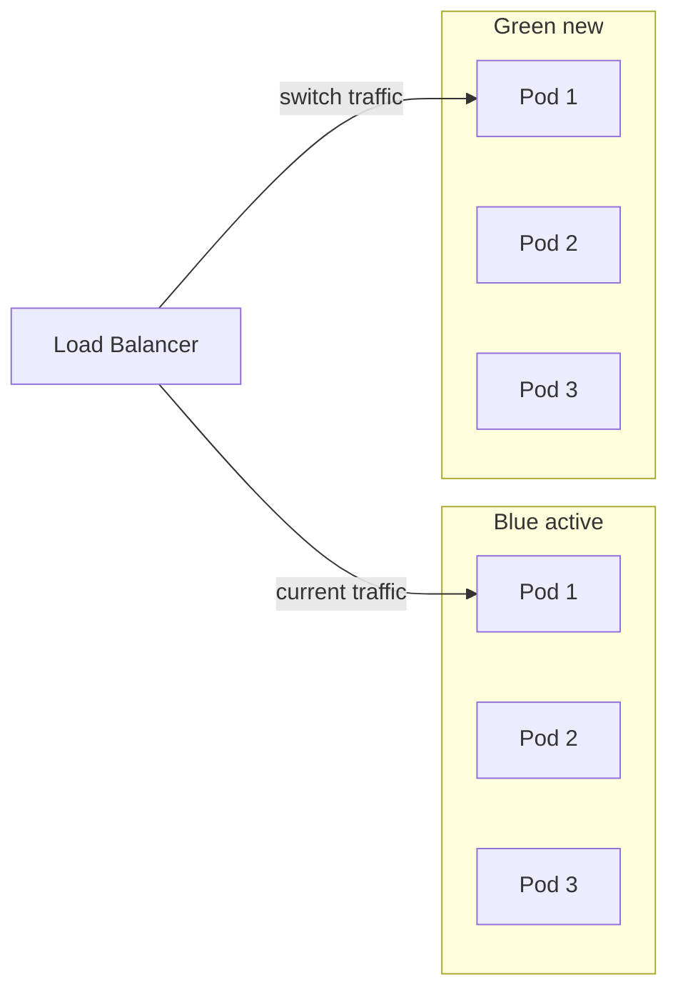

# Стратегия развёртывания

| Атрибут | Значение |
|---------|----------|
| **ID** | REQ-CON.INFRA.deployment-strategy |
| **Уровень** | CON |
| **Атрибут качества** | Physical |
| **Приоритет** | P0 |
| **Статус** | УТВЕРЖДЕНО |
| **Источник** | — |
| **Критерии приёмки** | — |

---

## Что описывает

Фиксирует ответ на вопрос T1.2: есть ли требования к blue-green deployment или canary releases для VEDO Core.

### On-premise deployment prerequisites

Перед развёртыванием VEDO Core on-premise убедитесь, что ваша инфраструктура соответствует требованиям:

- **Операционная система:** RHEL 8/9, Ubuntu 22.04/24.04, Debian 12 (см. `deployment-geography.md`).
- **Гипервизор:** KVM, VMware ESXi 7.0/8.0, Hyper-V 2019/2022.
- **Файловая система:** ext4 или XFS (не NTFS для production).
- **Сеть:** ≤ 10 ms latency между узлами, ≥ 1 Gbps.
- **NTP:** Синхронизация времени обязательна.

Полный список требований — в `deployment-geography.md` и `network-requirements.md`.

VEDO Core определяет обязательные правила deployment strategy для production. Выбор стратегии зависит от типа релиза, SLA, допустимого downtime и технической ёмкости окружения, но не может нарушать блокирующие требования безопасности rollout.

## Матрица стратегий

| Стратегия | Рекомендация | Для каких окружений | Допустимый downtime |
|-----------|--------------|---------------------|---------------------|
| Rolling update | Для minor versions и patches | dev, staging, prod для некритичных обновлений | Около 0 сек, но есть риск частичного трафика на новую версию |
| Blue-green | Для major versions и production critical updates | staging, prod | 0 сек на переключение трафика |
| Canary release | Опционально для крупных инсталляций | prod, только при A/B testing или progressive rollout | 0 сек |

## Стратегия Rolling Update

Rolling update является стратегией по умолчанию для dev, staging и production minor/patch updates.

Как работает: Kubernetes постепенно заменяет старые pods новыми через `maxSurge` и `maxUnavailable`.

```yaml
deployment:
  strategy:
    type: RollingUpdate
    rollingUpdate:
      maxSurge: 1
      maxUnavailable: 0
```

Преимущества:

- Простая настройка.
- Не требует дополнительных ресурсов.
- Downtime практически отсутствует.

Недостатки:

- При ошибке в новой версии часть трафика уже идёт на неё.
- Rollback занимает время, потому что нужно переключить pods на старую версию.

## Стратегия Blue-Green Deployment

Blue-green deployment рекомендуется для production и major versions. Для production major updates blue-green является обязательной стратегией, если инфраструктура заказчика имеет достаточные ресурсы.

Как работает: деплой выполняется в две одинаковые среды: blue — текущая активная, green — новая. После проверки green traffic переключается с blue на green.



Пример Helm values:

```yaml
bluegreen:
  enabled: true
  activeColor: blue
  previewColor: green
  serviceName: vedo-core-svc
  svcSelector:
    color: blue
```

Примеры GitLab CI:

```yaml
deploy-green:
  stage: deploy-staging
  script:
    - helm upgrade --install vedo-core-green ./helm-chart/ --namespace=vedo-prod --set color=green
  only:
    - main
  when: manual

switch-to-green:
  stage: deploy-prod
  script:
    - kubectl patch service vedo-core-svc -p '{"spec":{"selector":{"color":"green"}}}'
  needs:
    - deploy-green
  when: manual

rollback-to-blue:
  stage: deploy-prod
  script:
    - kubectl patch service vedo-core-svc -p '{"spec":{"selector":{"color":"blue"}}}'
  when: manual
```

Преимущества:

- Traffic switch без downtime.
- Rollback выполняется переключением traffic обратно.
- Новая версия тестируется в production-like окружении до переключения.

Недостатки:

- Требует примерно вдвое больше ресурсов на время переключения.

## Стратегия Canary Release

Canary release обязателен для production major updates и production critical updates. Для production minor updates canary обязателен, если релиз меняет API-контракты, схему БД или критичные security-механизмы. Canary требует service mesh, например Istio или Linkerd.

Как работает: traffic постепенно направляется на новую версию: 1%, 10%, 50%, 100%.

Пример Istio VirtualService:

```yaml
apiVersion: networking.istio.io/v1beta1
kind: VirtualService
metadata:
  name: vedo-core-canary
spec:
  hosts:
  - vedo-core
  http:
  - route:
    - destination:
        host: vedo-core-blue
        weight: 95
    - destination:
        host: vedo-core-green
        weight: 5
```

Пример Helm values:

```yaml
canary:
  enabled: false
  weight: 5
  increment: 5
  interval: 60
  maxWeight: 100
```

Преимущества:

- Ошибка затрагивает ограниченную долю пользователей.
- Можно проводить A/B testing.

Недостатки:

- Требуется service mesh.
- Длительное время rollout.
- Больше operational complexity.

## Рекомендации по окружениям

| Окружение | Стратегия | Причина |
|-----------|-----------|---------|
| dev | Rolling update | Быстро и просто |
| staging | Rolling update или blue-green | Можно тестировать traffic switch |
| production minor versions | Rolling update | Низкий риск |
| production major versions | Blue-green | Безопасность rollback |
| production A/B tests | Canary | Требуется Istio или Linkerd |

## Формулировка для заказчика

VEDO Core поддерживает три стратегии deployment:

- Rolling update по умолчанию для dev, staging и minor production updates.
- Blue-green deployment для major versions и production critical updates.
- Canary release опционально для A/B testing и крупных installations, требует service mesh.

Helm chart поставляется с готовыми настройками Rolling update. Для blue-green нужно включить `bluegreen.enabled=true`; на время переключения потребуется примерно вдвое больше ресурсов.

VEDO рекомендует использовать blue-green для production при major upgrades. Rollback в этом случае выполняется мгновенным переключением traffic обратно.

## Бизнес-правила

- Rolling update является стратегией по умолчанию для dev, staging и production minor/patch updates.
- Production major updates должны использовать blue-green deployment.
- Blue-green deployment обязателен для production major updates, если инфраструктура заказчика имеет достаточную ёмкость.
- Если инфраструктура не может запускать blue и green параллельно, major updates должны использовать документированное maintenance window и план rollback.
- Canary release обязателен для production major updates и production critical updates.
- Canary release обязателен для production minor updates, если релиз меняет API-контракты, схему данных или security-контроли.
- Canary release требует service mesh: Istio, Linkerd или эквивалент.
- Helm chart должен поддерживать rolling update по умолчанию.
- Helm chart должен предоставлять настройки `bluegreen.enabled` и `canary.enabled`.
- Переключение production traffic и rollback выполняются только через CI pipeline с записью deployment evidence.
- Rollback для blue-green deployment должен выполняться переключением traffic обратно на предыдущий color.
- Этапы canary для production: `0% -> 5% -> 25% -> 50% -> 100%`.
- Переход на следующий canary-этап запрещён, если `5xx` новой версии > baseline x1.5 в течение 3 минут.
- Переход на следующий canary-этап запрещён, если `latency p95` новой версии > baseline x1.2 в течение 5 минут.
- При нарушении любого hard-threshold выполняется auto-rollback на предыдущий стабильный этап не позднее 2 минут.
- Детальная политика rollout safety и auto-rollback определена в `rollout-safety-gates.md`.
- Переход rollout на 100% production-трафика разрешен только после PASS по `preprod-release-gates.md`.
