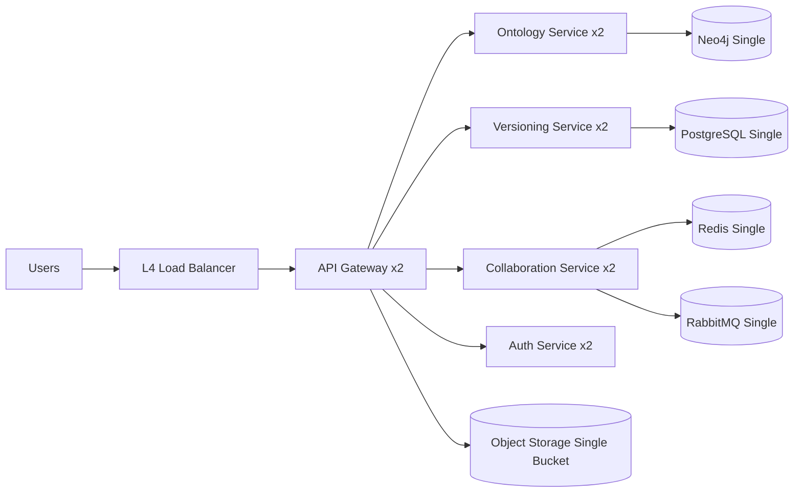
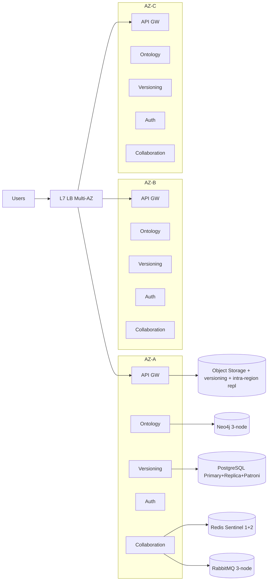
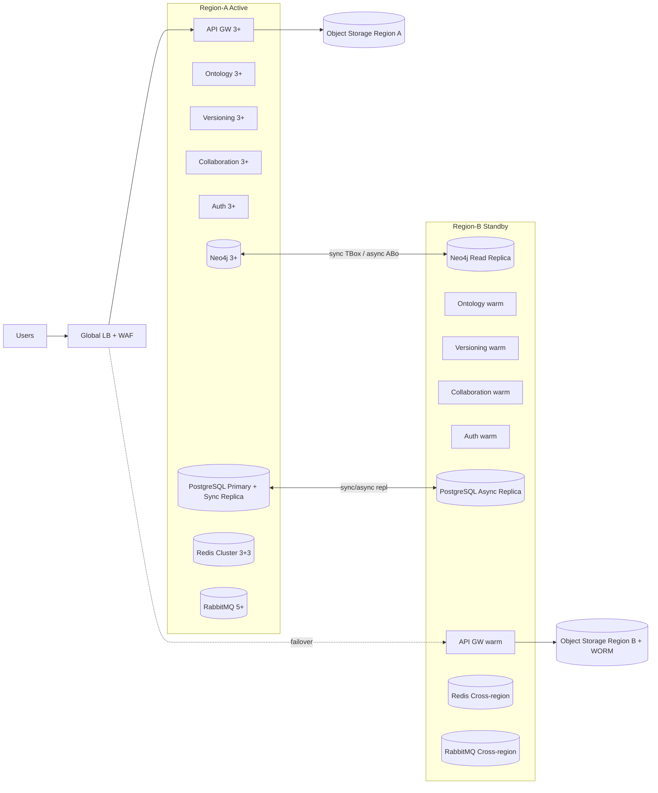

# Deployment Tiers & Reference Architecture Specification v1.0

| Атрибут | Значение |
|---------|----------|
| **ID** | REQ-CON.INFRA.deployment-tiers |
| **Уровень** | CON |
| **Атрибут качества** | Physical |
| **Приоритет** | P1 |
| **Статус** | УТВЕРЖДЕНО |
| **Источник** | — |
| **Критерии приёмки** | — |

---

## Что описывает

Фиксирует стандартные deployment tiers для VEDO Core, их целевые SLO/RTO/RPO, минимальные архитектурные требования, стоимость владения, путь миграции и операционные обязательства.

Документ предназначен для:
- SRE и DevOps (проектирование, эксплуатация, failover).
- Product Management (упаковка SLA/SLO по сегментам клиентов).
- Enterprise-клиентов (планирование инфраструктуры и бюджета).

## Связанные ADR

- `ADR-BIZ.INFRA.saas-deployment-strategy`
- `ADR-DES.INFRA.data-residency-region-strategy`
- `ADR-DES.INFRA.recovery-objectives-mandate`
- `ADR-DES.INFRA.airgap-offline-deployment-strategy`

## 1) Deployment tiers: определение и целевые показатели

| Tier | SLO | Допустимый downtime в месяц | Допустимый downtime в год | RTO | RPO | Архитектурный паттерн | Failover | Целевой рынок |
|---|---|---:|---:|---:|---:|---|---|---|
| Standard | 99.9% | 43.2 мин | 8.76 ч | 1 час | 1 час | Single-region, single-AZ | Ручной | MVP, Community, тестовые среды |
| High | 99.95% | 21.6 мин | 4.38 ч | 15 мин | 15 мин | Single-region, multi-AZ | Semi-automatic | Production для бизнес-клиентов |
| Premium | 99.99% | 4.32 мин | 52.6 мин | 5 мин | 5 мин | Multi-region active-standby | Automatic (с подтверждением) | Enterprise с критическими онтологиями |

## 2) Reference architecture по tiers

### 2.1 Standard (99.9)

- Single-region, single-AZ.
- Допускается единичная отказовая точка в data-layer при обязательном ежедневном backup.
- Failover только по runbook и с ручным подтверждением.



### 2.2 High (99.95)

- Single-region, multi-AZ.
- Контроль отказа AZ без полной остановки критичных сервисов.
- Semi-automatic failover: автоматическая детекция + операторское подтверждение переключения.



### 2.3 Premium (99.99)

- Multi-region active-standby.
- Region A обслуживает трафик, Region B в горячем резерве (warm standby), готов к переключению.
- Automatic failover pipeline с обязательным подтверждением для переключения write-потока.



## 3) Сводная таблица различий по компонентам

| Компонент | Standard | High | Premium |
|---|---|---|---|
| API Gateway | 2 реплики | 3 реплики (multi-AZ) | 3+ реплики + warm standby в регионе B |
| Ontology Service | 2 реплики | 3 реплики + anti-affinity | 3+ реплики + HPA + regional failover |
| Versioning Service | 2 реплики | 3 реплики | 3+ реплики + regional failover |
| Collaboration Service | 2 реплики | 3 реплики + Redis Sentinel | 3+ реплики + Redis Cluster cross-region |
| Auth Service | 2 реплики | 3 реплики + Keycloak HA | 3+ реплики + Keycloak clustered + IdP failover |
| Neo4j | Single + daily backup | 3-node cluster (async) | 3+ node + sync TBox + read replica в регионе B |
| PostgreSQL | Single + pg_dump | Primary + replica + Patroni | Primary + sync replica + async replica в регионе B, PITR 5 мин |
| Redis | Single (RDB) | Sentinel (1+2) | Cluster (3+3) + cross-region |
| RabbitMQ | Single node | 3-node cluster | 5+ node cluster + cross-region |
| Object Storage | Single bucket | Versioning + intra-region replication | CRR + WORM |
| Load Balancer | L4 LB (single) | L7 LB (multi-AZ) | Global LB + WAF |
| Backup | Full daily, WAL 1h | Full daily + PITR 15m | Continuous + PITR 5m + WORM separate region |
| Compute | Single node pool | Multi-AZ node pools | Regional node pools + spot fallback |
| Network | Basic LB | Multi-AZ networking | Multi-region + Direct Connect |

## 4) Component Specification (минимальные технические параметры)

Примечание: значения ниже — reference baseline для Canonical Workload Profile; финальные значения подтверждаются capacity-тестами в целевом контуре клиента.

| Компонент | Tier | Минимум CPU | Минимум RAM | Минимум Storage | Replication factor / topology |
|---|---|---:|---:|---:|---|
| API Gateway | Standard | 2 vCPU на pod | 4 GiB | 20 GiB ephemeral | 2 pods, single region |
| API Gateway | High | 2-4 vCPU на pod | 4-8 GiB | 20 GiB ephemeral | 3 pods, spread across AZ |
| API Gateway | Premium | 4 vCPU на pod | 8 GiB | 30 GiB ephemeral | 3+ active + warm standby region |
| Ontology Service | Standard | 4 vCPU | 8 GiB | 50 GiB | 2 replicas |
| Ontology Service | High | 4-8 vCPU | 16 GiB | 100 GiB | 3 replicas + anti-affinity |
| Ontology Service | Premium | 8+ vCPU | 24+ GiB | 200+ GiB | 3+ + HPA + regional failover |
| Versioning Service | Standard | 4 vCPU | 8 GiB | 100 GiB | 2 replicas |
| Versioning Service | High | 4-8 vCPU | 16 GiB | 200 GiB | 3 replicas |
| Versioning Service | Premium | 8+ vCPU | 24+ GiB | 300+ GiB | 3+ + regional failover |
| Neo4j | Standard | 8 vCPU | 32 GiB | 500 GiB SSD | Single node |
| Neo4j | High | 8-16 vCPU/node | 64 GiB/node | 1 TiB SSD/node | 3-node cluster (async repl) |
| Neo4j | Premium | 16 vCPU/node | 64-128 GiB/node | 2 TiB SSD/node | 3+ nodes, sync TBox + read replica region B |
| PostgreSQL | Standard | 8 vCPU | 32 GiB | 500 GiB SSD | Single primary |
| PostgreSQL | High | 8-16 vCPU | 64 GiB | 1 TiB SSD | Primary + replica + Patroni |
| PostgreSQL | Premium | 16 vCPU | 64-128 GiB | 2 TiB SSD | Primary + sync replica + async cross-region |
| Redis | Standard | 4 vCPU | 16 GiB | 100 GiB | Single + RDB |
| Redis | High | 4-8 vCPU/node | 16-32 GiB/node | 100 GiB/node | Sentinel 1+2 |
| Redis | Premium | 8 vCPU/node | 32 GiB/node | 200 GiB/node | Cluster 3+3 + cross-region |
| RabbitMQ | Standard | 4 vCPU | 8 GiB | 200 GiB | Single node |
| RabbitMQ | High | 4-8 vCPU/node | 16 GiB/node | 300 GiB/node | 3-node cluster |
| RabbitMQ | Premium | 8 vCPU/node | 32 GiB/node | 500 GiB/node | 5+ nodes + cross-region |
| Object Storage | Standard | Managed/basic | Managed/basic | 1 TiB | Single bucket |
| Object Storage | High | Managed/HA | Managed/HA | 5 TiB | Versioning + intra-region replication |
| Object Storage | Premium | Managed/HA | Managed/HA | 10+ TiB | CRR + WORM in separate region |

## 5) Дополнительные требования Premium (99.99)

```yaml
premium_requirements:
  data:
    tbox_sync_replication: true
    abox_async_replication: true
    pitr_target: 5_minutes
    immutable_backup: true
    backup_worm_region: separate

  security:
    mfa_all_destructive: true
    two_admin_for_tenant_delete: true
    break_glass_enabled: true

  availability:
    automatic_failover: true
    cross_region_failover_enabled: true
    disaster_recovery_drills: quarterly
    chaos_tests: monthly

  compliance:
    audit_retention_years: 7
    soc2_type2_attestation: true
    encryption_at_rest: always

  support:
    dedicated_support: true
    pagerduty_escalation: true
    response_time_p0: 5_minutes
```

## 6) Cost multiplier (ориентир)

| Tier | Относительная стоимость | Комментарий |
|---|---:|---|
| Standard | 1.0x | Базовый single-region контур |
| High | ~1.8x | Рост за счёт multi-AZ, HA БД и очередей |
| Premium | ~3.5x | Рост за счёт multi-region, standby, WORM, DR/chaos практик |

## 7) Upgrade / migration path

| Переход | Поддержка | Оценка downtime | Сложность | Комментарий |
|---|---|---|---|---|
| Standard -> High | Да | Обычно 15-60 минут (поэтапно) | Средняя | Добавление реплик, Patroni, Sentinel, multi-AZ сетки |
| Standard -> Premium | Да, с миграцией | Плановый downtime обязателен | Высокая | Добавление второго региона, перестройка data replication |
| High -> Premium | Да | 5-30 минут (cutover) | Высокая | Подключение region B, sync/async репликации, global LB |
| Premium -> High/Standard | Не поддерживается | - | - | Только через новый deployment и миграционный проект |

Минимальные фазы миграции:
1. Assessment текущего tier и capacity gap.
2. Infra bootstrap целевого tier.
3. Data replication + consistency validation.
4. Cutover/failover rehearsal.
5. Production switch + post-migration verification.

## 8) Required artifacts по каждому tier

| Артефакт | Standard | High | Premium | Владелец |
|---|---|---|---|---|
| Architecture diagram (Mermaid/C4) | Обязательно | Обязательно | Обязательно | Platform Architect |
| Deployment manifest (Helm values) | Обязательно | Обязательно | Обязательно | DevOps |
| Runbook (recovery/failover/backup) | Обязательно | Обязательно | Обязательно + DR drills | SRE |
| SLA addendum | Базовый | Расширенный | Enterprise расширенный | Product + Legal |
| Pricing model | Базовый | Business | Enterprise | Product Management |
| Migration path document | Standard->High | High path | High->Premium + DR validation | Platform + SRE |

## 9) Decision matrix: как выбрать tier

| Критерий | Standard | High | Premium |
|---|---|---|---|
| Размер онтологии / критичность | Небольшие/средние, некритичные | Production бизнес-нагрузка | Критичные онтологии и near-zero downtime ожидания |
| Регуляторные требования | Базовые | Повышенные | Строгие (аудит, долгий retention, формальные DR) |
| RTO/RPO ожидания | До 1 часа | До 15 минут | До 5 минут |
| Допустимый бюджет | Минимальный | Средний | Высокий |
| Требования к непрерывности бизнеса | Ограниченные | Значимые | Критические |

Правило выбора:
- Если целевой RTO/RPO <= 15 минут и есть production-критичные процессы, минимальный выбор — `High`.
- Если требуются cross-region устойчивость и near-continuous SLA 99.99%, выбор — только `Premium`.

## 10) Responsibilities

| Роль | Ответственность |
|---|---|
| SRE | SLO/RTO/RPO контроль, runbooks, DR/chaos drills, инцидент-менеджмент |
| Platform Team | Референс-архитектура, IaC/Helm стандарты, сетевой/кластерный дизайн |
| DevOps | Развёртывание, upgrade/cutover операции, observability и backup pipeline |
| DBA | Репликация, PITR, контроль консистентности TBox/ABox, performance tuning БД |
| Security Lead | MFA/break-glass политики, ключи, compliance-контроли безопасности |
| Product Management | SLA tier packaging, pricing model, коммерческие условия и roadmap апгрейдов |

## 11) Compliance mapping по tiers

| Требование / стандарт | Standard | High | Premium |
|---|---|---|---|
| 152-ФЗ (локализация/защита ПДн) | Базовые меры, локальные регионы по договору | Усиленные меры + HA-контроль | Обязательная формализация + расширенный аудит |
| GDPR | Базовые механизмы удаления/экспорта | Полные операционные процедуры | Полный набор + доказуемые DR-процедуры |
| HIPAA (если применимо) | Не целевой по умолчанию | Частично, по дополнительным мерам | Поддерживаемый режим при отдельном контуре controls |
| SOC2 | Не требуется по умолчанию | Рекомендуется readiness | SOC2 Type II attestation как целевое требование |

## 12) Exclusions and limitations (что не покрывается SLA)

SLA/SLO не покрывают:
- Плановые окна обслуживания, согласованные заранее.
- Инциденты внешних зависимостей вне зоны контроля VEDO Core (внешний IdP, внешний DNS, внешние API клиента).
- Неправильные действия клиента: ручные изменения инфраструктуры вне approved runbook/IaC, отключение backup/monitoring, нарушение capacity guidance.
- Форс-мажор и глобальные отказовые события провайдера вне контрактных обязательств.

## 13) Бизнес-правила

- Tier фиксируется в контракте и SLA addendum.
- Переход на более высокий tier требует formal readiness review (SRE + Platform + DBA).
- Даунгрейд tier не поддерживается без нового проекта миграции.
- Для Premium обязательны quarterly DR drills и monthly chaos tests с отчётностью.
- Любая архитектура, заявляющая 99.99%, должна иметь multi-region active-standby и WORM backup в отдельном регионе.
