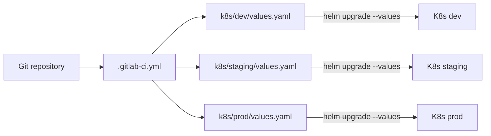

# Конфигурация окружений

| Атрибут | Значение |
|---------|----------|
| **ID** | REQ-CON.INFRA.environment-configuration |
| **Уровень** | CON |
| **Атрибут качества** | Implementation |
| **Приоритет** | P0 |
| **Статус** | УТВЕРЖДЕНО |
| **Источник** | — |
| **Критерии приёмки** | — |

---

## Назначение

Фиксирует ответ на вопрос T1.3: как VEDO Core обрабатывает конфигурацию между средами dev, staging и prod.

VEDO Core управляет конфигурацией через GitOps: конфигурация хранится в Git и применяется через GitLab CI. Для каждой среды используется отдельный файл Helm values.

## Подход

Источник истины для конфигурации окружений — Git-репозиторий.



## Структура репозитория

```text
vedo-core/
├── helm-chart/
│   ├── templates/
│   └── values.yaml
└── k8s/
    ├── dev/
    │   └── values.yaml
    ├── staging/
    │   └── values.yaml
    └── prod/
        └── values.yaml
```

`helm-chart/values.yaml` содержит значения по умолчанию и не должен редактироваться вручную для конкретной среды. Переопределения для конкретных окружений хранятся в `k8s/<env>/values.yaml`.

## Различия окружений

| Переменная | dev | staging | prod | Комментарий |
|------------|-----|---------|------|-------------|
| `replicaCount` | 1 | 2 | 3 | Меньше ресурсов для dev |
| `resources.limits.cpu` | 500m | 1000m | 2000m | Production получает больше мощности |
| `resources.limits.memory` | 512Mi | 1Gi | 4Gi | Production получает больше памяти |
| `ingress.host` | `dev.vedo.ai` | `staging.vedo.ai` | `vedo.ai` | Разные домены |
| `database.host` | `dev-postgres` | `staging-postgres` | `prod-postgres` | Разные БД |
| `database.replicaCount` | 1 | 1 | 3 | Production использует кластер |
| `redis.enabled` | true | true | true | Redis включён везде |
| `redis.cluster.enabled` | false | false | true | Production использует кластер |
| `monitoring.enabled` | false | true | true | Мониторинг включён со staging |
| `logging.level` | DEBUG | INFO | WARN | Меньше шума в prod |
| `features.hlv_markers` | true | true | true | HLV markers включены везде |
| `security.ssl.enabled` | false | true | true | TLS со staging |

## Базовые values

```yaml
replicaCount: 2

image:
  repository: vedo/core
  tag: latest
  pullPolicy: Always

resources:
  limits:
    cpu: 1000m
    memory: 1Gi
  requests:
    cpu: 500m
    memory: 512Mi

database:
  host: postgres
  port: 5432
  replicaCount: 1

redis:
  enabled: true
  cluster:
    enabled: false

monitoring:
  enabled: false

logging:
  level: INFO

security:
  ssl:
    enabled: false

features:
  hlv_markers: true
```

## Values для dev

```yaml
replicaCount: 1

resources:
  limits:
    cpu: 500m
    memory: 512Mi

ingress:
  host: dev.vedo.ai

database:
  host: dev-postgres
  replicaCount: 1

logging:
  level: DEBUG

security:
  ssl:
    enabled: false
```

## Values для staging

```yaml
replicaCount: 2

resources:
  limits:
    cpu: 1000m
    memory: 1Gi

ingress:
  host: staging.vedo.ai

database:
  host: staging-postgres
  replicaCount: 2

monitoring:
  enabled: true

logging:
  level: INFO
```

## Values для production

```yaml
replicaCount: 3

resources:
  limits:
    cpu: 2000m
    memory: 4Gi

ingress:
  host: vedo.ai

database:
  host: prod-postgres-cluster
  replicaCount: 3

redis:
  cluster:
    enabled: true
    nodes: 6

monitoring:
  enabled: true
  alerting: true

logging:
  level: WARN

security:
  ssl:
    enabled: true
    certManager: true

backup:
  enabled: true
  schedule: "0 2 * * *"
```

## Применение через GitLab CI

Каждая задача деплоя окружения должна передавать соответствующий файл values в Helm.

```yaml
deploy-dev:
  stage: deploy-dev
  script:
    - helm upgrade --install vedo-core ./helm-chart/ --namespace=vedo-dev --values ./k8s/dev/values.yaml --set image.tag=$CI_COMMIT_SHORT_SHA
  environment:
    name: dev
  only:
    - main

deploy-staging:
  stage: deploy-staging
  script:
    - helm upgrade --install vedo-core ./helm-chart/ --namespace=vedo-staging --values ./k8s/staging/values.yaml --set image.tag=$CI_COMMIT_SHORT_SHA
  environment:
    name: staging
  only:
    - main
  when: manual

deploy-prod:
  stage: deploy-prod
  script:
    - helm upgrade --install vedo-core ./helm-chart/ --namespace=vedo-prod --values ./k8s/prod/values.yaml --set image.tag=$CI_COMMIT_SHORT_SHA
  environment:
    name: production
  only:
    - main
  when: manual
```

## Политика секретов

Файлы `values.yaml` не должны содержать пароли, токены или приватные ключи.

| Тип секрета | Где хранится | Как применяется |
|-------------|--------------|-----------------|
| Пароли БД, API keys, JWT secrets | GitLab CI/CD Variables, masked | Передаются через `--set` или external secret reference |
| TLS certificates | cert-manager + Let's Encrypt | Автоматически |
| Секреты заказчика | Kubernetes Secrets или external secret operator | Подключаются через values references |

Пример values для production не должен содержать значения паролей:

```yaml
database:
  host: prod-postgres-cluster
  user: vedo
```

Секреты передаются через GitLab CI:

```yaml
deploy-prod:
  script:
    - helm upgrade --install vedo-core ./helm-chart/ --namespace=vedo-prod --values ./k8s/prod/values.yaml --set database.password=$PROD_DB_PASSWORD --set redis.password=$PROD_REDIS_PASSWORD
```

## Управление production-секретами

Production должен использовать external secret operator, где это возможно. Поддерживаемые backends включают AWS Secrets Manager, HashiCorp Vault и GitLab Variables.

```yaml
externalSecrets:
  enabled: true
  backend: aws
  region: eu-central-1
  secretStore: aws-secrets-manager
```

## Формулировка для заказчика

VEDO Core управляет конфигурацией между средами через GitOps:

- `k8s/dev/values.yaml`: конфигурация dev, 1 реплика, DEBUG logs, мониторинг отключён.
- `k8s/staging/values.yaml`: конфигурация staging, 2 реплики, мониторинг включён.
- `k8s/prod/values.yaml`: конфигурация production, 3 реплики, кластеризованная база данных, SSL и резервные копии.

Секреты не хранятся в Git. Они передаются через CI/CD variables или external secret managers, такие как AWS Secrets Manager и HashiCorp Vault.

Helm chart автоматически получает корректный файл values на основе окружения деплоя. Все изменения конфигурации проходят через тот же CI/CD process, что и изменения кода.

## Бизнес-правила

- Git-репозиторий является источником истины для несекретной конфигурации окружений.
- `helm-chart/values.yaml` содержит defaults и не должен редактироваться напрямую для изменений конкретных окружений.
- У каждого окружения должен быть собственный файл values в `k8s/<env>/values.yaml`.
- Задачи деплоя GitLab CI должны использовать соответствующий файл values для dev, staging и prod.
- Секреты никогда нельзя хранить в Git или обычных файлах values.
- Секреты должны храниться в masked GitLab CI/CD Variables, Kubernetes Secrets или external secret managers.
- Production должен использовать external secret operator, где это возможно.
- Dev может работать с меньшими ресурсами, меньшим количеством реплик, DEBUG logging и без SSL.
- Staging должен включать monitoring и использовать production-like resource limits, где это практично.
- Production должен включать monitoring, SSL и backups.
- Изменения конфигурации должны проходить review и CI/CD так же, как изменения кода.

## Открытые вопросы

- Нет открытых вопросов по T1.3.
