# Диаграммы последовательностей — VEDO Core

| Атрибут | Значение |
|---------|----------|
| **ID** | REQ-FUN.CROSS.sequences |
| **Уровень** | FUN |
| **Атрибут качества** | Functionality |
| **Приоритет** | P0 |
| **Статус** | УТВЕРЖДЕНО |
| **Источник** | — |
| **Критерии приёмки** | — |

---

Документ синхронизирован с `human/artifacts/use-cases.md`: для каждого UC есть отдельная sequence-диаграмма или группа потоков внутри одной диаграммы.

## Оглавление

- [UC-editor.classes.manage-class-lifecycle: Управлять классами](#uc-editor-classes-manage-class-lifecycle)
- [UC-editor.properties.manage-property-lifecycle: Управлять свойствами](#uc-editor-properties-manage-property-lifecycle)
- [UC-editor.properties.manage-ontology-annotations: Управлять аннотациями](#uc-editor-properties-manage-ontology-annotations)
- [UC-abox.individuals.manage-individual-lifecycle: Управлять индивидами (ABox)](#uc-abox-individuals-manage-individual-lifecycle)
- [UC-browse.tree.view-ontology-tree-and-graph: Просматривать онтологию](#uc-browse-tree-view-ontology-tree-and-graph)
- [UC-browse.graph.view-ontology-graph-with-pagination: Просматривать граф онтологии с пагинацией](#uc-browse-graph-pagination)
- [UC-browse.search.search-ontology-elements: Искать элементы](#uc-browse-search-search-ontology-elements)
- [UC-browse.search.execute-sparql-query-through-gui: Выполнить SPARQL-запрос через GUI](#uc-browse-search-sparql-gui)
- [UC-metrics.analytics.view-ontology-metrics: Анализировать метрики](#uc-metrics-analytics-view-ontology-metrics)
- [UC-git.commits.manage-commit-history: Управлять версиями](#uc-git-commits-manage-commit-history)
- [UC-git.branches.manage-branch-workflow: Управлять ветками](#uc-git-branches-manage-branch-workflow)
- [UC-git.commits.compare-ontology-versions: Сравнивать версии](#uc-git-commits-compare-ontology-versions)
- [UC-team.reviews.review-merge-request: Проводить ревью Merge Request](#uc-team-reviews-review-merge-request)
- [UC-editor.classes.validate-ontology-with-shacl: Валидировать онтологию](#uc-editor-classes-validate-ontology-with-shacl)
- [UC-editor.classes.manage-data-quality-rules: Контролировать качество данных](#uc-editor-classes-manage-data-quality-rules)
- [UC-io.import.import-and-export-ontology-data: Обмениваться данными](#uc-io-import-import-and-export-ontology-data)
- [UC-api.integration.integrate-through-platform-apis: Интегрироваться через API](#uc-api-integration-integrate-through-platform-apis)
- [UC-admin.system.manage-platform-configuration: Управлять системой](#uc-admin-system-manage-platform-configuration)
- [UC-admin.access.manage-membership-and-permissions: Настраивать доступ](#uc-admin-access-manage-membership-and-permissions)
- [UC-admin.backup.manage-backup-and-restore-via-cli: Управлять backup/restore через `vedo-cli`](#uc-admin-backup-manage-backup-and-restore-via-cli)
- [UC-admin.migration.apply-migrations-with-rollback-via-cli: Выполнять миграции с rollback через `vedo-cli`](#uc-admin-migration-apply-migrations-with-rollback-via-cli)
- [UC-admin.airgap.prepare-air-gapped-package-via-cli: Готовить air-gapped package через `vedo-cli`](#uc-admin-airgap-prepare-air-gapped-package-via-cli)
- [UC-diagnostics.trace.diagnose-incident-by-trace-id: Диагностировать инцидент по `trace_id`](#uc-diagnostics-trace-diagnose-incident-by-trace-id)
- [UC-admin.migration.transfer-and-diff-ontologies-via-cli: Переносить и сравнивать онтологии через `vedo-cli`](#uc-admin-migration-transfer-and-diff-ontologies-via-cli)
- [UC-io.publish.publish-ontology-snapshot: Публиковать снэпшот онтологии](#uc-io-publish)
- [UC-browse.public.view-published-ontology: Просматривать опубликованную онтологию без авторизации](#uc-browse-public)

---

## UC-editor.classes.manage-class-lifecycle: Управлять классами

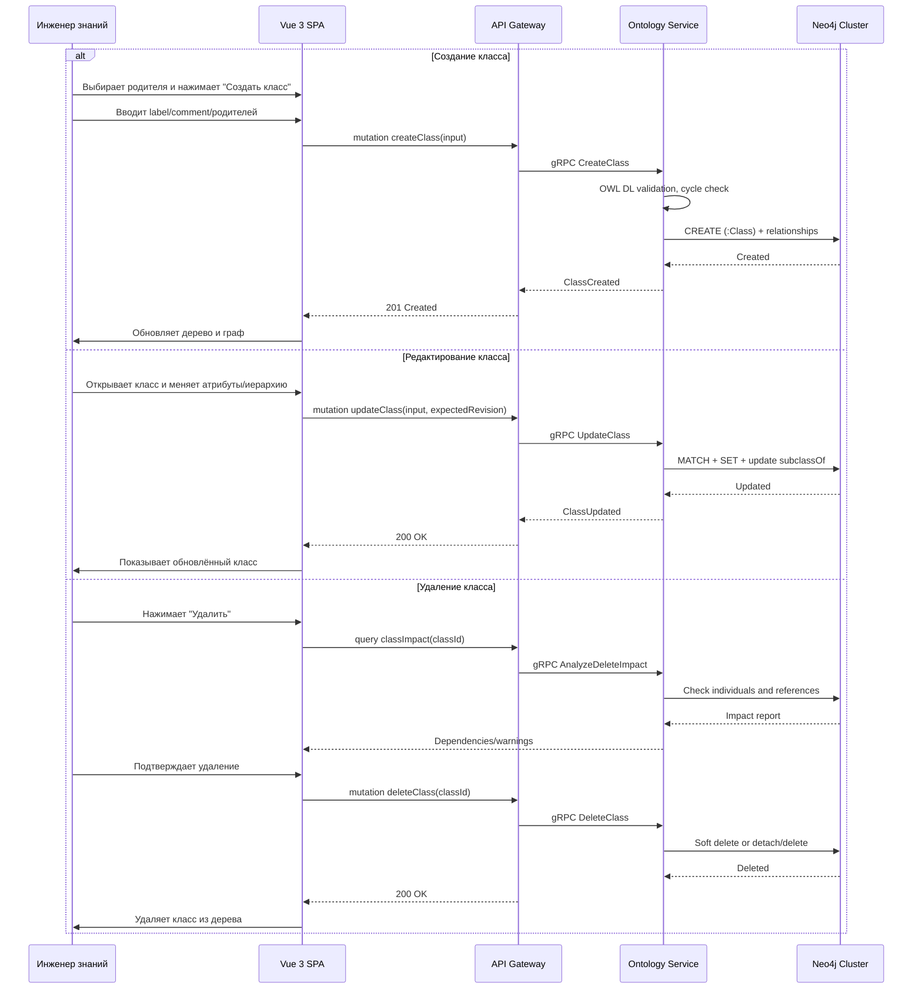
```mermaid
sequenceDiagram
    participant KE as Инженер знаний
    participant SPA as Vue 3 SPA
    participant AGW as API Gateway
    participant ONT as Ontology Service
    participant NEO4J as Neo4j Cluster

    alt Создание класса
        KE->>SPA: Выбирает родителя и нажимает "Создать класс"
        KE->>SPA: Вводит label/comment/родителей
        SPA->>AGW: mutation createClass(input)
        AGW->>ONT: gRPC CreateClass
        ONT->>ONT: OWL DL validation, cycle check
        ONT->>NEO4J: CREATE (:Class) + relationships
        NEO4J-->>ONT: Created
        ONT-->>AGW: ClassCreated
        AGW-->>SPA: 201 Created
        SPA->>KE: Обновляет дерево и граф
    else Редактирование класса
        KE->>SPA: Открывает класс и меняет атрибуты/иерархию
        SPA->>AGW: mutation updateClass(input, expectedRevision)
        AGW->>ONT: gRPC UpdateClass
        ONT->>NEO4J: MATCH + SET + update subclassOf
        NEO4J-->>ONT: Updated
        ONT-->>AGW: ClassUpdated
        AGW-->>SPA: 200 OK
        SPA->>KE: Показывает обновлённый класс
    else Удаление класса
        KE->>SPA: Нажимает "Удалить"
        SPA->>AGW: query classImpact(classId)
        AGW->>ONT: gRPC AnalyzeDeleteImpact
        ONT->>NEO4J: Check individuals and references
        NEO4J-->>ONT: Impact report
        ONT-->>SPA: Dependencies/warnings
        KE->>SPA: Подтверждает удаление
        SPA->>AGW: mutation deleteClass(classId)
        AGW->>ONT: gRPC DeleteClass
        ONT->>NEO4J: Soft delete or detach/delete
        NEO4J-->>ONT: Deleted
        AGW-->>SPA: 200 OK
        SPA->>KE: Удаляет класс из дерева
    end
```

---

## UC-editor.properties.manage-property-lifecycle: Управлять свойствами

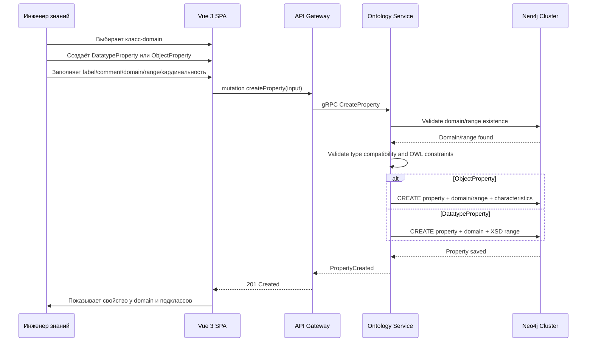
```mermaid
sequenceDiagram
    participant KE as Инженер знаний
    participant SPA as Vue 3 SPA
    participant AGW as API Gateway
    participant ONT as Ontology Service
    participant NEO4J as Neo4j Cluster

    KE->>SPA: Выбирает класс-domain
    KE->>SPA: Создаёт DatatypeProperty или ObjectProperty
    KE->>SPA: Заполняет label/comment/domain/range/кардинальность
    SPA->>AGW: mutation createProperty(input)
    AGW->>ONT: gRPC CreateProperty
    ONT->>NEO4J: Validate domain/range existence
    NEO4J-->>ONT: Domain/range found
    ONT->>ONT: Validate type compatibility and OWL constraints
    alt ObjectProperty
        ONT->>NEO4J: CREATE property + domain/range + characteristics
    else DatatypeProperty
        ONT->>NEO4J: CREATE property + domain + XSD range
    end
    NEO4J-->>ONT: Property saved
    ONT-->>AGW: PropertyCreated
    AGW-->>SPA: 201 Created
    SPA->>KE: Показывает свойство у domain и подклассов
```

---

## UC-editor.properties.manage-ontology-annotations: Управлять аннотациями

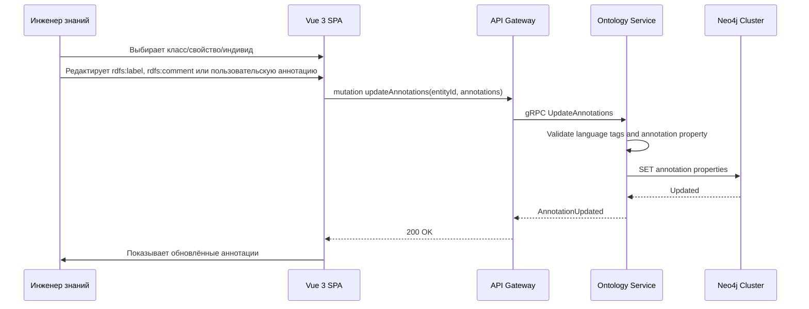
```mermaid
sequenceDiagram
    participant KE as Инженер знаний
    participant SPA as Vue 3 SPA
    participant AGW as API Gateway
    participant ONT as Ontology Service
    participant NEO4J as Neo4j Cluster

    KE->>SPA: Выбирает класс/свойство/индивид
    KE->>SPA: Редактирует rdfs:label, rdfs:comment или пользовательскую аннотацию
    SPA->>AGW: mutation updateAnnotations(entityId, annotations)
    AGW->>ONT: gRPC UpdateAnnotations
    ONT->>ONT: Validate language tags and annotation property
    ONT->>NEO4J: SET annotation properties
    NEO4J-->>ONT: Updated
    ONT-->>AGW: AnnotationUpdated
    AGW-->>SPA: 200 OK
    SPA->>KE: Показывает обновлённые аннотации
```

---

## UC-abox.individuals.manage-individual-lifecycle: Управлять индивидами (ABox)

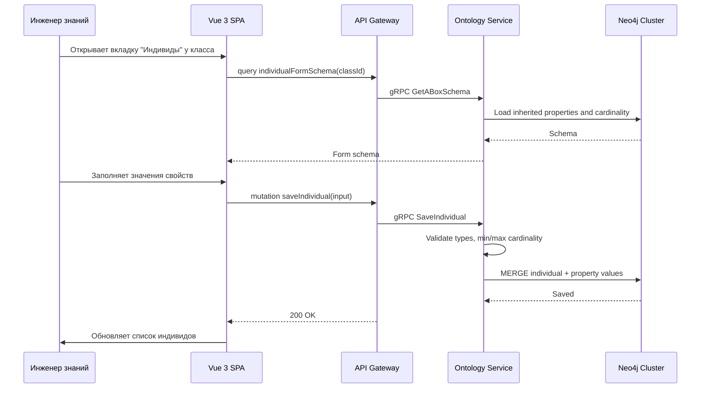
```mermaid
sequenceDiagram
    participant KE as Инженер знаний
    participant SPA as Vue 3 SPA
    participant AGW as API Gateway
    participant ONT as Ontology Service
    participant NEO4J as Neo4j Cluster

    KE->>SPA: Открывает вкладку "Индивиды" у класса
    SPA->>AGW: query individualFormSchema(classId)
    AGW->>ONT: gRPC GetABoxSchema
    ONT->>NEO4J: Load inherited properties and cardinality
    NEO4J-->>ONT: Schema
    ONT-->>SPA: Form schema
    KE->>SPA: Заполняет значения свойств
    SPA->>AGW: mutation saveIndividual(input)
    AGW->>ONT: gRPC SaveIndividual
    ONT->>ONT: Validate types, min/max cardinality
    ONT->>NEO4J: MERGE individual + property values
    NEO4J-->>ONT: Saved
    AGW-->>SPA: 200 OK
    SPA->>KE: Обновляет список индивидов
```

---

## UC-browse.tree.view-ontology-tree-and-graph: Просматривать онтологию

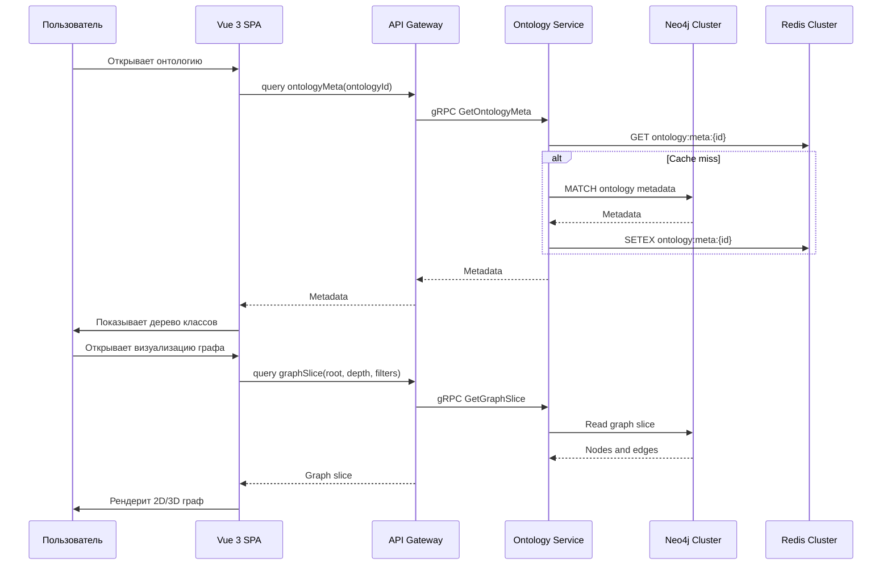
```mermaid
sequenceDiagram
    participant USER as Пользователь
    participant SPA as Vue 3 SPA
    participant AGW as API Gateway
    participant ONT as Ontology Service
    participant NEO4J as Neo4j Cluster
    participant REDIS as Redis Cluster

    USER->>SPA: Открывает онтологию
    SPA->>AGW: query ontologyMeta(ontologyId)
    AGW->>ONT: gRPC GetOntologyMeta
    ONT->>REDIS: GET ontology:meta:{id}
    alt Cache miss
        ONT->>NEO4J: MATCH ontology metadata
        NEO4J-->>ONT: Metadata
        ONT->>REDIS: SETEX ontology:meta:{id}
    end
    ONT-->>AGW: Metadata
    AGW-->>SPA: Metadata
    SPA->>USER: Показывает дерево классов
    USER->>SPA: Открывает визуализацию графа
    SPA->>AGW: query graphSlice(root, depth, filters)
    AGW->>ONT: gRPC GetGraphSlice
    ONT->>NEO4J: Read graph slice
    NEO4J-->>ONT: Nodes and edges
    AGW-->>SPA: Graph slice
    SPA->>USER: Рендерит 2D/3D граф
```

---

## UC-browse.graph.view-ontology-graph-with-pagination: Просматривать граф онтологии с пагинацией

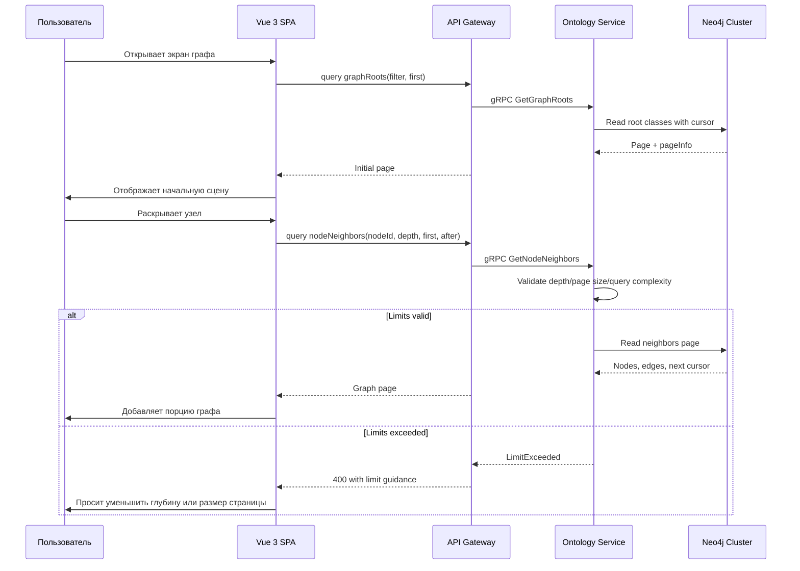
```mermaid
sequenceDiagram
    participant USER as Пользователь
    participant SPA as Vue 3 SPA
    participant AGW as API Gateway
    participant ONT as Ontology Service
    participant NEO4J as Neo4j Cluster

    USER->>SPA: Открывает экран графа
    SPA->>AGW: query graphRoots(filter, first)
    AGW->>ONT: gRPC GetGraphRoots
    ONT->>NEO4J: Read root classes with cursor
    NEO4J-->>ONT: Page + pageInfo
    AGW-->>SPA: Initial page
    SPA->>USER: Отображает начальную сцену
    USER->>SPA: Раскрывает узел
    SPA->>AGW: query nodeNeighbors(nodeId, depth, first, after)
    AGW->>ONT: gRPC GetNodeNeighbors
    ONT->>ONT: Validate depth/page size/query complexity
    alt Limits valid
        ONT->>NEO4J: Read neighbors page
        NEO4J-->>ONT: Nodes, edges, next cursor
        AGW-->>SPA: Graph page
        SPA->>USER: Добавляет порцию графа
    else Limits exceeded
        ONT-->>AGW: LimitExceeded
        AGW-->>SPA: 400 with limit guidance
        SPA->>USER: Просит уменьшить глубину или размер страницы
    end
```

---

## UC-browse.search.search-ontology-elements: Искать элементы

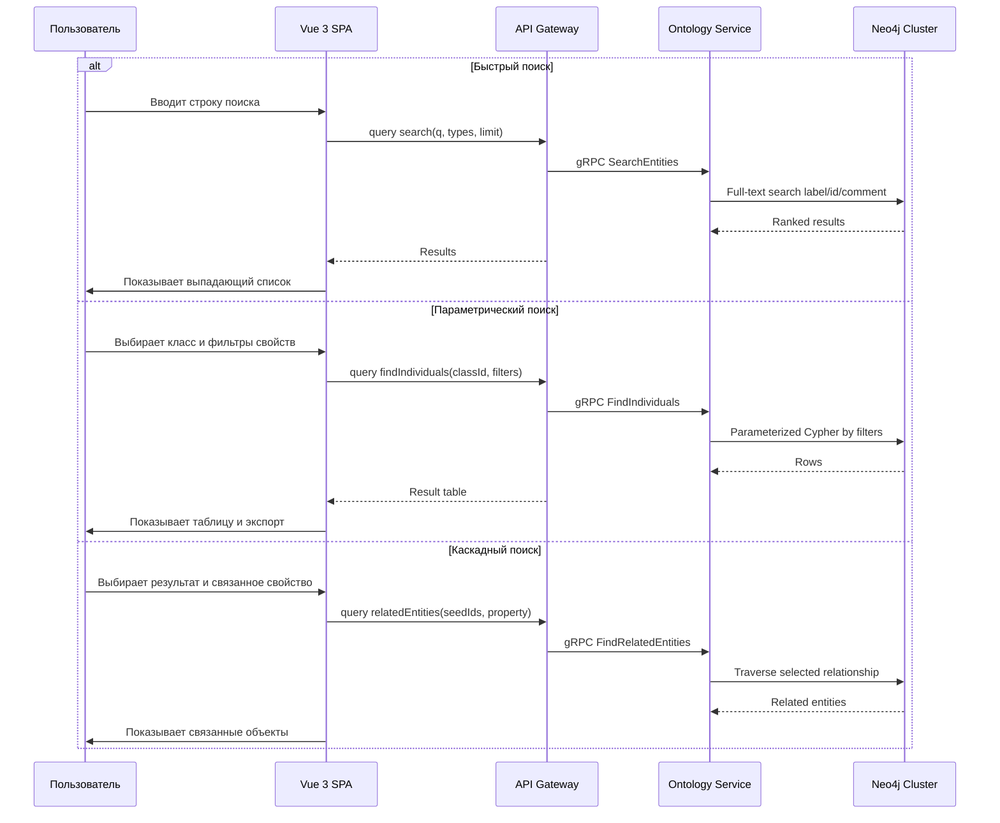
```mermaid
sequenceDiagram
    participant USER as Пользователь
    participant SPA as Vue 3 SPA
    participant AGW as API Gateway
    participant ONT as Ontology Service
    participant NEO4J as Neo4j Cluster

    alt Быстрый поиск
        USER->>SPA: Вводит строку поиска
        SPA->>AGW: query search(q, types, limit)
        AGW->>ONT: gRPC SearchEntities
        ONT->>NEO4J: Full-text search label/id/comment
        NEO4J-->>ONT: Ranked results
        AGW-->>SPA: Results
        SPA->>USER: Показывает выпадающий список
    else Параметрический поиск
        USER->>SPA: Выбирает класс и фильтры свойств
        SPA->>AGW: query findIndividuals(classId, filters)
        AGW->>ONT: gRPC FindIndividuals
        ONT->>NEO4J: Parameterized Cypher by filters
        NEO4J-->>ONT: Rows
        AGW-->>SPA: Result table
        SPA->>USER: Показывает таблицу и экспорт
    else Каскадный поиск
        USER->>SPA: Выбирает результат и связанное свойство
        SPA->>AGW: query relatedEntities(seedIds, property)
        AGW->>ONT: gRPC FindRelatedEntities
        ONT->>NEO4J: Traverse selected relationship
        NEO4J-->>ONT: Related entities
        SPA->>USER: Показывает связанные объекты
    end
```

---

## UC-browse.search.execute-sparql-query-through-gui: Выполнить SPARQL-запрос через GUI

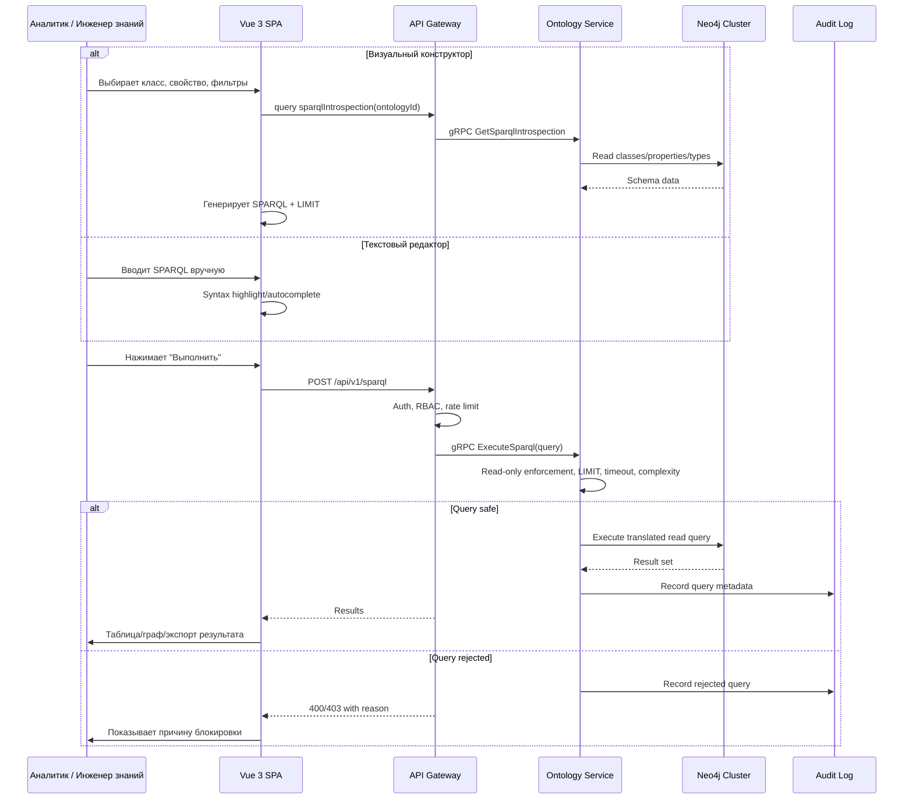
```mermaid
sequenceDiagram
    participant USER as Аналитик / Инженер знаний
    participant SPA as Vue 3 SPA
    participant AGW as API Gateway
    participant ONT as Ontology Service
    participant NEO4J as Neo4j Cluster
    participant AUDIT as Audit Log

    alt Визуальный конструктор
        USER->>SPA: Выбирает класс, свойство, фильтры
        SPA->>AGW: query sparqlIntrospection(ontologyId)
        AGW->>ONT: gRPC GetSparqlIntrospection
        ONT->>NEO4J: Read classes/properties/types
        NEO4J-->>ONT: Schema data
        SPA->>SPA: Генерирует SPARQL + LIMIT
    else Текстовый редактор
        USER->>SPA: Вводит SPARQL вручную
        SPA->>SPA: Syntax highlight/autocomplete
    end
    USER->>SPA: Нажимает "Выполнить"
    SPA->>AGW: POST /api/v1/sparql
    AGW->>AGW: Auth, RBAC, rate limit
    AGW->>ONT: gRPC ExecuteSparql(query)
    ONT->>ONT: Read-only enforcement, LIMIT, timeout, complexity
    alt Query safe
        ONT->>NEO4J: Execute translated read query
        NEO4J-->>ONT: Result set
        ONT->>AUDIT: Record query metadata
        AGW-->>SPA: Results
        SPA->>USER: Таблица/граф/экспорт результата
    else Query rejected
        ONT->>AUDIT: Record rejected query
        AGW-->>SPA: 400/403 with reason
        SPA->>USER: Показывает причину блокировки
    end
```

---

## UC-metrics.analytics.view-ontology-metrics: Анализировать метрики

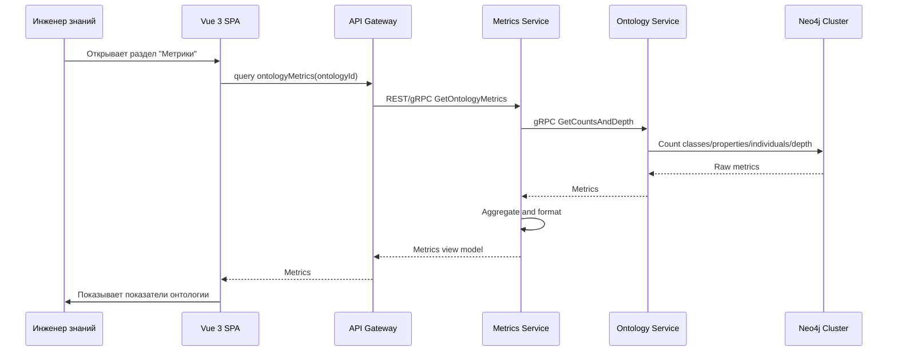
```mermaid
sequenceDiagram
    participant KE as Инженер знаний
    participant SPA as Vue 3 SPA
    participant AGW as API Gateway
    participant MET as Metrics Service
    participant ONT as Ontology Service
    participant NEO4J as Neo4j Cluster

    KE->>SPA: Открывает раздел "Метрики"
    SPA->>AGW: query ontologyMetrics(ontologyId)
    AGW->>MET: REST/gRPC GetOntologyMetrics
    MET->>ONT: gRPC GetCountsAndDepth
    ONT->>NEO4J: Count classes/properties/individuals/depth
    NEO4J-->>ONT: Raw metrics
    ONT-->>MET: Metrics
    MET->>MET: Aggregate and format
    MET-->>AGW: Metrics view model
    AGW-->>SPA: Metrics
    SPA->>KE: Показывает показатели онтологии
```

---

## UC-git.commits.manage-commit-history: Управлять версиями

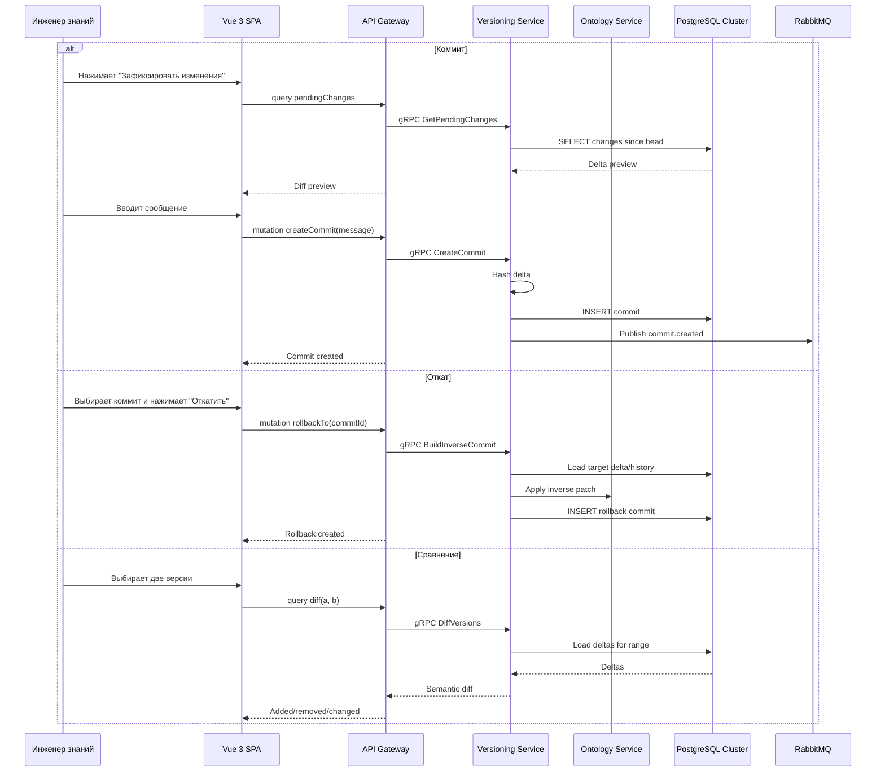
```mermaid
sequenceDiagram
    participant KE as Инженер знаний
    participant SPA as Vue 3 SPA
    participant AGW as API Gateway
    participant VERS as Versioning Service
    participant ONT as Ontology Service
    participant PG as PostgreSQL Cluster
    participant RMQ as RabbitMQ

    alt Коммит
        KE->>SPA: Нажимает "Зафиксировать изменения"
        SPA->>AGW: query pendingChanges
        AGW->>VERS: gRPC GetPendingChanges
        VERS->>PG: SELECT changes since head
        PG-->>VERS: Delta preview
        AGW-->>SPA: Diff preview
        KE->>SPA: Вводит сообщение
        SPA->>AGW: mutation createCommit(message)
        AGW->>VERS: gRPC CreateCommit
        VERS->>VERS: Hash delta
        VERS->>PG: INSERT commit
        VERS->>RMQ: Publish commit.created
        AGW-->>SPA: Commit created
    else Откат
        KE->>SPA: Выбирает коммит и нажимает "Откатить"
        SPA->>AGW: mutation rollbackTo(commitId)
        AGW->>VERS: gRPC BuildInverseCommit
        VERS->>PG: Load target delta/history
        VERS->>ONT: Apply inverse patch
        VERS->>PG: INSERT rollback commit
        AGW-->>SPA: Rollback created
    else Сравнение
        KE->>SPA: Выбирает две версии
        SPA->>AGW: query diff(a, b)
        AGW->>VERS: gRPC DiffVersions
        VERS->>PG: Load deltas for range
        PG-->>VERS: Deltas
        VERS-->>AGW: Semantic diff
        AGW-->>SPA: Added/removed/changed
    end
```

---

## UC-git.branches.manage-branch-workflow: Управлять ветками

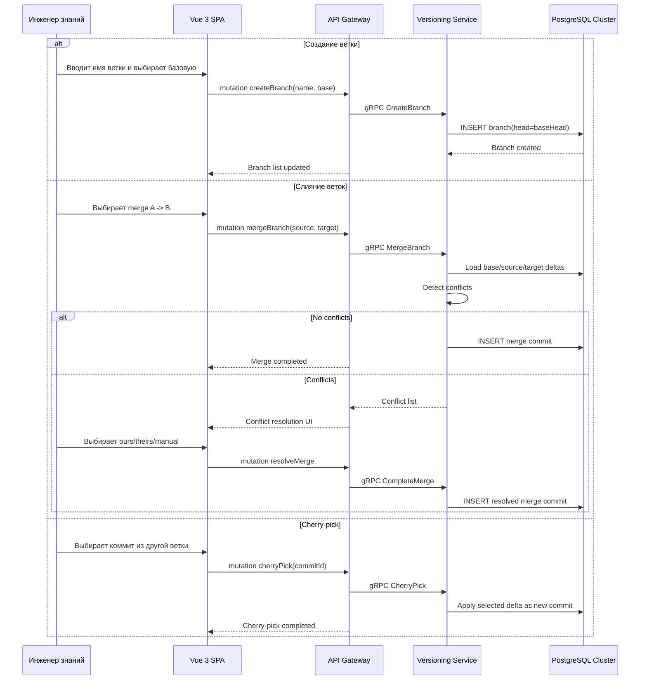
```mermaid
sequenceDiagram
    participant KE as Инженер знаний
    participant SPA as Vue 3 SPA
    participant AGW as API Gateway
    participant VERS as Versioning Service
    participant PG as PostgreSQL Cluster

    alt Создание ветки
        KE->>SPA: Вводит имя ветки и выбирает базовую
        SPA->>AGW: mutation createBranch(name, base)
        AGW->>VERS: gRPC CreateBranch
        VERS->>PG: INSERT branch(head=baseHead)
        PG-->>VERS: Branch created
        AGW-->>SPA: Branch list updated
    else Слияние веток
        KE->>SPA: Выбирает merge A -> B
        SPA->>AGW: mutation mergeBranch(source, target)
        AGW->>VERS: gRPC MergeBranch
        VERS->>PG: Load base/source/target deltas
        VERS->>VERS: Detect conflicts
        alt No conflicts
            VERS->>PG: INSERT merge commit
            AGW-->>SPA: Merge completed
        else Conflicts
            VERS-->>AGW: Conflict list
            AGW-->>SPA: Conflict resolution UI
            KE->>SPA: Выбирает ours/theirs/manual
            SPA->>AGW: mutation resolveMerge
            AGW->>VERS: gRPC CompleteMerge
            VERS->>PG: INSERT resolved merge commit
        end
    else Cherry-pick
        KE->>SPA: Выбирает коммит из другой ветки
        SPA->>AGW: mutation cherryPick(commitId)
        AGW->>VERS: gRPC CherryPick
        VERS->>PG: Apply selected delta as new commit
        AGW-->>SPA: Cherry-pick completed
    end
```

---

## UC-git.commits.compare-ontology-versions: Сравнивать версии

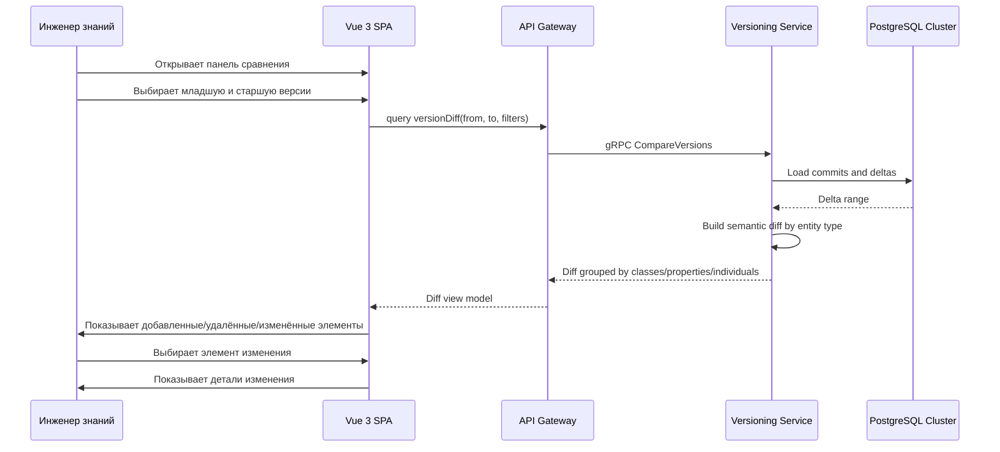
```mermaid
sequenceDiagram
    participant KE as Инженер знаний
    participant SPA as Vue 3 SPA
    participant AGW as API Gateway
    participant VERS as Versioning Service
    participant PG as PostgreSQL Cluster

    KE->>SPA: Открывает панель сравнения
    KE->>SPA: Выбирает младшую и старшую версии
    SPA->>AGW: query versionDiff(from, to, filters)
    AGW->>VERS: gRPC CompareVersions
    VERS->>PG: Load commits and deltas
    PG-->>VERS: Delta range
    VERS->>VERS: Build semantic diff by entity type
    VERS-->>AGW: Diff grouped by classes/properties/individuals
    AGW-->>SPA: Diff view model
    SPA->>KE: Показывает добавленные/удалённые/изменённые элементы
    KE->>SPA: Выбирает элемент изменения
    SPA->>KE: Показывает детали изменения
```

---

## UC-team.reviews.review-merge-request: Обсуждать изменения

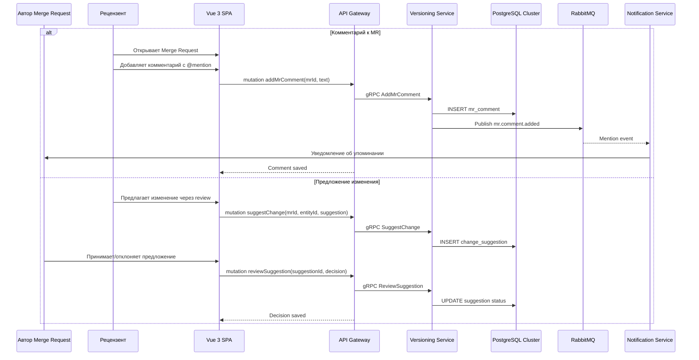
```mermaid
sequenceDiagram
    participant KE as Автор Merge Request
    participant REVIEWER as Рецензент
    participant SPA as Vue 3 SPA
    participant AGW as API Gateway
    participant VERS as Versioning Service
    participant PG as PostgreSQL Cluster
    participant RMQ as RabbitMQ
    participant NOTIF as Notification Service

    alt Комментарий к MR
        REVIEWER->>SPA: Открывает Merge Request
        REVIEWER->>SPA: Добавляет комментарий с @mention
        SPA->>AGW: mutation addMrComment(mrId, text)
        AGW->>VERS: gRPC AddMrComment
        VERS->>PG: INSERT mr_comment
        VERS->>RMQ: Publish mr.comment.added
        RMQ-->>NOTIF: Mention event
        NOTIF->>KE: Уведомление об упоминании
        AGW-->>SPA: Comment saved
    else Предложение изменения
        REVIEWER->>SPA: Предлагает изменение через review
        SPA->>AGW: mutation suggestChange(mrId, entityId, suggestion)
        AGW->>VERS: gRPC SuggestChange
        VERS->>PG: INSERT change_suggestion
        KE->>SPA: Принимает/отклоняет предложение
        SPA->>AGW: mutation reviewSuggestion(suggestionId, decision)
        AGW->>VERS: gRPC ReviewSuggestion
        VERS->>PG: UPDATE suggestion status
        AGW-->>SPA: Decision saved
    end
```

---

## UC-editor.classes.validate-ontology-with-shacl: Валидировать онтологию

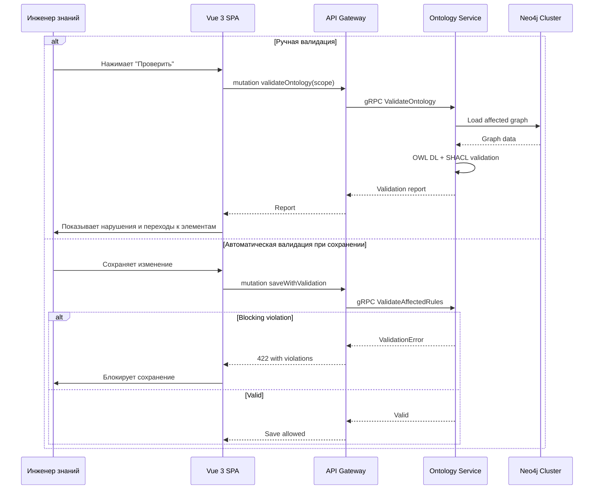
```mermaid
sequenceDiagram
    participant KE as Инженер знаний
    participant SPA as Vue 3 SPA
    participant AGW as API Gateway
    participant ONT as Ontology Service
    participant NEO4J as Neo4j Cluster

    alt Ручная валидация
        KE->>SPA: Нажимает "Проверить"
        SPA->>AGW: mutation validateOntology(scope)
        AGW->>ONT: gRPC ValidateOntology
        ONT->>NEO4J: Load affected graph
        NEO4J-->>ONT: Graph data
        ONT->>ONT: OWL DL + SHACL validation
        ONT-->>AGW: Validation report
        AGW-->>SPA: Report
        SPA->>KE: Показывает нарушения и переходы к элементам
    else Автоматическая валидация при сохранении
        KE->>SPA: Сохраняет изменение
        SPA->>AGW: mutation saveWithValidation
        AGW->>ONT: gRPC ValidateAffectedRules
        alt Blocking violation
            ONT-->>AGW: ValidationError
            AGW-->>SPA: 422 with violations
            SPA->>KE: Блокирует сохранение
        else Valid
            ONT-->>AGW: Valid
            AGW-->>SPA: Save allowed
        end
    end
```

---

## UC-editor.classes.manage-data-quality-rules: Контролировать качество данных

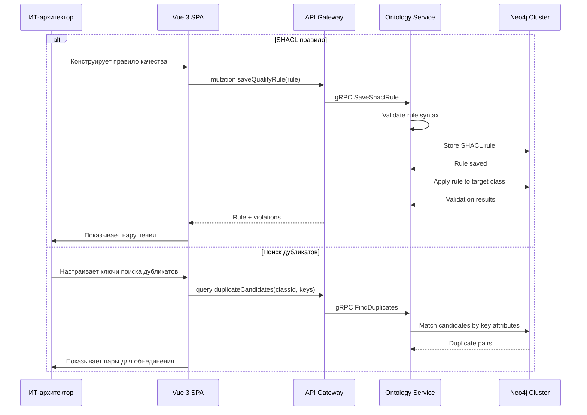
```mermaid
sequenceDiagram
    participant ITA as ИТ-архитектор
    participant SPA as Vue 3 SPA
    participant AGW as API Gateway
    participant ONT as Ontology Service
    participant NEO4J as Neo4j Cluster

    alt SHACL правило
        ITA->>SPA: Конструирует правило качества
        SPA->>AGW: mutation saveQualityRule(rule)
        AGW->>ONT: gRPC SaveShaclRule
        ONT->>ONT: Validate rule syntax
        ONT->>NEO4J: Store SHACL rule
        NEO4J-->>ONT: Rule saved
        ONT->>NEO4J: Apply rule to target class
        NEO4J-->>ONT: Validation results
        AGW-->>SPA: Rule + violations
        SPA->>ITA: Показывает нарушения
    else Поиск дубликатов
        ITA->>SPA: Настраивает ключи поиска дубликатов
        SPA->>AGW: query duplicateCandidates(classId, keys)
        AGW->>ONT: gRPC FindDuplicates
        ONT->>NEO4J: Match candidates by key attributes
        NEO4J-->>ONT: Duplicate pairs
        SPA->>ITA: Показывает пары для объединения
    end
```

---

## UC-io.import.import-and-export-ontology-data: Обмениваться данными

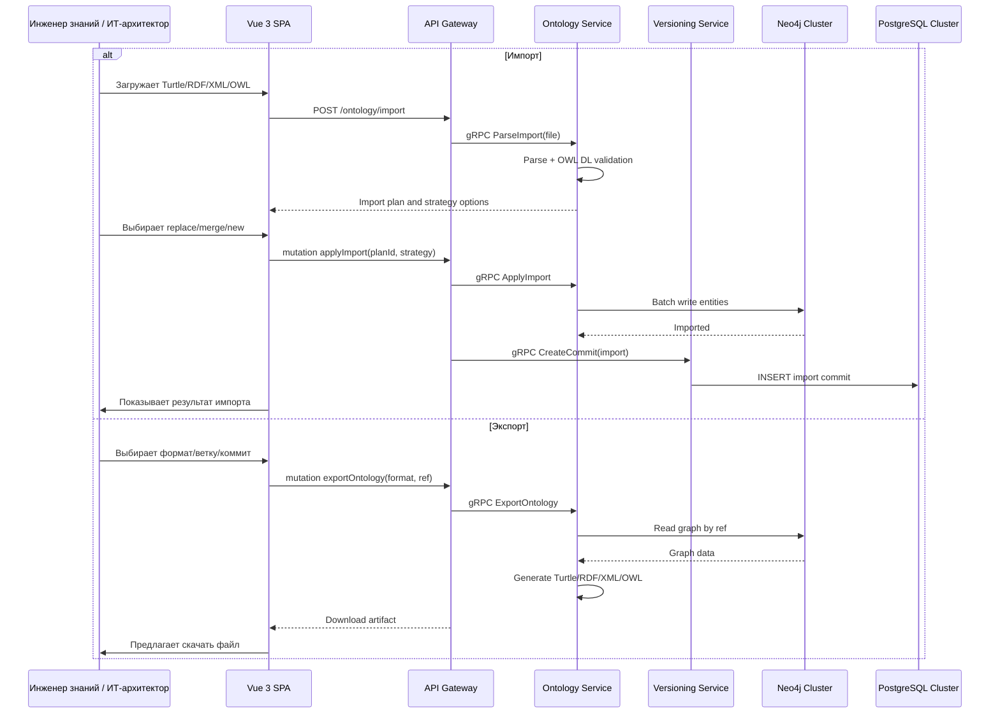
```mermaid
sequenceDiagram
    participant USER as Инженер знаний / ИТ-архитектор
    participant SPA as Vue 3 SPA
    participant AGW as API Gateway
    participant ONT as Ontology Service
    participant VERS as Versioning Service
    participant NEO4J as Neo4j Cluster
    participant PG as PostgreSQL Cluster

    alt Импорт
        USER->>SPA: Загружает Turtle/RDF/XML/OWL
        SPA->>AGW: POST /ontology/import
        AGW->>ONT: gRPC ParseImport(file)
        ONT->>ONT: Parse + OWL DL validation
        ONT-->>SPA: Import plan and strategy options
        USER->>SPA: Выбирает replace/merge/new
        SPA->>AGW: mutation applyImport(planId, strategy)
        AGW->>ONT: gRPC ApplyImport
        ONT->>NEO4J: Batch write entities
        NEO4J-->>ONT: Imported
        AGW->>VERS: gRPC CreateCommit(import)
        VERS->>PG: INSERT import commit
        SPA->>USER: Показывает результат импорта
    else Экспорт
        USER->>SPA: Выбирает формат/ветку/коммит
        SPA->>AGW: mutation exportOntology(format, ref)
        AGW->>ONT: gRPC ExportOntology
        ONT->>NEO4J: Read graph by ref
        NEO4J-->>ONT: Graph data
        ONT->>ONT: Generate Turtle/RDF/XML/OWL
        AGW-->>SPA: Download artifact
        SPA->>USER: Предлагает скачать файл
    end
```

---

## UC-api.integration.integrate-through-platform-apis: Интегрироваться через API

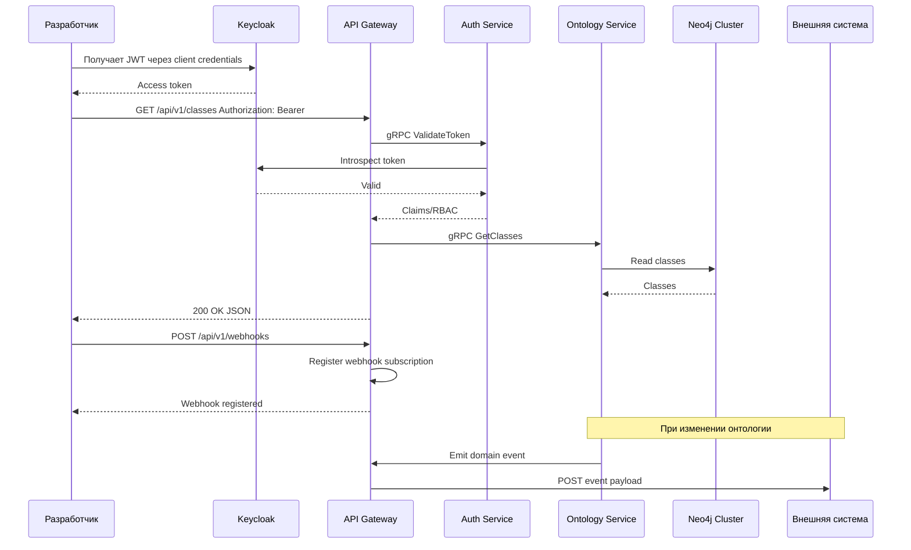
```mermaid
sequenceDiagram
    participant DEV as Разработчик
    participant KC as Keycloak
    participant AGW as API Gateway
    participant AUTH as Auth Service
    participant ONT as Ontology Service
    participant NEO4J as Neo4j Cluster
    participant WEBHOOK as Внешняя система

    DEV->>KC: Получает JWT через client credentials
    KC-->>DEV: Access token
    DEV->>AGW: GET /api/v1/classes Authorization: Bearer
    AGW->>AUTH: gRPC ValidateToken
    AUTH->>KC: Introspect token
    KC-->>AUTH: Valid
    AUTH-->>AGW: Claims/RBAC
    AGW->>ONT: gRPC GetClasses
    ONT->>NEO4J: Read classes
    NEO4J-->>ONT: Classes
    AGW-->>DEV: 200 OK JSON
    DEV->>AGW: POST /api/v1/webhooks
    AGW->>AGW: Register webhook subscription
    AGW-->>DEV: Webhook registered
    Note over ONT,WEBHOOK: При изменении онтологии
    ONT->>AGW: Emit domain event
    AGW->>WEBHOOK: POST event payload
```

---

## UC-admin.system.manage-platform-configuration: Управлять системой

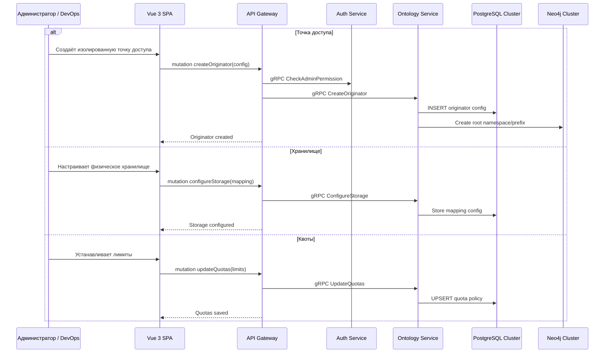
```mermaid
sequenceDiagram
    participant ADMIN as Администратор / DevOps
    participant SPA as Vue 3 SPA
    participant AGW as API Gateway
    participant AUTH as Auth Service
    participant ONT as Ontology Service
    participant PG as PostgreSQL Cluster
    participant NEO4J as Neo4j Cluster

    alt Точка доступа
        ADMIN->>SPA: Создаёт изолированную точку доступа
        SPA->>AGW: mutation createOriginator(config)
        AGW->>AUTH: gRPC CheckAdminPermission
        AGW->>ONT: gRPC CreateOriginator
        ONT->>PG: INSERT originator config
        ONT->>NEO4J: Create root namespace/prefix
        AGW-->>SPA: Originator created
    else Хранилище
        ADMIN->>SPA: Настраивает физическое хранилище
        SPA->>AGW: mutation configureStorage(mapping)
        AGW->>ONT: gRPC ConfigureStorage
        ONT->>PG: Store mapping config
        AGW-->>SPA: Storage configured
    else Квоты
        ADMIN->>SPA: Устанавливает лимиты
        SPA->>AGW: mutation updateQuotas(limits)
        AGW->>ONT: gRPC UpdateQuotas
        ONT->>PG: UPSERT quota policy
        AGW-->>SPA: Quotas saved
    end
```

---

## UC-admin.access.manage-membership-and-permissions: Настраивать доступ

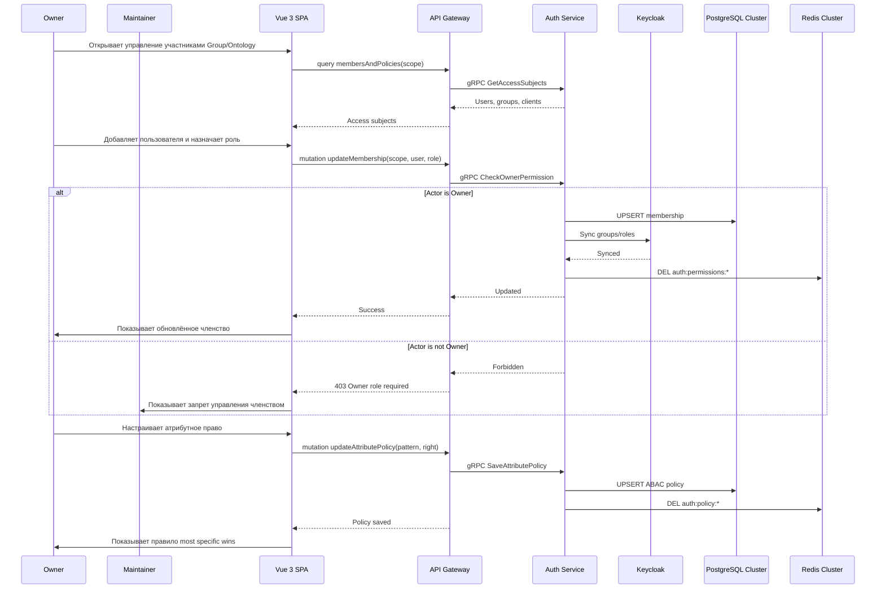
```mermaid
sequenceDiagram
    participant OWNER as Owner
    participant MAINT as Maintainer
    participant SPA as Vue 3 SPA
    participant AGW as API Gateway
    participant AUTH as Auth Service
    participant KC as Keycloak
    participant PG as PostgreSQL Cluster
    participant REDIS as Redis Cluster

    OWNER->>SPA: Открывает управление участниками Group/Ontology
    SPA->>AGW: query membersAndPolicies(scope)
    AGW->>AUTH: gRPC GetAccessSubjects
    AUTH-->>AGW: Users, groups, clients
    AGW-->>SPA: Access subjects
    OWNER->>SPA: Добавляет пользователя и назначает роль
    SPA->>AGW: mutation updateMembership(scope, user, role)
    AGW->>AUTH: gRPC CheckOwnerPermission
    alt Actor is Owner
        AUTH->>PG: UPSERT membership
        AUTH->>KC: Sync groups/roles
        KC-->>AUTH: Synced
        AUTH->>REDIS: DEL auth:permissions:*
        AUTH-->>AGW: Updated
        AGW-->>SPA: Success
        SPA->>OWNER: Показывает обновлённое членство
    else Actor is not Owner
        AUTH-->>AGW: Forbidden
        AGW-->>SPA: 403 Owner role required
        SPA->>MAINT: Показывает запрет управления членством
    end

    OWNER->>SPA: Настраивает атрибутное право
    SPA->>AGW: mutation updateAttributePolicy(pattern, right)
    AGW->>AUTH: gRPC SaveAttributePolicy
    AUTH->>PG: UPSERT ABAC policy
    AUTH->>REDIS: DEL auth:policy:*
    AGW-->>SPA: Policy saved
    SPA->>OWNER: Показывает правило most specific wins
```

---

## UC-admin.backup.manage-backup-and-restore-via-cli: Управлять backup/restore через `vedo-cli`

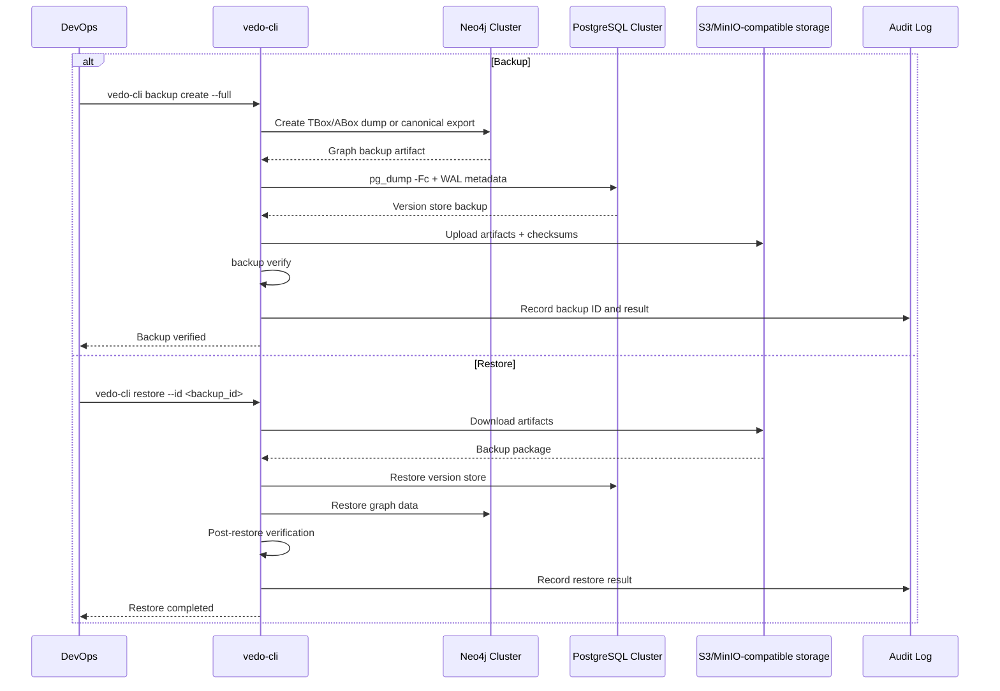
```mermaid
sequenceDiagram
    participant DEVOPS as DevOps
    participant CLI as vedo-cli
    participant NEO4J as Neo4j Cluster
    participant PG as PostgreSQL Cluster
    participant OBJ as S3/MinIO-compatible storage
    participant AUDIT as Audit Log

    alt Backup
        DEVOPS->>CLI: vedo-cli backup create --full
        CLI->>NEO4J: Create TBox/ABox dump or canonical export
        NEO4J-->>CLI: Graph backup artifact
        CLI->>PG: pg_dump -Fc + WAL metadata
        PG-->>CLI: Version store backup
        CLI->>OBJ: Upload artifacts + checksums
        CLI->>CLI: backup verify
        CLI->>AUDIT: Record backup ID and result
        CLI-->>DEVOPS: Backup verified
    else Restore
        DEVOPS->>CLI: vedo-cli restore --id <backup_id>
        CLI->>OBJ: Download artifacts
        OBJ-->>CLI: Backup package
        CLI->>PG: Restore version store
        CLI->>NEO4J: Restore graph data
        CLI->>CLI: Post-restore verification
        CLI->>AUDIT: Record restore result
        CLI-->>DEVOPS: Restore completed
    end
```

---

## UC-admin.migration.apply-migrations-with-rollback-via-cli: Выполнять миграции с rollback через `vedo-cli`

```mermaid
sequenceDiagram
    participant DEVOPS as DevOps
    participant CLI as vedo-cli
    participant NEO4J as Neo4j Cluster
    participant PG as PostgreSQL Cluster
    participant AUDIT as Audit Log

    DEVOPS->>CLI: vedo-cli migrate plan
    CLI->>PG: Read migration state
    CLI->>NEO4J: Read graph schema/version
    CLI-->>DEVOPS: Migration plan
    DEVOPS->>CLI: vedo-cli migrate apply
    CLI->>CLI: Check verified pre-migration backup
    CLI->>PG: Apply PostgreSQL migrations
    CLI->>NEO4J: Apply Neo4j migrations
    CLI->>CLI: Integrity checks (counts/history/SPARQL spot checks)
    alt Checks passed
        CLI->>AUDIT: Record migration applied
        CLI-->>DEVOPS: Migration completed
    else Checks failed
        DEVOPS->>CLI: vedo-cli migrate rollback
        CLI->>PG: Restore pre-migration backup
        CLI->>NEO4J: Restore pre-migration graph
        CLI->>AUDIT: Record rollback
        CLI-->>DEVOPS: Rollback completed
    end
```

---

## UC-admin.airgap.prepare-air-gapped-package-via-cli: Готовить air-gapped package через `vedo-cli`

```mermaid
sequenceDiagram
    participant DEVOPS as DevOps
    participant CLI as vedo-cli
    participant REG as Container Registry
    participant CHARTS as Helm Chart Repository
    participant FS as Offline Package

    DEVOPS->>CLI: vedo-cli airgap prepare
    CLI->>REG: Pull required images
    REG-->>CLI: Images
    CLI->>CHARTS: Fetch Helm charts
    CHARTS-->>CLI: Charts
    CLI->>CLI: Collect docs/config/checksums
    CLI->>FS: Write offline package
    DEVOPS->>CLI: vedo-cli airgap verify package
    CLI->>FS: Verify images/charts/docs/config/checksums
    alt Package complete
        CLI-->>DEVOPS: Package ready
    else Missing artifact or outbound dependency
        CLI-->>DEVOPS: Verification failed with missing items
    end
```

---

## UC-diagnostics.trace.diagnose-incident-by-trace-id: Диагностировать инцидент по `trace_id`

```mermaid
sequenceDiagram
    participant SUPPORT as Инженер поддержки
    participant CLI as vedo-cli
    participant TEMPO as Tempo
    participant LOKI as Loki
    participant PROM as Prometheus
    participant LLM as Optional LLM

    SUPPORT->>CLI: vedo-cli diagnose trace --id <trace_id>
    CLI->>TEMPO: Query trace
    alt Trace found
        TEMPO-->>CLI: Trace spans
        CLI->>CLI: Locate error span/service/operation
        CLI->>LOKI: Query logs by trace_id/span_id/time range
        LOKI-->>CLI: Related logs
        CLI->>PROM: Query RED/resource metrics for service
        PROM-->>CLI: Metrics
        opt LLM enabled
            CLI->>LLM: Redacted diagnostic context
            LLM-->>CLI: Suggested remediation
        end
        CLI-->>SUPPORT: Root span, logs, metrics, recommendations
    else Trace missing
        TEMPO-->>CLI: Not found
        CLI-->>SUPPORT: Retention/backend/propagation guidance
    end
```

---

## UC-admin.migration.transfer-and-diff-ontologies-via-cli: Переносить и сравнивать онтологии через `vedo-cli`

```mermaid
sequenceDiagram
    participant ADMIN as Администратор онтологий
    participant CLI as vedo-cli
    participant PROD as Production VEDO
    participant STAGE as Staging VEDO
    participant FILE as Canonical Turtle artifact

    ADMIN->>CLI: vedo-cli ontology export --env production --canonical
    CLI->>PROD: Request canonical TBox export
    PROD-->>CLI: Canonical Turtle
    CLI->>FILE: Save artifact + checksum
    ADMIN->>CLI: vedo-cli ontology import --env staging <file>
    CLI->>STAGE: Import artifact with validation
    alt Import valid
        STAGE-->>CLI: Import result
        ADMIN->>CLI: vedo-cli ontology diff production staging
        CLI->>PROD: Read production snapshot
        CLI->>STAGE: Read staging snapshot
        CLI-->>ADMIN: Semantic diff report
    else Import invalid
        STAGE-->>CLI: SHACL/OWL/domain-range errors
        CLI-->>ADMIN: Validation report
    end
```

---

## UC-io.publish.publish-ontology-snapshot: Публиковать снэпшот онтологии

```mermaid
sequenceDiagram
    participant KE as Инженер знаний
    participant SPA as Vue 3 SPA
    participant AGW as API Gateway
    participant PUB as Publisher Service
    participant NEO4J as Neo4j Cluster
    participant PNEO4J as Public Neo4j
    participant RMQ as RabbitMQ
    participant NOTIF as Notification Service

    KE->>SPA: Открывает раздел "Публикации"
    KE->>SPA: Нажимает "Опубликовать"
    SPA->>SPA: Optimistic UI: "Публикация выполняется..."
    SPA-->>KE: Управление возвращено пользователю
    SPA->>AGW: mutation publishOntology(ontologyId)
    AGW->>AGW: JWT validation
    AGW->>PUB: gRPC StartPublicationJob
    PUB->>RMQ: Publish publication.requested
    PUB-->>AGW: Accepted(publicationId)
    AGW-->>SPA: 202 Accepted
    RMQ-->>PUB: publication.requested
    PUB->>NEO4J: Read current TBox + ABox snapshot
    NEO4J-->>PUB: Snapshot data
    alt Новая публикация
        PUB->>PNEO4J: Create published graph copy
    else Обновление публикации
        PUB->>PNEO4J: Create new copy and keep previous version history
    end
    PNEO4J-->>PUB: Copy completed
    alt Success
        PUB->>RMQ: Publish publication.completed
        RMQ-->>SPA: status=published
        SPA->>KE: Показывает публичную ссылку
    else Failure
        PUB->>RMQ: Publish publication.failed
        RMQ-->>NOTIF: Failure event
        NOTIF->>KE: Уведомление о неудачной публикации
        RMQ-->>SPA: status=failed
        SPA->>KE: Показывает повтор попытки
    end
```

---

## UC-browse.public.view-published-ontology: Просматривать опубликованную онтологию без авторизации

```mermaid
sequenceDiagram
    participant EXT as Внешний пользователь
    participant BROWSE as Browse UI
    participant PBAPI as Public Browse API
    participant PNEO4J as Public Neo4j
    participant OBS as OpenTelemetry

    EXT->>BROWSE: Открывает публичную ссылку
    BROWSE->>PBAPI: GET /public/ontologies/{slug}/metadata
    PBAPI->>PBAPI: Rate limit + publication status check
    alt Публикация активна
        PBAPI->>PNEO4J: Allowlisted read-only metadata query
        PNEO4J-->>PBAPI: Metadata
        PBAPI-->>BROWSE: 200 OK metadata
        BROWSE->>EXT: Показывает опубликованную онтологию
        EXT->>BROWSE: Раскрывает узел класса
        BROWSE->>PBAPI: GET /nodes/{nodeId}/neighbors?depth=1&limit=50
        PBAPI->>PBAPI: Validate depth/limit/allowlisted query
        PBAPI->>PNEO4J: Allowlisted read-only neighborhood query
        PNEO4J-->>PBAPI: Nodes and edges
        PBAPI-->>BROWSE: Graph slice
        BROWSE->>EXT: Отображает 2D/3D связи
        EXT->>BROWSE: Вводит поисковый запрос
        BROWSE->>PBAPI: GET /search?q=Product&limit=20
        PBAPI->>PBAPI: Validate query length/rate limit
        PBAPI->>PNEO4J: Full-text search
        PNEO4J-->>PBAPI: Search results
        PBAPI-->>BROWSE: Results
        BROWSE->>EXT: Показывает найденные элементы
    else Публикация не найдена или отозвана
        PBAPI-->>BROWSE: 404 Not Found
        BROWSE->>EXT: Показывает сообщение об ошибке
    else Превышены лимиты
        PBAPI-->>BROWSE: 429/400 limit exceeded
        PBAPI->>OBS: Emit rate-limit/security event
        BROWSE->>EXT: Просит повторить позже или уменьшить запрос
    end
```
