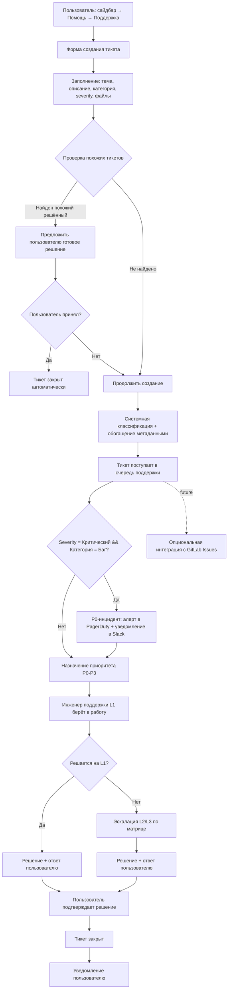
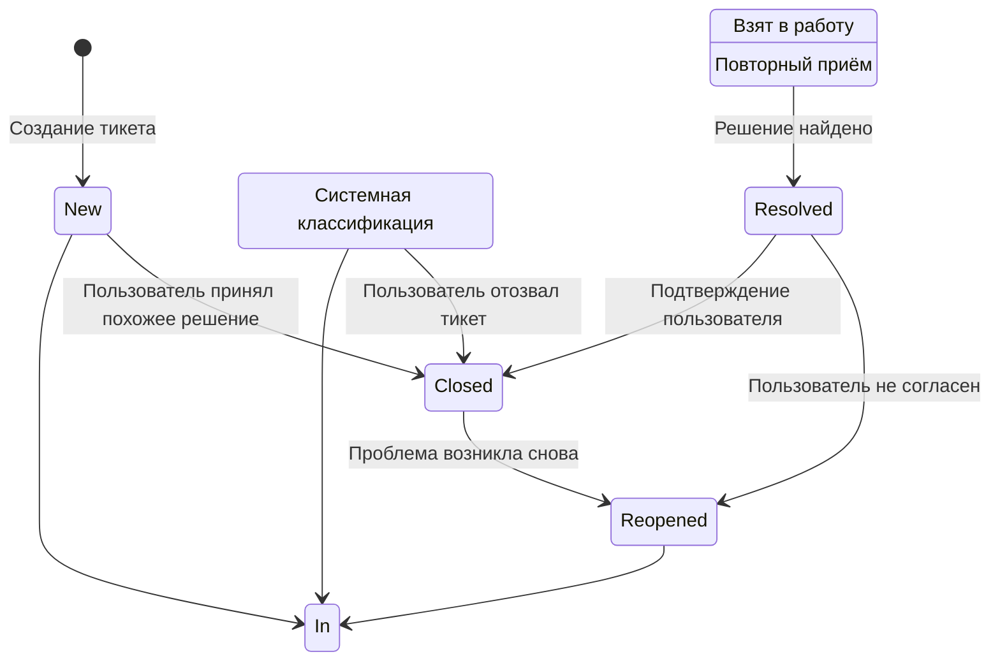
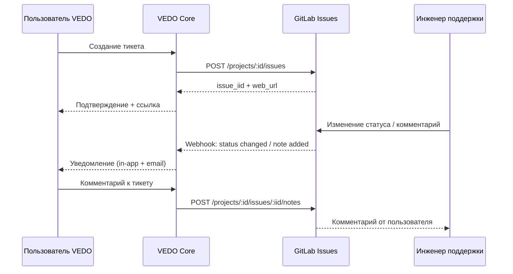

# Ticket Management & Feedback System Specification v1.0

| Атрибут | Значение |
|---------|----------|
| **ID** | REQ-FUN.INTEGRATION.ticket-management |
| **Уровень** | FUN |
| **Атрибут качества** | Functionality |
| **Приоритет** | P1 |
| **Статус** | УТВЕРЖДЕНО |
| **Источник** | — |
| **Критерии приёмки** | — |

---

**Статус:** ПРИНЯТ
**Дата:** 2026-05-18  
**Область:** Обратная связь пользователей VEDO Core  
**Аудитория:** Разработчики, QA, Product Manager, Support Team  
**Обязательность:** нормативный артефакт для реализации подсистемы тикетов

---

## Связанные артефакты

| Артефакт | Связь |
|----------|-------|
| `support-sla.md` | SLA-показатели времени реакции и восстановления по тарифам |
| `escalation-matrix.md` | Формальная матрица эскалации L1-L6 |
| `critical-alerts.md` | Каталог критических метрик и алертов инфраструктуры |

---

## 1. Цель и область

Система управления тикетами (Ticket Management & Feedback System) предоставляет авторизованным пользователям VEDO Core формальный канал для отправки обратной связи: сообщений об ошибках, проблемах производительности, вопросах, предложениях по улучшению и запросах на документацию.

Подсистема охватывает:
- Форму создания тикета с мастером классификации
- Автоматическую обработку (классификация, дедупликация, маршрутизация)
- Полный жизненный цикл тикета внутри VEDO Core (source of truth)
- Архитектурную готовность к интеграции с GitLab Issues через API/webhook (future)
- Автоматическое создание тикетов из телеметрии
- Уведомления и аналитику
- Единый бэкенд для ручных и автоматических тикетов

### 1.1. Границы v1.0 и фичи на будущее

- В версии v1.0 приоритет — сбор и обработка обратной связи внутри VEDO Core.
- Рекомендации с помощью внешнего ИИ-сервиса относятся к future backlog и не являются обязательными для v1.0.
- Интеграция с GitLab Issues относится к future backlog; в v1.0 реализуется только архитектурная и API-готовность.
- При включении GitLab-интеграции в будущих релизах VEDO Core обязан получать обратную связь о дальнейшей судьбе тикета (статусы, комментарии, закрытие/переоткрытие).
- В v1.0 административный интерфейс поддержки в VEDO GUI не реализуется; операторские действия выполняются через `vedo-cli`.
- GitLab является внутренним контуром компании и не экспонируется конечному пользователю в VEDO GUI.

---

## 2. Поток создания и обработки тикета



---

## 3. Жизненный цикл тикета (статусы)

| Статус | Описание | Кто устанавливает |
|--------|----------|-------------------|
| **New** | Тикет создан, ожидает первичной обработки | Система (автоматически) |
| **In Review** | Тикет проходит системную классификацию и проверку на дубликаты | Система |
| **In Progress** | Тикет взят в работу инженером поддержки | Инженер поддержки |
| **Resolved** | Найдено решение / предоставлен workaround | Инженер поддержки |
| **Closed** | Тикет закрыт (пользователь подтвердил решение или закрыл самостоятельно) | Пользователь или система |
| **Reopened** | Пользователь открыл закрытый тикет (проблема не решена) | Пользователь |

Переходы между статусами:



---

## 4. Маппинг severity → приоритет → SLA

| Severity (от пользователя) | Приоритет системы | Целевое время реакции | Целевое время решения (TTR) |
|---------------------------|-------------------|----------------------|----------------------------|
| Критический | P0 | ≤ 30 мин (Enterprise) / ≤ 2 ч (Professional) | ≤ 2 ч (Enterprise) / best effort |
| Высокий | P1 | ≤ 2 ч (Enterprise) / ≤ 8 ч (Professional) | ≤ 4 ч (Enterprise) / best effort |
| Средний | P2 | ≤ 8 ч | ≤ 3 дня |
| Низкий | P3 | ≤ 2 рабочих дня | ≤ 10 дней |

**Правила маппинга:**
- Критический + Баг → P0 (независимо от тарифа, с обязательным алертом)
- Высокий + Баг/Производительность → P1
- Средний + любая категория → P2
- Низкий + Предложение/Документация → P3
- Предложение по улучшению (любой severity) → P3 (не является инцидентом)

Детальные SLA по тарифам зафиксированы в `support-sla.md`.

---

## 5. Требования

### 5.1. Общие требования

| ID | Требование | Приоритет |
|----|------------|-----------|
| T-01 | Форма создания тикета доступна авторизованным пользователям по пути: сайдбар → Помощь → Поддержка. | P0 |
| T-02 | Форма содержит поля: тема (обязательное), описание (обязательное), категория (выпадающий список), приоритет от пользователя (низкий/средний/высокий/критический). | P0 |
| T-03 | Пользователь может прикрепить файлы (скриншоты, логи) — до 10 файлов, до 10 MB каждый. | P0 |
| T-04 | Система автоматически обогащает тикет метаданными: версия VEDO Core, окружение (prod/staging/dev), идентификатор пользователя, trace_id последнего действия (если доступен), URL страницы, User-Agent. | P0 |
| T-05 | Пользователь может просматривать историю своих тикетов (список с фильтрацией по статусу, категории, дате). | P1 |
| T-06 | Пользователь может просматривать детали конкретного тикета: статус, историю изменений, ответы поддержки. | P1 |
| T-07 | Пользователь может добавить комментарий к существующему тикету (дополнительная информация по проблеме). | P0 |
| T-08 | Пользователь может закрыть тикет самостоятельно (если проблема решена). | P1 |

### 5.2. Классификация тикетов (мастер создания)

| ID | Требование | Приоритет |
|----|------------|-----------|
| T-09 | Мастер создания тикета предлагает пользователю выбрать категорию из выпадающего списка: | P0 |
|     | - **Баг / Ошибка** — что-то работает не так, как ожидалось | P0 |
|     | - **Проблема с производительностью** — медленно работает, зависает | P0 |
|     | - **Вопрос / Как сделать?** — нужна помощь в использовании функционала | P0 |
|     | - **Предложение по улучшению** — идея новой фичи или улучшение существующей | P0 |
|     | - **Запрос на документацию** — документация неполная, непонятная или устаревшая | P1 |
|     | - **Проблема с доступом / авторизацией** — не могу войти, нет прав | P0 |
| T-10 | В зависимости от выбранной категории мастер может запросить дополнительные поля: | P1 |
|     | - Для «Баг / Ошибка»: шаги воспроизведения (обязательное поле) | P0 |
|     | - Для «Проблема с производительностью»: ожидаемое и фактическое время выполнения | P1 |
|     | - Для «Предложение по улучшению»: описание ожидаемого поведения (обязательное) | P0 |
| T-11 | Пользователь может оценить severity (серьёзность) проблемы: | P0 |
|     | - **Критический** — невозможно работать, потеря данных | P0 |
|     | - **Высокий** — ключевая функция недоступна, есть workaround | P0 |
|     | - **Средний** — функция работает с ограничениями | P0 |
|     | - **Низкий** — косметическая проблема, опечатка, предложение | P0 |

### 5.3. Автоматическая обработка тикетов

| ID | Требование | Приоритет |
|----|------------|-----------|
| T-12 | Система автоматически проверяет наличие похожих (ранее решённых или открытых) тикетов по ключевым словам и предлагает пользователю их перед созданием нового. | P1 |
| T-13 | *(Future)* Система может автоматически отвечать на тикеты категории «Вопрос / Как сделать?» при наличии релевантной статьи в базе знаний. Для v1.0 — не обязательное требование. | P3 |
| T-14 | При создании тикета с категорией «Баг / Ошибка» и severity «Критический» автоматически создаётся P0-инцидент в системе алертинга (Prometheus/Alertmanager) и уведомление отправляется в выделенный канал (PagerDuty/Slack). | P0 |
| T-15 | Система автоматически присваивает тикету приоритет (P0/P1/P2/P3) на основе severity, выбранной пользователем, и категории (критический баг → P0, предложение → P3). | P0 |
| T-16 | При создании тикета система автоматически прикладывает фрагмент логов за последние 5 минут (если пользователь согласился на сбор телеметрии). | P2 |
| T-17 | *(Future)* Система может предлагать пользователю возможные решения (workaround) для частых проблем, включая рекомендации через внешний ИИ-сервис. Для v1.0 — не обязательное требование. | P3 |

### 5.4. Интеграция с внешними системами

| ID | Требование | Приоритет |
|----|------------|-----------|
| T-18 | В v1.0 система реализует архитектурную и API-готовность к внешней интеграции (integration-ready): outbound API для создания external issue и inbound webhook API для получения изменений. | P0 |
| T-19 | Для будущей интеграции с GitLab Issues должен быть определён контракт полей: заголовок, описание, категория, severity, приоритет, метаданные (версия, окружение, trace_id), вложения, ссылка на тикет в VEDO Core. | P1 |
| T-20 | *(Future)* При включенной интеграции комментарии должны синхронизироваться двусторонне между VEDO Core и GitLab Issues. | P2 |
| T-21 | *(Future)* При включенной интеграции изменение статуса в GitLab Issues (включая closed/reopened) должно автоматически отражаться в VEDO Core. | P2 |

### 5.5. Уведомления

| ID | Требование | Приоритет |
|----|------------|-----------|
| T-22 | Пользователь получает уведомление (email + in-app) при: | P0 |
|     | - создании тикета (подтверждение) | P0 |
|     | - изменении статуса тикета (взят в работу, решён, закрыт) | P0 |
|     | - появлении нового комментария от поддержки | P0 |
| T-23 | Инженеры поддержки получают уведомления (канал на усмотрение — email, Telegram, Slack) о новых тикетах с P0/P1 приоритетом. | P0 |
| T-24 | Product Manager получает еженедельный дайджест: количество новых тикетов по категориям, топ повторяющихся проблем, предложения по улучшению с наибольшим количеством голосов (если реализовано голосование). | P2 |

### 5.6. Аналитика и отчёты

| ID | Требование | Приоритет |
|----|------------|-----------|
| T-25 | Система собирает метрики по тикетам: | P1 |
|     | - количество тикетов по категориям и severity | P1 |
|     | - среднее время ответа (по уровням поддержки) | P1 |
|     | - среднее время закрытия тикета (MTTR) | P1 |
|     | - процент тикетов, решённых автоматически (без участия человека) | P1 |
|     | - топ-10 наиболее частых проблем | P1 |
| T-26 | Аналитические дашборды доступны команде VEDO (Product Manager, Support Lead) через Grafana или отдельный интерфейс. | P2 |

### 5.7. UX/UI требования

| ID | Требование | Приоритет |
|----|------------|-----------|
| T-27 | Иконка «Поддержка» в сайдбаре и в форме создания тикета должна быть интуитивно понятной (вопросительный знак, конверт, жизнь). | P0 |
| T-28 | Форма создания тикета не должна покидать текущую страницу (открывается в модальном окне или сайдбаре). | P0 |
| T-29 | Пользователь может вернуться к созданию тикета позже (черновик сохраняется локально). | P2 |
| T-30 | История тикетов отображается в виде списка с фильтрами: по статусу (открытые/закрытые/все), по категории, по дате. | P1 |

### 5.8. Автоматическое создание тикетов из телеметрии

| ID | Требование | Приоритет |
|----|------------|-----------|
| T-31 | Система автоматически создаёт тикет при обнаружении аномалии в телеметрии, которая соответствует определённым критериям (например, повторяющиеся ошибки в логах, превышение порогов latency, падение успешности операций). | P1 |
| T-32 | Автоматически созданный тикет содержит: | P1 |
|     | - Заголовок: сгенерированный на основе типа аномалии (например, «Ontology Service: высокий уровень 5xx»). | P1 |
|     | - Описание: детали аномалии, метрики, пороги, временной интервал. | P1 |
|     | - Метаданные: trace_id, span_id, service name, instance, версия сервиса, окружение. | P1 |
|     | - Ссылку на дашборд Grafana (с уже применёнными фильтрами по времени и сервису). | P2 |
| T-33 | Категория для автоматических тикетов выбирается автоматически: | P1 |
|     | - Ошибки в логах / 5xx → «Баг / Ошибка» | P1 |
|     | - Превышение latency / таймауты → «Проблема с производительностью» | P1 |
|     | - Сбои подключения к БД / Redis → «Проблема с доступом / авторизацией» (или новая категория «Инфраструктурная проблема») | P1 |
|     | - Неизвестная аномалия → «Требует анализа» (специальная категория для автотикетов) | P1 |
| T-34 | Автоматические тикеты имеют специальную метку (label) `source="telemetry"`, чтобы отличать их от тикетов, созданных пользователями. | P0 |
| T-35 | Автоматические тикеты могут быть преобразованы в пользовательские (например, если инженер поддержки связывает аномалию с конкретным пользователем). При преобразовании сохраняется связь с исходным автотикетом. | P2 |
| T-36 | Система не создаёт автоматический тикет, если аналогичная аномалия уже зафиксирована в открытом тикете (дедупликация на основе сигнатуры ошибки за последние 24 часа). | P1 |
| T-37 | Автоматические тикеты имеют тот же жизненный цикл, что и пользовательские (статусы, уведомления, возможность комментирования). | P1 |

### 5.9. Единый бэкенд для тикетов

| ID | Требование | Приоритет |
|----|------------|-----------|
| T-38 | Тикеты, созданные пользователями вручную, и тикеты, созданные автоматически из телеметрии, хранятся в **едином бэкенде** (общая таблица в БД / единая очередь). | P0 |
| T-39 | В бэкенде тикеты различаются по полю `source` (manual / telemetry). Фильтрация по источнику доступна в интерфейсе поддержки. | P0 |
| T-40 | Единый бэкенд позволяет: | P0 |
|     | - Поддерживать единую нумерацию тикетов (ID). | P0 |
|     | - Применять единые правила эскалации (независимо от источника). | P0 |
|     | - Строить сводную аналитику по всем тикетам (качество работы поддержки, топ проблем). | P1 |
| T-41 | В интерфейсе пользователя (личный кабинет) отображаются **только тикеты, созданные этим пользователем вручную**. Автоматические тикеты не показываются пользователю (чтобы не создавать шум). | P1 |
| T-42 | В операторском контуре поддержки (через `vedo-cli`; опционально внутренний GitLab GUI вне VEDO) доступны все тикеты (и ручные, и автоматические), с фильтрацией по источнику. | P0 |
| T-48 | В VEDO GUI пользователь видит только проекцию статуса тикета: `получен`, `в работе`, `отклонён`, `решён` (без операторских полей и внутренних меток). | P0 |
| T-49 | Ссылки, IID и другие идентификаторы внутренних GitLab Issues не должны показываться конечному пользователю в VEDO GUI. | P0 |
| T-50 | Операторские действия по тикетам (assign/priority/comment/close/reopen/delete) в v1.0 выполняются через `vedo-cli`; дублирующий админский GUI в VEDO не создаётся. | P0 |

### 5.10. Управление тикетами через `vedo-cli`

| ID | Требование | Приоритет |
|----|------------|-----------|
| T-43 | Подсистема тикетов должна поддерживать управление тикетами через `vedo-cli` для ролей поддержки и эксплуатации (L1/L2/L3, DevOps/SRE): создание, просмотр, обновление, закрытие, переоткрытие, удаление. | P1 |
| T-44 | `vedo-cli` должен поддерживать команды CRUD для тикетов: `create`, `list`, `get`, `update`, `delete`, а также команды жизненного цикла `comment`, `close`, `reopen`. | P1 |
| T-45 | Все операции `vedo-cli` с тикетами должны логироваться в аудит с полями: actor, role, command, ticket_id, trace_id/correlation_id, result, timestamp. | P0 |
| T-46 | Команда удаления тикета через `vedo-cli` должна быть защищена guardrail-правилами destructive-операций (MFA + typed confirmation + environment guard). | P0 |
| T-47 | Операции `vedo-cli` должны использовать тот же бэкенд и ту же модель тикета, что и web-интерфейс; история изменений тикета должна отражать канал выполнения (`ui`/`cli`/`telemetry`). | P1 |

---

## 6. Примеры автоматического создания тикетов

| Сценарий | Условие | Действие |
|----------|---------|----------|
| Ontology Service возвращает 5xx > 5% за 2 минуты | Алерт Prometheus | Создать тикет с категорией «Баг / Ошибка», severity High |
| SPARQL запрос падает с таймаутом (заданный timeout) | Лог ошибки с `timeout` | Создать тикет с категорией «Проблема с производительностью», приложить trace_id |
| Replication lag Neo4j > 5 минут | Метрика `neo4j_replication_lag_seconds` | Создать тикет с категорией «Проблема с доступом», severity Critical |
| Пользователь 3 раза подряд получил ошибку при создании класса | Анализ логов пользовательских действий | Создать тикет (автоматически, но привязать к пользователю, предложить помощь) |

Детальный каталог метрик и порогов для алертов определён в `critical-alerts.md`.

---

## 7. Модель данных (тикет)

```yaml
ticket:
  id: uuid
  external_id: string | null     # ID во внешней системе (future, опционально)
  source: manual | telemetry     # Источник создания
  channel: ui | cli | telemetry  # Канал создания/изменения
  status: new | in_review | in_progress | resolved | closed | reopened
  user_visible_status: received | in_progress | rejected | resolved  # Проекция статуса для конечного пользователя в VEDO GUI
  title: string
  description: string
  category: bug | performance | question | feature | documentation | access | needs_analysis
  user_severity: critical | high | medium | low
  system_priority: p0 | p1 | p2 | p3
  metadata:
    vedo_version: string
    environment: prod | staging | dev
    user_id: uuid
    trace_id: string | null
    page_url: string
    user_agent: string
  steps_to_reproduce: string | null   # Для багов
  expected_behavior: string | null     # Для предложений
  expected_duration: string | null     # Для производительности
  actual_duration: string | null       # Для производительности
  attachments:
    - filename: string
      size: int
      url: string
  telemetry_link: string | null       # Ссылка на дашборд Grafana
  source_ticket_id: uuid | null       # Связь при преобразовании автотикета
  duplicate_of: uuid | null           # Ссылка на родительский тикет при дедупликации
  labels:
    - source=telemetry                # Для автотикетов
  comments:
    - author: uuid
      text: string
      created_at: datetime
  created_at: datetime
  updated_at: datetime
  closed_at: datetime | null
```

---

## 8. Архитектурная готовность к интеграции с GitLab Issues (future)

### 8.1. Целевой режим после включения интеграции



### 8.2. Требования к API и вебхукам (v1.0 readiness)

- VEDO Core в v1.0 должен предоставить внутренний адаптерный слой интеграции (provider interface) для подключения GitLab без рефакторинга доменной модели тикетов.
- VEDO Core в v1.0 должен предоставить inbound webhook endpoint для будущих событий GitLab: `issue updated`, `issue closed/reopened`, `note added`.
- При включении интеграции GitLab должен передавать вебхуки по событиям изменений статуса и комментариев.
- Таймаут обработки вебхука: ≤ 5 секунд.
- Retry policy: 3 попытки с экспоненциальной задержкой (1s, 5s, 30s).
- Аутентификация вебхуков: HMAC-SHA256 signature verification.
- Обязательное правило полного жизненного цикла: даже при создании issue в GitLab источником истины по жизненному циклу остаётся VEDO Core; входящие события GitLab должны быть отражены в истории тикета VEDO Core.

---

## 9. Бизнес-правила

- Все тикеты проходят системную классификацию перед попаданием в очередь поддержки (исключение: автоматические тикеты из телеметрии имеют предустановленную категорию).
- P0-тикеты не могут быть закрыты без подтверждения инженера поддержки (автоматическое закрытие запрещено).
- Повторное открытие тикета (Reopened) сбрасывает таймер SLA: новый цикл реакции начинается заново.
- Пользователь не может самостоятельно изменить категорию или severity после создания тикета (только через поддержку).
- Автоматические тикеты с `source="telemetry"` невидимы для пользователей в личном кабинете.
- Дедупликация автоматических тикетов выполняется по сигнатуре: `service_name + error_type + error_message_hash` за окно 24 часа.
- VEDO Core управляет полным жизненным циклом тикета (создание, обработка, эскалация, закрытие, переоткрытие) и хранит полную историю событий.
- Если тикет экспортирован в GitLab Issues, VEDO Core обязан принимать обратные события из GitLab и синхронизировать историю и состояние тикета.
- Операции `vedo-cli` и web UI обязаны работать с единым жизненным циклом и единым аудитом тикетов; независимые или «локальные» тикеты в CLI не допускаются.
- Операторские действия по тикетам выполняются через `vedo-cli`; админский интерфейс поддержки в VEDO GUI отсутствует.
- VEDO GUI не показывает конечному пользователю внутренние ссылки и идентификаторы GitLab Issues.

---

## 10. Ответственности

| Роль | Ответственность |
|------|-----------------|
| Product Manager | Анализ дайджестов, приоритезация фич на основе обратной связи |
| Инженер поддержки L1 | Первичная обработка, диагностика, ответы на типовые вопросы |
| Инженер поддержки L2/L3 | Эскалированные инциденты, исправление кода, архитектурные решения |
| DevOps/SRE | Поддержка интеграции с PagerDuty, Alertmanager, настройка автотикетов из телеметрии |
| Разработчик | Исправление багов с P0/P1 приоритетом, уведомление о релизах с фиксами |

---

## 11. Критерии приёмки (Definition of Done)

- Форма создания тикета доступна по пути сайдбар → Помощь → Поддержка для авторизованных пользователей.
- Мастер создания поддерживает все категории из T-09 с условными полями (T-10).
- Прикрепление файлов работает (до 10 шт., до 10 MB каждый).
- Метаданные (версия, окружение, User-Agent, trace_id) автоматически добавляются к тикету.
- Система выполняет поиск похожих тикетов и предлагает пользователю перед созданием.
- При severity=Критический + Баг → создаётся P0-алерт в PagerDuty/Slack.
- Реализована API-готовность к GitLab-интеграции: outbound контракт создания issue и inbound webhook endpoint для статусов/комментариев.
- Жизненный цикл тикета полностью ведётся внутри VEDO Core; при подключении GitLab входящие события корректно отражаются в тикете.
- Реализованы команды `vedo-cli` для CRUD и жизненного цикла тикетов; операции отражаются в общей истории тикета.
- Удаление тикета через `vedo-cli` защищено destructive guardrails и фиксируется в аудите.
- Пользователь получает уведомления при: создании, изменении статуса, новом комментарии.
- Автоматические тикеты из телеметрии создаются с label `source="telemetry"` и невидимы пользователю.
- Аналитические дашборды по метрикам тикетов (T-25) доступны команде.
- В VEDO GUI пользователю показывается только проекция статуса `получен` / `в работе` / `отклонён` / `решён`.
- В VEDO GUI не отображаются ссылки и идентификаторы внутренних GitLab Issues.
