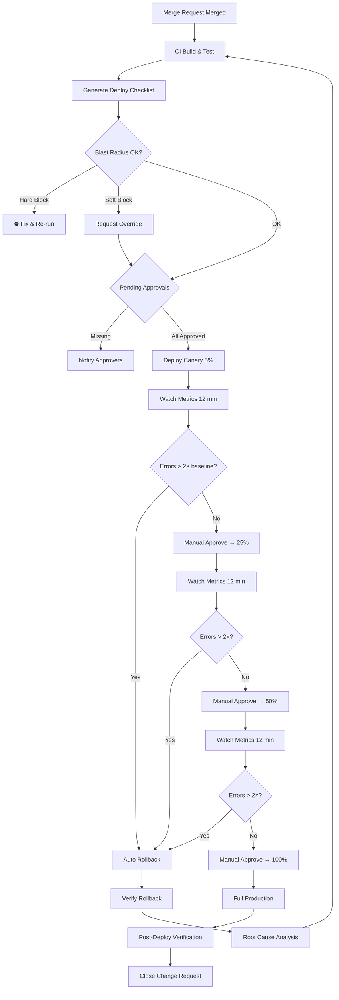

# Deployment Checklist Specification — Blast Radius, Canary, Rollback Path v1.0

| Атрибут | Значение |
|---------|----------|
| **ID** | REQ-FUN.PROCESS.deployment-checklist |
| **Уровень** | FUN |
| **Атрибут качества** | Supportability |
| **Приоритет** | P0 |
| **Статус** | УТВЕРЖДЕНО |
| **Источник** | — |
| **Критерии приёмки** | — |

---

> **Domain:** SRE / DevOps
> **Status:** Approved
> **Applies to:** Production deployments (EU, РФ, US regions), all VEDO Core services
> **References:** ADR-IMPL.PROCESS.gitlab-ci-cd-strategy, ADR-DES.PROCESS.deployment-strategy-policy, ADR-DES.PROCESS.major-version-migration-strategy

---

## 1. Definition

### 1.1 Blast Radius

Зона поражения деплоя — множество компонентов, данных и пользователей, которые могут быть затронуты в случае отказа. Измеряется в:
- **Количестве сервисов** — ontology-service, api-gateway, auth-service и т.д.
- **Изменениях схемы БД** — миграции Neo4j, PostgreSQL, Redis структур
- **Breaking API изменениях** — несовместимость запросов/ответов
- **Доле затронутых tenant** — процент клиентов, которых коснётся деплой
- **CPU/Memory impact** — изменение потребления ресурсов

### 1.2 Canary Status

Процесс постепенной раскатки трафика на новую версию с мониторингом ключевых метрик на каждом этапе. Этапы: 0% → 5% → 25% → 50% → 100%. После каждого этапа сравниваются метрики canary (новая версия) и baseline (текущая стабильная).

### 1.3 Rollback Path

Документированная процедура возврата к предыдущей стабильной версии при обнаружении проблем. Включает:
- **Rollback тип** — code-only (откат образа), code+data (откат образа + миграции), data-only (только откат БД)
- **Rollback команда** — точная CLI-команда или Helm-команда
- **RTO** — целевое время восстановления
- **RPO** — объём потери данных при откате
- **Автоматический триггер** — условие для auto-rollback

---

## 2. Структура Deployment Checklist

### 2.1 Блок 0: Идентификация деплоя

| Поле | Формат | Пример | Blocking |
|------|--------|--------|----------|
| `deploy_id` | `DEPLOY-YYYY-MM-DD-NNN` | `DEPLOY-2026-05-16-001` | auto-generated |
| `commit_sha` | SHA (7+ chars) | `abc123f` | hard |
| `git_tag` | semver | `v1.2.3` | hard (если есть) |
| `environment` | `production-eu / production-ru / production-us` | `production-eu` | hard |
| `initiator` | `@username` | `@devops-engineer` | auto |
| `deploy_type` | `major / minor / patch / hotfix` | `minor` | hard |
| `deploy_time` | ISO 8601 | `2026-05-16T22:00:00Z` | auto |

### 2.2 Блок 1: Blast Radius

| Поле | Формат | Пример | Blocking |
|------|--------|--------|----------|
| `affected_services` | `[string]` | `[ontology-service, api-gateway]` | hard (>3 → SRE Lead approval) |
| `db_schema_changes` | `[{service: string, stmt: string}]` | `[{neo4j: "CREATE INDEX :Person(ssn)"}]` | hard (rollback plan required) |
| `breaking_api_changes` | `[string]` | `[GET /v1/ontologies → /v2/]` | hard (client confirmation required) |
| `affected_tenants_pct` | float | `36.0` | hard (>20% → PO approval) |
| `dependency_conflicts` | `[{service: string, version: string}]` | `[{collaboration-service: "v1.2.x"}]` | hard (incompatible → block) |
| `feature_flags` | `[{name: string, ramp_from: int, ramp_to: int}]` | `[{new-layout: 0→100}]` | hard (ramp >10% → approval) |
| `cpu_impact_pct` | float | `15.0` | soft (>30% → capacity approval) |
| `memory_impact_mb` | int | `200` | soft (>30% → capacity approval) |
| `migration_type` | `schema / data / none` | `schema` | hard (if db_schema_changes not empty) |

### 2.3 Блок 2: Canary Status

| Поле | Формат | Пример | Blocking |
|------|--------|--------|----------|
| `canary_stages` | `[int]` | `[0, 5, 25, 50, 100]` | hard (min 5 stages) |
| `current_canary_pct` | int | `5` | hard (starts at 0) |
| `health_checks` | `{metric: canary_vs_baseline}` | `{cpu: "45% vs 42%"}` | hard (deviation >20% → block) |
| `error_rate` | `{canary: float, baseline: float}` | `{canary: 0.05, baseline: 0.04}` | hard (canary > baseline ×2) |
| `latency_p99` | `{canary: ms, baseline: ms}` | `{canary: 245, baseline: 210}` | hard (canary > baseline ×1.5) |
| `business_metrics` | `{metric: canary_vs_baseline}` | `{commit_success: "99.8% vs 99.9%"}` | hard (drop >0.5%) |
| `new_alerts_p0_p1` | int | `0` | hard (any P0/P1 → block) |
| `manual_approval_stage` | `pct: approver` | `5: @sre-lead, 25: @sre-lead` | hard (each stage >5%) |
| `canary_duration_min` | int | `12` | soft (>60 min → warning) |

### 2.4 Блок 3: Rollback Path

| Поле | Формат | Пример | Blocking |
|------|--------|--------|----------|
| `rollback_type` | `code-only / code+data / data-only` | `code-only` | hard |
| `rollback_command` | string | `helm rollback ontology-service 42` | hard (verified in staging) |
| `rollback_rto_min` | int | `5` | hard (< RTO target) |
| `rollback_rpo_min` | int | `0` | soft (must be documented) |
| `rollback_verified_in_staging` | ISO date | `2026-05-15` | hard (within last 7 days) |
| `auto_rollback_trigger` | string | `error_rate > 1% over 2 min` | hard |
| `manual_rollback_channel` | string | `@sre-oncall in #incident` | hard |
| `post_rollback_verification` | `[string]` | `[counts, checksum TBox]` | hard |
| `feature_flag_kill_switch` | string или null | `kill_new_layout=true` | soft (если feature_flags непуст) |

### 2.5 Блок 4: Compliance и Audit

| Поле | Формат | Пример | Blocking |
|------|--------|--------|----------|
| `change_request_id` | `CHG-YYYY-MM-DD-NNN` | `CHG-2026-05-16-001` | soft (если требуется) |
| `approvals` | `[{role: string, status: string}]` | `[{security: approved}, {product: pending}]` | hard (all required) |
| `deployment_window` | `HH:MM-HH:MM TZ` | `22:00-23:59 UTC` | hard (outside → override) |
| `compliance_evidence` | `[string]` | `[SOC2 controls ✅]` | hard |
| `audit_trail_url` | URL | `https://gitlab.com/.../jobs/1234` | auto |

---

## 3. Blocking Criteria

### 3.1 Hard Block

Деплой невозможен. CI/CD pipeline останавливается. Требует изменения кода или конфигурации перед повторным запуском.

| Условие | Пример |
|---------|--------|
| Missing обязательного поля | `commit_sha` не указан |
| Schema changes без rollback plan | `db_schema_changes` есть, а `rollback_type` не `code+data` |
| Canary error rate > 2× baseline | error_rate: 0.10 vs 0.04 |
| Rollback не протестирован в staging | `rollback_verified_in_staging` > 7 дней |
| Dependencies несовместимы | `dependency_conflicts` непуст |
| Любой новый P0/P1 алерт | `new_alerts_p0_p1` > 0 |
| Business metrics drop > 0.5% | commit success 99.3% vs 99.9% |
| Нет compliance evidence | `compliance_evidence` пуст |
| Латентность > 1.5× baseline | latency_p99: 320ms vs 210ms |
| Health check deviation > 20% | CPU: 65% vs 42% |

### 3.2 Soft Block

Требует manual override (approval уполномоченного лица). Pipeline приостанавливается до получения override.

| Условие | Override от | Действие |
|---------|-------------|----------|
| >3 затронутых сервиса | SRE Lead | Approve/fix |
| >20% затронутых tenant | Product Owner | Approve/fix |
| Feature flag ramp >10% | SRE Lead | Approve/fix |
| CPU/Memory impact >30% | SRE Lead + Capacity team | Approve/fix |
| Вне deployment window | SRE Lead + Incident Commander | Override с обоснованием |
| Canary duration >60 мин | SRE Lead | Warning / escalate |
| Отсутствует change request ID | Change Manager | Approve/post-factum |

### 3.3 Manual Override Protocol

```yaml
override:
  triggered_by: "@sre-lead"
  reason: "Hotfix for P0 incident INC-2026-05-16-001"
  approved_by: "@sre-lead, @incident-commander"
  timestamp: "2026-05-16T21:30:00Z"
  expires_at: "2026-05-17T06:00:00Z"
  audit_log_url: "https://..."
```

---

## 4. MVP Scope

Минимальный набор полей для первого production deployment:

### Блок 0
- `deploy_id` — авто
- `environment` — hard
- `commit_sha` — hard

### Блок 1
- `affected_services` — hard
- `db_schema_changes` — hard
- `breaking_api_changes` — hard

### Блок 2
- `current_canary_pct` — hard
- `error_rate` — hard (canary vs baseline)

### Блок 3
- `rollback_command` — hard
- `rollback_verified_in_staging` — hard

### Блок 4
- (MVP — пусто, заполняется при переходе к GA)

---

## 5. Формат визуального отображения

### 5.1 CLI вывод (терминал)

```
╔══════════════════════════════════════════════════════════════╗
║ DEPLOY-2026-05-16-001 │ production-eu │ minor │ @sre-ivan ║
╠══════════════════════════════════════════════════════════════╣
║ 🔥 BLAST RADIUS                                            ║
║  ├─ Services:  [ontology-service, api-gateway]              ║
║  ├─ DB schema: [neo4j: CREATE INDEX :Person(ssn)]           ║
║  ├─ API break: [GET /v1/ontologies → /v2/]                 ║
║  └─ Tenants:  36% (>20% → ⚠️ PO approval required)         ║
╠══════════════════════════════════════════════════════════════╣
║ 🐤 CANARY STATUS                                           ║
║  ├─ Stage:     5% (0%→5%→25%→50%→100%)                    ║
║  ├─ Errors:    0.05% vs 0.04%  ✅ (within 2×)             ║
║  ├─ Latency:   245ms vs 210ms ✅ (within 1.5×)            ║
║  └─ Health:    CPU 45% vs 42% ✅ (within 20%)             ║
╠══════════════════════════════════════════════════════════════╣
║ ↩️ ROLLBACK PATH                                           ║
║  ├─ Type:      code-only                                   ║
║  ├─ Command:   helm rollback ontology-service 42           ║
║  ├─ RTO:       5 min ✅                                    ║
║  ├─ RPO:       0 min ✅                                    ║
║  ├─ Verified:  2026-05-15 ✅ (within 7 days)               ║
║  └─ Trigger:   error_rate > 1% over 2 min                  ║
╠══════════════════════════════════════════════════════════════╣
║ 🔒 COMPLIANCE                                              ║
║  ├─ Approvals: [security: ✅, product: ⏳, sre-lead: ✅]   ║
║  └─ Window:    22:00-23:59 UTC ✅                          ║
╠══════════════════════════════════════════════════════════════╣
║ 🟢 READY FOR DEPLOY  |  ⛔ BLOCKED  |  ⚠️ SOFT BLOCK       ║
╚══════════════════════════════════════════════════════════════╝
```

### 5.2 GitLab CI output

```
=== Deployment Checklist: DEPLOY-2026-05-16-001 ===

[PASS] deploy_id: auto-generated
[PASS] environment: production-eu
[PASS] commit_sha: abc123f

[PASS] affected_services: 2 services (≤3)
[BLOCK] db_schema_changes: schema migration without rollback plan
[PASS] breaking_api_changes: none

[PASS] current_canary_pct: 5%
[PASS] error_rate: 0.05% vs 0.04% (within 2×)

[PASS] rollback_command: helm rollback ontology-service 42
[PASS] rollback_verified: 2026-05-15 (within 7 days)

⛔ DEPLOYMENT BLOCKED — fix db_schema_changes rollback plan
```

### 5.3 ChatOps (Slack)

```
🚀 *Deploy Checklist: DEPLOY-2026-05-16-001*
• Environment: production-eu | Type: minor
• Services: ontology-service, api-gateway

🔥 *Blast Radius*
• DB schema changes: `CREATE INDEX :Person(ssn)` — *rollback plan required*
• API breaking: `GET /v1/ontologies → v2` — *needs client confirmation*
• Tenants affected: ~36% — ⚠️ *PO approval needed*

🐤 *Canary (5%)*
• Errors: 0.05% vs 0.04% ✅
• Latency: 245ms vs 210ms ✅

↩️ *Rollback*
• Type: code-only | RTO: 5min ✅
• Verified: 2026-05-15 ✅

⛔ *BLOCKED by:* db_schema_changes rollback plan
👤 *Owner:* @sre-ivan
```

---

## 6. CI/CD интеграция (.gitlab-ci.yml)

```yaml
# .gitlab-ci.yml — Deployment Checklist stage

.deployment-checklist:
  stage: deploy-prep
  script:
    # Шаг 1: Сбор метаданных
    - export DEPLOY_ID="DEPLOY-$(date +%Y-%m-%d)-$CI_PIPELINE_ID"
    - export COMMIT_SHA="$CI_COMMIT_SHA"
    - export ENVIRONMENT="$DEPLOY_ENVIRONMENT"

    # Шаг 2: Blast radius (авто: из git diff, ченджлогов)
    - python scripts/deploy-check/blast-radius.py \
        --from-ref "$CI_MERGE_REQUEST_DIFF_BASE_SHA" \
        --to-ref "$CI_COMMIT_SHA" \
        --output blast-radius.json

    # Шаг 3: Canary status (запрос к Prometheus)
    - python scripts/deploy-check/canary-status.py \
        --namespace "vedo-$DEPLOY_ENVIRONMENT" \
        --output canary-status.json

    # Шаг 4: Rollback path (из rollback-plan.yaml в репозитории)
    - python scripts/deploy-check/rollback-verify.py \
        --rollback-plan "ops/rollback/$CI_COMMIT_REF_NAME.yaml" \
        --output rollback-status.json

    # Шаг 5: Валидация checklist
    - python scripts/deploy-check/validate-checklist.py \
        --blast-radius blast-radius.json \
        --canary canary-status.json \
        --rollback rollback-status.json \
        --report checklist-report.md

  artifacts:
    paths:
      - blast-radius.json
      - canary-status.json
      - rollback-status.json
      - checklist-report.md

deploy-checklist:
  extends: .deployment-checklist
  environment:
    name: $DEPLOY_ENVIRONMENT
  rules:
    - if: '$CI_PIPELINE_SOURCE == "merge_request_event"'
    - if: '$CI_COMMIT_TAG =~ /^v?\d+\.\d+\.\d+$/'
  # Manual gate: SRE запускает вручную перед deploy
  when: manual
  allow_failure: false

deploy-canary-5:
  stage: deploy-canary
  needs: ["deploy-checklist"]
  script:
    - python scripts/deploy/helm-upgrade.py --set canary.percentage=5
  environment:
    name: $DEPLOY_ENVIRONMENT
  when: manual

deploy-canary-25:
  stage: deploy-canary
  needs: ["deploy-canary-5"]
  script:
    - python scripts/deploy-check/wait-for-canary.py --duration 12
    - python scripts/deploy-check/compare-metrics.py \
        --canary-pct 25 --baseline stable
  environment:
    name: $DEPLOY_ENVIRONMENT
  when: manual

deploy-production-100:
  stage: deploy-prod
  needs: ["deploy-canary-50"]
  script:
    - python scripts/deploy/helm-upgrade.py --set canary.percentage=100
  environment:
    name: $DEPLOY_ENVIRONMENT
  when: manual

rollback:
  stage: rollback
  script:
    - python scripts/deploy/helm-rollback.py --revision PREVIOUS
  environment:
    name: $DEPLOY_ENVIRONMENT
  when: manual
```

---

## 7. Процесс Deployment



---

## 8. Интеграция с существующими стратегиями

### 8.1 Rolling Update (minor/patch)

- Canary этапы: 0% → 25% → 100% (3 этапа, без 5% и 50%)
- Rollback: `kubectl rollout undo` (code-only, 2 min RTO)
- Blast radius: только затронутые сервисы

### 8.2 Blue-Green (major)

- Canary этапы: 0% → 5% → 25% → 50% → 100% (5 этапов)
- Rollback: DNS switch на blue (code+data, <1 min RTO)
- Blast radius: полный (все сервисы, schema changes, breaking API)
- Обязателен: pre-flight check региона Б

### 8.3 Canary Release (опционально, с service mesh)

- Canary этапы: 0% → 1% → 5% → 25% → 100% (дополнительный 1% этап)
- Traffic split через Istio VirtualService
- Метрики: дополнительно сравниваются по tenant tiers (платящие vs бесплатные)

### 8.4 Hotfix

- Canary этапы: 0% → 100% (1 этап, manual override)
- Rollback: предварительно протестирован (обязательно)
- Blast radius: минимальный (только изменённый сервис)
- Approvals: ускоренные (SRE Lead + Incident Commander)

---

## 9. Тестирование Checklist

### 9.1 Staging Validation

Перед каждым production deploy checklist должен быть проверен в staging:

```bash
# Запуск checklist в staging
python scripts/deploy-check/validate-checklist.py \
  --blast-radius blast-radius.json \
  --canary canary-status.json \
  --rollback rollback-status.json \
  --env staging

# Проверка, что все hard блоки сработают корректно
python scripts/deploy-check/test-hard-blocks.py \
  --scenarios ops/deploy-check/test-scenarios.yaml
```

### 9.2 Rollback Drill

| Сценарий | Периодичность | Проверяет |
|----------|---------------|-----------|
| code-only rollback | Каждый deploy | `rollback_command` валидна |
| code+data rollback (schema) | Еженедельно | Migration rollback scripts |
| data-only rollback | Ежемесячно | PITR + data integrity |
| Full drill с canary | Ежеквартально | Весь pipeline от MR до post-rollback |

### 9.3 Test Scenarios

```yaml
# ops/deploy-check/test-scenarios.yaml
scenarios:
  - name: "missing_rollback_plan"
    input:
      db_schema_changes: [{neo4j: "CREATE INDEX"}]
      rollback_type: "code-only"
    expected: HARD_BLOCK
    reason: "Schema change without data rollback plan"

  - name: "canary_error_rate_exceeded"
    input:
      error_rate: {canary: 0.10, baseline: 0.04}
    expected: HARD_BLOCK
    reason: "Canary error rate > 2× baseline"

  - name: "stale_rollback_verification"
    input:
      rollback_verified_in_staging: "2026-04-01"
    expected: HARD_BLOCK
    reason: "Rollback not verified within 7 days"

  - name: "partial_approvals"
    input:
      approvals: [{security: "approved"}, {product: "pending"}]
    expected: SOFT_BLOCK
    reason: "Missing product approval"
```

---

## 10. Responsibility Matrix

| Блок | Заполняет | Утверждает | Ответственный |
|------|-----------|------------|---------------|
| **Блок 0** | CI/CD (авто) | — | Pipeline |
| **Блок 1: Blast Radius** | Developer (MR description) | SRE Lead (>3 services) | Developer |
| **Блок 1: DB Schema** | Developer | SRE Lead / DBA | Developer |
| **Блок 1: Breaking API** | Developer | Tech Lead | Developer |
| **Блок 1: Tenant Impact** | Developer / PM | Product Owner (>20%) | Developer |
| **Блок 2: Canary** | CI/CD (Prometheus queries) | SRE (per stage) | SRE |
| **Блок 2: Business Metrics** | CI/CD (Grafana API) | SRE (per stage) | SRE |
| **Блок 3: Rollback Path** | Developer (ops/rollback/*.yaml) | SRE Lead | Developer |
| **Блок 3: Rollback Drill** | CI/CD (staging) | SRE Lead | SRE |
| **Блок 4: Compliance** | Developer / SRE | Security Lead | Security Lead |

---

## 11. Полный пример заполненного Checklist

```yaml
# DEPLOY-2026-05-16-001 — production-eu, minor релиз ontology-service v2.3.0

deploy_id: "DEPLOY-2026-05-16-001"
commit_sha: "abc123f"
git_tag: "v2.3.0"
environment: "production-eu"
initiator: "@sre-ivan"
deploy_type: "minor"
deploy_time: "2026-05-16T22:00:00Z"

blast_radius:
  affected_services:
    - ontology-service
    - api-gateway
  db_schema_changes:
    - service: neo4j
      stmt: "CREATE INDEX :Person(ssn)"
  breaking_api_changes:
    - "GET /v1/ontologies → /v2/ontologies"
  affected_tenants_pct: 36.0
  dependency_conflicts: []
  feature_flags:
    - name: "new-layout"
      ramp_from: 0
      ramp_to: 100
  cpu_impact_pct: 15.0
  memory_impact_mb: 200
  migration_type: "schema"

canary:
  stages: [0, 5, 25, 50, 100]
  current_pct: 5
  health_checks:
    cpu: "45% vs 42%"
    memory: "60% vs 58%"
    connections: "1200 vs 1150"
  error_rate:
    canary: 0.05
    baseline: 0.04
  latency_p99:
    canary: 245
    baseline: 210
  business_metrics:
    commit_success: "99.8% vs 99.9%"
    query_success: "99.95% vs 99.97%"
  new_alerts_p0_p1: 0
  manual_approval:
    - pct: 5
      approver: "@sre-lead"
    - pct: 25
      approver: "@sre-lead"
    - pct: 50
      approver: "@sre-lead"
  duration_min: 12

rollback:
  type: "code+data"
  command: |
    # Code rollback
    helm rollback ontology-service 42
    # Data rollback (revert migration)
    python scripts/migrations/revert.py --migration 042_add_person_index
  rto_min: 5
  rpo_min: 0
  verified_in_staging: "2026-05-15"
  auto_trigger: "error_rate > 1% over 2 min"
  manual_channel: "@sre-oncall in #incident"
  post_verification:
    - "Count ontology classes (≥ 50000)"
    - "Checksum TBox matches pre-deploy"
    - "SPARQL smoke query returns 200"
  feature_flag_kill_switch: "kill_new_layout=true"

compliance:
  change_request_id: "CHG-2026-05-16-001"
  approvals:
    - role: "security"
      status: "approved"
    - role: "product"
      status: "approved"
    - role: "sre-lead"
      status: "approved"
  deployment_window: "22:00-23:59 UTC"
  compliance_evidence:
    - "SOC2 CC6.1 controls ✅"
    - "OWASP ASVS V4 checks ✅"
  audit_trail_url: "https://gitlab.com/vedo-core/vedo-core/-/jobs/12345"
```

---

## 12. Шаблоны автоматического заполнения

### 12.1 Из MR description

```yaml
# Парсинг MR description → blast_radius поля
# Шаблон для включения в MR description template

## Blast Radius
- [ ] Сервисы: `ontology-service, api-gateway`
- [ ] Изменения схемы БД: `neo4j: CREATE INDEX :Person(ssn)`
- [ ] Breaking API: `GET /v1/ontologies → /v2/`
- [ ] Затронуто tenant (%): `36`
- [ ] Feature flags: `new-layout: 0→100`
- [ ] CPU impact: `+15%`
- [ ] Memory impact: `+200MB`

## Rollback
- [ ] Тип: `code+data`
- [ ] Команда: `helm rollback ontology-service 42`
- [ ] RTO: `5 min`
- [ ] RPO: `0 min`
- [ ] Staging verified: `2026-05-15`
- [ ] Auto-trigger: `error_rate > 1% over 2 min`
```

### 12.2 Из git diff

```bash
# Автоматическое определение affected_services из git diff
python -c "
import subprocess, json
diff = subprocess.check_output(['git', 'diff', '--name-only', '$CI_MERGE_REQUEST_DIFF_BASE_SHA', 'HEAD']).decode()
services = set()
if any('ontology-service/' in f for f in diff.splitlines()):
    services.add('ontology-service')
if any('api-gateway/' in f for f in diff.splitlines()):
    services.add('api-gateway')
if any('auth-service/' in f for f in diff.splitlines()):
    services.add('auth-service')
# etc.
print(json.dumps(list(services)))
"
```

### 12.3 Из kubectl / Helm

```bash
# Определение revision для rollback
CURRENT_REVISION=$(helm history ontology-service -n vedo-production \
  --output json | jq '.[-1].revision')
ROLLBACK_COMMAND="helm rollback ontology-service $((CURRENT_REVISION - 1))"
echo "rollback_command: $ROLLBACK_COMMAND"
```

### 12.4 Из Prometheus

```bash
# Получение canary vs baseline метрик
CANARY_ERROR_RATE=$(curl -s "http://prometheus:9090/api/v1/query" \
  --data-urlencode 'query=rate(http_requests_total{app="ontology-service",version="v2.3.0",status=~"5.."}[5m]) / rate(http_requests_total{app="ontology-service",version="v2.3.0"}[5m])' \
  | jq '.data.result[0].value[1]')
BASELINE_ERROR_RATE=$(curl -s "http://prometheus:9090/api/v1/query" \
  --data-urlencode 'query=rate(http_requests_total{app="ontology-service",version="v2.2.0",status=~"5.."}[5m]) / rate(http_requests_total{app="ontology-service",version="v2.2.0"}[5m])' \
  | jq '.data.result[0].value[1]')
```

---

## 13. Error Handling

### 13.1 Checklist не может быть автоматически заполнен

| Сценарий | Действие |
|----------|----------|
| git diff пуст или недоступен | CI/CD падает с `DEPLOY-CHECK-001: unable to compute diff`. SRE заполняет `affected_services` вручную через `deploy-checklist-override.yaml` |
| Prometheus недоступен | CI/CD падает с `DEPLOY-CHECK-002: metrics unavailable`. Canary этапы блокируются до восстановления мониторинга. SRE запускает `vedo-cli diagnose` для диагностики |
| Rollback plan файл отсутствует | CI/CD падает с `DEPLOY-CHECK-003: rollback plan not found`. Developer создаёт `ops/rollback/$BRANCH.yaml` |
| Staging окружение занято | CI/CD падает с `DEPLOY-CHECK-004: staging not available`. SRE освобождает staging или запускает deploy в другое окно |

### 13.2 Manual Override Procedure

```bash
# Шаг 1: Создать override файл
cat > deploy-checklist-override.yaml << EOF
override:
  blocked_fields:
    - db_schema_changes
  reason: "Missing rollback plan — migration is additive only (CREATE INDEX)"
  approved_by: "@sre-lead"
  timestamp: "2026-05-16T21:30:00Z"
EOF

# Шаг 2: Запустить pipeline с override
python scripts/deploy-check/validate-checklist.py \
  --blast-radius blast-radius.json \
  --canary canary-status.json \
  --rollback rollback-status.json \
  --override deploy-checklist-override.yaml

# Шаг 3: Override фиксируется в audit trail
# Pipeline продолжается с отметкой MANUAL_OVERRIDE в логах
```

### 13.3 Partial Data Availability

Если часть данных недоступна, checklist продолжает работу с Partial статусом:

```
╔══════════════════════════════════════════════════════════════╗
║ PARTIAL DATA — некоторые поля не удалось автозаполнить      ║
╠══════════════════════════════════════════════════════════════╣
║ Missing:                                                    ║
║  • cpu_impact_pct — baseline metrics not available          ║
║  • memory_impact_mb — baseline metrics not available        ║
║ Action: SRE заполняет вручную через --override              ║
╚══════════════════════════════════════════════════════════════╝
```
---

## История изменений

| Версия | Дата | Автор | Изменения |
|--------|------|-------|-----------|
| v1.0 | 2026-05-16 | SRE / DevOps Architect | Initial specification |
