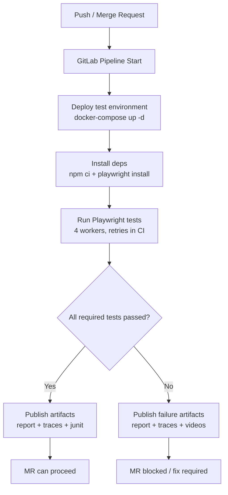

# E2E Testing Specification v1.0

| Атрибут | Значение |
|---------|----------|
| **ID** | REQ-FUN.PROCESS.e2e-testing |
| **Уровень** | FUN |
| **Атрибут качества** | Functionality |
| **Приоритет** | P0 |
| **Статус** | УТВЕРЖДЕНО |
| **Источник** | — |
| **Критерии приёмки** | — |

---

## 1. Purpose and Scope

Этот документ определяет единый стандарт E2E-тестирования для VEDO Core в среде, максимально приближенной к production.

Цель E2E-тестирования:
- гарантировать работоспособность критических пользовательских сценариев после каждого изменения;
- снизить риск регрессий в распределенной архитектуре (API Gateway, Ontology Service, Versioning Service, Commenting Service и др.);
- обеспечить воспроизводимую диагностику падений тестов в CI и локально.

Область покрытия:
- UI-потоки пользователя (Editor/Browse UI);
- интеграционные пользовательские цепочки с backend-сервисами;
- кроссбраузерные проверки (Chromium, Firefox, WebKit) в контексте требований доступности (WCAG);
- критические сценарии из `human/artifacts/use-cases.md` (Gherkin).

Вне области этого документа:
- нагрузочное тестирование (perf/soak);
- security pentest;
- unit/integration тесты сервисов.

## 2. Tooling Standard: Playwright

Для E2E в VEDO Core используется **Playwright** как обязательный инструмент.

Обоснование выбора:
- кроссбраузерный запуск из коробки (Chromium, Firefox, WebKit) для SaaS и WCAG-стратегии;
- параллелизация выполнения и встроенные retries для сокращения времени CI;
- встроенный trace viewer, video и screenshot артефакты для быстрой отладки;
- поддержка mobile emulation для публичного Browse UI;
- API-first возможности (REST/GraphQL) для ускоренной подготовки тестовых состояний.

## 3. Directory and File Structure

Базовая структура E2E-пакета:

```text
tests/e2e/
├── specs/                  # тест-кейсы по функциональным доменам
│   ├── auth/               # авторизация, регистрация
│   ├── ontology/           # F1-F4: просмотр, редактирование, индивиды
│   ├── versioning/         # F3: коммиты, ветки, слияния
│   ├── collaboration/      # F5: комментарии
│   ├── sparql/             # F10: SPARQL запросы
│   ├── publisher/          # F11: публикация, Browse UI
│   └── regression/         # полные smoke-сценарии перед релизом
├── fixtures/               # тестовые данные (онтологии в Turtle)
├── pages/                  # Page Object Model
├── utils/                  # helper-функции
├── playwright.config.ts    # конфигурация
└── .env.e2e                # переменные окружения
```

Правила организации:
- один `.spec.ts` файл покрывает один пользовательский поток или связанный набор шагов;
- общие селекторы и действия выносятся в `pages/`;
- создание данных и служебные API-шаги выносятся в `utils/`;
- фикстуры в `fixtures/` должны быть версионируемыми и детерминированными;
- сценарии smoke/release размещаются только в `specs/regression/`.

## 4. Mandatory Scenario Coverage

Источник сценариев: `human/artifacts/use-cases.md` (Gherkin).

Все сценарии ниже обязательны к автоматизации и поддержанию в green-состоянии.

| ID | Сценарий | Приоритет | Статус покрытия |
|---|---|---|---|
| E2E-01 | Авторизация (логин/логаут) | P0 | Required |
| E2E-02 | Создание класса | P0 | Required |
| E2E-03 | Создание свойства (ObjectProperty / DatatypeProperty) | P0 | Required |
| E2E-04 | Создание индивида | P0 | Required |
| E2E-05 | Создание коммита | P0 | Required |
| E2E-06 | Создание ветки и слияние | P1 | Required |
| E2E-07 | Импорт онтологии (Turtle) | P0 | Required |
| E2E-08 | Экспорт онтологии (Turtle) | P0 | Required |
| E2E-09 | SPARQL SELECT запрос (через визуальный конструктор) | P0 | Required |
| E2E-10 | Добавление комментария к классу | P1 | Required |
| E2E-11 | Публикация онтологии и просмотр в Browse UI | P1 | Required |
| E2E-12 | Восстановление пароля | P1 | Required |

Политика прогона:
- каждый Merge Request: минимум P0 + smoke;
- перед релизом: полный набор P0+P1;
- падение любого P0 в MR-блокере считается release-blocking.

## 5. Testing Patterns and Conventions

### 5.1 Page Object Model (POM)
- все пользовательские действия описываются методами Page Object;
- запрещено дублировать сложные CSS/XPath локаторы в `.spec.ts`;
- spec-файлы должны оставаться на уровне бизнес-шагов.

### 5.2 Stable Selectors (`data-testid`)
- для автоматизации используются только стабильные селекторы `data-testid`;
- запрещено опираться на текст, порядок элементов или динамические CSS-классы, если есть `data-testid`;
- при добавлении нового UI-элемента команда feature обязана добавить test id.

### 5.3 Fixtures and Test Data
- фикстуры (Turtle и вспомогательные JSON) хранятся в `tests/e2e/fixtures/`;
- фикстуры должны быть минимальными, читаемыми и переиспользуемыми;
- один тест должен зависеть только от явно объявленных фикстур.

### 5.4 API-assisted Steps
- подготовка состояния (логин, создание онтологии, загрузка исходных данных) должна выполняться через API, где это снижает длительность теста;
- UI-проверки используются для валидации именно пользовательских действий и отображения результата;
- допускается смешанный подход: setup через API, валидация через UI.

## 6. CI Integration (GitLab)

E2E-пайплайн выполняется:
- на каждый Merge Request;
- на дефолтной ветке;
- перед релизом (regression stage).

Базовый job:

```yaml
e2e-tests:
  stage: test
  image: mcr.microsoft.com/playwright:v1.40.0-focal
  script:
    - docker-compose up -d
    - npm ci
    - npx playwright install --with-deps
    - npx playwright test
  artifacts:
    when: always
    paths:
      - test-results/
      - playwright-report/
    reports:
      junit: test-results/junit.xml
  rules:
    - if: $CI_MERGE_REQUEST_ID
    - if: $CI_COMMIT_BRANCH == $CI_DEFAULT_BRANCH
```

### Mermaid: CI E2E Execution Flow



## 7. Reliability and Performance Requirements

### 7.1 Stability (Anti-Flaky)
- каждый тест идемпотентен и может запускаться повторно без ручного сброса;
- тесты не зависят от порядка выполнения;
- обязательная очистка данных после каждого теста (UI/API cleanup hooks);
- `retries = 2` в CI для временных сбоев;
- обязательный сбор trace при падении теста.

### 7.2 Speed
- полный E2E-набор (40-60 тестов): не более 10 минут в CI;
- `workers = 4` в `playwright.config.ts`;
- setup-шаги по возможности через API вместо UI;
- длинные сценарии выносятся в release regression, не дублируются в каждом smoke прогоне.

### 7.3 Exit Criteria
- MR: 100% прохождение required P0 сценариев;
- Release: 100% прохождение required P0+P1;
- отсутствие неклассифицированных flaky-тестов в critical suite.

## 8. Code Examples (Reference Fragments)

### 8.1 `playwright.config.ts` (workers/retries/reporting)

```ts
import { defineConfig, devices } from '@playwright/test'

export default defineConfig({
  testDir: 'tests/e2e/specs',
  timeout: 60_000,
  fullyParallel: true,
  workers: process.env.CI ? 4 : undefined,
  retries: process.env.CI ? 2 : 0,
  reporter: [['list'], ['junit', { outputFile: 'test-results/junit.xml' }], ['html', { outputFolder: 'playwright-report' }]],
  use: {
    baseURL: process.env.E2E_BASE_URL,
    trace: 'on-first-retry',
    screenshot: 'only-on-failure',
    video: 'retain-on-failure',
  },
  projects: [
    { name: 'chromium', use: { ...devices['Desktop Chrome'] } },
    { name: 'firefox', use: { ...devices['Desktop Firefox'] } },
    { name: 'webkit', use: { ...devices['Desktop Safari'] } },
  ],
})
```

### 8.2 POM + `data-testid`

```ts
// tests/e2e/pages/ontology.page.ts
import { Page, expect } from '@playwright/test'

export class OntologyPage {
  constructor(private readonly page: Page) {}

  async createClass(className: string) {
    await this.page.getByTestId('create-class-button').click()
    await this.page.getByTestId('class-name-input').fill(className)
    await this.page.getByTestId('save-class-button').click()
    await expect(this.page.getByTestId('class-tree')).toContainText(className)
  }
}
```

### 8.3 API-assisted setup

```ts
// tests/e2e/utils/setup.ts
import { APIRequestContext } from '@playwright/test'

export async function createOntologyViaApi(request: APIRequestContext, name: string) {
  const response = await request.post('/api/ontologies', {
    data: { name, format: 'turtle' },
  })
  if (!response.ok()) throw new Error('Failed to create ontology via API')
  return response.json()
}
```

## 9. Local Run (Developer Workflow)

Минимальные шаги локального запуска:

```bash
cp tests/e2e/.env.e2e.example tests/e2e/.env.e2e
docker-compose up -d
npm ci
npx playwright install --with-deps
npx playwright test
```

Полезные команды:
- запуск одного файла: `npx playwright test tests/e2e/specs/ontology/create-class.spec.ts`
- запуск по тегу/grep: `npx playwright test --grep "@p0"`
- запуск в headed режиме: `npx playwright test --headed`
- открытие отчета: `npx playwright show-report`

Локальные требования:
- доступ к тестовому стенду и переменным из `.env.e2e`;
- синхронизированная версия Node.js/npm с CI;
- поднятые зависимости (DB, broker, сервисы) через docker-compose.

## 10. FAQ по отладке

### Как посмотреть trace падающего теста?
1. Выполнить тест с трассировкой или взять артефакт из CI (`test-results/`).
2. Открыть: `npx playwright show-trace test-results/<path-to-trace.zip>`.
3. Проверить timeline, network, DOM snapshot и console errors в момент падения.

### Как быстро перезапустить флакующий тест локально?
- `npx playwright test <path-to-spec> --retries=2 --repeat-each=5`

### Что делать, если тест падает только в одном браузере?
- запуск по проекту: `npx playwright test --project=webkit` (или `chromium`, `firefox`);
- проверить WCAG/семантические различия UI-рендеринга и race conditions;
- зафиксировать issue с указанием браузера и приложенным trace.

### Как понять, что падение связано с окружением, а не с продуктом?
- проверить health-check сервисов до теста;
- сопоставить тайминги и network failures в trace;
- повторить тест на чистом окружении с теми же фикстурами.

## 11. Roles and Responsibilities

- **Feature-разработчики (Backend/Frontend):** добавляют `data-testid`, поддерживают API setup hooks, обновляют E2E при изменении пользовательских потоков.
- **QA Engineers:** проектируют E2E-сценарии, поддерживают POM/фикстуры, анализируют flaky-тесты и ведут дефектную обратную связь.
- **DevOps Engineers:** поддерживают CI job, окружение, хранение артефактов и стабильность запуска в pipeline.
- **Release Manager / Tech Lead:** контролирует release-gate по P0/P1 и принимает решение о релизе при отклонениях метрик качества.

Правило ownership:
- автор функционального изменения обязан либо обновить существующий E2E-тест, либо добавить новый для затронутого критического сценария.

## 12. E2E Quality Metrics and Targets

Обязательные метрики:

| Метрика | Определение | Целевое значение |
|---|---|---|
| Scenario Coverage | (Автоматизированные обязательные сценарии / Все обязательные сценарии) x 100% | 100% |
| Flakiness Rate | (Нестабильные прогоны / Общее число прогонов) x 100% | <= 2% |
| Critical Pass Rate (P0) | (Успешные P0 тесты / Все P0 тесты) x 100% | 100% в MR |
| Full Suite Duration | Время выполнения полного E2E-набора в CI | <= 10 минут |
| Mean Time To Diagnose | Среднее время первичной диагностики падения по trace/report | <= 30 минут |

Правила мониторинга метрик:
- метрики собираются из GitLab CI + Playwright report + JUnit;
- еженедельный обзор flaky-листа на QA/DevOps синке;
- тесты, попавшие в flaky-list более 3 раз за 14 дней, подлежат обязательной стабилизации.

## 13. Compliance and Review

Этот стандарт обязателен для всех команд, изменяющих пользовательские потоки VEDO Core.

Изменения в документе выполняются через Merge Request с ревью минимум от:
- QA Lead;
- DevOps Engineer;
- владельца затронутого домена (Ontology/Versioning/Collaboration/UI).
