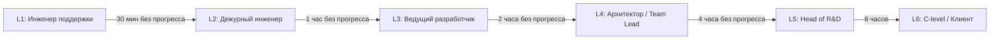

# Матрица Эскалации Производственных Инцидентов

| Атрибут | Значение |
|---------|----------|
| **ID** | REQ-FUN.PROCESS.escalation-matrix |
| **Уровень** | FUN |
| **Атрибут качества** | Supportability |
| **Приоритет** | P1 |
| **Статус** | УТВЕРЖДЕНО |
| **Источник** | — |
| **Критерии приёмки** | — |

---

## Назначение

Фиксирует формальную матрицу эскалации для производственных инцидентов VEDO Core. Матрица определяет, кто принимает решение на каждом уровне эскалации, когда инцидент передаётся выше и какие каналы коммуникации используются.

Без формальной матрицы эскалации SLA остаётся непроверяемым обещанием: время реакции, TTD и TTR должны иметь владельцев, таймеры, каналы и аудиторские доказательства.

## Общая Схема Эскалации



Таймеры начинаются с момента подтверждения инцидента: срабатывания алерта или обращения клиента. "Без прогресса" означает отсутствие нового диагноза, исправления, обходного решения или согласованного решения об откате/восстановлении.

## Уровни Эскалации

| Уровень | Кто участвует | Тайминг эскалации | Каналы |
|---------|---------------|-------------------|--------|
| L1 | Инженер поддержки | Событие зафиксировано | Тикет, чат, email |
| L2 | Дежурный инженер DevOps / Backend | 30 минут без прогресса или быстрее для P0 | Телефон, Telegram, webhook |
| L3 | Ведущий разработчик сервиса | 1 час без прогресса | Прямой звонок, группа Telegram, видеозвонок |
| L4 | Архитектор / технический лидер | 2 часа без прогресса | Телефон, приоритетное push-уведомление, incident bridge |
| L5 | Head of R&D / менеджмент | 4 часа без прогресса | Телефон, канал руководства по инцидентам |
| L6 | C-level + клиент для Enterprise | 8 часов или нарушение SLA | Customer success, звонок руководства, план действий |

## P0 Critical Escalation

| Переход | Тайминг | Действие |
|---------|---------|----------|
| L1 -> L2 | 15 минут | L1 не может воспроизвести проблему, не хватает прав или нет быстрого обходного решения |
| L2 -> L3 | 30 минут | L2 не локализовал причину или нужна доработка кода |
| L3 -> L4 | 1 час | L3 не устранил проблему или требуется архитектурное решение |
| L4 -> L5 | 2 часа | Нужны ресурсные, организационные или риск-решения |
| L5 -> L6 | 4 часа | Потенциальный SLA breach, уведомление клиента и подготовка компенсации по договору |

## P1 High Escalation

| Переход | Тайминг | Действие |
|---------|---------|----------|
| L1 -> L2 | 30 минут | Нет прогресса по диагностике или workaround |
| L2 -> L3 | 1.5 часа | Дежурный инженер не решил проблему |
| L3 -> L4 | 4 часа | Требуется архитектурная координация или решение об откате |
| L4 -> L5 | 8 часов | Менеджмент оценивает риски и клиентскую коммуникацию |

## P2/P3 Escalation

P2/P3 не имеют поминутного таймера производственной эскалации. Они обрабатываются в рабочем порядке. Если реакции нет 3 рабочих дня, L2 поднимает вопрос на daily/операционной встрече и назначает владельца.

## Роли И Ответственность

| Роль | Зона ответственности | Каналы |
|------|----------------------|--------|
| L1: Инженер поддержки | Первичная фильтрация, коммуникация с клиентом, ведение тикета | Email, чат, телефон для P0/P1 |
| L2: Дежурный инженер | Проверки health, backup/restore, перезапуск сервисов, анализ логов/метрик/трейсов | Телефон, Telegram, webhook |
| L3: Ведущий разработчик сервиса | Исправление кода, локальное воспроизведение, PR, диагностика parser/service-level проблем | Телефон, видеозвонок |
| L4: Архитектор / технический лидер | Архитектурное решение, координация команд, стратегия отката/восстановления | Телефон, Zoom, incident bridge |
| L5: Head of R&D | Подтверждение нарушения SLA, коммуникация с клиентом, выделение ресурсов | Телефон, канал руководства |
| L6: C-level / Customer Success | Финансовые компенсации, удержание клиента, roadmap/action plan | Звонок с клиентом, формальный план действий |

## Инструменты Эскалации

| Этап | Инструмент | Пример использования |
|------|------------|----------------------|
| Обнаружение | Prometheus + Grafana alerts | Алерт `Neo4j down` создаёт P0-тикет |
| Диагностика | `vedo-cli diagnose`, Loki, Tempo, Prometheus | L2 получает trace/logs/metrics по `trace_id` |
| Маршрутизация дежурному | PagerDuty / Opsgenie | Телефонная эскалация на L2 при P0 |
| ChatOps | Slack / Teams / Telegram | `#incident-p0`, `@here`, ссылка на incident bridge |
| Коммуникация с клиентом | Support portal, email, status page | Клиент получает статус и ETA |
| Эскалация руководству | Телефон, канал руководства | L5/L6 при нарушении SLA |

## Архитектурные Требования

- Все сервисы должны пробрасывать `trace_id` по HTTP, gRPC, WebSocket и async messaging, чтобы `vedo-cli diagnose` мог собрать полный контекст инцидента.
- Логи должны быть структурированными и содержать `trace_id`, `span_id`, `service`, `operation`, `tenant_id` или обезличенный эквивалент, `ontology_id` где применимо.
- Метрики `vedo_*` должны покрывать RED metrics: Rate, Errors, Duration.
- P0/P1-алерт должен создавать тикет, владельца маршрута эскалации и таймер эскалации без ручной настройки.
- Доказательства по инциденту должны включать timestamps: detected_at, acknowledged_at, escalated_at, diagnosed_at, workaround_at, restored_at, closed_at.
- Customer-managed on-premise environments должны либо использовать эквивалентную маршрутизацию, либо явно принимать ответственность за альтернативную маршрутизацию инцидентов.

## Учения По Инцидентам

- Для Enterprise game day обязателен 1 раз в квартал.
- Для SaaS рекомендуется 1 раз в квартал.
- Сценарий: synthetic P0 incident, например отказ Neo4j, потеря связи с PostgreSQL или недоступность API Gateway.
- Проверяется актуальность телефонов, маршрутизация, таймеры эскалации, `vedo-cli diagnose`, уведомление клиента и доказательства закрытия.
- Результат учения фиксируется как план действий с владельцем и сроками исправления.

## YAML-Сводка

```yaml
escalation_matrix:
  levels:
    L1: Инженер поддержки
    L2: Дежурный инженер
    L3: Ведущий разработчик
    L4: Архитектор / технический лидер
    L5: Head of R&D
    L6: C-level + Customer Success
  timings:
    p0:
      escalate_L1_to_L2: 15_minutes
      escalate_L2_to_L3: 30_minutes
      escalate_L3_to_L4: 1_hour
      escalate_L4_to_L5: 2_hours
      escalate_L5_to_L6: 4_hours
    p1:
      escalate_L1_to_L2: 30_minutes
      escalate_L2_to_L3: 90_minutes
      escalate_L3_to_L4: 4_hours
      escalate_L4_to_L5: 8_hours
  game_days:
    enterprise_frequency: quarterly
    saas_frequency: quarterly_recommended
```

## Формулировка Для Заказчика

VEDO Core имеет утверждённую матрицу эскалации для производственных инцидентов: от L1-инженера поддержки до Head of R&D и C-level/customer success для Enterprise. Для P0 эскалация начинается через 15 минут без прогресса, доходит до руководства в течение 4 часов и сопровождается коммуникацией с клиентом при риске нарушения SLA. Матрица проверяется на учениях не реже одного раза в квартал для Enterprise.

## Бизнес-Правила

- Production incidents P0/P1 требуют формальной матрицы эскалации.
- Таймеры эскалации запускаются с момента подтверждения алерта или клиентского инцидента, а не с ручной triage-обработки тикета.
- P0 эскалируется L1->L2 через 15 минут, L2->L3 через 30 минут, L3->L4 через 1 час, L4->L5 через 2 часа, L5->L6 через 4 часа.
- P1 эскалируется L1->L2 через 30 минут, L2->L3 через 90 минут, L3->L4 через 4 часа, L4->L5 через 8 часов.
- P2/P3 эскалируются по календарю, а не поминутно; отсутствие реакции 3 рабочих дня требует назначения владельца.
- P0/P1-алерты должны создавать владельца маршрута, support ticket и таймер эскалации.
- Ежеквартальные учения обязательны для Enterprise-контрактов и рекомендованы для SaaS operations.
- Доказательства по инциденту должны подтверждать timestamps реакции, диагностики, эскалации, обходного решения, восстановления и закрытия.
- Измеримые цели MTTA/MTTR и условия блокировки релизов определены в `incident-response-slo.md`.

## Incident Response Роли и Время Назначения

При P0/P1 инциденте в дополнение к матрице эскалации назначаются следующие роли:

| Роль | Обязанности | Макс. время назначения при P0 | При P1 |
|------|-------------|------------------------------|--------|
| **Incident Commander** | Координация, communication, decision making | 5 минут | 15 минут |
| **Communications Lead** | Обновление статуса, уведомление заказчиков (SaaS Enterprise), внутренний канал | 10 минут | 30 минут |
| **Operations Lead** | Technical mitigation, runbook execution, rollback | 5 минут | 15 минут |

Для on-premise заказчик назначает свои роли; VEDO предоставляет контакт escalation L3 (2 часа для Enterprise SLA).

Назначение выполняется автоматически через PagerDuty/Opsgenie эскалационная политика. При отсутствии подтверждения за 2 минуты — эскалация следующему в цепи.

## Открытые Вопросы

- Нет открытых вопросов по матрице эскалации.
