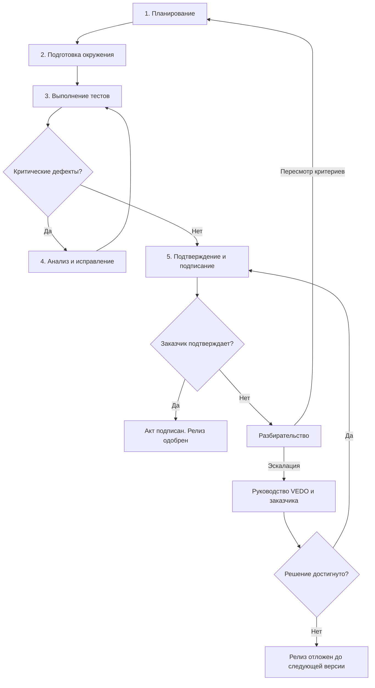

# Спецификация приёмочного тестирования (UAT) v1.0

| Атрибут | Значение |
|---------|----------|
| **ID** | REQ-FUN.PROCESS.uat-specification |
| **Уровень** | FUN |
| **Атрибут качества** | Functionality |
| **Приоритет** | P1 |
| **Статус** | УТВЕРЖДЕНО |
| **Источник** | — |
| **Критерии приёмки** | — |

---

## 1. Определение и цели UAT

**Приёмочное тестирование (User Acceptance Testing, UAT)** — формализованная процедура, в рамках которой представители заказчика (или независимые тестировщики, действующие от лица заказчика) подтверждают, что VEDO Core соответствует их бизнес-ожиданиям и готов к промышленной эксплуатации.

### Цели UAT

1. Подтвердить, что VEDO Core решает бизнес-задачи, для которых приобретается:
   - создание и редактирование онтологий;
   - управление версиями (коммиты, ветки, слияния);
   - интеграция через API и SPARQL.
2. Убедиться, что продукт работает в реальных условиях заказчика: на его данных, в его окружении, с его сценариями использования.
3. Проверить достижение согласованных критериев качества: производительность, удобство использования, надёжность.

### Область применения UAT

| Тип релиза | Обязательность UAT | Примечание |
|-----------|-------------------|------------|
| Major-релизы (v1.0, v2.0) | Обязателен для Enterprise-клиентов | Полный цикл UAT |
| Minor-релизы (v1.1, v1.2) | Опционально | По запросу клиента или при критических изменениях функциональности |
| Patch-релизы | Не требуется | Только внутреннее регрессионное тестирование силами QA |

---

## 2. Процесс UAT

Процесс состоит из пяти последовательных этапов.



### Этап 1. Планирование

Определение объёма тестирования, сроков, участников и перечня тестовых сценариев.

**Входные критерии:**
- Релизный кандидат собран.
- Сроки проведения UAT предварительно согласованы с заказчиком.
- Product Manager утвердил готовность к UAT.

**Действия:**
1. QA Lead составляет проект Плана UAT (шаблон — в разделе 8).
2. План согласуется с заказчиком: объём, даты, участники.
3. Заказчик назначает своих представителей для тестирования.
4. План утверждается обеими сторонами.

**Выходные критерии:**
- Утверждённый План UAT.
- Назначены ответственные с обеих сторон.

### Этап 2. Подготовка окружения

Развёртывание staging-окружения, загрузка данных заказчика, выдача доступа.

**Входные критерии:**
- План UAT утверждён.

**Действия:**
1. QA Lead развёртывает релизный кандидат на staging-окружении.
2. Заказчик предоставляет данные (онтологии в форматах .ttl/.rdf/.owl) либо VEDO использует анонимизированную копию.
3. Данные загружаются в staging.
4. Представителям заказчика выдаются учётные записи с ролью, достаточной для выполнения сценариев.
5. Участникам направляются инструкции: ссылка на окружение, описание сценариев, порядок фиксации дефектов.

**Выходные критерии:**
- Окружение доступно по ссылке.
- Данные заказчика загружены и отображаются.
- Инструкции выданы, доступ подтверждён.

### Этап 3. Выполнение тестов

Представители заказчика выполняют тестовые сценарии, фиксируют результаты и дефекты.

**Входные критерии:**
- Окружение готово, доступ подтверждён.

**Действия:**
1. Каждый участник выполняет назначенные сценарии (обязательный минимум — раздел 3).
2. Результат каждого сценария фиксируется в Журнале UAT: PASS (успех) или FAIL (неудача).
3. При FAIL участник заполняет отчёт о дефекте: шаги воспроизведения, ожидаемый и фактический результат, скриншот/видео, severity (классификация — раздел 5).
4. QA Lead ежедневно проверяет поступление дефектов, отвечает на вопросы участников.

**Выходные критерии:**
- Все обязательные сценарии выполнены.
- Журнал UAT заполнен.
- Дефекты зарегистрированы в тикет-системе.

### Этап 4. Анализ и исправление

VEDO Core анализирует дефекты, исправляет критические, согласует обходные пути для остальных.

**Входные критерии:**
- Завершено выполнение тестов (Этап 3).

**Действия:**
1. QA Lead классифицирует каждый дефект (Blocker, Critical, Major, Minor, Suggestion).
2. Blocker-дефекты: разработка приступает к исправлению немедленно.
3. Critical-дефекты: исправляются до подписания акта.
4. Major/Minor: заносятся в backlog следующего релиза, если заказчик не настаивает на исправлении.
5. После исправления QA Lead верифицирует фикс и уведомляет заказчика.
6. Если дефект не может быть исправлен в срок — согласуется workaround с заказчиком.

**Выходные критерии:**
- Blocker-дефекты: 0.
- Critical-дефекты: 0 (или согласован workaround).
- Остальные дефекты задокументированы.

### Этап 5. Подтверждение и подписание

Заказчик подтверждает, что продукт соответствует ожиданиям, или отклоняет с обоснованием.

**Входные критерии:**
- Все критикусы исправлены (раздел «Выходные критерии Этапа 4»).
- Заказчик уведомлен о завершении исправлений.

**Действия:**
1. QA Lead направляет заказчику итоговый отчёт: Журнал UAT, список дефектов, статус исправлений.
2. Заказчик проверяет исправления в staging.
3. Если всё удовлетворительно — представитель заказчика подписывает Акт приёмочного тестирования (Certificate of Acceptance).
4. Если нет — заказчик предоставляет мотивированный отказ. Далее — раздел 7 «Урегулирование разногласий».

**Выходные критерии:**
- Акт подписан обеими сторонами (или письменное подтверждение в тикет-системе).
- UAT завершён.

---

## 3. Минимальный набор тестовых сценариев

Обязательные сценарии для Enterprise UAT.

| ID | Сценарий | Описание | Критерий успеха |
|----|----------|----------|-----------------|
| UAT-01 | Создание онтологии с нуля | Заказчик создаёт онтологию, добавляет 5 классов, 3 свойства (2 объектных, 1 дататайп), 2 индивида. | Все операции выполняются за < 1 минуты. Классы, свойства и индивиды отображаются в дереве. |
| UAT-02 | Импорт существующей онтологии | Заказчик загружает свой файл .ttl или .rdf (до 10 МБ). | Онтология импортирована. Дерево классов отображается. Количество импортированных сущностей совпадает с исходным файлом. |
| UAT-03 | Ветвление и слияние | Заказчик создаёт ветку, вносит изменения (добавляет класс), создаёт Merge Request. | MR создан. Изменения видны в Semantic Diff. |
| UAT-04 | SPARQL-запрос | Заказчик выполняет SELECT-запрос к своей онтологии через визуальный конструктор запросов. | Результат отображается за < 5 секунд. Набор результатов корректен. |
| UAT-05 | Экспорт онтологии | Заказчик экспортирует онтологию в Turtle. | Файл .ttl скачан. Открывается в Protégé без ошибок. Контрольная сумма (checksum) совпадает с исходной при повторном импорте. |
| UAT-06 | Добавление комментария | Заказчик комментирует класс, упоминает коллегу через @username. | Комментарий сохранён. Упомянутый коллега получил уведомление. Комментарий виден в ленте обсуждений. |
| UAT-07 | Просмотр графа | Заказчик открывает 2D-визуализацию выбранного класса с дочерними элементами. | Граф отображается. Узлы кликабельны. Ленивая подгрузка срабатывает при раскрытии узла. |

---

## 4. Критерии приёмки

| Категория | Критерий | Способ измерения |
|-----------|----------|-----------------|
| **Функциональность** | Все заявленные функции (F1–F12 из vision.md) работают согласно документации. | 0 blocker-дефектов, 0 critical-дефектов по итогам UAT. |
| **Производительность** | Открытие класса с 500 дочерними элементами — не более 2 секунд (p95). | Замер времени при выполнении сценария UAT-01. |
| **Производительность** | SPARQL-запрос к онтологии из 500 000 триплетов — не более 5 секунд (p95). | Замер времени при выполнении сценария UAT-04. |
| **Надёжность** | Нет потери данных при импорте, экспорте, коммите, слиянии веток. | Контрольные суммы (checksum) до и после операции. |
| **Удобство использования** | Представитель заказчика успешно выполнил все обязательные сценарии UAT без постоянной поддержки инженеров VEDO. | 100% обязательных сценариев завершены (PASS). |
| **Данные заказчика** | Онтология заказчика загружена, отображается, редактируется без ошибок. | Выборочная проверка (spot checks) QA Lead и представителем заказчика. |
| **Интеграции** | API-вызовы (REST, SPARQL) возвращают ожидаемые результаты. | Автоматизированные дымовые тесты (smoke tests) на staging перед началом UAT. |

---

## 5. Классификация дефектов

| Степень | Описание | Действие |
|---------|----------|----------|
| **Блокирующий** (Blocker) | Невозможно выполнить ключевой сценарий (создание класса, импорт, коммит, просмотр графа). Обходной путь отсутствует. | ❌ UAT приостанавливается до исправления. Разработка исправляет вне очереди. |
| **Критический** (Critical) | Сценарий выполним, но с серьёзными ограничениями: существенная потеря производительности, ошибки в отображении данных, несохранение изменений. Обходной путь существует, но неудобен. | ⚠️ UAT продолжается, но релиз блокируется до исправления. |
| **Значительный** (Major) | Функция работает, но не соответствует документации или ожиданиям: незначительные ошибки в логике, проблемы с юзабилити, неверные сообщения об ошибках. | ✅ UAT продолжается. Дефект заносится в backlog ближайшего релиза. |
| **Незначительный** (Minor) | Косметические проблемы: опечатки, несоответствие цветов, смещение элементов интерфейса. Не влияет на работу. | ✅ UAT продолжается. Дефект в backlog по желанию. |
| **Предложение** (Suggestion) | Идея по улучшению, новая функциональность. Не является дефектом. | ✅ Зарегистрировано как feature-request в системе управления продуктом. |

---

## 6. Роли и ответственность

| Роль | Сторона | Ответственность в UAT |
|------|---------|-----------------------|
| **Представитель заказчика** | Заказчик | Назначается приказом/письмом. Выполняет тестовые сценарии. Предоставляет свои данные для тестирования. Фиксирует дефекты и замечания. Подписывает Акт приёмки. |
| **QA Lead** | VEDO Core | Составляет План UAT и сценарии. Разворачивает staging-окружение. Обучает представителей заказчика работе с окружением. Классифицирует дефекты. Верифицирует исправления. Готовит итоговый отчёт. |
| **Product Manager** | VEDO Core | Утверждает готовность релизного кандидата к UAT. Коммуницирует с заказчиком на стратегическом уровне. Принимает решение об эскалации. Подписывает Акт приёмки со стороны VEDO. |
| **Инженер поддержки (L1)** | VEDO Core | Отвечает на вопросы участников в процессе UAT. Помогает с доступом. Направляет дефекты в разработку. |
| **Разработчик** | VEDO Core | Исправляет blocker- и critical-дефекты в установленные сроки. |

---

## 7. Урегулирование разногласий

Если заказчик отказывается подписывать Акт приёмки, но все формальные критерии (раздел 4) выполнены:

1. **Обязательные переговоры.** QA Lead и Product Manager проводят встречу с представителями заказчика для выяснения причин отказа. В течение 5 рабочих дней стороны пытаются достичь соглашения.

2. **Повторное тестирование.** Если отказ связан с дефектами, которые заказчик считает критическими, но VEDO классифицирует их как значительные — проводится повторное тестирование с участием независимого наблюдателя (например, интегратора или консультанта, приглашённого обеими сторонами).

3. **Эскалация.** Если соглашение не достигнуто в течение 10 рабочих дней:
   - Product Manager VEDO направляет письменное уведомление руководству заказчика.
   - Проводится совместное совещание руководителей сторон.
   - Решение фиксируется протоколом.

4. **Крайняя мера.** Если решение не достигнуто, релиз откладывается до следующей версии, а заказчику предоставляется доступ к текущей стабильной версии продукта до урегулирования разногласий. Дальнейшие действия регулируются договором (Соглашением об уровне обслуживания).

---

## 8. Артефакты UAT

### 8.1. Перечень обязательных артефактов

| Артефакт | Содержание | Формат |
|----------|------------|--------|
| **План UAT** | Сроки, участники, объём тестирования, перечень тестовых сценариев | Markdown / Confluence |
| **Журнал UAT** | Результаты выполнения каждого сценария (PASS/FAIL), дата, исполнитель | Google Sheets / Jira |
| **Отчёт о дефектах UAT** | Список дефектов с severity, описанием, шагами воспроизведения, статусом | Jira / YouTrack |
| **Акт приёмочного тестирования** | Подписанный документ о приёмке или письменное подтверждение в тикет-системе | PDF (скан) |

### 8.2. Шаблон Плана UAT

```markdown
# План UAT

## Версия продукта
- Наименование: VEDO Core
- Версия: <номер версии>
- Тип релиза: Major / Minor

## Сроки
- Начало: <дата>
- Окончание: <дата>

## Участники

### Со стороны заказчика
| ФИО | Должность | Роль в UAT |
|-----|-----------|------------|
|     |           | Исполнитель |
|     |           | Утверждающий |

### Со стороны VEDO Core
| ФИО | Должность | Роль в UAT |
|-----|-----------|------------|
|     |           | QA Lead |
|     |           | Product Manager |
|     |           | Инженер поддержки |

## Объём тестирования
- Обязательные сценарии: UAT-01 – UAT-07 (все)
- Дополнительные сценарии: <если есть>

## Критерии готовности к UAT (Entry Criteria)
- [ ] Релизный кандидат собран и развёрнут на staging.
- [ ] Автоматические тесты (модульные, интеграционные, сквозные) — ≥ 95% успешных.
- [ ] Критические ошибки (P0/P1) исправлены.
- [ ] Документация пользовательская и API обновлена.
- [ ] Данные заказчика (или анонимизированная копия) загружены.
- [ ] Представители заказчика назначены, доступ выдан.

## Критерии завершения UAT (Exit Criteria)
- [ ] UAT-01 – UAT-07 выполнены с результатом PASS.
- [ ] Нет открытых дефектов severity Blocker или Critical.
- [ ] Акт приёмки подписан заказчиком.
- [ ] Журнал UAT передан VEDO.

## Утверждение
| Должность | ФИО | Подпись | Дата |
|-----------|-----|---------|------|
| Product Manager (VEDO) | | | |
| Представитель заказчика | | | |
```

### 8.3. Шаблон Журнала UAT (таблица)

```markdown
# Журнал UAT

| ID сценария | Описание | Исполнитель | Дата | Результат | Примечание / Ссылка на дефект |
|-------------|----------|-------------|------|-----------|-------------------------------|
| UAT-01 | Создание онтологии с нуля | | | PASS / FAIL | |
| UAT-02 | Импорт существующей онтологии | | | PASS / FAIL | |
| UAT-03 | Ветвление и слияние | | | PASS / FAIL | |
| UAT-04 | SPARQL-запрос | | | PASS / FAIL | |
| UAT-05 | Экспорт онтологии | | | PASS / FAIL | |
| UAT-06 | Добавление комментария | | | PASS / FAIL | |
| UAT-07 | Просмотр графа | | | PASS / FAIL | |

## Дополнительные сценарии (если применимо)
| ID сценария | Описание | Исполнитель | Дата | Результат | Примечание |
|-------------|----------|-------------|------|-----------|------------|
|             |          |             |      |           |            |

## Итоги
- Всего сценариев: <число>
- PASS: <число>
- FAIL: <число>
- Дефектов зарегистрировано: <число>
  - Blocker: <число>
  - Critical: <число>
  - Major: <число>
  - Minor: <число>
  - Suggestion: <число>
```

### 8.4. Шаблон Отчёта о дефекте UAT

```markdown
# Отчёт о дефекте

## Общая информация
- ID дефекта: <номер в тикет-системе>
- ID сценария: UAT-<номер>
- Severity: Blocker / Critical / Major / Minor / Suggestion
- Статус: Открыт / Исправлен / Верифицирован / Закрыт
- Автор: <ФИО представителя заказчика>
- Дата регистрации: <дата>

## Описание
<краткое описание проблемы>

## Шаги воспроизведения
1. <шаг>
2. <шаг>
3. <шаг>

## Ожидаемый результат
<что должно было произойти>

## Фактический результат
<что произошло на самом деле>

## Окружение
- Браузер: Chrome / Firefox / Safari (версия)
- Версия VEDO Core: <номер>

## Вложения
<скриншот, видео, лог>

## Заключение QA Lead
- Классификация подтверждена: Да / Нет (указать причину)
- Workaround: <если есть>
- Дата исправления: <дата>
- Дата верификации: <дата>
```

### 8.5. Шаблон Акта приёмочного тестирования

```markdown
# АКТ ПРИЁМОЧНОГО ТЕСТИРОВАНИЯ (CERTIFICATE OF ACCEPTANCE)

## 1. Стороны

**Заказчик:** <наименование организации>
**Исполнитель:** VEDO Core (разработчик)

## 2. Предмет приёмки

Программный продукт VEDO Core версии <номер версии>, прошедший приёмочное тестирование в период с <дата начала> по <дата окончания>.

## 3. Результаты UAT

- Обязательные сценарии (UAT-01 – UAT-07): выполнены — <число PASS>/7.
- Дефекты severity Blocker на момент подписания: 0.
- Дефекты severity Critical на момент подписания: 0.

## 4. Решение

Продукт VEDO Core версии <номер версии> признаётся соответствующим согласованным требованиям и **принимается в промышленную эксплуатацию** / **отклоняется** (нужное подчеркнуть).

## 5. Подписи

**Заказчик:**
__________________ / <ФИО>
Должность: <должность>
Дата: <дата>
МП

**Исполнитель (VEDO Core):**
__________________ / <ФИО>
Должность: Product Manager
Дата: <дата>
МП
```

---

## 9. Критерии готовности к UAT (Entry Criteria)

- [ ] Релизный кандидат собран и развёрнут на staging-окружении.
- [ ] Автоматические тесты (модульные, интеграционные, сквозные) проходят с результатом ≥ 95% успешных.
- [ ] Критические ошибки (P0/P1) исправлены.
- [ ] Пользовательская документация и документация API обновлены в соответствии с изменениями в релизе.
- [ ] Данные заказчика (или их анонимизированная копия) загружены в staging-окружение.
- [ ] Представители заказчика назначены и имеют доступ к окружению.
- [ ] План UAT утверждён обеими сторонами.

---

## 10. Критерии выхода из UAT (Exit Criteria)

- [ ] Все обязательные сценарии (UAT-01 – UAT-07) выполнены с результатом PASS (или заказчик подтвердил приемлемый обходной путь).
- [ ] Нет открытых дефектов с severity Blocker или Critical.
- [ ] Заказчик подписал Акт приёмочного тестирования (или дал письменное подтверждение в тикет-системе).
- [ ] Журнал UAT заполнен и передан VEDO Core.

---

## 11. Исключения (когда UAT не требуется)

- **Community / бесплатный тариф.** UAT не предусмотрен. Используется общедоступная песочница (sandbox). Обратная связь собирается через GitHub Issues.
- **Пилотные проекты (до 3 месяцев).** UAT может быть заменён на упрощённую процедуру: демонстрация продукта (демо) + подписание Акта приёмки без выполнения полного набора сценариев.
- **Патчи и горячие исправления (hotfix).** Только внутреннее регрессионное тестирование силами QA. Участие заказчика не требуется.

---

## Открытые вопросы

- Каков минимальный срок на проведение полного цикла UAT (от планирования до подписания) для Enterprise-клиента? Рекомендуется 2–4 недели, но требуется уточнение с учётом типовой загрузки представителей заказчика.
- Нужен ли отдельный шаблон для упрощённого UAT пилотных проектов, или достаточно сокращённой версии текущих шаблонов?
- Какие метрики процесса UAT следует отслеживать для улучшения качества релизов (например, % сценариев, провалившихся на первом прогоне; среднее время исправления blocker-дефекта)?
