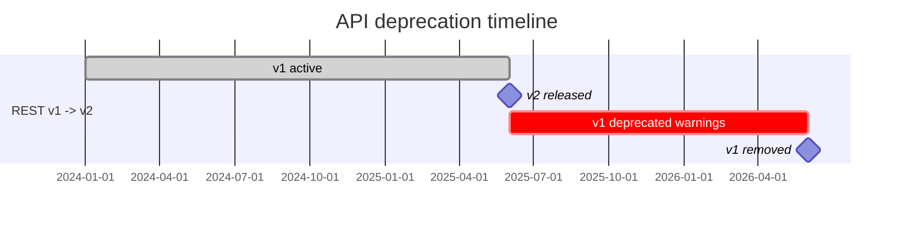

# SLA совместимости API

| Атрибут | Значение |
|---------|----------|
| **ID** | REQ-NFR.API.compatibility-sla |
| **Уровень** | NFR |
| **Атрибут качества** | Reliability |
| **Приоритет** | P1 |
| **Статус** | УТВЕРЖДЕНО |
| **Источник** | — |
| **Критерии приёмки** | — |

---

## SLO доступности

Основная политика доступности зафиксирована в `human/artifacts/requirements/REQ-NFR.INFRA.availability-slo.md`.

Для совместимости API и пользовательских API endpoint применяются уровни:
- MVP SaaS: 99.9%.
- Enterprise production: 99.95%.
- Premium Enterprise: 99.99% по отдельному согласованию и при отдельной HA-архитектуре.

## Сроки поддержки старых API

| API | Мажорная версия | Поддержка после выхода новой | Период устаревания | Требования |
|-----|-----------------|------------------------------|--------------------|-------------|
| REST | v1 | 12 месяцев | 12 месяцев, уведомления с 9-го месяца | Одновременная поддержка v1 и v2 |
| GraphQL | v1 -> v2 через deprecated | 9 месяцев | 9 месяцев | Директивы `@deprecated` |
| gRPC | Мажорная версия сервиса | Не применимо | Нет | Protobuf совместимость, отдельная версия proto |

## Хронология REST v1 -> v2

## Открытые вопросы

- Нет по M2.2.
