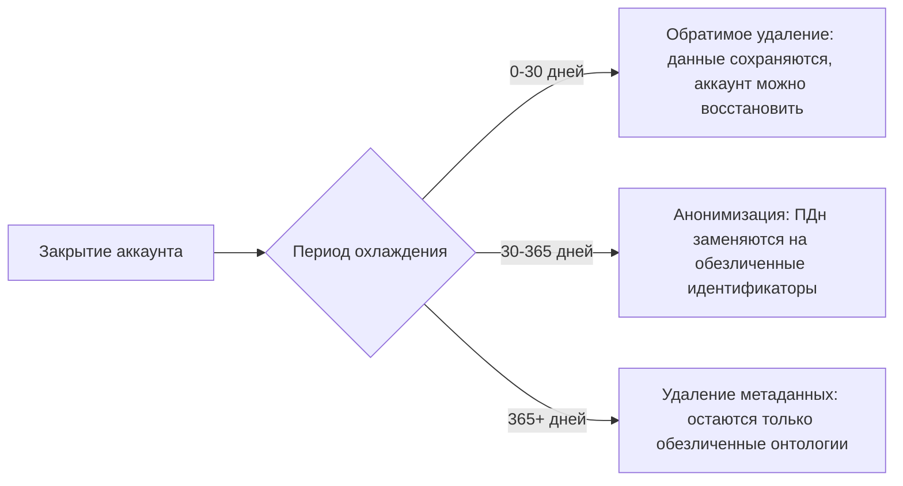
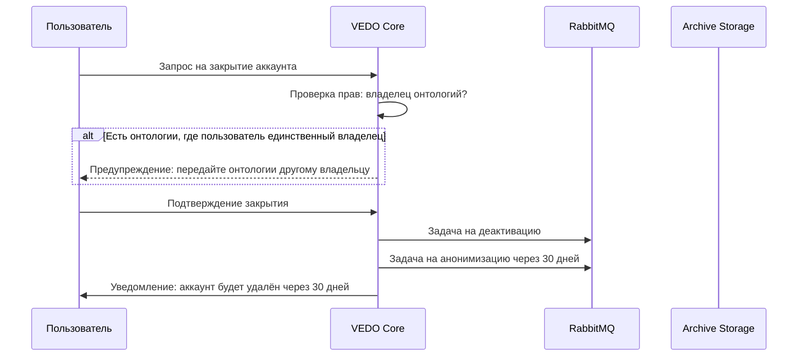

# Хранение данных после закрытия аккаунта

| Атрибут | Значение |
|---------|----------|
| **ID** | REQ-NFR.DATA.account-closure-retention |
| **Уровень** | NFR |
| **Атрибут качества** | Reliability |
| **Приоритет** | P0 |
| **Статус** | УТВЕРЖДЕНО |
| **Источник** | — |
| **Критерии приёмки** | — |

---

## Назначение

Фиксирует ответ на вопрос D1.2: сколько времени хранятся данные после закрытия аккаунта с учётом GDPR и 152-ФЗ.

VEDO Core должна соответствовать двум режимам: GDPR для европейских клиентов и 152-ФЗ для российских клиентов. Требования различаются, поэтому стратегия — раздельное хранение в зависимости от юрисдикции.

## Регуляторные требования

| Регуляция | Срок хранения ПДн | Срок хранения логов (аудит) | Обязательное удаление | Требование к уведомлению |
|-----------|-------------------|-----------------------------|----------------------|--------------------------|
| GDPR (ЕС) | Не дольше, чем необходимо для цели | 1 год рекомендовано | Да, Right to be forgotten | 30 дней |
| 152-ФЗ (РФ) | 3 года; для уволенных сотрудников может достигать 75 лет | 1 год для ПДн, 5 лет журналы | Частичное, через обезличивание | 10 дней |

Важно: для ПДн бывших сотрудников по 152-ФЗ срок хранения может достигать 75 лет, например для кадровых документов. Но сама онтология обычно не содержит кадровых данных в таком объёме.

## Жизненный цикл хранения после закрытия аккаунта



| Этап | Срок | Действие с данными | Соответствие |
|------|------|--------------------|--------------|
| Период охлаждения | 30 дней | Аккаунт деактивирован, но данные не удалены; можно восстановить | GDPR, 30 дней |
| Анонимизация | 31-365 дней | ПДн, включая имя и email, заменяются на обезличенные идентификаторы | 152-ФЗ, обезличивание |
| Полное удаление по GDPR | По требованию, до 30 дней | Все данные пользователя удаляются безвозвратно | GDPR Right to be forgotten |
| Архивация логов | 1-5 лет | Логи сохраняются в холодном хранилище без связей с пользователем | 152-ФЗ, расследования |

Главное отличие: по GDPR пользователь может потребовать полного удаления своих данных в течение 30 дней. По 152-ФЗ допускается обезличивание, а хранение может продолжаться десятилетиями для отдельных типов ПДн.

## Матрица обработки данных

| Тип данных | Период охлаждения 0-30 дней | После 30 дней GDPR | После 30 дней 152-ФЗ | Полное удаление по GDPR |
|------------|-----------------------------|--------------------|----------------------|--------------------------|
| Профиль пользователя: имя, email | Не удаляется | Удаляется | Анонимизируется | Удаляется |
| Контент: онтологии, созданные пользователем | Не удаляется | Передаётся владельцу онтологии | Передаётся владельцу онтологии | Не удаляется, если онтология shared |
| Комментарии, упоминания | Не удаляются | Удаляются | Анонимизируются | Удаляются |
| Логи действий: аудит | Не удаляются | Анонимизируются через 1 год | Хранятся 5 лет только при профиле `152-ФЗ / Regulatory Enterprise`; иначе default 3 года cold archive | Не удаляются, если закон требует хранения |
| Сессии и токены | Блокируются | Удаляются | Удаляются | Удаляются |

Для GDPR пользователь имеет право на удаление по Right to be forgotten, статья 17. Срок — 30 дней.

Для 152-ФЗ применяется обезличивание по статье 6, часть 3: удаляются персональные данные, но не сами онтологии.

## Ошибочное удаление tenant или ontology

Ошибочное удаление не того tenant или ontology обрабатывается через двухфазное удаление: soft-delete quarantine и последующий hard-delete только после периода охлаждения.

### Политика

| Объект | Soft-delete quarantine | Hard-delete | Путь восстановления |
|--------|------------------------|-------------|--------------|
| Tenant | 30 дней для SaaS | Автоматически после 30 дней daily cleanup job | Restore из quarantine за секунды; после hard-delete restore из backup в новый tenant |
| Ontology | 30 дней для SaaS | Автоматически после 30 дней, если tenant активен | Restore из quarantine за секунды; после hard-delete restore из backup в новую ontology |
| User/account | 30 дней | По политике GDPR/152-ФЗ | Restore account during cooling-off; после удаления персональных данных восстановление ограничено законом |

### Обязательные меры защиты (backend/infra)

- UI deletion требует ввода точного имени tenant или ontology для подтверждения.
- API deletion требует явного `force=true`; запросы без него отклоняются до soft-delete.
- Backend deletion выставляет `deleted_at = now()` и `permanent_delete_at = now() + 30 days`; обычные чтения и записи исключают объекты в quarantine.
- Hard-delete выполняется плановой очисткой только после окончания quarantine; для удаления tenant или ontology он никогда не выполняется мгновенно.
- Restore from quarantine очищает `deleted_at` и `permanent_delete_at` и снова разрешает обычные операции.
- Restore after hard-delete использует восстановление из backup в новый tenant или ontology id с суффиксом `-restored-YYYY-MM-DD` для проверки перед опциональным переименованием.
- Backup recovery для ошибочного удаления P0 имеет целевой RTO <= 4 часа; RPO следует backup policy: TBox 5 минут и ABox 15 минут.

### Обязательные UX-защиты (user-facing)

| Защита | Область применения | Механизм |
|---|---|---|
| **Mandatory preview** | Tenant delete, ontology delete, account closure | Система показывает список затронутых сущностей, онтологий, пользователей, shared data, необратимых последствий |
| **Typed confirmation** | Tenant delete, ontology delete, account closure | Пользователь вводит имя tenant/ontology/username, а не просто нажимает «Да, удалить» |
| **Dry-run (sandbox run)** | Decommission export, major version migration, массовое удаление | Система показывает полный план без изменений: estimated size, количество артефактов, retention, совместимость |
| **Irreversible-action delay** | Tenant delete, account closure | После подтверждения система вводит обязательную паузу: tenant — 24 часа (если не пустой), аккаунт — 30 дней |
| **Explicit owner transfer check** | Account closure, tenant delete | Система не разрешает удаление, пока все онтологии не переданы новому владельцу или явно заблокированы администратором |

**Пошаговые flows (в дополнение к backend-механизмам):**

Tenant delete:
1. Preview: список онтологий, пользователей, shared data, linked внешних систем
2. Owner transfer / блокировка всех онтологий — явное решение по каждой
3. Typed confirmation: `delete tenant <имя>`
4. 24-hour cooling-off delay (если tenant не пустой); tenant read-only, отмена администратором
5. Final purge + audit log

Ontology delete:
1. Preview: количество классов, свойств, индивидов, linked ontologies
2. Typed confirmation: `delete ontology <имя>`
3. Немедленное soft-delete или cooling-off по политике владельца
4. Restore возможно из Git-like истории и backup (если cooling-off не истёк)

Account closure:
1. Preview: список персональных данных, онтологий (единственный владелец), shared групп
2. Owner transfer check — блокирует закрытие без передачи
3. Typed confirmation: `close account <username>`
4. 30-day cooling-off; деактивация, восстановление администратором
5. Delayed data purge/anonymization по GDPR/152-ФЗ

**Неприемлемые практики (исключены):**
- Кнопка «Удалить» без preview последствий
- Подтверждение удаления чекбоксом вместо typed confirmation
- Мгновенное удаление tenant/account без cooling-off периода
- Удаление аккаунта-единственного владельца онтологий без проверки owner transfer
- Отсутствие sandbox-прогона для decommission export/migration перед реальным выполнением

Пример поведения API:

```json
DELETE /api/v1/tenants/123
Response: {"error":"DELETE_CONFIRMATION_REQUIRED","message":"Use force=true to confirm soft-delete"}

DELETE /api/v1/tenants/123?force=true
Response: {"status":"deleted","will_be_permanently_removed_at":"2026-06-11T10:00:00Z"}
```

Восстановление из quarantine:

```bash
vedo-cli tenant restore --id 123
```

Восстановление после hard-delete:

```bash
vedo-cli backup restore --snapshot 2026-05-12T09:55:00Z --tenant original-tenant-id --new-tenant-id restored-tenant
```

## Процесс закрытия аккаунта

### Шаг 1: Запрос на закрытие

Запрос может инициировать пользователь или администратор.



### Шаг 2: Период охлаждения

В течение 30 дней:

- Аккаунт помечен как `deleted_at = now + 30 days`.
- Пользователь не может войти.
- Онтологии, где пользователь был единственным владельцем, блокируются до передачи владения.

```sql
UPDATE users
SET status = 'deactivation_pending',
    deactivation_date = NOW() + INTERVAL '30 days',
    data_retention_policy = 'GDPR'
WHERE user_id = '123';
```

### Шаг 3: Анонимизация после 30 дней

Для 152-ФЗ персональные данные обезличиваются.

```sql
UPDATE users
SET name = 'Deleted User',
    email = CONCAT('user_', user_id, '@deleted.vedo'),
    password_hash = NULL,
    personal_data_removed = TRUE,
    anonimized_at = NOW()
WHERE user_id = '123';

UPDATE comments
SET author_id = NULL,
    author_name = 'Anonymous'
WHERE author_id = '123';
```

### Шаг 4: Полное удаление по GDPR

Для GDPR по требованию пользователя выполняется жёсткое удаление персональных данных, комментариев и сессий. Логи остаются, но связь с пользователем стирается.

```sql
DELETE FROM users WHERE user_id = '123';
DELETE FROM comments WHERE author_id = '123';
DELETE FROM sessions WHERE user_id = '123';
```

### Шаг 5: Архивация логов

Audit logs не удаляются сразу, но через год анонимизируются. Для логов не требуется привязка к конкретному пользователю.

## Таблица сроков хранения

| Тип данных | GDPR | 152-ФЗ | Действие |
|------------|------|--------|----------|
| Профиль пользователя (ПДн) | Удалить через 30 дней | Анонимизировать через 30 дней | Анонимизация: хранить обезличенные данные до востребования |
| Комментарии и упоминания | Удалить через 30 дней | Анонимизировать, автор = NULL | Удалить при требовании GDPR |
| Контент: онтологии, индивиды | Передать новому владельцу | Передать новому владельцу | Не удалять, если shared |
| Логи аудита | Анонимизировать через 1 год | Хранить 5 лет | Не удалять, если закон требует хранения |
| Данные восстановления: бэкапы | Удалить БД через 1 год | Хранить 3 года | По политике backup retention |

## Формулировка для заказчика

VEDO Core поддерживает два режима удаления данных после закрытия аккаунта.

GDPR для клиентов в ЕС:

- 30 дней на восстановление аккаунта, период охлаждения.
- По истечении 30 дней или по требованию пользователя, Right to be forgotten, выполняется полное удаление персональных данных, комментариев и сессий.
- Audit logs анонимизируются через 1 год.
- Онтологии, где пользователь был единственным владельцем, необходимо передать другому пользователю заранее.

152-ФЗ для клиентов в РФ:

- 30 дней — период охлаждения.
- По истечении 30 дней персональные данные анонимизируются: имя заменяется на `Deleted User`, email — на `user_{ID}@deleted.vedo`.
- Комментарии анонимизируются: автор = `Anonymous`.
- Audit logs хранятся 5 лет без связей с пользователем.
- Онтологии, где пользователь был единственным владельцем, блокируются до передачи владения.

Процесс полностью автоматизирован. За 7 дней до окончания периода охлаждения отправляются уведомления на email резервного администратора.

## Бизнес-правила

- Режим хранения выбирается по юрисдикции клиента: GDPR или 152-ФЗ.
- Account closure всегда начинается с 30-дневного cooling-off периода.
- Tenant и ontology deletion всегда начинается с 30-дневного soft-delete quarantine; hard-delete не выполняется мгновенно.
- API deletion tenant/ontology требует `force=true`, UI deletion требует ввода точного имени tenant или ontology.
- Restore из quarantine должен быть административной операцией, возвращающей объект в активное состояние за секунды.
- Restore после hard-delete выполняется только из backup в новый tenant/ontology в пределах RPO/RTO backup policy.
- Пользователь не может войти в систему во время cooling-off периода.
- Если пользователь является единственным владельцем онтологий, закрытие аккаунта требует передачи владения или блокирует такие онтологии до передачи.
- По GDPR персональные данные, комментарии и сессии удаляются через 30 дней или по Right to be forgotten request.
- По 152-ФЗ персональные данные и комментарии анонимизируются через 30 дней.
- Shared ontologies не удаляются при закрытии аккаунта пользователя; они передаются владельцу онтологии или новому владельцу.
- Audit logs не удаляются сразу; связь с пользователем стирается или анонимизируется.
- Audit logs по умолчанию имеют 3 года cold archive; для профиля `152-ФЗ / Regulatory Enterprise` хранятся 5 лет без связей с пользователем.
- За 7 дней до окончания cooling-off периода отправляется уведомление на email резервного администратора.

## UX/SLO-цели для account closure и decommission

### Account closure flow

| Метрика | Лимит | Комментарий |
|---|---|---|
| **Активная работа администратора** | ≤ 10 минут | От подтверждения до финального статуса «аккаунт закрыт» |
| **Ручные шаги (экраны/подтверждения)** | ≤ 5 | Не считая cooling-off оповещений (автоматические) |
| **Ожидание / фоновая работа** | Не входит в лимит | Cooling-off (30 дней) и delayed data purge — автоматические |
| **Recovery в cooling-off** | 1 команда администратора | Без повторного заполнения данных пользователя |

**Что входит в ≤ 10 минут:**
- Администратор инициирует закрытие аккаунта (подтверждение)
- Выбирает судьбу shared онтологий (transfer ownership / блокировка)
- Подтверждает финальное закрытие
- Система создаёт запись в audit log и запускает delayed jobs

### Full decommission export flow

| Метрика | Лимит | Комментарий |
|---|---|---|
| **Запуск** | 1 команда | `vedo-cli decommission --export` или эквивалент |
| **Preview до запуска** | Обязательно | Dry-run показывает: estimated size, число файлов, целевые форматы, retention policy |
| **Manifest** | Генерируется автоматически | Содержит checksums, форматы, дату экспорта, инструкции по импорту |
| **Активная работа администратора** | ≤ 5 минут (подтверждение параметров из preview) | Сама выгрузка — фоновая |
| **Фоновая работа** | Не входит в лимит | Может занимать часы для крупных онтологий, с уведомлением о завершении |

**Неприемлемые практики (исключены):**
- Ручное переключение между несколькими CLI/Web-инструментами для одного closure или decommission
- Отсутствие preview перед decommission export (запуск «вслепую»)
- Отсутствие manifest с checksums (нельзя доказать целостность)
- Процедуры, требующие чтения кода сервиса или ручного SQL-доступа в штатном flow
