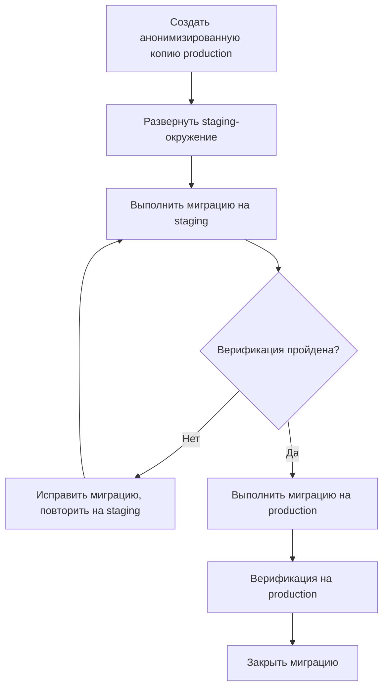

# Операционный регламент миграции мажорной версии

| Атрибут | Значение |
|---------|----------|
| **ID** | REQ-NFR.DATA.migration-runbook |
| **Уровень** | NFR |
| **Атрибут качества** | Supportability |
| **Приоритет** | P1 |
| **Статус** | УТВЕРЖДЕНО |
| **Источник** | — |
| **Критерии приёмки** | — |

---

## Подходы к миграции

Поддерживаются два подхода:

- Blue-green: рекомендуется для критичных систем.
- In-place: fallback, если нет места для второго окружения.

Blue-green предполагает наличие Production v1, параллельного Production v2 без трафика, миграцию данных и последующее переключение нового трафика на v2.

In-place включает:

- Остановку сервисов.
- Миграцию БД несколькими скриптами, транзакционно.
- Запуск v2.

## Production Runbook Для Миграции

Runbook миграции включает:

1. Остановку сервисов.
2. Дамп схемы БД.
3. Выполнение SQL-миграций PostgreSQL.
4. Выполнение Cypher-миграций Neo4j.
5. Обновление версии в метаданных.
6. Запуск сервисов v2.
7. Проверку health endpoint.

Целевой способ запуска production runbook — `vedo-cli migrate`. Нативные команды `kubectl`, `psql`, `cypher-shell` и shell loops являются внутренней реализацией или emergency fallback; штатный операторский интерфейс должен быть `vedo-cli migrate plan`, `vedo-cli migrate apply`, `vedo-cli migrate verify` и `vedo-cli migrate rollback`.

Пример упрощённого runbook:

```bash
set -e

LOG_FILE="/var/log/vedo/migration-$(date +%Y%m%d-%H%M%S).log"

kubectl scale deployment --replicas=0 -l app=vedo-core
pg_dump --schema-only vedo_version > /backup/schema_v1.sql

for script in /migrations/sql/*.sql; do
    psql -f "$script" vedo_version >> $LOG_FILE 2>&1
done

for script in /migrations/cypher/*.cyp; do
    cat "$script" | cypher-shell -u neo4j -p "$NEO4J_PASSWORD" >> $LOG_FILE 2>&1
done

psql -c "INSERT INTO system_version (version, migrated_at) VALUES ('2.0.0', now())"
kubectl set image deployment/vedo-core vedo-core=vedo/core:2.0.0
kubectl scale deployment --replicas=3 -l app=vedo-core
```

## Staging Environment Requirements для миграции (дополнение)

### Обязательность staging-окружения

**Решение:** Миграция в production **всегда** должна предварительно выполняться на staging-окружении.

**Исключения:**
- Hotfix миграции (критический баг, нет времени) — с approval от CTO.
- Патч-миграции (non-breaking, например, добавление индекса) — approval от Tech Lead.

### Требования к staging-окружению

| Параметр | Требование | Обоснование |
|----------|------------|-------------|
| **Структурное зеркало production** | Схема БД, версии ПО, конфигурация — идентичны production | Тест должен быть репрезентативным |
| **Анонимизированные данные** | Данные (онтологии) должны быть обезличены, но сохранять структуру и объём | Соответствие GDPR, 152-ФЗ |
| **Объём данных** | Не менее 10% от production (по числу триплетов), но не менее 100K | Выявление проблем производительности |
| **Refresh частота** | Не реже 1 раза в месяц | Данные не должны устаревать |
| **Автоматизация refresh** | `vedo-cli staging-refresh --anonymize` | Ручной refresh — риск ошибок |

### Процесс миграции с staging-зеркалом



### Инструмент для создания анонимизированного зеркала

```bash
# Создание анонимизированной копии production в staging
vedo-cli staging-refresh \
  --source https://production.vedo.cloud \
  --target https://staging.vedo.cloud \
  --anonymize \
  --anonymize-config .anonymize.yaml \
  --size-limit 100000  # 100K триплетов (минимум)
```

**Пример `.anonymize.yaml`:**
```yaml
anonymization:
  - field: "rdfs:label"
    action: "hash"           # заменить на хэш (сохранить уникальность)
  - field: "schema:email"
    action: "replace"        # user@example.com → user_{hash}@example.com
  - field: "schema:address"
    action: "delete"         # удалить полностью
  - field: "vedo:tenant_id"
    action: "keep"           # сохранить (для тестирования изоляции)
```

### Проверка staging перед миграцией

| Проверка | Порог | Действие |
|----------|-------|----------|
| Все тесты проходят (smoke + integration) | 100% | Обязательно |
| Производительность (p95 latency) | Не хуже production на 20% | Если хуже — расследование |
| Целостность данных (counts, checksum) | Идентично production (по анонимизированным данным) | Обязательно |

### Ответственность

| Роль | Ответственность |
|------|-----------------|
| **SRE** | Поддержание staging-окружения, автоматизация refresh |
| **QA Lead** | Верификация миграции на staging |
| **Tech Lead** | Утверждение миграции после успешного staging |
| **Security Lead** | Проверка анонимизации (чтобы реальные данные не попали в staging) |

## UX Requirements for Migration (дополнение)

### CLI прогресс для администратора

`vedo-cli migrate apply` должна отображать:

```bash
$ vedo-cli migrate apply --version v2.0.0

Миграция VEDO Core с v1.2.0 на v2.0.0

Подготовка:
  [✓] Pre-migration backup (45.2 GB)
  [✓] Проверка целостности данных

Применение изменений:
  [✓] Schema migration (Neo4j) — 12.3 сек
  [█░░░░░░░░░] Migration 2/10: PostgreSQL (осталось ~45 сек)
  [ ] Migration 3/10: Version Store
  ...
```

### Read-only баннер в GUI (для пользователей)

При выполнении миграции, требующей read-only режима:

1. API Gateway переключается в режим read-only (только GET запросы).
2. Web UI отображает баннер:

```
┌─────────────────────────────────────────────────────────────┐
│  ПЛАТНОЕ ОБСЛУЖИВАНИЕ                                       │
│                                                             │
│ VEDO Core обновляется до версии 2.0.                        │
│ Данные доступны только для чтения.                          │
│                                                             │
│ ⏱ Осталось около 15 минут.                                  │
│                                                             │
│ Подробнее на status.vedo.cloud/upgrade                      │
└─────────────────────────────────────────────────────────────┘
```

3. Кнопки редактирования (Создать, Редактировать, Удалить) — disabled с пояснением при наведении.
4. SPI (Status Page API) уведомляет о начале и окончании миграции.

### Прогресс миграции в Status API

`GET /api/v1/status/migration` возвращает:

```json
{
  "status": "in_progress",
  "current_version": "1.2.0",
  "target_version": "2.0.0",
  "current_step": 2,
  "total_steps": 10,
  "step_name": "postgres_schema",
  "estimated_remaining_seconds": 2700,
  "read_only_mode": true
}
```

### Graceful shutdown миграции

При прерывании миграции (Ctrl+C):
1. Система пытается завершить текущую миграцию до безопасной точки.
2. Откатывает применённые изменения (если возможно).
3. Выводит сообщение: `⚠ Миграция прервана. Система возвращена к версии v1.2.0.`
4. API Gateway возвращается в нормальный режим (read-write).

### Связанные артефакты

| Артефакт | Связь |
|----------|-------|
| `cli-design-guidelines.md` | Единые стандарты оформления CLI (цвета, спиннеры, прогресс-бары) |
| `major-version-migration.md` | Общий регламент миграции мажорной версии |
| `ADR-IMPL.STACK.vedo-cli-framework-strategy` | UX Requirements for CLI (дополнение) |

## Открытые вопросы

- Нет по M2.1.
