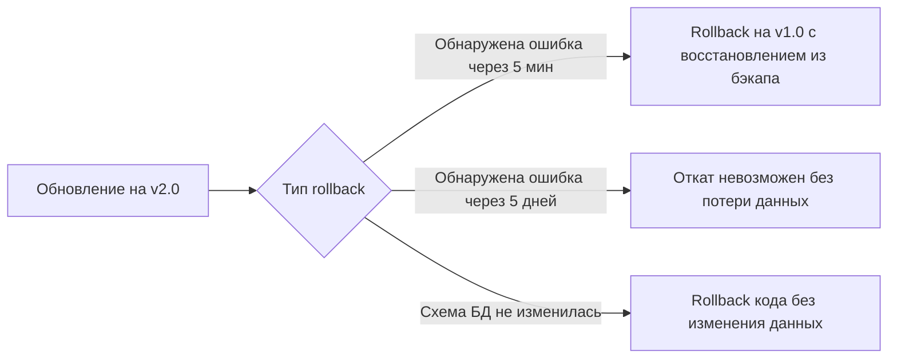

# Политика пользовательских данных при rollback версии

| Атрибут | Значение |
|---------|----------|
| **ID** | REQ-NFR.DATA.rollback-data-policy |
| **Уровень** | NFR |
| **Атрибут качества** | Reliability |
| **Приоритет** | P0 |
| **Статус** | УТВЕРЖДЕНО |
| **Источник** | — |
| **Критерии приёмки** | — |

---

## Ключевое правило

Rollback кода без rollback данных сохраняет пользовательские данные только если схема БД не изменилась.

Для VEDO Core major version почти всегда меняет схему Neo4j и PostgreSQL, поэтому rollback major version требует rollback данных через восстановление из pre-migration backup.

## Два сценария rollback

## Rollback до изменения схемы или в пределах 1 часа

- Окно: в течение 60 минут после обновления.
- Действие: восстановить БД из backup, созданного перед обновлением.
- Потеря данных: все изменения, сделанные за этот час.
- RTO: 30-60 минут.

## Rollback после интенсивного использования

Если после обновления прошло несколько дней и накопились новые классы, индивиды и коммиты, прямой rollback невозможен без потери данных.

Допустимые варианты:

- Исправить баг в v2.0 через hotfix.
- Оставить v2.0 и перенести данные вручную.
- Создать дамп данных из v2.0 и восстановить в v1.0 после адаптации скрипта.

## Условия отказа от rollback

Rollback не выполняется автоматически, если:

- Пользователи создали больше 1000 новых объектов.
- С момента обновления прошло больше 48 часов.
- Потери данных без согласования с заказчиком неприемлемы.

## Открытые вопросы

- Нет по M2.3.
