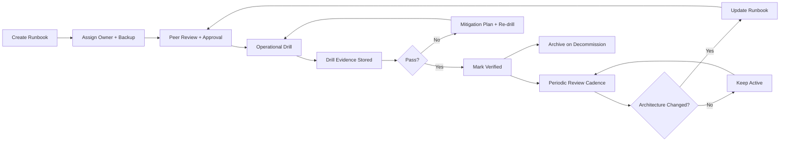

# Runbook Ownership, Review Cadence & Drill Evidence Specification v1.0

| Атрибут | Значение |
|---------|----------|
| **ID** | REQ-NFR.INFRA.runbook-ownership-drill-evidence |
| **Уровень** | NFR |
| **Атрибут качества** | Supportability |
| **Приоритет** | P1 |
| **Статус** | УТВЕРЖДЕНО |
| **Источник** | — |
| **Критерии приёмки** | — |

---

## Что описывает

Фиксирует обязательный стандарт владения эксплуатационными runbook, периодичности review, периодичности drill и формата drill evidence для VEDO Core.

Принципы:
- Без владельца процедура не существует.
- Без drill процедура не доказана.

## Связанные ADR

- `ADR-DES.INFRA.recovery-objectives-mandate`
- `ADR-DES.INFRA.backup-policy-strategy`
- `ADR-DES.INFRA.restore-drill-strategy`
- `ADR-DES.PROCESS.major-version-migration-strategy`
- `ADR-DES.SECURITY.break-glass-access-strategy`

## 1) Базовые принципы ownership, review и drills

- Каждый runbook обязан иметь `Runbook ID`, `Owner role`, `Backup role`, `Review cadence`, `Drill period`.
- Review подтверждает актуальность шагов, команд, зависимостей, порогов RTO/RPO и эскалации.
- Drill подтверждает исполнимость runbook в условиях, приближенных к production.
- Отсутствие owner или просроченный обязательный drill для P0/P1 сценария блокирует production-релиз.

## 2) Lifecycle runbook



## 3) Полный реестр runbook (A-G)

Поля:
- `Обязательные метрики evidence`: что обязательно приложить в drill evidence.

| Категория | Runbook ID | Название и краткое описание | Owner role | Review cadence | Drill period | Обязательные метрики evidence |
|---|---|---|---|---|---|---|
| A: DR | DR-001 | PostgreSQL restore (восстановление primary/данных) | DBA Lead | 3 мес | 1 мес | measured_rto_seconds, measured_rpo_seconds, lag_before_after, row_count_delta |
| A: DR | DR-002 | Neo4j restore (восстановление graph store) | DBA Lead | 3 мес | 1 мес | measured_rto_seconds, measured_rpo_seconds, node_edge_count_delta, checksum_status |
| A: DR | DR-003 | Cross-region failover | SRE Lead | 3 мес | 3 мес | failover_duration_seconds, replication_lag_seconds, traffic_shift_success |
| A: DR | DR-004 | Redis restore | SRE Lead | 3 мес | 3 мес | restore_duration_seconds, keyspace_count_delta, cache_warmup_time |
| A: DR | DR-005 | RabbitMQ recovery | Platform Lead | 3 мес | 6 мес | queue_recovery_seconds, unacked_messages_delta, dlq_delta |
| A: DR | DR-006 | Object Storage failover | SRE Lead | 3 мес | 6 мес | read_write_error_rate_before_after, endpoint_switch_time |
| A: DR | DR-007 | Tenant decommission | Security Lead | 6 мес | 12 мес | purge_completion_time, evidence_hash, audit_log_presence |
| A: DR | DR-008 | Total cluster recovery | SRE Lead + DBA Lead | 6 мес | 12 мес | full_recovery_rto_seconds, service_availability_after_restore, data_integrity_report |
| B: CF | CF-001 | Neo4j leader failover | DBA Lead | 3 мес | 3 мес | leader_election_time, write_pause_seconds |
| B: CF | CF-002 | PostgreSQL failover | DBA Lead | 3 мес | 3 мес | failover_time, replication_lag_recovery |
| B: CF | CF-003 | Redis Sentinel failover | SRE Lead | 3 мес | 3 мес | master_switch_time, cache_error_rate |
| B: CF | CF-004 | API Gateway recovery | Platform Lead | 3 мес | 3 мес | p95_p99_before_after, error_rate_before_after |
| B: CF | CF-005 | RabbitMQ node failure | Platform Lead | 3 мес | 6 мес | queue_drain_time, consumer_reconnect_time |
| B: CF | CF-006 | Keycloak failover | Security Lead | 3 мес | 6 мес | auth_success_rate, token_issue_latency |
| B: CF | CF-007 | Ontology Service crash recovery | Platform Lead | 1 мес | 1 мес | restart_time, request_error_spike_duration |
| B: CF | CF-008 | Object Storage endpoint down | SRE Lead | 3 мес | 6 мес | endpoint_recovery_time, io_error_rate |
| C: REC | REC-001 | Class recovery from history | Versioning Lead | 1 мес | 3 мес | recovered_entities_count, history_consistency_check |
| C: REC | REC-002 | Major version rollback | SRE Lead + DBA Lead | 3 мес | 6 мес | rollback_rto_seconds, data_loss_window_seconds |
| C: REC | REC-003 | Corrupted TBox restore | DBA Lead | 3 мес | 3 мес | checksum_recovery_status, restore_time |
| C: REC | REC-004 | Mass import rollback | Versioning Lead | 1 мес | 3 мес | rollback_duration, import_delta_reverted |
| C: REC | REC-005 | Tenant restore after deletion | Platform Lead | 3 мес | 6 мес | tenant_restore_time, access_restore_validation |
| D: EM | EM-001 | L1 kill switch (read-only) | SRE Lead | 1 мес | 3 мес | readonly_activation_seconds, write_reject_rate |
| D: EM | EM-002 | Break-glass access | Security Lead | 3 мес | 6 мес | access_grant_time, audit_event_count |
| D: EM | EM-003 | Mass token revocation | Security Lead | 6 мес | 12 мес | revocation_completion_seconds, residual_valid_tokens |
| D: EM | EM-004 | Tenant data compromise response | Security Lead + SRE Lead | 3 мес | 12 мес | containment_time, forensic_evidence_integrity |
| E: BK | BK-001 | Backup verify | DBA Lead | 1 мес | 1 нед | backup_validity_status, checksum_status, age_hours |
| E: BK | BK-002 | Restore in isolated environment | DBA Lead | 3 мес | 1 мес | restore_time, integrity_check_status |
| E: BK | BK-003 | LFS backup/restore | SRE Lead | 3 мес | 6 мес | object_count_delta, restore_duration |
| E: BK | BK-004 | Immutable backup (WORM) verification | Security Lead | 6 мес | 12 мес | object_lock_status, retention_policy_validation |
| E: BK | BK-005 | Cross-region backup | SRE Lead | 3 мес | 6 мес | replication_lag, backup_availability_secondary_region |
| F: MON | MON-001 | Prometheus recovery | SRE Lead | 3 мес | 6 мес | scrape_target_recovery_time, alert_pipeline_recovery |
| F: MON | MON-002 | Loki recovery | SRE Lead | 3 мес | 6 мес | ingestion_recovery_time, query_success_rate |
| F: MON | MON-003 | Tempo recovery | SRE Lead | 6 мес | 12 мес | trace_ingest_recovery, trace_query_latency |
| F: MON | MON-004 | Alert calibration | SRE Lead | 1 мес | continuous | false_positive_rate, alert_volume_weekly, mttr_trend |
| G: SEC | SEC-001 | JWT key rotation | Security Lead | 3 мес | 12 мес | rotation_duration, token_validation_success |
| G: SEC | SEC-002 | BOLA/BFLA attack response | Security Lead | 3 мес | 6 мес | containment_time, blocked_requests_count |
| G: SEC | SEC-003 | Secret leak response | Security Lead | 6 мес | 12 мес | secret_revocation_time, blast_radius_validation |
| G: SEC | SEC-004 | DDoS attack response | SRE Lead + Security Lead | 3 мес | 6 мес | mitigation_activation_time, availability_during_attack |

## 4) Ownership matrix

| Owner роль | Ответственные runbook | Бэкап роль |
|---|---|---|
| SRE Lead | DR-003, DR-004, DR-006, DR-008, CF-003, CF-008, EM-001, BK-003, BK-005, MON-001, MON-002, MON-003, MON-004, SEC-004 | Senior SRE |
| DBA Lead | DR-001, DR-002, DR-008, CF-001, CF-002, REC-003, BK-001, BK-002, REC-002 | Senior DBA |
| Platform Lead | DR-005, CF-004, CF-005, CF-007, REC-005 | Senior Platform Engineer |
| Security Lead | DR-007, CF-006, EM-002, EM-003, EM-004, BK-004, SEC-001, SEC-002, SEC-003, SEC-004 | Senior Security Engineer |
| Versioning Lead | REC-001, REC-004 | Versioning Engineer |

Правило:
- Owner отвечает за актуальность, drill-готовность и evidences.
- Backup role обязан уметь выполнить runbook в случае недоступности owner.

## 5) Review Cadence Matrix

| Категория | Тип сценария | Базовый review cadence | Эскалация при просрочке |
|---|---|---|---|
| A: DR | disaster recovery | 3 мес (часть 6 мес) | P2 warning, mandatory correction plan |
| B: CF | component failover | 1-3 мес | P2 warning |
| C: REC | selective recovery/rollback | 1-3 мес | P2 warning |
| D: EM | emergency/security critical ops | 1-6 мес | P1 если влияет на P0 path |
| E: BK | backup integrity/restore | 1-6 мес | P1 при drill impact |
| F: MON | observability recovery/calibration | 1-6 мес | P2 warning |
| G: SEC | security incident response | 3-6 мес | P1 если response path stale |

## 6) Drill Period Matrix

| Критичность сценария | Период drill | Примеры |
|---|---|---|
| Очень высокая (частые/критичные инциденты) | 1 неделя - 1 месяц | BK-001, DR-001, DR-002, CF-007 |
| Высокая | 3 месяца | DR-003, CF-001, CF-002, REC-003, EM-001 |
| Средняя | 6 месяцев | DR-005, DR-006, CF-005, CF-006, BK-003 |
| Низкая частота, высокий impact | 12 месяцев | DR-007, DR-008, EM-003, BK-004, MON-003 |
| Непрерывная настройка | continuous | MON-004 |

## 7) Формат drill evidence и требования хранения

### 7.1 Обязательный формат evidence (YAML)

```yaml
drill_evidence:
  runbook_id: "DR-001"
  timestamp: "2026-05-17T10:00:00Z"
  owner: "DBA Lead"
  duration_seconds: 420
  success: true
  measured_rpo_seconds: 300
  logs_reference: "s3://dr-logs/timestamp/console.log"
  recording_reference: "https://vault.vedo.com/recordings/timestamp"
  metrics_before_after:
    - metric: "pg_replication_lag_seconds"
      before: "12"
      after: "0"
  issues_encountered: []
  signature: "Owner Name"
```

### 7.2 JSON-совместимая структура (норматив)

```json
{
  "runbook_id": "DR-001",
  "timestamp": "2026-05-17T10:00:00Z",
  "owner": "DBA Lead",
  "duration_seconds": 420,
  "success": true,
  "measured_rpo_seconds": 300,
  "logs_reference": "...",
  "recording_reference": "...",
  "metrics_before_after": [
    {"metric": "...", "before": "...", "after": "..."}
  ],
  "issues_encountered": [],
  "signature": "Owner Name"
}
```

### 7.3 Где хранить evidence

- Git-индекс (метаданные): `human/evidence/runbook-drills/<runbook_id>/<yyyy-mm-dd>.yaml`
- Объёмные вложения (логи, записи экрана, dump): WORM-совместимое хранилище `s3://vedo-drill-evidence/`
- Референсы на вложения обязательны в YAML/JSON evidence.

### 7.4 Retention и access control

- Минимальный retention evidence: `3 года`.
- Для security/drill по инцидентам с compliance-риском: `7 лет`.
- Доступ по принципу наименьших привилегий:
  - Read: SRE Lead, Security Lead, DBA Lead, аудиторы.
  - Write: только owner/backup role и автоматизированный pipeline.
  - Delete: запрещено; только через formal retention policy.

## 8) Что считается нарушением

| Нарушение | Severity | Последствие |
|---|---|---|
| Runbook не имеет named owner | P1 | Блокировка production-релиза |
| Review просрочен > 30 дней (для 1-мес cadence) | P2 | Warning + план исправления |
| Drill просрочен > периода | P1 | Блокировка релиза до проведения drill |
| Drill провален без mitigation | P0 | Немедленная блокировка релиза |
| Evidence отсутствует или неполный | P2 | Повторный drill обязателен |

## 9) Процесс review: кто, как, approval gates

- Инициатор: owner role.
- Обязательные ревьюеры:
  - 1 peer из смежной роли (SRE/DBA/Platform/Security).
  - Для P0-path runbook — обязательное одобрение SRE Lead.
  - Для security runbook — обязательное одобрение Security Lead.
- Review-checklist:
  - команды актуальны,
  - зависимости и версии актуальны,
  - эскалация и контакты валидны,
  - RTO/RPO target указан,
  - есть валидная drill evidence ссылка.

Approval gates:
- Gate-RB-01: owner+backup назначены.
- Gate-RB-02: last_review_at в допустимом окне.
- Gate-RB-03: last_drill_at в допустимом окне.
- Gate-RB-04: evidence schema valid.

## 10) Как создать новый runbook (checklist автора)

1. Назначить `Runbook ID` (`<CATEGORY>-<NNN>`), owner и backup role.
2. Определить критичность и привязать review cadence + drill period.
3. Описать шаги диагностики, восстановления, верификации, эскалации.
4. Указать целевые RTO/RPO (или N/A, если неприменимо).
5. Добавить требуемые evidence metrics.
6. Подготовить тестовый drill-сценарий.
7. Пройти peer review и approval gates.
8. Выполнить initial drill и приложить evidence.

## 11) Шаблон runbook (обязательные секции)

```md
# <Runbook ID> <Название>

## Цель и scope
- Что покрывает runbook
- Какие системы/контуры затрагиваются

## Диагностика
- Сигналы алертов и пороги
- Команды проверки

## Восстановление (пошагово)
1. ...
2. ...

## Верификация успеха
- Проверки after-state
- Критерии PASS

## Эскалация
- Когда эскалировать
- Кому и по какому каналу

## RTO/RPO цели
- RTO: ...
- RPO: ...

## Ownership и review
- Owner: ...
- Backup role: ...
- Review cadence: ...
- Drill period: ...
- Last review: ...
- Last drill: ...
```

## 12) Exceptions

Runbook может не требовать drill только если одновременно:
- процедура read-only,
- не меняет состояние production,
- не участвует в пути восстановления P0/P1.

Примеры допустимых исключений:
- справочные диагностические процедуры без изменения состояния,
- информационные runbook для P3-событий.

Даже при исключении:
- owner и review cadence обязательны,
- evidence о применимости исключения фиксируется в runbook metadata.

## 13) Audit requirements

Для compliance-аудита обязательно хранить:
- runbook-версию (commit hash),
- owner/backup role на момент drill,
- timestamp drill,
- success/failure,
- measured RTO/RPO,
- ссылки на логи и запись выполнения,
- issues_encountered + mitigation actions,
- подпись ответственного.

Минимальный audit pack по каждому P0/P1 runbook за период:
- не менее 1 валидного evidence в рамках drill period,
- журнал review-изменений,
- подтверждение прохождения approval gates.

## 14) Compliance и ответственность

| Роль | Обязанности по compliance |
|---|---|
| SRE Lead | Контроль gate-нарушений, релиз-блокировки, аудит P0/P1 runbook |
| Security Lead | Контроль security runbook, evidence retention 7 лет для security-инцидентов |
| DBA Lead | Контроль DR/backup runbook для БД, проверка RTO/RPO фактических значений |
| Platform Lead | Актуальность recovery runbook сервисной платформы |
| Product/Program Manager | Контроль закрытия corrective actions по результатам audit |

Release rule:
- Production-релиз допускается только при нулевых открытых P0/P1 нарушениях runbook governance.
