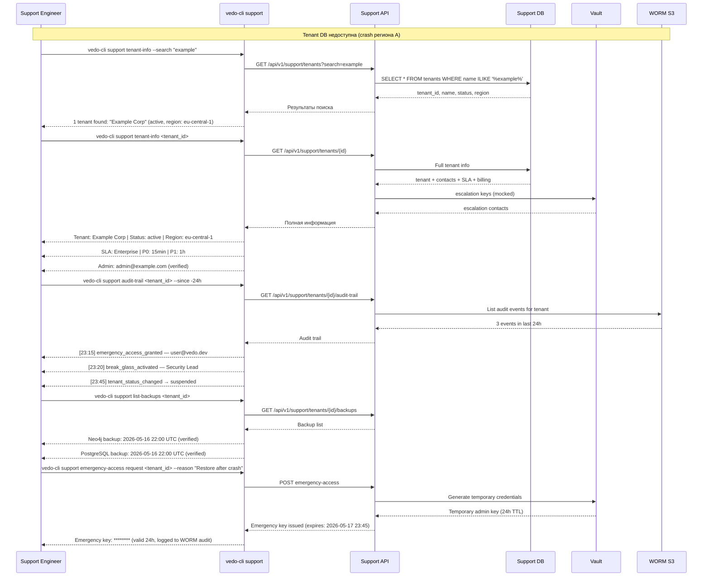

# Support Metadata Isolation Specification — Technical Requirements v1.0

| Атрибут | Значение |
|---------|----------|
| **ID** | REQ-NFR.INFRA.support-metadata-isolation |
| **Уровень** | NFR |
| **Атрибут качества** | Reliability |
| **Приоритет** | P1 |
| **Статус** | УТВЕРЖДЕНО |
| **Источник** | — |
| **Критерии приёмки** | — |

---

## Обзор

Документ определяет требования к изолированному хранению support metadata — данных о tenant'ах, контактах, SLA, audit trail и emergency-доступе, которые не зависят от tenant DB (Neo4j, PostgreSQL Version Store). Изоляция гарантирует, что команда поддержки сохраняет возможность идентифицировать tenant, получить audit trail и выполнить break-glass процедуру при повреждении, удалении или недоступности основных tenant-хранилищ.

Support metadata размещается в четырёх типах хранилищ:
1. **Support DB** — отдельный кластер PostgreSQL (не Version Store)
2. **WORM Storage** — S3/MinIO с Object Lock для неизменяемого audit trail
3. **Vault / KMS** — HashiCorp Vault или cloud-аналог для emergency-ключей
4. **ITSM** — опционально Jira / Zendesk, fallback на Support DB

---

## 1. Перечень Support Metadata

### 1.1 Tenant Identity

| Поле | Тип | Хранилище | Retention | RTO (цель/предел) | Ответственный |
|------|-----|-----------|-----------|-------------------|---------------|
| `tenant_id` | UUID v7 | Support DB | Бессрочно + 1 год после удаления | 5 / 10 мин | SRE |
| `tenant_name` | VARCHAR(255) | Support DB | Бессрочно + 1 год | 5 / 10 мин | SRE |
| `tenant_status` | ENUM(active, suspended, deleting, deleted, purged) | Support DB | Бессрочно + 1 год | 5 / 10 мин | SRE |
| `region` | VARCHAR(63) | Support DB | Бессрочно + 1 год | 5 / 10 мин | SRE |
| `deployment_model` | ENUM(saas, on-premise, air-gapped) | Support DB | Бессрочно + 1 год | 5 / 10 мин | SRE |
| `created_at` | TIMESTAMP WITH TZ | Support DB | Бессрочно + 1 год | 5 / 10 мин | SRE |
| `purged_at` | TIMESTAMP WITH TZ | Support DB | Бессрочно + 1 год | 5 / 10 мин | SRE |
| `data_residency` | VARCHAR(7) | Support DB | Бессрочно + 1 год | 5 / 10 мин | SRE |

### 1.2 Contact Information

| Поле | Тип | Хранилище | Retention | RTO (цель/предел) | Ответственный |
|------|-----|-----------|-----------|-------------------|---------------|
| `contact_id` | UUID v7 | Support DB | Бессрочно + 3 года после удаления | 5 / 10 мин | Support Team |
| `tenant_id` | FK → tenants | Support DB | Бессрочно + 3 года | 5 / 10 мин | Support Team |
| `role` | ENUM(admin, billing, technical, emergency) | Support DB | Бессрочно + 3 года | 5 / 10 мин | Support Team |
| `email` | VARCHAR(320) [шифрование at rest] | Support DB | Бессрочно + 3 года | 5 / 10 мин | Support Team |
| `phone` | VARCHAR(30) [шифрование at rest] | Support DB | Бессрочно + 3 года | 5 / 10 мин | Support Team |
| `backup_email` | VARCHAR(320) [шифрование at rest] | Support DB | Бессрочно + 3 года | 5 / 10 мин | Support Team |
| `name` | VARCHAR(255) | Support DB | Бессрочно + 3 года | 5 / 10 мин | Support Team |
| `is_verified` | BOOLEAN | Support DB | Бессрочно + 3 года | 5 / 10 мин | Support Team |

### 1.3 SLA Information

| Поле | Тип | Хранилище | Retention | RTO (цель/предел) | Ответственный |
|------|-----|-----------|-----------|-------------------|---------------|
| `sla_id` | UUID v7 | Support DB | Бессрочно + 3 года | 5 / 10 мин | Product Owner |
| `tenant_id` | FK → tenants | Support DB | Бессрочно + 3 года | 5 / 10 мин | Product Owner |
| `sla_tier` | ENUM(community, standard, enterprise, custom) | Support DB | Бессрочно + 3 года | 5 / 10 мин | Product Owner |
| `start_date` | DATE | Support DB | Бессрочно + 3 года | 5 / 10 мин | Product Owner |
| `end_date` | DATE | Support DB | Бессрочно + 3 года | 5 / 10 мин | Product Owner |
| `response_time_p0` | INTERVAL | Support DB | Бессрочно + 3 года | 5 / 10 мин | Product Owner |
| `response_time_p1` | INTERVAL | Support DB | Бессрочно + 3 года | 5 / 10 мин | Product Owner |
| `availability_slo` | NUMERIC(5,2) | Support DB | Бессрочно + 3 года | 5 / 10 мин | Product Owner |
| `custom_terms_ref` | TEXT (S3 key) | Support DB + WORM | Бессрочно + 3 года | 15 / 30 мин | Product Owner |

### 1.4 Audit Trail

| Поле | Тип | Хранилище | Retention | RTO (цель/предел) | Ответственный |
|------|-----|-----------|-----------|-------------------|---------------|
| `event_id` | UUID v7 | WORM S3 | 7 лет | 15 / 30 мин | SRE |
| `tenant_id` | UUID | WORM S3 | 7 лет | 15 / 30 мин | SRE |
| `event_type` | ENUM(tenant_created, tenant_deleted, tenant_purged, sla_changed, contact_updated, emergency_access_granted, break_glass_activated, config_override_changed) | WORM S3 | 7 лет | 15 / 30 мин | SRE |
| `actor_id` | UUID | WORM S3 | 7 лет | 15 / 30 мин | SRE |
| `actor_role` | VARCHAR(63) | WORM S3 | 7 лет | 15 / 30 мин | SRE |
| `timestamp` | TIMESTAMP WITH TZ | WORM S3 | 7 лет | 15 / 30 мин | SRE |
| `payload` | JSONB | WORM S3 | 7 лет | 15 / 30 мин | SRE |
| `checksum` | VARCHAR(64) SHA-256 | WORM S3 | 7 лет | 15 / 30 мин | SRE |

### 1.5 Billing Metadata

| Поле | Тип | Хранилище | Retention | RTO (цель/предел) | Ответственный |
|------|-----|-----------|-----------|-------------------|---------------|
| `billing_id` | UUID v7 | Support DB | 5 лет | 15 / 30 мин | Product Owner |
| `tenant_id` | FK → tenants | Support DB | 5 лет | 15 / 30 мин | Product Owner |
| `plan` | VARCHAR(63) | Support DB | 5 лет | 15 / 30 мин | Product Owner |
| `billing_cycle` | ENUM(monthly, annual, custom) | Support DB | 5 лет | 15 / 30 мин | Product Owner |
| `currency` | CHAR(3) | Support DB | 5 лет | 15 / 30 мин | Product Owner |
| `external_billing_ref` | VARCHAR(255) | Support DB | 5 лет | 15 / 30 мин | Product Owner |

### 1.6 Incident History

| Поле | Тип | Хранилище | Retention | RTO (цель/предел) | Ответственный |
|------|-----|-----------|-----------|-------------------|---------------|
| `incident_id` | UUID v7 | Support DB | 3 года | 15 / 30 мин | Support Team |
| `tenant_id` | FK → tenants | Support DB | 3 года | 15 / 30 мин | Support Team |
| `severity` | ENUM(P0, P1, P2, P3) | Support DB | 3 года | 15 / 30 мин | Support Team |
| `status` | ENUM(open, investigating, resolved, closed) | Support DB | 3 года | 15 / 30 мин | Support Team |
| `summary` | TEXT | Support DB | 3 года | 15 / 30 мин | Support Team |
| `external_ticket_ref` | VARCHAR(255) | Support DB | 3 года | 15 / 30 мин | Support Team |
| `resolved_at` | TIMESTAMP WITH TZ | Support DB | 3 года | 15 / 30 мин | Support Team |

### 1.7 Escalation Contacts

| Поле | Тип | Хранилище | Retention | RTO (цель/предел) | Ответственный |
|------|-----|-----------|-----------|-------------------|---------------|
| `escalation_id` | UUID v7 | Support DB | Пока активен контракт | 5 / 10 мин | Support Team |
| `level` | ENUM(L1, L2, L3, L4, L5) | Support DB | Пока активен контракт | 5 / 10 мин | Support Team |
| `role_name` | VARCHAR(127) | Support DB | Пока активен контракт | 5 / 10 мин | Support Team |
| `email` | VARCHAR(320) | Support DB | Пока активен контракт | 5 / 10 мин | Support Team |
| `phone` | VARCHAR(30) | Support DB | Пока активен контракт | 5 / 10 мин | Support Team |
| `pagerduty_integration_key` | VARCHAR(255) | Vault | Пока активен контракт | 10 / 20 мин | Support Team |

### 1.8 Emergency Access Keys (Break-Glass)

| Поле | Тип | Хранилище | Retention | RTO (цель/предел) | Ответственный |
|------|-----|-----------|-----------|-------------------|---------------|
| `key_id` | UUID v7 | Vault / KMS | Бессрочно (пока tenant существует) | 10 / 20 мин | Security Lead |
| `tenant_id` | UUID (metadata) | Vault / KMS | Бессрочно | 10 / 20 мин | Security Lead |
| `key_type` | ENUM(neo4j_admin, pg_admin, root_shell, api_gateway_admin) | Vault / KMS | Бессрочно | 10 / 20 мин | Security Lead |
| `encrypted_value` | BYTEA | Vault / KMS | Бессрочно | 10 / 20 мин | Security Lead |
| `access_audit` | JSONB (кто, когда, зачем) | Vault + WORM | 7 лет | 15 / 30 мин | Security Lead |
| `rotation_schedule` | INTERVAL (default 90 дней) | Vault / KMS | Бессрочно | 10 / 20 мин | Security Lead |

### 1.9 Deployment Config Overrides

| Поле | Тип | Хранилище | Retention | RTO (цель/предел) | Ответственный |
|------|-----|-----------|-----------|-------------------|---------------|
| `override_id` | UUID v7 | Support DB | Пока активен контракт | 15 / 30 мин | SRE |
| `tenant_id` | FK → tenants | Support DB | Пока активен контракт | 15 / 30 мин | SRE |
| `chart` | VARCHAR(127) | Support DB | Пока активен контракт | 15 / 30 мин | SRE |
| `values_yaml` | TEXT | Support DB | Пока активен контракт | 15 / 30 мин | SRE |
| `git_commit_ref` | VARCHAR(63) | Support DB | Пока активен контракт | 15 / 30 мин | SRE |

### 1.10 Compliance Evidence

| Поле | Тип | Хранилище | Retention | RTO (цель/предел) | Ответственный |
|------|-----|-----------|-----------|-------------------|---------------|
| `evidence_id` | UUID v7 | WORM S3 + Support DB (index) | 5 лет после закрытия tenant | 30 / 60 мин | Product Owner |
| `tenant_id` | UUID | Support DB (index) | 5 лет | 30 / 60 мин | Product Owner |
| `type` | ENUM(dpa, consent, export_request, audit_report, compliance_cert) | Support DB (index) | 5 лет | 30 / 60 мин | Product Owner |
| `s3_key` | VARCHAR(1024) | Support DB (index) | 5 лет | 30 / 60 мин | Product Owner |
| `uploaded_at` | TIMESTAMP WITH TZ | Support DB (index) | 5 лет | 30 / 60 мин | Product Owner |
| `expires_at` | DATE | Support DB (index) | 5 лет | 30 / 60 мин | Product Owner |
| `document_body` | BYTEA (encrypted) | WORM S3 (Object Lock) | 5 лет | 30 / 60 мин | Product Owner |

---

## 2. Архитектура

### 2.1 Схема компонентов

```
                        ┌─────────────────────────────────────┐
                        │        Support Tooling Layer         │
                        │  ┌───────────┐  ┌────────────────┐  │
                        │  │ vedo-cli  │  │ Support Portal │  │
                        │  │ support   │  │ (Grafana /     │  │
                        │  │ commands  │  │  custom UI)    │  │
                        │  └─────┬─────┘  └───────┬────────┘  │
                        └────────┼─────────────────┼───────────┘
                                 │                 │
               ┌─────────────────┼─────────────────┼───────────────┐
               │                 │                 │               │
         ┌─────▼──────┐  ┌──────▼───────┐  ┌──────▼──────┐  ┌─────▼──────┐
         │ Support API │  │  WORM S3     │  │   Vault /   │  │   ITSM     │
         │  (Internal) │  │  / MinIO     │  │   KMS       │  │ (optional) │
         │  gRPC/REST  │  │  Object Lock │  │             │  │ Jira/ZD    │
         └──────┬──────┘  └──────────────┘  └─────────────┘  └────────────┘
                │
         ┌──────▼──────┐
         │  Support DB  │
         │  PostgreSQL  │
         │  (Multi-AZ)  │
         │  отдельный   │
         │  кластер     │
         └──────────────┘
                │
         ┌──────▼──────┐
         │  WORM S3     │
         │  (audit      │
         │   trail,     │
         │   compliance)│
         └──────────────┘
```

### 2.2 Компоненты

| Компонент | Технология | Репликация | Шифрование | Access Control |
|-----------|-----------|------------|------------|----------------|
| **Support DB** | PostgreSQL 16, отдельный кластер от Version Store | Multi-AZ, синхронная репликация (2+ узла) | At rest (AES-256), in transit (TLS 1.3) | IAM roles + mTLS, отдельные от tenant DB credentials |
| **WORM Storage** | S3 / MinIO с Object Lock (COMPLIANCE mode) | Cross-region replication (S3 CRR / MinIO bucket replication) | At rest (SSE-S3 или SSE-KMS), in transit (TLS 1.3) | Отдельные IAM policy, запрет delete/overwrite при Object Lock |
| **Vault / KMS** | HashiCorp Vault (Enterprise) или AWS KMS / Yandex KMS | Active cluster (Vault HA, 3+ узла) | At rest (seal key + unseal), auto-unseal через KMS | AppRole + OIDC federation, audit log всех операций |
| **ITSM (опционально)** | Jira Service Management / Zendesk | Поставщик managed service | TLS in transit | API token для vedo-cli, fallback на Support DB |

### 2.3 Требования к отказоустойчивости

| Компонент | RTO | RPO | Режим отказа |
|-----------|-----|-----|-------------|
| Support DB | 5 мин | ≤ 1 мин | Multi-AZ auto-failover (Patroni / RDS Multi-AZ) |
| Support DB (катастрофа региона) | 30 мин | ≤ 5 мин | Cross-region replica (асинхронная) |
| WORM Storage | 15 мин | 0 | S3 CRR или MinIO bucket replication |
| Vault | 10 мин | ≤ 1 мин | Vault HA с auto-unseal |
| ITSM | 30 мин | ≤ 15 мин | Fallback на Support DB (локальное хранение ticket summary) |

### 2.4 Требования к безопасности

| Область | Требование |
|---------|------------|
| **Шифрование at rest** | Support DB: AES-256 (TDE или pgcrypto). WORM: SSE-S3 или SSE-KMS. Vault: seal key в отдельном KMS |
| **Шифрование in transit** | TLS 1.3 для всех соединений. mTLS для Support Tooling → Support API |
| **Изоляция credentials** | Support DB credentials отделены от tenant DB. Хранятся только в Vault, ротация каждые 90 дней |
| **Audit** | Все операции чтения/записи support metadata логируются в WORM S3. Vault audit log в отдельный bucket |
| **Access Control** | Role-based (SRE, Support Engineer, Security Lead). Минимальные привилегии. Approval для emergency access |
| **Network isolation** | Support API доступен только из support VPN / management network. Не публичный. mTLS mutual authentication |

---

## 3. ERD Support DB Schema

```mermaid
erDiagram
    tenants ||--o{ contacts : "имеет"
    tenants ||--o{ sla_tiers : "имеет"
    tenants ||--o{ billing_metadata : "имеет"
    tenants ||--o{ incidents : "связан"
    tenants ||--o{ deployment_overrides : "настроен"
    tenants ||--o{ compliance_evidence_index : "содержит"

    tenants {
        uuid tenant_id PK "UUID v7"
        varchar tenant_name "UK, 255"
        enum tenant_status "active|suspended|deleting|deleted|purged"
        varchar region "63"
        enum deployment_model "saas|on-premise|air-gapped"
        timestamptz created_at
        timestamptz purged_at
        varchar data_residency "7"
    }

    contacts {
        uuid contact_id PK "UUID v7"
        uuid tenant_id FK
        enum role "admin|billing|technical|emergency"
        varchar email "320, encrypted at rest"
        varchar phone "30, encrypted at rest"
        varchar backup_email "320, encrypted at rest"
        varchar name "255"
        boolean is_verified
        timestamptz created_at
        timestamptz deleted_at
    }

    sla_tiers {
        uuid sla_id PK "UUID v7"
        uuid tenant_id FK
        enum sla_tier "community|standard|enterprise|custom"
        date start_date
        date end_date
        interval response_time_p0
        interval response_time_p1
        numeric availability_slo "5,2"
        text custom_terms_ref "S3 key"
    }

    billing_metadata {
        uuid billing_id PK "UUID v7"
        uuid tenant_id FK
        varchar plan "63"
        enum billing_cycle "monthly|annual|custom"
        char currency "3"
        varchar external_billing_ref "255"
        date valid_until
    }

    incidents {
        uuid incident_id PK "UUID v7"
        uuid tenant_id FK
        enum severity "P0|P1|P2|P3"
        enum status "open|investigating|resolved|closed"
        text summary
        varchar external_ticket_ref "255"
        timestamptz created_at
        timestamptz resolved_at
    }

    escalation_contacts {
        uuid escalation_id PK "UUID v7"
        enum level "L1|L2|L3|L4|L5"
        varchar role_name "127"
        varchar email "320"
        varchar phone "30"
    }

    deployment_overrides {
        uuid override_id PK "UUID v7"
        uuid tenant_id FK
        varchar chart "127"
        text values_yaml
        varchar git_commit_ref "63"
        timestamptz applied_at
    }

    compliance_evidence_index {
        uuid evidence_id PK "UUID v7"
        uuid tenant_id FK
        enum type "dpa|consent|export_request|audit_report|compliance_cert"
        varchar s3_key "1024"
        timestamptz uploaded_at
        date expires_at
    }
```



---

## 4. API и Интерфейсы Доступа

### 4.1 Internal API Endpoints

Support API — внутренний gRPC/REST сервис, доступный только из support VPN / management network. Не публикуется через публичный API Gateway.

| Endpoint | Метод | Описание | Роль |
|----------|-------|----------|------|
| `GET /api/v1/support/tenants/{tenant_id}` | REST | Получить tenant identity + статус | SRE, Support Engineer |
| `GET /api/v1/support/tenants/{tenant_id}/contacts` | REST | Получить контакты tenant | SRE, Support Engineer |
| `GET /api/v1/support/tenants/{tenant_id}/sla` | REST | Получить SLA tier | SRE, Support Engineer |
| `GET /api/v1/support/tenants/{tenant_id}/audit-trail` | REST | Audit trail для tenant | SRE, Security Lead |
| `GET /api/v1/support/tenants/{tenant_id}/billing` | REST | Billing metadata | SRE, Product Owner |
| `GET /api/v1/support/tenants/{tenant_id}/incidents` | REST | История инцидентов | SRE, Support Engineer |
| `POST /api/v1/support/tenants/{tenant_id}/emergency-access` | REST | Запрос break-glass ключа | Security Lead |
| `GET /api/v1/support/tenants/{tenant_id}/config-overrides` | REST | Deployment config overrides | SRE |
| `GET /api/v1/support/tenants/{tenant_id}/compliance-evidence` | REST | Список compliance evidence | Security Lead, Product Owner |
| `POST /api/v1/support/compliance-evidence` | REST | Загрузить compliance evidence | Product Owner |
| `POST /api/v1/support/tenants/{tenant_id}/contacts` | REST | Обновить контакты tenant | Support Engineer |
| `GET /api/v1/support/escalation-matrix` | REST | Текущая матрица эскалации | SRE, Support Engineer |

### 4.2 vedo-cli support команды

```bash
# Tenant information
vedo-cli support tenant-info <tenant_id>              # Полная информация о tenant
vedo-cli support tenant-info <tenant_id> --format json # Машиночитаемый вывод
vedo-cli support tenant-info --search <name/email>    # Поиск tenant по названию или email

# Audit trail
vedo-cli support audit-trail <tenant_id>                      # Все события
vedo-cli support audit-trail <tenant_id> --since 2026-01-01   # Фильтр по дате
vedo-cli support audit-trail <tenant_id> --type tenant_purged # Фильтр по типу события

# Backup information
vedo-cli support list-backups <tenant_id>                    # Список бэкапов tenant
vedo-cli support list-backups <tenant_id> --type worm         # Только WORM archive
vedo-cli support list-backups <tenant_id> --status verified   # Только верифицированные

# Emergency access (break-glass)
vedo-cli support emergency-access request <tenant_id> --reason "<reason>"  # Запрос ключа
vedo-cli support emergency-access list <tenant_id>                         # История доступов
vedo-cli support emergency-access revoke <key_id>                          # Отзыв ключа

# Compliance evidence
vedo-cli support compliance-evidence list <tenant_id>
vedo-cli support compliance-evidence upload <tenant_id> --type dpa --file dpa.pdf

# Escalation matrix
vedo-cli support escalation-matrix                     # Текущая матрица
vedo-cli support escalation-matrix --tenant <tenant_id> # Матрица с учётом SLA tenant

# Support DB health
vedo-cli support health                                # Статус всех компонентов support storage
```

### 4.3 Права доступа

| Команда / Endpoint | SRE | Support Engineer | Security Lead | Product Owner |
|--------------------|-----|-----------------|---------------|---------------|
| `tenant-info` | R | R | R | R |
| `audit-trail` | R | R | R | — |
| `list-backups` | R | R | R | — |
| `emergency-access request` | — | — | R (approval) | — |
| `emergency-access list` | R | R | R | — |
| `emergency-access revoke` | R | — | R | — |
| `contacts` read | R | R | R | R |
| `contacts` write | R | R | — | — |
| `billing` read | R | — | — | R |
| `incidents` read | R | R | R | — |
| `incidents` write | — | R | — | — |
| `config-overrides` read/write | R | — | — | — |
| `compliance-evidence` read | R | — | R | R |
| `compliance-evidence` upload | — | — | — | R |
| `escalation-matrix` read | R | R | R | — |
| `escalation-matrix` write | R | — | — | — |
| `health` | R | R | R | — |

*R — read / выполнение, R (approval) — read с обязательным approval*

---

## 5. Операционные сценарии

### 5.1 Сценарий А: Tenant Data недоступна (crash)

**Описание:** Tenant DB (Neo4j + PostgreSQL Version Store) недоступна из-за crash кластера. Команда поддержки должна идентифицировать tenant, найти контакты администраторов и выполнить диагностику, не имея доступа к tenant данным.

**Sequence Diagram:**



**Runbook:**

```yaml
scenario: tenant_data_crash
trigger: Все P0 алерты по Neo4j и PostgreSQL tenant кластеру
steps:
  - step: 1
    action: "Подтвердить недоступность tenant DB через Grafana / `vedo-cli diagnose`"
    role: SRE
    time_budget: 2 мин
  - step: 2
    action: "Определить tenant через `vedo-cli support tenant-info --search <name/ip>`"
    role: Support Engineer
    time_budget: 2 мин
  - step: 3
    action: "Проверить audit trail за последние 24 часа через `vedo-cli support audit-trail`"
    role: Support Engineer
    time_budget: 2 мин
  - step: 4
    action: "Проверить статус backup через `vedo-cli support list-backups`"
    role: SRE
    time_budget: 2 мин
  - step: 5
    action: "Связаться с администратором tenant по контактам из support DB"
    role: Support Engineer
    time_budget: 5 мин
  - step: 6
    action: "Запросить emergency ключи через `vedo-cli support emergency-access request`"
    role: Security Lead (approval)
    time_budget: 5 мин
  - step: 7
    action: "Выполнить restore tenant из backup (по runbook восстановления региона А)"
    role: SRE
    time_budget: 30 мин
  - step: 8
    action: "Верифицировать tenant после restore. Закрыть инцидент"
    role: SRE + Support Engineer
    time_budget: 10 мин
```

### 5.2 Сценарий Б: Tenant Data удалена (purge)

**Описание:** Tenant данные были удалены (purge по запросу заказчика или по окончанию срока хранения). Необходимо подтвердить факт удаления, предоставить audit trail и compliance evidence.

**Runbook:**

```yaml
scenario: tenant_data_purge
trigger: "Запрос от заказчика / compliance-аудит подтверждения удаления"
steps:
  - step: 1
    action: "Проверить статус tenant: `vedo-cli support tenant-info <tenant_id>`"
    role: Support Engineer
    time_budget: 2 мин
    expected: "tenant_status: purged, purged_at: <timestamp>"
  - step: 2
    action: "Проверить audit trail события tenant_purged: `vedo-cli support audit-trail <tenant_id> --type tenant_purged`"
    role: Support Engineer
    time_budget: 3 мин
    expected: "event_type: tenant_purged, payload: {reason, actor_id, timestamp, verification_hash}"
  - step: 3
    action: "Проверить WORM evidence факта удаления: checksum payload из audit trail → verify против WORM S3"
    role: SRE
    time_budget: 5 мин
  - step: 4
    action: "Проверить, что support metadata tenant сохранена (identity, audit trail согласно retention)"
    role: Support Engineer
    time_budget: 2 мин
    expected: "tenants.tenant_status = purged, но запись существует (retention: 1 год)"
  - step: 5
    action: "Сформировать compliance report: tenant identity, purge timestamp, audit trail, WORM checksum"
    role: Security Lead
    time_budget: 10 мин
  - step: 6
    action: "Предоставить report заказчику / аудитору"
    role: Product Owner
    time_budget: 10 мин
```

### 5.3 Сценарий В: Tenant Data повреждена (коррупция)

**Описание:** Tenant DB доступна, но данные повреждены (коррупция на уровне диска, логическая коррупция после неудачной миграции). Support metadata используется для расследования, идентификации точки восстановления и коммуникации с администратором.

**Runbook:**

```yaml
scenario: tenant_data_corruption
trigger: "Алерт проверки целостности данных / жалоба пользователя на некорректные данные"
steps:
  - step: 1
    action: "Подтвердить коррупцию через `vedo-cli diagnose data-integrity <tenant_id>`"
    role: SRE
    time_budget: 5 мин
  - step: 2
    action: "Проверить audit trail для выявления момента коррупции: `vedo-cli support audit-trail <tenant_id> --since -72h`"
    role: Support Engineer
    time_budget: 3 мин
    expected: "Поиск событий migration, schema_change, import, emergency_access за последние 72 часа"
  - step: 3
    action: "Сверить timestamp первого проявления коррупции с событиями в audit trail"
    role: SRE
    time_budget: 5 мин
  - step: 4
    action: "Проверить deployment config overrides: `vedo-cli support tenant-info <tenant_id>` → config-overrides"
    role: SRE
    time_budget: 2 мин
    expected: "Проверка, не было ли применено некорректных Helm values / config overrides"
  - step: 5
    action: "Определить точку восстановления: последний verified backup до момента коррупции"
    role: SRE
    time_budget: 5 мин
  - step: 6
    action: "Связаться с администратором tenant через контакты из support DB, согласовать окно восстановления"
    role: Support Engineer
    time_budget: 5 мин
  - step: 7
    action: "Восстановить tenant из backup. Верифицировать целостность после restore"
    role: SRE
    time_budget: 30 мин
  - step: 8
    action: "Задокументировать root cause в incident history и ITSM"
    role: Support Engineer
    time_budget: 10 мин
```

---

## 6. Мониторинг и Алерты

### 6.1 Метрики доступности

| Компонент | Метрика | Интервал проверки | Порог | Severity | Действие |
|-----------|---------|-------------------|-------|----------|----------|
| **Support DB** | `vedo_support_db_up` | 15 сек | 2 consecutive failure → DOWN | P0 | Эскалация SRE, проверка Multi-AZ failover |
| **Support DB** | `vedo_support_db_replication_lag` | 30 сек | > 5 sec | P2 | Диагностика репликации |
| **Support DB** | `vedo_support_db_connections_available` | 30 сек | < 20% от max_connections | P1 | Scale connections / проверка leak |
| **WORM S3** | `vedo_support_worm_healthy` | 60 сек | 3 consecutive failure → UNHEALTHY | P1 | Проверка S3/MinIO endpoint, credentials |
| **WORM S3** | `vedo_support_worm_object_lock_compliance` | 5 мин | Retention < 7 лет | P1 | Проверка Object Lock конфигурации |
| **Vault** | `vedo_support_vault_sealed` | 30 сек | vault_sealed = true (2 consecutive) | P0 | Auto-unseal / эскалация Security Lead |
| **Vault** | `vedo_support_vault_up` | 30 сек | 2 consecutive failure → DOWN | P0 | Проверка Vault HA кластера |
| **Support API** | `vedo_support_api_health` | 30 сек | HTTP 503 (3 consecutive) | P1 | Проверка Support API pod'ов |
| **Support API** | `vedo_support_api_latency_p99` | 60 сек | > 2 sec | P2 | Scale up / диагностика |
| **ITSM** (optional) | `vedo_support_itsm_healthy` | 5 мин | Недоступен | P2 | Переключение на fallback (Support DB) |

### 6.2 Алерты и эскалация

| Алерт | Severity | Канал | Эскалация |
|-------|----------|-------|-----------|
| Support DB DOWN | P0 | PagerDuty + Slack + Email | L1→L2: 15 мин |
| Vault sealed / DOWN | P0 | PagerDuty + Slack + Email | L1→L2: 15 мин |
| WORM bucket UNHEALTHY | P1 | Slack + Email | L1→L2: 30 мин |
| Support DB replication lag > 5s | P2 | Slack | — |
| Support API DOWN | P1 | Slack + Email | L1→L2: 30 мин |
| Vault audit log недоступен | P1 | Slack + Email | L1→L2: 30 мин |
| Compliance evidence expires < 30 days | P2 | Email (Product Owner) | — |

---

## 7. Backup и Restore

### 7.1 Политика резервного копирования

| Компонент | Метод | Retention | Частота | RTO | RPO |
|-----------|-------|-----------|---------|-----|-----|
| **Support DB** | `pg_dump` + WAL (continuous archiving) | 30 дней PITR | Ежечасно (WAL), ежедневно (full dump) | 5 мин | ≤ 1 мин |
| **Support DB (long-term)** | `pg_dump -Fc` (custom format) | 1 год | Еженедельно | 30 мин | 7 дней |
| **WORM Storage** | S3 Cross-Region Replication | 7 лет (Object Lock) | Непрерывно (S3 CRR) | 15 мин | 0 (синхронно) |
| **WORM Storage (on-premise)** | MinIO bucket replication | 7 лет (Object Lock) | Непрерывно (MinIO replication) | 30 мин | 0 |
| **Vault** | Vault auto-snapshot (Raft snapshot) | 90 дней | Ежедневно | 10 мин | ≤ 5 мин |

### 7.2 Restore Drill

Support DB restore drill выполняется ежемесячно:

```yaml
drill: support_db_restore
schedule: "Ежемесячно, первый понедельник, 10:00 UTC"
duration_target: 15 мин
steps:
  - step: 1
    action: "Развернуть временный PostgreSQL кластер из последнего PITR backup"
    tool: vedo-cli support restore --pitr latest
    time_budget: 5 мин
  - step: 2
    action: "Верифицировать целостность данных: tenant count, pivot queries"
    tool: SELECT count(*) FROM tenants WHERE tenant_status != 'purged'
    time_budget: 3 мин
  - step: 3
    action: "Проверить RTO: время с момента запуска restore до успешного health check"
    tool: vedo-cli support health --component postgres
    time_budget: 2 мин
  - step: 4
    action: "Удалить временный кластер. Задокументировать результаты"
    tool: vedo-cli support restore cleanup
    time_budget: 5 мин
success_criteria:
  - RTO ≤ 5 мин
  - Все tenant records > 0
  - Последний audit event доступен
report_to: SRE Lead + Product Owner
```

---

## 8. On-Premise и Air-Gapped

### 8.1 Минимальные требования к инфраструктуре заказчика

Для on-premise и air-gapped развёртываний заказчик обязан предоставить:

| Компонент | Минимальная конфигурация | Примечание |
|-----------|-------------------------|------------|
| PostgreSQL кластер | 2 узла (primary + HA), 4 vCPU, 8 GB RAM, 100 GB SSD | Отдельный от tenant DB кластер. Patroni для auto-failover |
| MinIO с Object Lock | 2+ узла, 4 vCPU, 8 GB RAM, 500 GB+ NVMe | COMPLIANCE mode для audit trail. Retention 7 лет |
| Vault-аналог | encFS + управляемый заказчиком key management | См. 8.2 |
| Network | Support сегмент изолирован от tenant network | Без доступа tenant администраторов |

### 8.2 Альтернативы Vault для air-gapped

В air-gapped среде, где HashiCorp Vault Enterprise недоступен:

```yaml
fallback_vault: encfs_key_management
implementation:
  - "LUKS-encrypted раздел для хранения emergency keys"
  - "Master key разделён по схеме Shamir (3 из 5) — хранится у Security Lead, SRE Lead, CEO"
  - Доступ: физический доступ к серверу + 2 из 3 master key фрагментов
  - Аудит: все операции логируются в локальный syslog с WORM-forwarding
  - Ротация: master key пересоздаётся каждые 90 дней
limitations:
  - RTO увеличивается до 30 мин (физический доступ к консоли)
  - Нет автоматического audit trail в WORM — требуется ручной экспорт
```

### 8.3 Offline-доступ к support metadata

Для air-gapped сред без доступа к центральной support инфраструктуре VEDO:

1. **Support DB** разворачивается локально на инфраструктуре заказчика
2. **WORM storage** — локальный MinIO кластер
3. **Vault** — encFS (см. 8.2)
4. **vedo-cli support** команды работают полностью offline, без вызовов к центральным сервисам VEDO
5. **Audit trail** хранится локально и экспортируется раз в квартал (на физическом носителе) для централизованного архивирования
6. **ITSM интеграция** недоступна; ticket summary хранится только в local Support DB

---

## 9. Cost Implications

### 9.1 Support DB кластер

| Ресурс | Конфигурация | Месячная стоимость (приблизительно) |
|--------|-------------|-------------------------------------|
| PostgreSQL Multi-AZ (2 узла) | db.r6g.large (2 vCPU, 16 GB RAM) — AWS | $350–500 |
| Storage (GP3, 200 GB) | 200 GB @ $0.08/GB + IOPS | $30–60 |
| Backup storage (PITR 30 дней) | ~200 GB incremental | $20–40 |
| Cross-region replica | 1 read replica в регионе Б | $150–250 |
| **Subtotal Support DB** | | **$550–850/мес** |

### 9.2 WORM Storage

| Ресурс | Конфигурация | Месячная стоимость (приблизительно) |
|--------|-------------|-------------------------------------|
| S3 bucket (audit trail, 7 лет) | 500 GB @ $0.023/GB (S3 Standard) | $12 |
| S3 Object Lock (COMPLIANCE mode) | Включено в стоимость S3 | $0 |
| S3 CRR (кросс-региональная репликация) | 500 GB replicated | $10–20 |
| MinIO on-premise (2 узла) | 2 × 4 vCPU, 8 GB RAM, 1 TB NVMe | $200–400 (equipment amortised) |
| **Subtotal WORM** | | **$12–400/мес** |

### 9.3 Vault / KMS

| Ресурс | Конфигурация | Месячная стоимость (приблизительно) |
|--------|-------------|-------------------------------------|
| AWS KMS (customer managed key) | 1 key + 10,000 API requests | $1–5 |
| Vault Enterprise (self-managed) | 3 узла (HA), лицензия включена в поддержку | $0 (infra) |
| **Subtotal Vault** | | **$1–50/мес** |

### 9.4 Итого

| Компонент | SaaS (облачный) | On-premise (капитальные затраты) |
|-----------|----------------|----------------------------------|
| Support DB | $550–850/мес | $5,000–10,000 (однократно) |
| WORM Storage | $12–20/мес | $3,000–8,000 (однократно) |
| Vault / KMS | $1–5/мес | $1,000–3,000 (однократно) |
| **Total** | **$563–875/мес** | **$9,000–21,000 (однократно) + ops** |

Стоимость составляет менее 5% от общей инфраструктурной стоимости VEDO Core и оправдана гарантией доступности support metadata при отказе tenant DB.

---

## 10. Compliance Mapping

### 10.1 GDPR Art. 30 (Records of Processing Activities)

| Требование GDPR | Реализация в Support Metadata |
|-----------------|------------------------------|
| Name of controller | `tenants.tenant_name` (Support DB) |
| Purposes of processing | `compliance_evidence_index.type = dpa` (WORM + Support DB index) |
| Categories of data subjects | `contacts.role` (Support DB, encrypted at rest) |
| Categories of personal data | `contacts.email, contacts.phone, contacts.name` (Support DB, AES-256) |
| Recipients | `audit_trail.event_type = data_shared` (WORM, 7 лет) |
| Retention periods | `sla_tiers.end_date, compliance_evidence_index.expires_at` (Support DB) |
| Technical/organisational measures | Шифрование at rest/in transit, IAM, audit trail всех операций |

### 10.2 152-ФЗ (Федеральный закон «О персональных данных»)

| Требование 152-ФЗ | Реализация в Support Metadata |
|-------------------|------------------------------|
| Ст. 18.1 — Назначение ответственного за ПДн | `escalation_contacts.level = L4` (Security Lead) |
| Ст. 19 — Обеспечение безопасности ПДн | Шифрование at rest (AES-256), access control, mTLS |
| Ст. 21 — Журналы событий | `audit_trail` (WORM, 7 лет, Object Lock) |
| Ст. 22 — Уведомление об инцидентах | `incidents` (Support DB, 3 года) + P0 алерты |
| Ст. 23 — Согласие на обработку ПДн | `compliance_evidence_index.type = consent` (WORM, 5 лет) |
| Приказ ФСТЭК №21 — Защита ПДн при их обработке в ИСПДн | Support storage изолирован от tenant storage, шифрование, audit |

### 10.3 SOC 2 (Trust Services Criteria)

| Критерий SOC 2 | Реализация в Support Metadata |
|----------------|------------------------------|
| **CC6.1** — Logical and physical access controls | IAM roles + mTLS для Support API. Support storage в отдельном security perimeter |
| **CC6.7** — Restrict physical access | On-premise: Support DB на выделенных серверах, физическая изоляция от tenant |
| **A1.2** — System components available for operation | Support DB Multi-AZ (RTO 5 мин). Restore drill ежемесячно. Мониторинг каждые 15 сек |
| **A1.3** — Identity and access management | Vault audit всех emergency-access операций. Разделение ролей SRE / Support Engineer / Security Lead |
| **C1.1** — Confidentiality | Шифрование PII-полей в Support DB at rest. WORM storage с отдельными credentials |
| **C1.2** — Disposal of confidential information | Retention policy: контакты — 3 года после удаления, audit — 7 лет, compliance — 5 лет |

---

## 11. Ответственность

### 11.1 Матрица RACI

| Действие | SRE | Security Lead | Support Team | Product Owner |
|----------|-----|---------------|--------------|---------------|
| Доступность Support DB | **R** | I | I | A |
| Доступность WORM Storage | **R** | I | I | A |
| Доступность Vault / KMS | C | **R** | I | A |
| Актуальность contact информации | I | I | **R** | A |
| Актуальность escalation chain | I | C | **R** | A |
| Retention policy | C | C | I | **R** |
| Compliance mapping | I | **R** | I | C |
| Restore drill (ежемесячно) | **R** | I | I | I |
| Emergency access approval | I | **R** | I | I |
| Emergency key rotation (90 дней) | C | **R** | I | I |
| Audit trail completeness | C | **R** | I | C |
| Incident documentation | C | I | **R** | I |
| Cost management | I | I | I | **R** |
| Support Portal development | **R** | C | C | A |

*R — ответственный, A — утверждающий, C — консультирующий, I — информируемый*

### 11.2 Описание ролей

| Роль | Обязанности в контексте support metadata |
|------|------------------------------------------|
| **SRE** | Обеспечивает доступность Support DB (Multi-AZ, PITR, restore drill), WORM storage, Support API. Может читать tenant identity, audit trail и emergency access audit |
| **Security Lead** | Владелец Vault/KMS. Утверждает emergency-access запросы. Отвечает за ротацию emergency ключей. Обеспечивает compliance audit trail |
| **Support Engineer** | Актуализирует контакты tenant. Ведёт incident history. Использует support metadata для диагностики. Fallback на Support DB при недоступности ITSM |
| **Product Owner** | Определяет retention policy. Утверждает изменения SLA. Управляет compliance evidence. Принимает решение о продлении/закрытии контракта tenant |

---

## 12. Synchronization Requirements (дополнение)

### R-01: Source of Truth
Tenant DB является единственным источником истины для tenant-метаданных.

**Критерий приемки:**
- Все изменения tenant-метаданных проходят через tenant DB.
- Support DB не может изменять tenant-метаданные независимо от tenant DB.

### R-02: Direction of Sync
Синхронизация однонаправленная: tenant DB -> Support DB. Support DB никогда не записывает данные обратно.

**Критерий приемки:**
- Подтверждено отсутствие write-потока Support DB -> tenant DB в коде и интеграционных сценариях.

### R-03: Support DB Access
Поддержка имеет доступ к Support DB только для чтения (SELECT). Запись запрещена.

**Критерий приемки:**
- Учетные записи поддержки не имеют прав INSERT/UPDATE/DELETE/DDL в Support DB.

### R-04: Event-driven Sync (Critical Events)
Критические события (create tenant, delete tenant, change SLA, назначение Owner) синхронизируются немедленно.

**Критерий приемки:**
- p99 задержка синхронизации < 1 секунды для критических событий.
- Для каждого критического события в Support DB появляется консистентная запись.

### R-05: Periodic Reconciliation (Daily)
Полная сверка tenant DB и Support DB выполняется каждые 24 часа (02:00 UTC).

**Критерий приемки:**
- При обнаружении расхождений создается запись в `sync_discrepancies`.
- Однозначные расхождения (например, отсутствующий tenant в Support DB) исправляются автоматически.
- Неоднозначные расхождения (например, конфликт SLA) создают тикет для поддержки.

### R-06: Discrepancy Logging
Все расхождения логируются с указанием `tenant_id`, типа расхождения, ожидаемого и фактического значений, а также статуса разрешения.

**Критерий приемки:**
- Для каждого обнаруженного расхождения в `sync_discrepancies` заполнены поля: `tenant_id`, `discrepancy_type`, `expected_value`, `actual_value`, `resolved`, `resolved_at`, `resolved_by`.

### R-07: Recovery After Outage
При восстановлении tenant DB после сбоя выполняется автоматическая синхронизация Support DB из tenant DB.

**Критерий приемки:**
- В течение 1 часа после восстановления tenant DB расхождения исправлены.

### R-08: Support Read-Only Mode
При недоступности tenant DB поддержка использует данные из Support DB.

**Критерий приемки:**
- Ответы поддержки содержат пометку: "Данные могут быть устаревшими (последняя синхронизация: YYYY-MM-DD HH:MM:SS)".

---

## 13. Deployment Config Overrides Retention (дополнение)

GDPR и 152-ФЗ не устанавливают прямой отдельный retention для deployment config overrides как класса технических данных; политика ниже задается по принципам минимизации данных, privacy-by-design и требованиям Enterprise-клиентов к восстановлению.

### R-01: Retention period по умолчанию
Deployment config overrides (Helm values, custom domain, SSL-сертификаты, кастомные темы, feature flags) хранятся 90 дней после закрытия tenant (hard delete).

**Критерий приемки:**
- Счетчик retention начинается с даты `hard_deleted_at` в Support DB.
- Конфигурации автоматически удаляются после истечения 90 дней.

### R-02: GDPR right to erasure
При запросе tenant на удаление всех данных по GDPR Article 17 config overrides удаляются немедленно, без ожидания стандартного retention.

**Критерий приемки:**
- Время реакции на подтвержденный запрос: <= 7 дней.
- Факт удаления отражается в audit log с датой и идентификатором tenant.

### R-03: 152-ФЗ обезличивание
Для tenant в регионе РФ данные, позволяющие прямую идентификацию tenant через `custom_domain`, подлежат обезличиванию при закрытии.

**Критерий приемки:**
- `custom_domain` удаляется (NULL), сохраняется только `custom_domain_hash` (SHA-256) для forensic-анализа.
- Прямая идентификация tenant по данным overrides невозможна.

### R-04: Legal hold
При официальном legal hold retention продлевается до снятия hold + 90 дней.

**Критерий приемки:**
- Для tenant с legal hold удаление overrides блокируется независимо от срока хранения.
- Основание legal hold фиксируется в реестре удержаний (tenant_id, hold_until_date, authorized_by).

### R-05: Хранение в WORM
Конфигурации overrides хранятся в S3-совместимом WORM-хранилище с Object Lock в режиме GOVERNANCE в течение срока retention.

**Критерий приемки:**
- До истечения retention удаление/изменение объектов без специальных прав bypass governance невозможно.

### R-06: Автоматическая очистка
Ежедневный job выполняет очистку overrides с истекшим retention.

**Критерий приемки:**
- Job запускается не реже 1 раза в 24 часа.
- Overrides с `hard_deleted_at` старше 90 дней удаляются из Support DB и объектного хранилища.

### R-07: Лог очистки
Все операции удаления overrides логируются в неизменяемый audit log.

**Критерий приемки:**
- Запись audit log содержит: `timestamp`, `tenant_id` (если не обезличен), количество удаленных записей, инициатор (`system` / `admin`).
- Retention audit log составляет 7 лет.

### R-08: Уведомление о предстоящем удалении
За 7 дней до истечения retention отправляется уведомление администратору tenant (если контакт доступен).

**Критерий приемки:**
- Уведомление отправляется на 83-й день после `hard_deleted_at`.
- Тема уведомления: "VEDO Core: конфигурации будут удалены через 7 дней".

---

## 14. Open Questions

- API-спецификация (protobuf / OpenAPI) для Support API — deferred до имплементации
- Интеграция с PagerDuty для автоматического обновления escalation chain — deferred
- Механизм верификации email/phone контактов — deferred до имплементации Support Portal

---

## 15. Ссылки

- `human/constraints/security.yaml` — глобальные ограничения безопасности (шифрование, access control)
- `human/constraints/observability.yaml` — структурированное логирование, audit trail
- [ADR-DES.INFRA.recovery-objectives-mandate](#adr-desinfrarecovery-objectives-mandate) — целевые RTO/RPO
- [ADR-DES.INFRA.backup-policy-strategy](#adr-desinfrabackup-policy-strategy) — политика резервного копирования
- [ADR-DES.DATA.account-closure-retention-strategy](#adr-desdataaccount-closure-retention-strategy) — политика закрытия tenant
- [ADR-DES.SECURITY.break-glass-access-strategy](#adr-dessecuritybreak-glass-access-strategy) — процедура emergency доступа
- [ADR-DES.DATA.secure-erase-responsibility-strategy](#adr-desdatasecure-erase-responsibility-strategy) — secure erase и проверка удаления
- `human/artifacts/stack.md` — технологический стек
