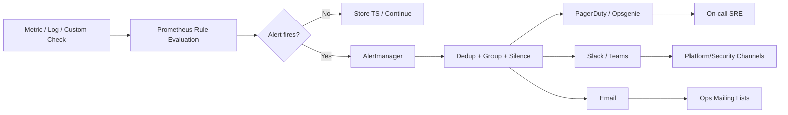

# Critical Infrastructure Alerts & Metrics Specification v1.0

| Атрибут | Значение |
|---------|----------|
| **ID** | REQ-NFR.OPS.critical-alerts |
| **Уровень** | NFR |
| **Атрибут качества** | Supportability |
| **Приоритет** | P0 |
| **Статус** | УТВЕРЖДЕНО |
| **Источник** | — |
| **Критерии приёмки** | — |

---

**Статус:** ACCEPTED  
**Дата:** 2026-05-17  
**Область:** production-инфраструктура VEDO Core  
**Аудитория:** SRE, DevOps, Platform Team, Security Lead, DBA  
**Обязательность:** нормативный артефакт для настройки мониторинга и алертинга

---

## Цель и область

Документ фиксирует обязательный стандарт метрик, порогов, уровней критичности и эскалации для инфраструктурных компонентов VEDO Core. Спецификация расширяет существующую severity-модель и устраняет неоднозначность в вопросах: какие сигналы считаются критическими, кто их получает и как быстро команда обязана реагировать.

## Интеграция с существующими ADR

- `ADR-DES.INFRA.critical-alerts-strategy`: источник severity-модели P0-P3; этот документ добавляет конкретные метрики и пороги.
- `ADR-DES.INFRA.recovery-objectives-mandate`: источник требований по RPO/RTO; здесь заданы алерты на replication lag и угрозу потери данных.
- `ADR-DES.INFRA.otel-observability-strategy`: источник требований к observability stack; здесь заданы алерты на недоступность Prometheus/Loki/Tempo.

---

## Модель критичности алертов

| Уровень | Цвет в Grafana | Действие | Время реакции | Целевое начало реакции | Пример |
|---------|----------------|----------|---------------|------------------------|--------|
| P0 (Critical) | Красный | Немедленное вмешательство инженера, будит on-call | 15 минут | ≤ 5 минут | Полная потеря сервиса, потеря данных, split-brain |
| P1 (High) | Оранжевый | Вмешательство в течение часа | 1 час | — | Высокая задержка, деградация сервиса |
| P2 (Warning) | Жёлтый | Мониторинг, плановое исправление | 24 часа | — | Почти полное использование ресурсов |
| P3 (Info) | Синий | Логирование, без действий | Не требуется | — | Событие не требует реакции |

Любой алерт, связанный с целостностью данных, split-brain или недоступностью primary/leader, не может быть ниже P0.

## Стек мониторинга и источники сигналов

- **Prometheus + Alertmanager**: основной движок правил и маршрутизации.
- **Экспортёры**: Neo4j, PostgreSQL (`postgres_exporter`), Redis (`redis_exporter`), RabbitMQ, Keycloak, MinIO/AWS.
- **Blackbox exporter**: внешняя доступность API, IdP, observability endpoints.
- **Логи и пользовательские проверки**: checksum, restore drill, key rotation, archive success.

## Поток алертов



---

## Каталог критических метрик и алертов

Колонки:
- `Источник`: exporter, лог или пользовательская проверка.
- `Порог`: значение + окно наблюдения.
- `Время alert`: через сколько после обнаружения алерт обязан сформироваться.
- `Runbook`: обязательный путь к инструкции.

### 1) Neo4j (7 метрик)

| Метрика | Источник | Порог | Время alert | Severity | Runbook |
|---------|----------|-------|-------------|----------|---------|
| Cluster leader exists | Neo4j exporter | leader отсутствует > 30 сек | 30 сек | P0 | `runbooks/neo4j-leader.md` |
| Replication lag | Neo4j exporter | lag > 5 минут | мгновенно | P0 | `runbooks/neo4j-replication-lag.md` |
| Heap usage | Neo4j exporter | > 80% за 5 минут | 5 минут | P1 | `runbooks/neo4j-memory.md` |
| Transaction log usage | Neo4j exporter | > 80% лимита за 5 минут | 5 минут | P1 | `runbooks/neo4j-txlog.md` |
| Cluster member availability | Neo4j exporter | недоступен >= 1 follower за 2 минуты | 2 минуты | P1 | `runbooks/neo4j-cluster-health.md` |
| TBox checksum mismatch | Custom integrity check | любое несовпадение контрольной суммы | мгновенно | P0 | `runbooks/tbox-checksum-mismatch.md` |
| OOMKill | Kubernetes | контейнер Neo4j был убит OOM Killer'ом | немедленно | P0 | `runbooks/neo4j-oom.md` |

**Примечание:** все OOM события должны приводить к автоматическому сбору heap dump для последующего анализа.

### 2) PostgreSQL (6 метрик)

| Метрика | Источник | Порог | Время alert | Severity | Runbook |
|---------|----------|-------|-------------|----------|---------|
| Primary доступен | Blackbox + postgres_exporter | health check failed 2 раза | 15 сек | P0 | `runbooks/postgres-primary-down.md` |
| Replication lag | postgres_exporter | lag > 10 минут | мгновенно | P0 | `runbooks/postgres-replication-lag.md` |
| WAL archive failed | Логи/метрика архивации | нет успешной архивации > 15 минут | 15 минут | P0 | `runbooks/postgres-wal-archive.md` |
| Connection pool saturation | postgres_exporter | > 90% used за 5 минут | 5 минут | P1 | `runbooks/postgres-conn-pool.md` |
| Txid wraparound risk | postgres_exporter | > 80% до wraparound | 5 минут | P1 | `runbooks/postgres-txid.md` |
| Replication slots bloat | postgres_exporter | slot retained bytes > 80% лимита | 5 минут | P1 | `runbooks/postgres-repl-slots.md` |

### 3) Redis (4 метрики)

| Метрика | Источник | Порог | Время alert | Severity | Runbook |
|---------|----------|-------|-------------|----------|---------|
| Split-brain | redis_exporter | masters > 2 | 5 сек | P0 | `runbooks/redis-split-brain.md` |
| Persistence failed | redis_exporter + логи | RDB/AOF failure > 5 минут | 5 минут | P0 | `runbooks/redis-persistence.md` |
| Memory usage | redis_exporter | > 80% `maxmemory` за 5 минут | 5 минут | P1 | `runbooks/redis-memory.md` |
| Cache hit rate | redis_exporter | < 50% за 15 минут | 15 минут | P1 | `runbooks/redis-hit-rate.md` |

### 4) RabbitMQ (4 метрики)

| Метрика | Источник | Порог | Время alert | Severity | Runbook |
|---------|----------|-------|-------------|----------|---------|
| Queue depth critical | RabbitMQ exporter | > 10,000 за 5 минут | 5 минут | P0 | `runbooks/rabbitmq-queue-depth.md` |
| Dead letter queue size | RabbitMQ exporter | > 1,000 | мгновенно | P0 | `runbooks/rabbitmq-dlq.md` |
| Queue depth high | RabbitMQ exporter | > 1,000 за 5 минут | 5 минут | P1 | `runbooks/rabbitmq-queue-depth.md` |
| Connections usage | RabbitMQ exporter | > 80% от лимита за 5 минут | 5 минут | P1 | `runbooks/rabbitmq-connections.md` |

### 5) Keycloak/Auth (5 метрик)

| Метрика | Источник | Порог | Время alert | Severity | Runbook |
|---------|----------|-------|-------------|----------|---------|
| IdP availability | Blackbox + Keycloak exporter | 3 failures подряд | 30 сек | P0 | `runbooks/keycloak-availability.md` |
| JWT key rotation failure | Keycloak logs/custom check | любая ошибка ротации | мгновенно | P0 | `runbooks/keycloak-key-rotation.md` |
| Login failure rate spike | Keycloak exporter | > 500% baseline за 5 минут | 5 минут | P1 | `runbooks/keycloak-login-failures.md` |
| Certificate expiry | Keycloak/custom cert check | < 30 дней до истечения | ежедневно | P1 | `runbooks/keycloak-certificates.md` |
| Token issuance latency p99 | Keycloak exporter | p99 > 1 сек за 5 минут | 5 минут | P1 | `runbooks/keycloak-token-latency.md` |

### 6) API Gateway (4 метрики)

| Метрика | Источник | Порог | Время alert | Severity | Runbook |
|---------|----------|-------|-------------|----------|---------|
| 5xx rate | Gateway metrics | > 1% за 2 минуты | 2 минуты | P0 | `runbooks/gateway-5xx.md` |
| Latency p99 | Gateway metrics | > 5s (CRUD) / > 10s (SPARQL), при load > 100 req/min | мгновенно | P0 | `runbooks/gateway-latency.md` |
| 4xx rate | Gateway metrics | > 10% за 5 минут | 5 минут | P1 | `runbooks/gateway-4xx.md` |
| GraphQL complexity violations | Runtime protection metrics | > 10 за 1 минуту | 1 минута | P1 | `runbooks/graphql-complexity.md` |

### 7) Object Storage (4 метрики)

| Метрика | Источник | Порог | Время alert | Severity | Runbook |
|---------|----------|-------|-------------|----------|---------|
| Write availability | MinIO exporter / CloudWatch | > 5 ошибок записи за 1 минуту | 1 минута | P0 | `runbooks/object-storage-write.md` |
| Read availability | MinIO exporter / CloudWatch | > 10 ошибок чтения за 1 минуту | 1 минута | P0 | `runbooks/object-storage-read.md` |
| Free space | MinIO exporter / CloudWatch | < 20% | 10 минут | P1 | `runbooks/object-storage-capacity.md` |
| Latency p99 | MinIO exporter / CloudWatch | > 2 сек за 5 минут | 5 минут | P1 | `runbooks/object-storage-latency.md` |

### 8) Backup (3 метрики)

| Метрика | Источник | Порог | Время alert | Severity | Runbook |
|---------|----------|-------|-------------|----------|---------|
| Backup age | Backup scheduler + custom metric | последний успешный backup > 24 часов | ежечасно | P0 | `runbooks/backup-age.md` |
| Restore drill success | Restore drill pipeline | любой провал restore drill | мгновенно | P0 | `runbooks/backup-restore-drill.md` |
| Backup duration | Backup scheduler | > 2x baseline (по завершении) | при завершении | P1 | `runbooks/backup-duration.md` |

### 9) Observability Stack (4 метрики)

| Метрика | Источник | Порог | Время alert | Severity | Runbook |
|---------|----------|-------|-------------|----------|---------|
| Stack availability | Blackbox (Prometheus/Loki/Tempo) | 3 failures подряд | 1 минута | P0 | `runbooks/observability-stack-down.md` |
| Prometheus target down | Prometheus self-monitoring | targets down > 0 за 5 минут | 5 минут | P1 | `runbooks/prometheus-targets.md` |
| Loki ingestion saturation | Loki metrics | ingestion > 90% лимита за 5 минут | 5 минут | P1 | `runbooks/loki-ingestion.md` |
| Alert delivery failures | Alertmanager metrics | notification failures > 0 за 5 минут | 5 минут | P1 | `runbooks/alertmanager-delivery.md` |

### 10) Network/Replication (2 метрики)

| Метрика | Источник | Порог | Время alert | Severity | Runbook |
|---------|----------|-------|-------------|----------|---------|
| Cross-region replication lag | Replication metrics/custom check | lag > 15 минут | мгновенно | P1 | `runbooks/cross-region-lag.md` |
| Inter-region link loss | Blackbox/network probes | packet loss > 20% за 1 минуту | 1 минута | P0 | `runbooks/network-link-loss.md` |

### 11) DDoS Protection (5 метрик)

| Метрика | Источник | Порог | Время alert | Severity | Runbook |
|---------|----------|-------|-------------|----------|---------|
| Possible L7 DDoS | Gateway metrics + anomaly detection | RPS > 10000 и 5xx rate > 20% за 1 минуту | 1 минута | P1 | `runbooks/ddos-attack-response.md` |
| Rate limiting violations spike | Gateway metrics | rate-limited requests > 1000 за 1 минуту | 1 минута | P1 | `runbooks/ddos-attack-response.md` |
| WebSocket connection flood | Collaboration Service metrics | новые WS соединения > 1000 за 1 минуту | 1 минута | P1 | `runbooks/ddos-attack-response.md` |
| SPARQL endpoint overload | SPARQL metrics | запросы > 60 req/min per IP и latency p99 > 30s | 1 минута | P1 | `runbooks/ddos-attack-response.md` |
| Single IP traffic anomaly | Gateway metrics | трафик с одного IP > 10% общего за 1 минуту | 1 минута | P2 | `runbooks/ddos-attack-response.md` |

**Все P1 DDoS-алерты** отправляются Security Lead и SRE on-call одновременно. Автоматическая блокировка IP на WAF при превышении порогов > 3x baseline.

---

## Классические критические алерты (дополнительные из существующей политики)

### Потеря connectivity

| Алерт | Описание | Условие срабатывания | Источник | Severity |
|-------|----------|----------------------|----------|----------|
| Neo4j cluster down | Все экземпляры Neo4j недоступны | `neo4j_up == 0` в течение 30 секунд | Prometheus | P0 |
| PostgreSQL primary down | Мастер PostgreSQL недоступен | `pg_up == 0` для primary или failover не сработал | Prometheus | P0 |
| Внутренние микросервисы не реплицируются | Kubernetes pod не может запуститься | `kube_pod_status_ready{condition="false"} > 30m` | Kubernetes | P0 |

### Высокая latency для критичных операций

| Операция | Алерт | Порог | Дополнительное условие | Severity |
|----------|-------|-------|------------------------|----------|
| Создание класса | `vedo_class_create_duration_seconds{quantile="0.99"}` | больше 5 секунд | нагрузка > 100 запросов/мин | P0 |
| API Gateway CRUD | `api_gateway_request_duration_seconds{quantile="0.99"}` | больше 10 секунд | нагрузка > 100 запросов/мин | P0 |
| SPARQL query (сложный) | `sparql_query_duration_seconds{quantile="0.99"}` | больше 30 секунд | нагрузка > 100 запросов/мин | P0 |

### Алерты высокого уровня P1 (ресурсы и деградация)

| Алерт | Порог | Время |
|-------|-------|-------|
| CPU usage > 80% | `(1 - avg(rate(node_cpu_seconds_total{mode="idle"}[5m])) by (instance)) > 0.8` | 10 минут |
| Memory usage > 80% | `(node_memory_MemTotal_bytes - node_memory_MemAvailable_bytes) / node_memory_MemTotal_bytes > 0.8` | 15 минут |
| Визуализация графа (загрузка) p95 | `graph_load_duration_seconds{quantile="0.95"}` > 3 секунд | — |
| Поиск индивидов p95 | `individual_search_duration_seconds{quantile="0.95"}` > 2 секунд | — |
| Commit (создание коммита) p95 | `commit_create_duration_seconds{quantile="0.95"}` > 5 секунд | — |
| HTTP 5xx rate > 5% | `rate(api_gateway_requests_total{code=~"5.."}[5m]) / rate(api_gateway_requests_total[5m]) > 0.05` | 5 минут |
| GraphQL errors rate > 10% | `graphql_requests_total{error="true"} / graphql_requests_total > 0.1` | 10 минут |
| SPARQL query failures > 10% | `sparql_query_errors_total / sparql_query_total > 0.1` | 10 минут |

### Отказ отдельных компонентов

```yaml
alerts:
  - name: "Metrics Service down"
    condition: "vedo_metrics_service_up == 0"
    priority: P1
  - name: "Reasoner service unavailable"
    condition: "vedo_reasoner_up == 0 for 5m"
    priority: P1
```

### Предупреждающие алерты P2

| Алерт | Порог | Действие |
|-------|-------|----------|
| Disk usage > 85% | `node_filesystem_avail_bytes / node_filesystem_size_bytes < 0.15` | Очистка логов или удаление старых бэкапов |
| Network receive errors > 0.1% | `rate(node_network_receive_errs_total[5m]) > 0` | Проверка сетевого оборудования |
| Kubernetes Pod restarts > 3 за час | `kube_pod_container_status_restarts_total > 3` | Анализ логов подов |
| Slow SPARQL queries (частота) | `sum(rate(sparql_query_duration_seconds_bucket{le="5"}[5m])) < 0.9 * sum(rate(sparql_query_duration_seconds_count[5m]))` | Оптимизация запросов |

### Информационные алерты P3

| Алерт | Назначение |
|-------|------------|
| Cert expires in < 30 days | Плановое обновление сертификатов |
| Backup disk space low | Увеличение квоты или удаление старых бэкапов |
| User session count drops to zero | Возможно, все пользователи вышли; может быть нормальным событием |
| New version deployed | Логирование событий обновления |

---

## Маршрутизация алертов

| Система | Протокол | Интеграция |
|---------|----------|------------|
| PagerDuty/Opsgenie | Webhook | P0 и P1 алерты |
| Slack / Teams | Webhook | P0, P1, P2 в канал `#alerts` |
| Email | SMTP | P2 и выше на почту дежурного инженера |
| Status page | API | Обновление статуса при P0 алертах |

### Детальная матрица маршрутизации по severity

| Severity | Канал 1 (paging) | Канал 2 (chat) | Канал 3 (async) |
|---|---|---|---|
| P0 | PagerDuty/Opsgenie (немедленно) | Slack/Teams `#incident-p0` | Email incident list |
| P1 | PagerDuty/Opsgenie (high urgency) | Slack/Teams `#platform-alerts` | Email ops list |
| P2 | Без paging | Slack/Teams `#platform-alerts` | Email ops list |
| P3 | Без paging | Опционально weekly digest | Email digest |

---

## Эскалация и владельцы реакции

### Матрица эскалации

Минимальные правила эскалации определены в `escalation-matrix.md` и обязательны для P0/P1 производственных инцидентов.

| Уровень критичности | Эскалационный путь | Тайминг |
|---------------------|--------------------|---------|
| P0 | L1 → L2 | 15 минут |
| P0 | L2 → L3 | 30 минут |
| P0 | L3 → L4 | 1 час |
| P0 | L4 → L5 | 2 часа |
| P0 | L5 → L6 | 4 часа |
| P1 | L1 → L2 | 30 минут |
| P1 | L2 → L3 | 90 минут |
| P1 | L3 → L4 | 4 часа |
| P1 | L4 → L5 | 8 часов |

### Доказательства по инциденту

Для каждого P0/P1 инцидента должны фиксироваться временные метки:
- `detected_at` — время обнаружения алертом
- `acknowledged_at` — время подтверждения on-call инженером
- `escalated_at` — время эскалации (если применялась)
- `diagnosed_at` — время диагностики корневой причины
- `workaround_at` — время применения workaround'а
- `restored_at` — время полного восстановления сервиса
- `closed_at` — время закрытия инцидента

### Детализация по типам алертов

| Тип алерта | Первичный получатель | Вторичный получатель | Время эскалации |
|---|---|---|---|
| P0 infrastructure | On-call SRE | Platform Team Lead + DBA/Security по домену | 10 минут без ACK |
| P1 infrastructure | Platform Team | On-call SRE | 30 минут без ACK |
| AUTH/Keycloak (P0/P1) | On-call SRE + Security Lead | Platform Team | 10 минут (P0) / 30 минут (P1) |
| DDoS (P1) | On-call SRE + Security Lead | Platform Team | 10 минут без ACK |
| Data integrity (checksum/replication) | On-call SRE + DBA | Platform Team Lead | 5 минут |

---

## Требования к runbook для каждого P0

Каждый P0-алерт обязан иметь runbook со структурой:
- **Диагностика:** как подтвердить инцидент (метрики, логи, команды, scope).
- **Восстановление:** пошаговые действия first-response и mitigation.
- **Эскалация:** когда и кому передавать (SRE Lead, DBA, Security, Platform).

### Минимальный coverage P0 runbook по компонентам

| Компонент | Обязательные runbook |
|---|---|
| Neo4j | leader missing, replication lag, TBox checksum mismatch, OOM |
| PostgreSQL | primary down, replication lag, WAL archive failed |
| Redis | split-brain, persistence failed |
| RabbitMQ | critical queue depth, DLQ overflow |
| Keycloak | IdP down, JWT key rotation failure |
| API Gateway | 5xx spike, p99 critical latency |
| Object Storage | write/read availability |
| Backup | backup age breach, restore drill failure |
| Observability | stack unavailable |
| Network | inter-region link loss |

---

## Примеры Prometheus alerting rules

```yaml
groups:
- name: vedo_critical_neo4j
  rules:
  - alert: Neo4jLeaderMissing
    expr: neo4j_cluster_leader_exists == 0
    for: 30s
    labels:
      severity: p0
      category: database
    annotations:
      summary: "Neo4j cluster has no leader"
      runbook: "runbooks/neo4j-leader.md"

- name: vedo_critical_postgres
  rules:
  - alert: PostgresPrimaryDown
    expr: up{job="postgres-exporter",role="primary"} == 0
    for: 15s
    labels:
      severity: p0
      category: database
    annotations:
      summary: "PostgreSQL primary is unavailable"
      runbook: "runbooks/postgres-primary-down.md"

- name: vedo_critical_redis
  rules:
  - alert: RedisSplitBrain
    expr: sum(redis_instance_info{role="master"}) > 2
    for: 5s
    labels:
      severity: p0
      category: cache
    annotations:
      summary: "Redis split-brain detected"
      runbook: "runbooks/redis-split-brain.md"

- name: vedo_critical_rabbitmq
  rules:
  - alert: RabbitMQDeadLetterQueueCritical
    expr: sum(rabbitmq_queue_messages{queue=~".*dlq.*"}) > 1000
    for: 0s
    labels:
      severity: p0
      category: messaging
    annotations:
      summary: "RabbitMQ DLQ exceeded threshold"
      runbook: "runbooks/rabbitmq-dlq.md"

- name: vedo_critical_auth
  rules:
  - alert: KeycloakUnavailable
    expr: probe_success{job="blackbox-keycloak"} == 0
    for: 30s
    labels:
      severity: p0
      category: auth
      notify_security: "true"
    annotations:
      summary: "Keycloak endpoint unavailable"
      runbook: "runbooks/keycloak-availability.md"

- name: vedo_critical_gateway
  rules:
  - alert: APIGateway5xxRateHigh
    expr: |
      sum(rate(http_requests_total{job="api-gateway",status=~"5.."}[2m]))
      /
      sum(rate(http_requests_total{job="api-gateway"}[2m])) > 0.01
    for: 2m
    labels:
      severity: p0
      category: gateway
    annotations:
      summary: "API Gateway 5xx rate > 1%"
      runbook: "runbooks/gateway-5xx.md"

- name: vedo_critical_object_storage
  rules:
  - alert: ObjectStorageWriteErrorsCritical
    expr: increase(object_storage_write_errors_total[1m]) > 5
    for: 1m
    labels:
      severity: p0
      category: storage
    annotations:
      summary: "Object storage write errors exceeded threshold"
      runbook: "runbooks/object-storage-write.md"

- name: vedo_critical_backup
  rules:
  - alert: BackupAgeExceeded
    expr: time() - backup_last_success_timestamp_seconds > 24 * 3600
    for: 0s
    labels:
      severity: p0
      category: backup
    annotations:
      summary: "Last successful backup is older than 24 hours"
      runbook: "runbooks/backup-age.md"

- name: vedo_critical_observability
  rules:
  - alert: ObservabilityStackDown
    expr: |
      (probe_success{job=~"blackbox-prometheus|blackbox-loki|blackbox-tempo"} == 0)
    for: 1m
    labels:
      severity: p0
      category: observability
    annotations:
      summary: "Observability stack endpoint is unavailable"
      runbook: "runbooks/observability-stack-down.md"

- name: vedo_network_replication
  rules:
  - alert: CrossRegionReplicationLagHigh
    expr: cross_region_replication_lag_seconds > 15 * 60
    for: 0s
    labels:
      severity: p1
      category: replication
    annotations:
      summary: "Cross-region replication lag exceeded 15 minutes"
      runbook: "runbooks/cross-region-lag.md"
```

---

## Тестирование алертов

### Unit testing для правил

- Использовать `promtool test rules` для каждого правила.
- Для каждого P0/P1 правила обязателен набор тестов:
  - positive case (алерт срабатывает)
  - negative case (алерт не срабатывает)
  - boundary case (ровно на пороге)
- Изменение порога без обновления unit tests запрещено.

### Интеграционное и хаос-тестирование

- Еженедельные controlled failure drills: остановка exporter/instance, инъекция latency, искусственный рост queue depth.
- Ежемесячные chaos-сценарии: primary failover, network partition, object storage throttling.
- Acceptance-критерий: алерт срабатывает в пределах `времени alert`, маршрут и эскалация соответствуют политике.

---

## SLI/SLO для критичных компонентов

| Показатель | Целевое значение |
|---|---|
| Доступность P0-компонентов (Neo4j leader path, PostgreSQL primary path, Keycloak, API Gateway, Object Storage, Observability) | ≥ 99.9% в месяц |
| MTTR для P0-инцидентов | ≤ 15 минут (от открытия до подтверждённого восстановления сервиса) |
| Доля P0 без runbook | 0% |
| Доля алертов без владельца | 0% |

---

## Alert fatigue prevention

| Показатель | Цель | Контроль |
|---|---|---|
| P0 алерты в неделю | 0-1 | Weekly SRE review |
| P1 алерты в неделю | ≤ 5 | Weekly Platform review |
| Доля ложных P0 | < 1% | Post-incident audit |
| Доля auto-resolved P1 | ≥ 30% | Monthly tuning |

---

## False positive handling

- Все P0/P1 алерты маркируются тегом `tuning_state` (`new`, `stable`, `needs_tuning`).
- Новые правила работают 2 недели в режиме наблюдения (`notify chat + email`, paging только по согласованию).
- Калибровка порогов выполняется на основании:
  - baseline за последние 28 дней
  - профиля нагрузки (рабочие часы/пиковые окна)
  - incident postmortem
- Любое изменение порога фиксируется в changelog правил и проходит review SRE + владельца компонента.

---

## Maintenance mode (плановые работы)

- Плановые окна оформляются через Alertmanager silence с обязательными полями: `owner`, `change_id`, `start`, `end`, `scope`.
- P0 silencing допускается только для явно затронутых компонентов; глобальное silencing запрещено.
- Для maintenance mode требуется pre-check:
  - подтверждение актуального backup
  - подтверждение дежурного on-call
  - назначенный rollback owner
- После завершения окна выполняется post-check: удаление silence, smoke test, валидация восстановленной телеметрии.

---

## Emergency kill switch

### Уровни аварийного отключения

| Уровень | Механизм | Время срабатывания | Когда применяется |
|---------|----------|-------------------|-------------------|
| **L1: Logical read-only** | `vedo-cli emergency readonly` — API Gateway отклоняет все mutating запросы (POST/PUT/PATCH/DELETE) с HTTP 503, заголовок `X-VEDO-Emergency: readonly` | ≤ 60 секунд | Основной механизм: подозрительная активность, ошибки данных, подготовка к восстановлению |
| **L2: Service-level kill** | `vedo-cli emergency kill --service <name>` — отключение конкретного сервиса | ≤ 120 секунд | Проблема изолирована в одном сервисе (например, бесконечный merge) |
| **L3: Infrastructure kill** | Network ACL или shutdown пода | ≤ 300 секунд | Fallback, если L1/L2 недоступны |

### Поведение L1 (logical read-only)

1. API Gateway немедленно отклоняет мутирующие запросы (HTTP 503); read-only запросы продолжают обслуживаться.
2. WebSocket-уведомление всем клиентам о режиме emergency readonly с указанием причины.
3. Audit log: кто активировал, время, причина, статус системы.
4. Обратный переход — только после `vedo-cli emergency clear`.

### Требования к ≤ 60 секундам

- Kill switch доступен через независимый канал управления (отдельный management endpoint), не зависящий от основного API Gateway.
- `vedo-cli emergency readonly` выполняется без прохождения стандартной очереди запросов (priority path).
- Время измеряется от вызова до отклонения последнего in-flight mutating запроса. Метрика: `emergency_readonly_activation_seconds`.

### Обоснование приоритета логического отключения

- Read-only mode не требует перезапуска подов и восстановления целостности.
- Сохраняется read-доступность для диагностики и оценки ущерба.
- Минимизируются побочные эффекты: потеря in-flight транзакций, нарушение индексов.

### Fault injection tests

| ID | Сценарий | Ожидаемый результат |
|----|----------|---------------------|
| FT1 | Массовый ошибочный импорт в production | L1 kill switch ≤ 60 сек, write-запросы отклонены, read работают |
| FT2 | Versioning Service в бесконечном цикле merge | L2 kill switch ≤ 120 сек, остальные сервисы работают |
| FT3 | API Gateway недоступен | L3 fallback ≤ 300 сек |

Детальная политика аварийного отключения проблемных security policy определена в `emergency-security-policy-disable.md`.

---

## Конфигурация заказчика

VEDO Core поставляется с предварительно настроенными алертами Prometheus для критических событий:

- **P0:** потеря Neo4j/PostgreSQL, OOM, потеря данных, высокий уровень 5xx больше 10%, недоступность API Gateway.
- **P1:** высокое использование ресурсов больше 80%, задержки выше порогов, отказ отдельных микросервисов.
- **P2:** переполнение диска, частые перезапуски, медленные запросы.

Алерты доставляются через PagerDuty, Slack и email. Дашборды в Grafana показывают текущие метрики RED (Rate, Errors, Duration).

Для on-premise заказчик может изменить пороги и каналы уведомлений через конфигурацию Prometheus. При использовании альтернативного стека, например Datadog или New Relic, заказчик должен самостоятельно настроить эквивалентные алерты.

---

## Бизнес-правила

- P0 алерты требуют реакции инженера в течение 15 минут.
- P1 алерты требуют реакции в течение 1 часа.
- P0/P1 алерты должны запускать матрицу эскалации из `escalation-matrix.md`.
- P2 алерты требуют мониторинга и планового исправления в течение 24 часов.
- P3 события логируются и не требуют оперативной реакции.
- P0 latency alert должен учитывать минимальный объём нагрузки больше 100 запросов в минуту.
- Все OOM события должны собирать heap dump для последующего анализа.
- Альтернативные observability backend должны иметь эквивалентные алерты, но их настройка является зоной ответственности заказчика, если backend не входит в базовую поставку.

### Закрывает

- `4.1 Аварии/Катастрофы × Проектирование`
- `4.2 Аварии/Катастрофы × Эксплуатация`

---

## Ответственности

| Роль | Ответственность |
|---|---|
| SRE | Политика алертинга, маршрутизация P0/P1, on-call процесс, postmortem, MTTR контроль, DDoS mitigation activation |
| Platform Team | Поддержка exporter и telemetry pipeline, исправление инфраструктурных причин P1/P0, capacity planning, WAF-правила и rate-limit tuning |
| Security Lead | AUTH-сигналы (Keycloak, key rotation, brute-force), security escalation и корректность response-процедур, DDoS-атаки эскалация и анализ |
| Database Admin | Neo4j/PostgreSQL репликация, целостность, backup/restore readiness, оптимизация порогов БД |

---

## Критерии соответствия спецификации

- Для каждой метрики из каталога существует правило Prometheus и ссылка на runbook.
- Для каждого P0 существует проверенный runbook и последний drill не старше 90 дней.
- Маршрутизация в Alertmanager соответствует матрице severity.
- Unit tests для правил проходят в CI.
- Еженедельный отчёт по P0/P1 включает: количество, MTTR, false positive rate, tuning actions.
