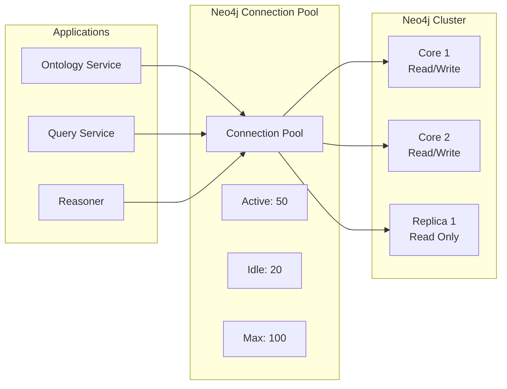

# Спецификация производительности — VEDO Core

| Атрибут | Значение |
|---------|----------|
| **ID** | REQ-NFR.PERF.performance |
| **Уровень** | NFR |
| **Атрибут качества** | Performance |
| **Приоритет** | P0 |
| **Статус** | УТВЕРЖДЕНО |
| **Источник** | — |
| **Критерии приёмки** | — |

---

## 0. Канонический профиль нагрузки

Единица масштаба для производительности, SLA, QA benchmarks и capacity planning зафиксирована в `human/artifacts/requirements/REQ-NFR.PERF.canonical-workload-profile.md`.

Базовый профиль: 1M аксиом, ~4M триплетов, 50K классов, 100K индивидов, 5 параллельных редакторов, 10 API requests/sec.

## 1. Пул соединений Neo4j

### 1.1. Стратегия

VEDO Core использует **адаптивный пул соединений** для Neo4j, настроенный под каждое окружение.



### 1.2. Лимиты соединений по окружениям

| Окружение | Neo4j Core | Neo4j Replicas | Максимум соединений | На сервис | Timeout |
|-------------|------------|----------------|-----------------|-------------|---------|
| **Sandbox** | 1 (single) | 0 | 20 | 5 | 30 сек |
| **Staging** | 3 (cluster) | 1 | 100 | 20 | 10 сек |
| **Production** | 3-5 (cluster) | 2-5 | 500 | 50 | 5 сек |
| **Enterprise** | 5+ (cluster) | 5+ | 2000 | 100 | 3 сек |

### 1.3. Конфигурация сервера Neo4j

```conf
# neo4j.conf
dbms.netty.max_inbound_connections = 5000
dbms.netty.max_inbound_connections_per_ip = 250
dbms.connector.http.idle_timeout = 120s
dbms.connector.bolt.idle_timeout = 120s
dbms.threads.worker_count = 200
dbms.memory.transaction.global_max_size = 1G
dbms.memory.transaction.max_size = 128M
```

---

## 2. Конфигурация памяти Redis

### 2.1. Сценарии использования

- Кэш (запросы к онтологии)
- Блокировки (блокировка узлов для коллаборации)
- Сессии (пользовательские сессии)
- Состояние WebSocket
- Rate limiting

### 2.2. Лимиты памяти по окружениям

| Окружение | Максимум памяти | Политика вытеснения | Предупреждение | Критично |
|-------------|------------|-----------------|---------|----------|
| **Sandbox** | 256 MB | allkeys-lru | 80% | 90% |
| **Staging** | 1 GB | allkeys-lru | 80% | 90% |
| **Production** | 8 GB | volatile-lru | 80% | 95% |
| **Enterprise** | 32 GB | volatile-lru | 80% | 95% |

### 2.3. Значения TTL по умолчанию

| Тип ключа | TTL | Назначение |
|----------|-----|---------|
| cache | 300 сек | Результаты запросов |
| session | 3600 сек | Пользовательские сессии |
| lock | 300 сек | Блокировки узлов |
| rate_limit | 60 сек | Лимиты API |

### 2.4. Распределение памяти Redis (Production)

| Сценарий | Максимум памяти | Шаблон |
|----------|-----------|---------|
| Cache | 4 GB | `vedo:cache:*` |
| Sessions | 2 GB | `vedo:session:*` |
| Locks | 1 GB | `vedo:lock:*` |
| Rate limiting | 500 MB | `vedo:ratelimit:*` |
| WebSocket | 500 MB | `vedo:ws:*` |

---

## 3. Ключевые метрики производительности

```prometheus
# Neo4j
neo4j_active_connections 23
neo4j_waiting_requests 0
neo4j_query_duration_seconds_p95 0.12

# Redis
redis_memory_used_bytes 4294967296
redis_memory_max_bytes 8589934592
redis_cache_hit_ratio 0.85
redis_evicted_keys_total 1234

# Application
api_request_duration_seconds_p95 0.12
api_request_duration_seconds_p99 0.25
```

---

## 4. Рекомендации по масштабированию

| Условие | Действие |
|-----------|--------|
| Neo4j active > 80% limit | +50% max_connections |
| Neo4j waiting requests > 0 | Добавить read replica |
| Redis memory > 85% | Увеличить maxmemory, проверить TTL |
| Cache hit ratio < 50% | Увеличить TTL или добавить кэш |
| Evicted keys > 1000/hour | Увеличить maxmemory |

---

## 5. Всплески трафика (Traffic spikes)

### Коэффициенты всплеска

Базовый профиль: 10× от p95 обычного трафика. Интервал измерения: 5 минут скользящее окно.

Допустимая latency (p99): +100% от baseline, но не более 5 секунд для критических операций (создание класса). Допустимая error rate: ≤ 0.1% (5xx) для non-mutating, ≤ 0.5% для mutating.

### Распределение по типам операций

| Тип операции | Коэф. всплеска | Max p99 latency | Max error rate |
|--------------|----------------|-----------------|----------------|
| GraphQL навигация (read) | 10× | 2 сек | 0.1% |
| SPARQL аналитика | 5× | 10 сек | 0.5% |
| REST CRUD (read) | 8× | 1 сек | 0.1% |
| Коммит / write | 3× | 3 сек | 0.5% |
| WebSocket connection | 15× (handshake) | 1 сек | 1% |

---

## 6. Worst-case query CI gates

CI запускает performance-regression тесты на следующих классах worst-case inputs на каноническом профиле (1M триплетов). При превышении порога CPU-time релиз блокируется.

| Класс inputs | Пример | Допустимый рост CPU-time | Блокировка релиза при росте |
|--------------|--------|--------------------------|----------------------------|
| SPARQL: неограниченный optional + filter | `OPTIONAL { ?s ?p ?o . FILTER(REGEX(STR(?o), "^.*$")) }` | > 300% от baseline | > 500% |
| SPARQL: property path глубины 10 | `:parentOf+` без ограничения | > 200% | > 400% |
| GraphQL: вложенные запросы глубиной 8 | `{ class { subclasses { subclasses { ... } } } }` | > 150% | > 300% |
| Regex на больших строках | `FILTER(REGEX(?label, "^.{1000,}.*$"))` | > 200% | > 400% |
| Cartesian product (cross join) | `SELECT * WHERE { ?s ?p ?o . ?s2 ?p2 ?o2 }` | > 400% | Всегда (лабораторный тест, не в CI) |

Измерение: CPU-time через `rusage` или Prometheus metrics. При превышении порога — релиз блокируется, требуется оптимизация или явное risk acceptance.
