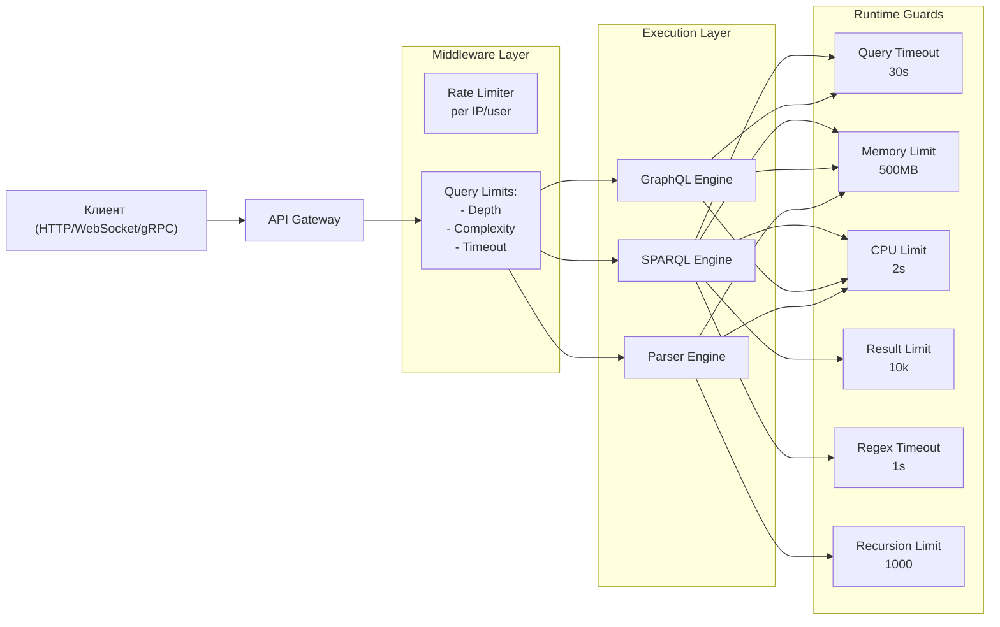
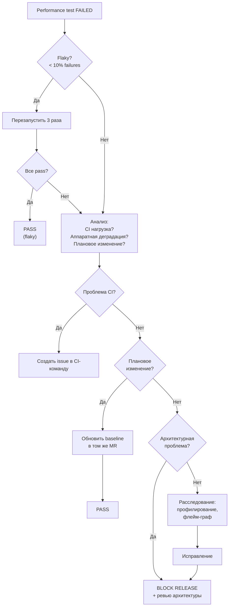
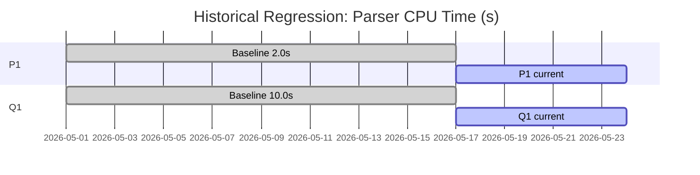

# Parser and Query Fuzz & Performance Gates Specification v1.0

| Атрибут | Значение |
|---------|----------|
| **ID** | REQ-NFR.SECURITY.parser-query-fuzz-gates |
| **Уровень** | NFR |
| **Атрибут качества** | Functionality |
| **Приоритет** | P1 |
| **Статус** | УТВЕРЖДЕНО |
| **Источник** | — |
| **Критерии приёмки** | — |

---

> Спецификация fuzz-тестирования, performance-тестирования и runtime-защиты для парсеров и обработчиков
> запросов VEDO Core. Определяет workload-профили, пороги блокировки релиза, инструменты, CI-интеграцию
> и production-мониторинг для предотвращения superlinear деградации, ReDoS, OOM и stack overflow.

---

## Оглавление

1. [Определения](#1-определения)
2. [Workload Profiles](#2-workload-profiles)
3. [Пороги блокировки релиза](#3-пороги-блокировки-релиза)
4. [Runtime Protection (Production)](#4-runtime-protection-production)
5. [Инструменты](#5-инструменты)
6. [CI Интеграция](#6-ci-интеграция)
7. [Baseline Establishment](#7-baseline-establishment)
8. [False Positive Handling](#8-false-positive-handling)
9. [Historical Regression Tracking](#9-historical-regression-tracking)
10. [Мониторинг (Production)](#10-мониторинг-production)
11. [Ответственность](#11-ответственность)
12. [Исключения](#12-исключения)
13. [Примеры](#13-примеры)

---

## 1. Определения

### 1.1 Superlinear деградация

Рост времени выполнения или потребления памяти быстрее линейного относительно размера входных данных.
Характерные классы сложности:

| Класс | Сложность | Пример в VEDO Core |
|-------|-----------|-------------------|
| Квадратичная | O(n²) | Turtle парсер: глубоко вложенные blank nodes с перекрёстными ссылками — каждый blank node может ссылаться на n других, total = n² триплетов |
| Кубическая | O(n³) | SPARQL: трижды вложенный OPTIONAL с NOT EXISTS — планировщик строит декартово произведение трёх граф-паттернов |
| Экспоненциальная | O(2ⁿ) | SPARQL: цепочка UNION внутри OPTIONAL — каждое соединение удваивает количество планов |
| Факториальная | O(n!) | SPARQL: множественные property paths с произвольной длиной (`rdfs:subClassOf+`) — комбинаторный взрыв при переборе путей |

### 1.2 ReDoS (Regular Expression Denial of Service)

Атака на основе regex с катастрофическим возвратом (catastrophic backtracking).
Возникает, когда regex содержит:
- Вложенные квантификаторы: `(a+)+`
- Перекрывающиеся альтернативы с квантификаторами: `(a|aa)+`
- Квантификаторы после повторяющихся групп: `(a|b)*c` на входе `aaaaac`

Для VEDO Core ReDoS возможен в:
- SPARQL regex filter (`FILTER regex(?label, "...")`)
- RDF-валидаторах (разбор IRI, lang-тегов)
- Парсерах Turtle/RDF/XML (извлечение префиксов)

### 1.3 Catastrophic Backtracking (катастрофический возврат)

Ситуация, при которой regex-движок перебирает экспоненциальное количество комбинаций при
несовпадении строки с паттерном. Отличается от ReDoS тем, что может возникать без злого умысла —
на легальных входных данных с неблагоприятной структурой.

### 1.4 Cartesian product (декартово произведение) в SPARQL

Когда SPARQL-запрос соединяет несколько независимых граф-паттернов без общих переменных,
количество промежуточных результатов равно произведению размеров каждого паттерна.
При 3 паттернах по 10,000 записей каждый → 10¹² промежуточных строк.

### 1.5 Stack overflow при глубокой рекурсии

Экспоненциальный расход стека вызовов при разборе глубоко вложенных структур.
Для VEDO Core — парсеры Turtle/RDF/XML/OWL с вложенностью > 1000.

---

## 2. Workload Profiles

### 2.1 Parser profiles (P1–P6)

#### P1: Deeply nested blank nodes

| Свойство | Значение |
|----------|----------|
| **ID** | FZ-P-P1 |
| **Название** | Глубокая вложенность blank nodes |
| **Входные данные** | Turtle-файл с blank nodes, вложенными на глубину до 10,000: `_:a1 :p [ :p [ :p ... ] ]` |
| **Размер** | ~2 MB (10,000 вложений) |
| **Назначение** | Проверка рекурсивного парсера на stack overflow и superlinear аллокации |
| **Ожидаемое поведение** | Парсер завершает разбор без stack overflow, время ≤ 5× от разбора эквивалентного плоского файла того же размера |
| **Механизм защиты** | Recursion limit = 1000 (runtime), tail-call оптимизация (arch) |

#### P2: Large literals

| Свойство | Значение |
|----------|----------|
| **ID** | FZ-P-P2 |
| **Название** | Крупные литералы |
| **Входные данные** | Turtle-файл с одним литералом размером 50 MB (base64-encoded бинарный объект) |
| **Размер** | ~50 MB |
| **Назначение** | Проверка аллокаций при разборе больших строковых значений, memory fragmentation |
| **Ожидаемое поведение** | Парсер аллоцирует ≤ 55 MB, не падает по OOM, завершает за ≤ 10 сек |
| **Механизм защиты** | Memory limit per query = 500 MB (runtime), streaming parser для large objects (arch) |

#### P3: Many namespaces

| Свойство | Значение |
|----------|----------|
| **ID** | FZ-P-P3 |
| **Название** | Множество namespace-префиксов |
| **Входные данные** | Turtle-файл с 100,000 уникальных `@prefix` объявлений, каждое используется 1 раз |
| **Размер** | ~10 MB |
| **Назначение** | Проверка hashtable/resolution — O(n²) при неэффективном prefix resolve |
| **Ожидаемое поведение** | Разбор всех prefix + триплетов за ≤ 3× от файла с 1 prefix (не более 15 сек) |
| **Механизм защиты** | HashMap с O(1) lookup для namespace resolution |

#### P4: Blank nodes cross-references

| Свойство | Значение |
|----------|----------|
| **ID** | FZ-P-P4 |
| **Название** | Перекрёстные ссылки blank nodes |
| **Входные данные** | Turtle-файл: n blank nodes, каждый ссылается на все остальные (полный граф). n = 1000 |
| **Размер** | ~10 MB (1,000,000 триплетов) |
| **Назначение** | Проверка O(n²) деградации при поточной загрузке blank nodes в граф |
| **Ожидаемое поведение** | Парсер не превышает O(n²) по CPU, no free-list fragmentation по memory |
| **Механизм защиты** | Batch insert с pre-allocation, bulk Cypher query |

#### P5: Malformed input

| Свойство | Значение |
|----------|----------|
| **ID** | FZ-P-P5 |
| **Название** | Некорректный ввод |
| **Входные данные** | Мутированные Turtle/RDF/XML/JSON-LD/OWL/XML файлы из AFL++ корпуса |
| **Размер** | От 1 байта до 10 MB, случайные бинарные последовательности |
| **Назначение** | Проверка error handling: парсер не должен паниковать, зависать или аллоцировать бесконтрольно |
| **Ожидаемое поведение** | Парсер возвращает синтаксическую ошибку с указанием позиции, не падает, не зависает, memory ≤ 50 MB |
| **Механизм защиты** | Structured error handling (never `.unwrap()` в парсерах), bounded allocation |

#### P6: Catastrophic backtracking (Turtle)

| Свойство | Значение |
|----------|----------|
| **ID** | FZ-P-P6 |
| **Название** | Катастрофический возврат в Turtle |
| **Входные данные** | Turtle-файл с длинной строкой, провоцирующей backtracking в regex парсинга IRI или lang-тега: `@prefix : <http://...#` + 100,000 символов без закрывающего `>` |
| **Размер** | ~100 KB |
| **Назначение** | Проверка, что все regex в парсере используют bounded repeat или не подвержены backtracking |
| **Ожидаемое поведение** | Парсер завершает разбор (с ошибкой или success) за ≤ 1 сек |
| **Механизм защиты** | Все regex в парсерах — bounded (не используют `.*` или `.+` с вложенными квантификаторами), regex timeout = 1 сек |

---

### 2.2 SPARQL profiles (Q1–Q6)

#### Q1: Deep property paths

| Свойство | Значение |
|----------|----------|
| **ID** | FZ-SP-Q1 |
| **Название** | Глубокие property paths |
| **Входные данные** | SPARQL-запрос с цепочкой property paths произвольной длины: `?s rdfs:subClassOf+ / rdfs:subClassOf+ / rdfs:subClassOf+ ?o` на онтологии с 10,000 классов |
| **Назначение** | Проверка exponential blowup при переборе транзитивных замыканий |
| **Ожидаемое поведение** | Запрос выполняется за ≤ 30 сек или отклоняется таймаутом с error code `SPARQL_TIMEOUT` |
| **Механизм защиты** | SPARQL query timeout = 30 сек, property path depth limit |

#### Q2: Nested OPTIONAL + NOT EXISTS

| Свойство | Значение |
|----------|----------|
| **ID** | FZ-SP-Q2 |
| **Название** | Вложенные OPTIONAL + NOT EXISTS |
| **Входные данные** | SPARQL-запрос с 5+ уровнями вложенных OPTIONAL и NOT EXISTS: `SELECT * WHERE { ?s :p1 ?o1 . OPTIONAL { ?s :p2 ?o2 . NOT EXISTS { ?s :p3 ?o3 . OPTIONAL { ... } } } }` |
| **Назначение** | Проверка экспоненциального роста плана запроса при вложенных optional-паттернах |
| **Ожидаемое поведение** | Query planner завершает построение плана за ≤ 5 сек, не превышает complexity limit |
| **Механизм защиты** | SPARQL query timeout = 30 сек, ограничение глубины вложенности OPTIONAL (рекомендовано: ≤ 10) |

#### Q3: Cartesian product

| Свойство | Значение |
|----------|----------|
| **ID** | FZ-SP-Q3 |
| **Название** | Декартово произведение |
| **Входные данные** | SPARQL-запрос: три независимых паттерна без общих переменных, каждый возвращает 10,000 записей: `SELECT * WHERE { ?a :p1 ?b . ?c :p2 ?d . ?e :p3 ?f }` |
| **Назначение** | Проверка детекции cartesian product в query planner'е |
| **Ожидаемое поведение** | Планировщик детектирует cartesian product и либо отклоняет запрос с error code `CARTESIAN_PRODUCT`, либо переписывает план |
| **Механизм защиты** | SPARQL result limit = 10,000, детекция cartesian product на уровне планировщика |

#### Q4: UNION of many patterns

| Свойство | Значение |
|----------|----------|
| **ID** | FZ-SP-Q4 |
| **Название** | Множественные UNION |
| **Входные данные** | SPARQL-запрос с 100+ UNION-блоками: `SELECT * WHERE { { ?s :p1 ?o } UNION { ?s :p2 ?o } UNION ... }` |
| **Назначение** | Проверка O(n) vs O(n²) деградации при компиляции большого числа UNION |
| **Ожидаемое поведение** | Компиляция UNION занимает O(n), ≤ 5 сек для 100 UNION |
| **Механизм защиты** | SPARQL query timeout = 30 сек, оптимизация UNION compilation |

#### Q5: ReDoS regex in SPARQL FILTER

| Свойство | Значение |
|----------|----------|
| **ID** | FZ-SP-Q5 |
| **Название** | ReDoS через SPARQL regex filter |
| **Входные данные** | SPARQL-запрос: `SELECT * WHERE { ?s :label ?l . FILTER regex(?l, "(a|aa)+b") }` на данных с длинной строкой "aaaaa...c" (100,000 символов) |
| **Назначение** | Проверка, что SPARQL regex filter не подвержен ReDoS |
| **Ожидаемое поведение** | Regex-движок завершает выполнение за ≤ 1 сек или прерывается таймаутом |
| **Механизм защиты** | Regex execution timeout = 1 сек, использование `regex_safe` / re2-совместимого движка |

#### Q6: ORDER BY + DISTINCT + LIMIT

| Свойство | Значение |
|----------|----------|
| **ID** | FZ-SP-Q6 |
| **Название** | ORDER BY + DISTINCT + LIMIT |
| **Входные данные** | SPARQL-запрос: `SELECT DISTINCT ?s WHERE { ?s ?p ?o } ORDER BY ?s LIMIT 10` на онтологии с 1M триплетов |
| **Назначение** | Проверка, что комбинация ORDER BY + DISTINCT + LIMIT не вызывает полную сортировку всех данных (top-K оптимизация) |
| **Ожидаемое поведение** | Запрос использует top-K сортировку, не полную. Время ≤ 5 сек |
| **Механизм защиты** | SPARQL query timeout = 30 сек, SPARQL result limit = 10,000, top-K оптимизация |

---

### 2.3 GraphQL profiles (G1–G4)

#### G1: Deep nesting

| Свойство | Значение |
|----------|----------|
| **ID** | FZ-GQL-G1 |
| **Название** | Глубокая вложенность GraphQL |
| **Входные данные** | GraphQL query с вложенностью 15 уровней: `{ class { children { children { ... } } } }` |
| **Назначение** | Проверка depth limit |
| **Ожидаемое поведение** | Запрос отклоняется с error code `GRAPHQL_DEPTH_EXCEEDED` |
| **Механизм защиты** | GraphQL depth limit = 10 |

#### G2: Alias flooding

| Свойство | Значение |
|----------|----------|
| **ID** | FZ-GQL-G2 |
| **Название** | Alias flooding |
| **Входные данные** | GraphQL query с 1000 алиасов на одно поле: `{ a1: classes, a2: classes, ..., a1000: classes }` |
| **Назначение** | Проверка complexity limit и alias deduplication |
| **Ожидаемое поведение** | Запрос отклоняется с error code `GRAPHQL_COMPLEXITY_EXCEEDED` либо алисы дедуплицируются |
| **Механизм защиты** | GraphQL complexity limit = 1000, alias normalization |

#### G3: Batch overlap

| Свойство | Значение |
|----------|----------|
| **ID** | FZ-GQL-G3 |
| **Название** | Пересечение batch-запросов |
| **Входные данные** | GraphQL batch из 100 запросов, каждый запрашивает перекрывающиеся подмножества данных |
| **Назначение** | Проверка N+1 prevention и DataLoader кэширования |
| **Ожидаемое поведение** | Количество SQL/Cypher запросов ≤ 10 (DataLoader батчит) |
| **Механизм защиты** | DataLoader паттерн, batch deduplication |

#### G4: Expensive computed fields

| Свойство | Значение |
|----------|----------|
| **ID** | FZ-GQL-G4 |
| **Название** | Тяжёлые вычисляемые поля |
| **Входные данные** | GraphQL query: `{ class(id: "X") { impactAnalysis { ... } subgraph(depth: 100) { ... } validationReport { ... } } }` |
| **Назначение** | Проверка, что query с множеством дорогих computed fields не превышает time/memory limit |
| **Ожидаемое поведение** | Запрос выполняется ≤ 30 сек (общий таймаут) или частично ошибается с error code `FIELD_TIMEOUT` |
| **Механизм защиты** | GraphQL complexity limit = 1000, per-field timeouts |

---

### 2.4 Regex profiles (R1–R3)

#### R1: ReDoS patterns (Static)

| Свойство | Значение |
|----------|----------|
| **ID** | FZ-RX-R1 |
| **Название** | ReDoS паттерны (статический анализ) |
| **Входные данные** | Корпус известных ReDoS паттернов из OWASP ReDoS database (100+ паттернов) |
| **Назначение** | Проверка, что все regex в кодовой базе не содержат ReDoS-уязвимостей |
| **Ожидаемое поведение** | `re2` / `regex_safe` анализатор не находит опасных паттернов |
| **Механизм защиты** | Pre-commit hook: grep для `(a+)+`, `(a|aa)+`, `(.*)+` паттернов; timeout = 1 сек в production |

#### R2: Long input regex

| Свойство | Значение |
|----------|----------|
| **ID** | FZ-RX-R2 |
| **Название** | Regex на длинном входе |
| **Входные данные** | Строка 1 MB, каждый regex из кодовой базы применяется к ней |
| **Назначение** | Проверка аллокаций при разборе длинных строк через regex |
| **Ожидаемое поведение** | Каждый regex завершает разбор за ≤ 1 сек, аллокация ≤ 2 MB |
| **Механизм защиты** | Regex execution timeout = 1 сек, bounded regex engine (re2) |

#### R3: Unicode normalization attack

| Свойство | Значение |
|----------|----------|
| **ID** | FZ-RX-R3 |
| **Название** | Unicode-нормализация |
| **Входные данные** | Строка 100 KB с многократно нормализованными Unicode-символами (NFC/NFD/NFKC/NFKD комбинации) |
| **Назначение** | Проверка O(n²) деградации при нормализации Unicode в regex-движке |
| **Ожидаемое поведение** | Нормализация завершается за ≤ 2× времени от ASCII строки того же размера |
| **Механизм защиты** | Unicode normalization bounds, regex timeout = 1 сек |

---

## 3. Пороги блокировки релиза

### 3.1 Таблица порогов

| ID Workload | Метрика | Baseline (ожидание) | Предел (block release) | Способ измерения |
|-------------|---------|---------------------|------------------------|------------------|
| FZ-P-P1 | CPU time | ≤ 2 сек | > +50% (> 3 сек) | hyperfine --warmup 3 |
| FZ-P-P2 | Memory allocation | ≤ 55 MB | > +100% (> 110 MB) или > 2 GB | valgrind --tool=massif |
| FZ-P-P3 | CPU time | ≤ 5 сек | > +50% (> 7.5 сек) | hyperfine --warmup 3 |
| FZ-P-P4 | CPU time | ≤ 10 сек | > +50% (> 15 сек) | hyperfine --warmup 3 |
| FZ-P-P5 | Crash/OOM | 0 | Любой crash/OOM → block | AFL++ / cargo-fuzz |
| FZ-P-P6 | CPU time (regex) | ≤ 0.5 сек | > 1 сек | timeout 1 + hyperfine |
| FZ-SP-Q1 | CPU time | ≤ 10 сек | > +100% (> 20 сек) | hyperfine + SPARQL endpoint |
| FZ-SP-Q2 | CPU time | ≤ 2 сек | > +100% (> 4 сек) | hyperfine + SPARQL endpoint |
| FZ-SP-Q3 | CPU time (detection) | ≤ 0.5 сек | > +100% (> 1 сек) | hyperfine + SPARQL endpoint |
| FZ-SP-Q4 | CPU time | ≤ 3 сек | > +20% (> 3.6 сек) | hyperfine + SPARQL endpoint |
| FZ-SP-Q5 | ReDoS timeout | ≤ 0.5 сек | > 1 сек | timeout 1 + SPARQL endpoint |
| FZ-SP-Q6 | CPU time | ≤ 3 сек | > +20% (> 3.6 сек) | hyperfine + SPARQL endpoint |
| FZ-GQL-G1 | Error code | GRAPHQL_DEPTH_EXCEEDED | Любой другой код или success → block | Интеграционный тест |
| FZ-GQL-G2 | Error code | GRAPHQL_COMPLEXITY_EXCEEDED | Любой другой код или success → block | Интеграционный тест |
| FZ-GQL-G3 | # DB queries | ≤ 10 | > 10 → block | Интеграционный тест |
| FZ-GQL-G4 | CPU time | ≤ 15 сек | > +50% (> 22.5 сек) | hyperfine + GraphQL endpoint |
| FZ-RX-R1 | ReDoS detection | 0 опасных паттернов | Любой опасный паттерн → block | re2 / regex_safe static analysis |
| FZ-RX-R2 | CPU time / regex | ≤ 0.5 сек | > 1 сек | timeout 1 + hyperfine |
| FZ-RX-R3 | CPU time | ≤ 2× ASCII | > 2× ASCII → block | hyperfine --warmup 3 |

### 3.2 Общие пороги

| Метрика | Workload | Предел (block release) |
|---------|----------|------------------------|
| Latency p95 | Любой | > +100% (2×) от baseline |
| Latency p99 | Любой | > +200% (3×) от baseline |
| OOM/crash | Любой fuzz test | Любой crash/OOM → block |
| Memory allocation (total) | Parser | > +100% или > 2 GB |

### 3.3 Исключения из порогов

| Ситуация | Действие |
|----------|----------|
| Первичный прогон (baseline не установлен) | Не блокировать, установить baseline |
| Плановое изменение архитектуры (новый парсер) | Обновить baseline в том же MR |
| Аппаратная деградация CI-раннера | Перезапустить, если флаки — пересмотреть baseline |

---

## 4. Runtime Protection (Production)

### 4.1 Таблица runtime limit'ов

| Механизм | Порог | Действие при превышении | Error code |
|----------|-------|-------------------------|------------|
| SPARQL query timeout | 30 секунд | Прерывание запроса, возврат ошибки | `SPARQL_TIMEOUT` |
| SPARQL result limit | 10,000 записей | Обрезание результатов + partial flag | `SPARQL_RESULT_TRUNCATED` |
| SPARQL cartesian product detection | 2 независимых паттерна | Отклонение запроса | `CARTESIAN_PRODUCT` |
| GraphQL depth limit | 10 уровней | Отклонение запроса | `GRAPHQL_DEPTH_EXCEEDED` |
| GraphQL complexity limit | 1000 очков | Отклонение запроса | `GRAPHQL_COMPLEXITY_EXCEEDED` |
| Regex execution timeout | 1 секунда | Прерывание regex, возврат false | `REGEX_TIMEOUT` |
| Parser recursion limit | 1000 вызовов | Ошибка парсинга + stack depth info | `PARSER_RECURSION_LIMIT` |
| Memory limit per query | 500 MB | OOM guard, прерывание запроса | `QUERY_MEMORY_LIMIT` |
| Total CPU per request | 2 секунды | Прерывание запроса | `REQUEST_CPU_LIMIT` |

### 4.2 Архитектура runtime защиты



---

## 5. Инструменты

### 5.1 Таблица инструментов

| Workload | Инструмент | Команда запуска | Обязательность | CI Stage |
|----------|-----------|-----------------|----------------|----------|
| P1–P6 (parser fuzz) | AFL++ / cargo-fuzz | `cargo fuzz run parser_fuzz` | mandatory | fuzz |
| P1–P6 (parser perf) | hyperfine | `hyperfine --warmup 3 'target/parser workload.ttl'` | mandatory | performance |
| P1–P6 (memory) | valgrind / heaptrack | `valgrind --tool=massif target/parser workload.ttl` | recommended | performance |
| Q1–Q6 (SPARQL fuzz) | SPARQL-query-fuzzer | `python3 fuzz_sparql.py --endpoint http://localhost:9090/sparql` | mandatory | fuzz |
| Q1–Q6 (SPARQL perf) | hyperfine + curl | `hyperfine 'curl -X POST -d @query.sparql http://...'` | mandatory | performance |
| G1–G4 (GraphQL) | graphql-depth-limit | Встроенная библиотека в Apollo Server | mandatory | lint |
| G1–G4 (GraphQL perf) | k6 | `k6 run --vus 10 --duration 30s graphql_test.js` | recommended | performance |
| R1–R3 (ReDoS static) | re2 / regex_safe | `cargo clippy -- -D clippy::regex_*` | mandatory | lint |
| R1–R3 (ReDoS perf) | hyperfine | `hyperfine 'target/regex_benchmark'` | mandatory | performance |
| Load test (все Q) | k6 / JMeter | `k6 run --vus 50 --duration 60s load_test.js` | recommended | performance |
| Structure fuzz (RDF) | rasta | `rasta fuzz input.ttl -o corpus/` | recommended | fuzz |

### 5.2 Fuzz-инфраструктура

```mermaid
flowchart TB
    subgraph "CI Fuzz Pipeline"
        MR["MR Created"] --> FuzzCheck{"Fuzz?\nmanual trigger"}
        Tag["Tag pushed"] --> FuzzAuto["Fuzz: automatic"]
        
        FuzzCheck -->|Да| FuzzManual["Fuzz: manual\nCI=manual"]
        FuzzAuto --> RunFuzz["Run fuzz targets"]
        FuzzManual --> RunFuzz
        
        RunFuzz --> ParserFuzz["Parser fuzz\n(cargo-fuzz)"]
        RunFuzz --> SparqlFuzz["SPARQL fuzz\n(SPARQL-query-fuzzer)"]
        RunFuzz --> RedosFuzz["ReDoS check\n(re2/regex_safe)"]
        
        ParserFuzz --> |"30 min"| ReportFuzz["Fuzz Report"]
        SparqlFuzz --> |"30 min"| ReportFuzz
        RedosFuzz --> |"5 min"| ReportFuzz
        
        ReportFuzz --> Decision{"Decision"}
        Decision -->|"Crash/OOM"| Block["BLOCK RELEASE"]
        Decision -->|"No issues"| Pass["PASS"]
    end
    
    subgraph "CI Performance Pipeline"
        MR2["MR Created"] --> PerfAuto["Performance:\nautomatic"]
        Tag2["Tag pushed"] --> PerfAuto
        
        PerfAuto --> RunPerf["Run performance targets"]
        RunPerf --> ParserPerf["Parser perf\n(hyperfine)"]
        RunPerf --> SparqlPerf["SPARQL perf\n(hyperfine + curl)"]
        RunPerf --> GqlPerf["GraphQL perf\n(k6)"]
        
        ParserPerf --> |"15 min"| ReportPerf["Performance Report"]
        SparqlPerf --> |"15 min"| ReportPerf
        GqlPerf --> |"15 min"| ReportPerf
        
        ReportPerf --> Compare["Compare with baseline"]
        Compare --> Threshold{"Threshold exceeded?"}
        Threshold -->|"Yes"| Block2["BLOCK RELEASE\n(или false positive review)"]
        Threshold -->|"No"| Pass2["PASS"]
    end
```



---

## 6. CI Интеграция

### 6.1 GitLab CI jobs

```yaml
include:
  - template: Security/Fuzzing.gitlab-ci.yml

variables:
  FUZZ_TIME: "30m"
  BASELINE_FILE: "performance-baseline.json"

# ── Parser fuzz (manual for MR, automatic for tags) ──

parser-fuzz:
  stage: fuzz
  script:
    - cargo fuzz run parser_fuzz -- -max_total_time=$FUZZ_TIME
  artifacts:
    paths:
      - fuzz/artifacts/
      - fuzz/corpus/
    reports:
      fuzzing: fuzz/artifacts/
    when: always
  only:
    - tags
  rules:
    - if: '$CI_COMMIT_TAG =~ /^v/'
      when: on_success
    - if: '$CI_PIPELINE_SOURCE == "merge_request_event" && $CI_MANUAL == "fuzz"'
      when: manual
      allow_failure: true

# ── SPARQL fuzz (manual for MR, automatic for tags) ──

sparql-fuzz:
  stage: fuzz
  script:
    - python3 tools/fuzz/fuzz_sparql.py --endpoint http://sparql:9090/sparql --timeout $FUZZ_TIME
  artifacts:
    paths:
      - fuzz-results/
    when: always
  only:
    - tags
  rules:
    - if: '$CI_COMMIT_TAG =~ /^v/'
      when: on_success
    - if: '$CI_PIPELINE_SOURCE == "merge_request_event" && $CI_MANUAL == "fuzz"'
      when: manual
      allow_failure: true

# ── ReDoS static check (automatic for MR) ──

redos-check:
  stage: lint
  script:
    - cargo clippy --all-targets -- -D clippy::regex_* 2>&1 | tee redos-report.txt
    - python3 tools/redos/check_patterns.py --allowlist tools/redos/allowlist.txt
  artifacts:
    reports:
      codequality: redos-report.txt
    when: always
  rules:
    - if: '$CI_PIPELINE_SOURCE == "merge_request_event"'
      when: on_success
    - if: '$CI_COMMIT_BRANCH == "main"'
      when: on_success

# ── Parser performance (automatic for MR) ──

parser-performance:
  stage: performance
  script:
    - cargo build --release --bin parser-bench
    - hyperfine --warmup 3 --export-json parser-results.json
      'target/release/parser-bench < workloads/p1-deep-blanks.ttl'
      'target/release/parser-bench < workloads/p2-large-literal.ttl'
      'target/release/parser-bench < workloads/p3-many-ns.ttl'
      'target/release/parser-bench < workloads/p4-cross-refs.ttl'
    - python3 tools/perf/compare_baseline.py --baseline $BASELINE_FILE --results parser-results.json
  artifacts:
    paths:
      - parser-results.json
    reports:
      performance: parser-results.json
    when: always
  rules:
    - if: '$CI_PIPELINE_SOURCE == "merge_request_event"'
      when: on_success
    - if: '$CI_COMMIT_BRANCH == "main"'
      when: on_success

# ── SPARQL performance (automatic for MR) ──

sparql-performance:
  stage: performance
  services:
    - postgres:16
    - neo4j:5
  script:
    - cargo build --release --bin ontology-service
    - ./target/release/ontology-service &
    - sleep 5
    - hyperfine --warmup 3 --export-json sparql-results.json
      'curl -X POST -d @workloads/q1-deep-property.sparql http://localhost:9090/sparql'
      'curl -X POST -d @workloads/q2-nested-optional.sparql http://localhost:9090/sparql'
      'curl -X POST -d @workloads/q3-cartesian.sparql http://localhost:9090/sparql'
      'curl -X POST -d @workloads/q4-union.sparql http://localhost:9090/sparql'
      'curl -X POST -d @workloads/q5-redos.sparql http://localhost:9090/sparql'
      'curl -X POST -d @workloads/q6-order-distinct.sparql http://localhost:9090/sparql'
    - python3 tools/perf/compare_baseline.py --baseline $BASELINE_FILE --results sparql-results.json
  artifacts:
    paths:
      - sparql-results.json
    when: always
  rules:
    - if: '$CI_PIPELINE_SOURCE == "merge_request_event"'
      when: on_success
    - if: '$CI_COMMIT_BRANCH == "main"'
      when: on_success

# ── GraphQL performance (automatic for MR) ──

graphql-performance:
  stage: performance
  script:
    - k6 run --vus 10 --duration 30s --summary-export gql-results.json tools/perf/graphql_test.js
    - python3 tools/perf/compare_baseline.py --baseline $BASELINE_FILE --results gql-results.json
  artifacts:
    paths:
      - gql-results.json
    when: always
  rules:
    - if: '$CI_PIPELINE_SOURCE == "merge_request_event"'
      when: on_success

# ── Scheduled regression ──

regression-scan:
  stage: performance
  script:
    - python3 tools/perf/full_regression.py --output regression-report.html
    - python3 tools/perf/update_baseline.py --baseline $BASELINE_FILE
  artifacts:
    paths:
      - regression-report.html
      - $BASELINE_FILE
    when: always
  only:
    - schedules
  rules:
    - if: '$CI_PIPELINE_SOURCE == "schedule"'
      when: on_success
```

### 6.2 Триггеры

| Тип триггера | Fuzz | Performance | ReDoS |
|--------------|------|-------------|-------|
| MR (merge request) | manual, allow_failure | automatic, block on failure | automatic, block |
| Tag (v*) | automatic, block | automatic, block | automatic, block |
| Scheduled (nightly) | — | full regression, update baseline | full scan |
| Main branch | — | automatic | automatic |

### 6.3 Allow_failure политика

| Stage | allow_failure | Обоснование |
|-------|---------------|-------------|
| Fuzz (manual) | true | Fuzz тесты могут занимать > 30 мин, не блокируют MR |
| Fuzz (tag) | false | Тег = релизный кандидат, fuzz обязателен |
| Performance | false на tagged, true на MR | MR может иметь флаки, тег блокирует релиз |
| ReDoS | false | ReDoS — security уязвимость, блокирует всегда |

### 6.4 Артефакты

| Артефакт | Формат | Retention | Назначение |
|----------|--------|-----------|------------|
| Fuzz artifacts | Корпус файлов | 30 дней | Воспроизведение crash'ей |
| Fuzz corpus | Корпус файлов | 90 дней | Эволюция fuzz-корпуса |
| Performance JSON | JSON | 90 дней | Сравнение с baseline |
| Regression report | HTML | 1 год | Historical tracking |
| Baseline JSON | JSON | Постоянно | Текущие пороги |

---

## 7. Baseline Establishment

### 7.1 Процедура установки baseline

1. **Запуск на чистом main:** После каждого major-релиза выполнить полный прогон всех workload-профилей на чистом `main` без изменений.
2. **Измерение:** Использовать `hyperfine --warmup 5 --runs 10` для CPU time, `valgrind --tool=massif` для memory.
3. **Фиксация:** Результаты сохраняются в `performance-baseline.json` в корне репозитория.
4. **Review:** Baseline утверждается Tech Lead и Security Lead, изменения baseline только через MR.

### 7.2 Когда обновлять baseline

| Событие | Действие |
|---------|----------|
| Новый major-релиз | Полный перезапуск baseline |
| Новая архитектура парсера | Обновить baseline для P-workloads |
| Новая версия SPARQL-движка | Обновить baseline для Q-workloads |
| Смена языка/тулчейна (например, Rust edition) | Обновить baseline |
| Аппаратная смена CI-раннеров | Обновить baseline |

### 7.3 Baseline JSON схема

```json
{
  "schema_version": 1,
  "created_at": "2026-05-17T12:00:00Z",
  "commit": "abc123def456",
  "workloads": {
    "FZ-P-P1": {
      "baseline_mean_ms": 2000,
      "baseline_std_ms": 150,
      "memory_mb": 45,
      "threshold_ms": 3000,
      "threshold_memory_mb": 55
    }
  },
  "environment": {
    "cpu": "AMD EPYC 7B12",
    "ram_gb": 64,
    "os": "Ubuntu 24.04",
    "rust_version": "1.85.0"
  }
}
```

---

## 8. False Positive Handling

### 8.1 Причины false positive

| Причина | Признак | Действие |
|---------|---------|----------|
| CI-раннер под нагрузкой | Все тесты упали с > 2× baseline | Перезапустить пайплайн |
| Флакирующий тест | Падает ~5% прогонов | Отметить как flaky, увеличить warmup |
| Изменение baseline (плановое) | Только один workload упал, и это ожидаемо | Обновить baseline в MR |
| Аппаратная деградация | Все P95/P99 упали одновременно | Проверить CI-раннер, перезапустить |

### 8.2 Процедура обработки



### 8.3 Исключение из block (risk acceptance)

Если performance-тест упал, но архитектурное решение принято (например, добавлена новая фича, которая утяжеляет запросы), допускается:
1. Обновление baseline в том же MR.
2. Risk acceptance от Tech Lead.
3. Запись в Changelog.

---

## 9. Historical Regression Tracking

### 9.1 Формат хранения

Все результаты performance-тестов хранятся в:
- `performance-baseline.json` — текущий baseline
- `performance-history/` — директория с результатами по датам:
  ```
  performance-history/
    2026-05-01.json
    2026-05-15.json
    2026-06-01.json
    ...
  ```

### 9.2 Scheduled regression

Еженощный (scheduled) пайплайн:
1. Запускает все performance workload'ы
2. Сравнивает с baseline
3. Генерирует HTML-отчёт с графиками
4. Если деградация > 20% — создаёт issue в GitLab
5. Обновляет baseline (если деградация подтверждена и принята)

### 9.3 Визуализация



Метрики отслеживания (Grafana dashboard):
- Parser CPU time (p50/p95/p99) по workload'ам
- SPARQL execution time (p50/p95/p99)
- Memory allocation per parser
- Fuzz test pass rate
- ReDoS detection count

---

## 10. Мониторинг (Production)

### 10.1 Метрики для мониторинга

| Метрика | Тип | Источник | Описание |
|---------|-----|----------|----------|
| `parser_duration_seconds` | Histogram | Ontology Service | Время разбора RDF-файлов |
| `parser_memory_bytes` | Gauge | Ontology Service | Потребление памяти при разборе |
| `sparql_duration_seconds` | Histogram | Ontology Service | Время выполнения SPARQL-запроса |
| `sparql_results_count` | Counter | Ontology Service | Количество возвращённых записей |
| `sparql_timeout_total` | Counter | Ontology Service | Количество прерванных по таймауту запросов |
| `sparql_cartesian_total` | Counter | Ontology Service | Количество отклонённых cartesian product |
| `graphql_depth_exceeded_total` | Counter | API Gateway | Количество отклонённых по depth limit |
| `graphql_complexity_exceeded_total` | Counter | API Gateway | Количество отклонённых по complexity limit |
| `regex_timeout_total` | Counter | Ontology Service / API Gateway | Количество прерванных regex |
| `parser_recursion_limit_total` | Counter | Ontology Service | Количество превышений recursion limit |
| `query_memory_limit_total` | Counter | Ontology Service | Количество прерываний по memory limit |
| `request_cpu_limit_total` | Counter | API Gateway | Количество прерываний по CPU limit |
| `fuzz_regression_detected` | Gauge | CI | 1 если регрессия обнаружена (push из CI) |

### 10.2 Пороги алертов

| Алерт | Метрика | Порог | Severity | Действие |
|-------|---------|-------|----------|----------|
| SPARQL p95 latency spike | `sparql_duration_seconds` p95 | > 5 сек за 5 мин | P1 | Проверить запросы, отключить тяжёлые |
| SPARQL timeout spike | `sparql_timeout_total` | > 10/min за 5 мин | P1 | Расследовать нагрузку, rate limit |
| Parser OOM | `parser_memory_bytes` | > 1 GB за 1 мин | P0 | Автоматический restart pod'а |
| GraphQL depth/complexity spike | `graphql_*_exceeded_total` | > 50/min за 5 мин | P2 | Проверить клиентов, rate limit |
| Regex timeout spike | `regex_timeout_total` | > 20/min за 5 мин | P2 | Проверить SPARQL-запросы с regex |
| Fuzz regression | `fuzz_regression_detected` | = 1 | P2 | Создать issue, назначить Security Lead |

### 10.3 Severity классификация

| Severity | Описание | Реакция |
|----------|----------|---------|
| P0 | OOM/crash в production | Немедленное вмешательство SRE |
| P1 | Значительная деградация latency (p95 > 5s) | Расследование в течение 1 часа |
| P2 | Превышение порогов, массовые таймауты | Расследование в течение 1 дня |
| P3 | Единичные превышения, CI-регрессии | Запись в бэклог |

---

## 11. Ответственность

| Роль | Обязанности |
|------|------------|
| **Backend Developer** | Реализация runtime guards (таймауты, depth limit, memory limit). Написание fuzz-таргетов для своих парсеров. Исправление ReDoS-уязвимостей. |
| **Security Lead** | Review fuzz-результатов. Поддержка allowlist для ReDoS. Принятие risk acceptance для исключений. |
| **SRE** | Мониторинг production-метрик (p95/p99, timeouts). Настройка алертов. Scheduled regression пайплайн. |
| **QA Lead** | Создание workload-профилей для новых компонентов. Верификация порогов. False positive triage. |
| **Architect** | Утверждение baseline. Принятие архитектурных решений по защите от superlinear деградации. Review исключений. |

---

## 12. Исключения

### 12.1 Исключённые компоненты

| Компонент | Обоснование исключения | Компенсирующие меры |
|-----------|------------------------|---------------------|
| Внутренние gRPC-сервисы | Непубличные, фиксированные контракты. Входные данные контролируются API Gateway | Rate limiting на API Gateway, circuit breaker |
| Health/ready endpoints | Ограниченный ввод (только HTTP GET), не содержат парсинга | — |
| Static assets (CSS, JS, images) | Не содержат парсинга, отдаются как есть | CDN, заголовки кэширования |
| Helm charts | YAML-шаблоны, не содержат runtime-парсинга | Линтер YAML, schema validation |

### 12.2 Исключённые сценарии

| Сценарий | Обоснование | Компенсация |
|----------|-------------|-------------|
| Fuzz внутренних protobuf-контрактов | gRPC-контракты типизированы, protobuf-парсеры стабильны | Fuzz protobuf-десериализации на уровне раннера |
| Load test всех эндпоинтов | Невозможно тестировать все комбинации | Канонический профиль (canonical workload profile) |

---

## 13. Примеры

### 13.1 Пример fuzz теста на Rust (cargo-fuzz)

```rust
// fuzz/fuzz_targets/parser_fuzz.rs

#![no_main]

use libfuzzer_sys::fuzz_target;
use vedo_ontology::parser::turtle::TurtleParser;

fuzz_target!(|data: &[u8]| {
    // Таймаут 1 секунда для каждого fuzz-входа
    std::thread::scope(|s| {
        let handle = s.spawn(|| {
            let parser = TurtleParser::new();
            match parser.parse_bytes(data) {
                Ok(model) => {
                    // Проверка: модель не должна содержать > 1M триплетов
                    assert!(model.triples().count() <= 1_000_000,
                        "Parser returned > 1M triples");
                }
                Err(e) => {
                    // Ошибка парсинга — ожидаемое поведение
                    // Проверяем, что ошибка содержит позицию
                    assert!(e.position().is_some(),
                        "Parse error must include position");
                }
            }
        });
        // Прерываем, если fuzz-вход выполняется > 1 секунды
        if handle.join().is_err() {
            panic!("Fuzz target timed out or panicked");
        }
    });
});
```

### 13.2 Пример performance теста (hyperfine)

```bash
# benchmark_parser.sh
# Пример запуска: ./benchmark_parser.sh workloads/p1-deep-blanks.ttl

TARGET="target/release/parser-bench"
WORKLOAD="$1"
LABEL=$(basename "$WORKLOAD" .ttl)

echo "=== Benchmarking: $LABEL ==="

hyperfine \
    --warmup 3 \
    --runs 10 \
    --export-json "results/${LABEL}.json" \
    --show-output \
    "$TARGET parse < $WORKLOAD"

echo "=== Memory profile: $LABEL ==="
valgrind \
    --tool=massif \
    --massif-out-file="results/${LABEL}.massif" \
    "$TARGET parse < $WORKLOAD" 2>&1 | tail -5

ms_print "results/${LABEL}.massif" | head -30 > "results/${LABEL}_mem.txt"

echo "Done. Results: results/${LABEL}.json, results/${LABEL}_mem.txt"
```

### 13.3 Пример ReDoS проверки в CI

```yaml
# tools/redos/check_patterns.py
# CI-скрипт для статического анализа ReDoS-паттернов

import re
import sys
import glob

# Известные опасные паттерны (non-exhaustive)
DANGEROUS_PATTERNS = [
    # Nested quantifiers
    r'\(\w*\+\)\+',
    r'\(\w*\*\)\*', 
    r'\(\w*\+\)\*',
    r'\(\w*\*\)\+',
    # Overlapping alternatives with quantifiers
    r'\(\.+\|\.+\)\+',
    r'\(\w+\|\w+\)\+',
    # Quantifier after repeated group
    r'\(\.\*\)\*',
    r'\(\.\+\)\+',
    r'\(\.\*\)\+',
]

# Allowlist — известные безопасные исключения
ALLOWLIST = [
    # URI схемы (bounded)
    r'^[a-zA-Z][a-zA-Z0-9+\-.]*:.*$',
]

def check_file(filepath, allowlist):
    """Проверяет файл на наличие опасных regex-паттернов."""
    with open(filepath, 'r', encoding='utf-8', errors='ignore') as f:
        content = f.read()
    
    for pattern in DANGEROUS_PATTERNS:
        matches = re.findall(pattern, content)
        for match in matches:
            # Проверяем allowlist
            if any(re.match(al, match) for al in allowlist):
                continue
            print(f"DANGEROUS PATTERN in {filepath}: {match}")
            return False
    
    return True

def main():
    rust_files = glob.glob('**/*.rs', recursive=True)
    failures = 0
    
    for filepath in rust_files:
        if not check_file(filepath, ALLOWLIST):
            failures += 1
    
    if failures > 0:
        print(f"FAILED: {failures} files contain dangerous regex patterns")
        sys.exit(1)
    else:
        print("PASS: No dangerous regex patterns found")

if __name__ == '__main__':
    main()
```

### 13.4 Пример GraphQL depth/complexity лимитов (Apollo)

```typescript
// server/src/graphql/limits.ts

import { depthLimit } from 'graphql-depth-limit';
import { createComplexityLimitRule } from 'graphql-validation-complexity';

export const graphqlValidationRules = [
  // Depth limit: не более 10 уровней вложенности
  depthLimit(
    10,
    { ignore: [ 'TrustedDocument' ] },
    (depth: number) => {
      throw new Error(`GRAPHQL_DEPTH_EXCEEDED: depth ${depth} > 10`);
    }
  ),

  // Complexity limit: не более 1000 очков
  createComplexityLimitRule(
    1000,
    {
      onCostLimit: (cost: number) => {
        throw new Error(`GRAPHQL_COMPLEXITY_EXCEEDED: cost ${cost} > 1000`);
      },
      formatError: ({ cost, maxCost }) => ({
        code: 'GRAPHQL_COMPLEXITY_EXCEEDED',
        message: `Query complexity ${cost} exceeds limit ${maxCost}`,
      }),
    }
  ),
];

// Пример стоимости полей:
// - class (id: String!): Class — 1 очко
// - class.children: [Class] — 2 очка
// - class.impactAnalysis: ImpactReport — 50 очков
// - class.subgraph(depth: Int!): Subgraph — depth * 10 очков
```

---

## История изменений

| Версия | Дата | Автор | Изменения |
|--------|------|-------|-----------|
| 1.0 | 2026-05-17 | Performance Engineer | Первичная версия |

---

## Приложение A: Быстрый старт для разработчика

```bash
# 1. Запуск fuzz теста для парсера
cargo fuzz run parser_fuzz -- -max_total_time=60s

# 2. Запуск SPARQL-запроса (проверка на timeout)
timeout 35 curl -X POST -d 'SELECT * WHERE { ?s ?p ?o }' \
  http://localhost:9090/sparql

# 3. ReDoS check
cargo clippy -- -D clippy::regex_*

# 4. Performance benchmark
hyperfine --warmup 3 'target/release/parser-bench < workloads/p1.ttl'

# 5. Обновить baseline
python3 tools/perf/update_baseline.py --workload FZ-P-P1 --mean_ms 2100
```

## Приложение B: Словарь терминов

| Термин | Определение |
|--------|-------------|
| Superlinear деградация | Рост времени/памяти быстрее линейного относительно входа |
| ReDoS | Атака на основе regex с катастрофическим возвратом |
| Catastrophic backtracking | Экспоненциальный перебор комбинаций regex-движком |
| Cartesian product | Декартово произведение независимых паттернов без общих переменных |
| Canonical workload | Стандартизированный профиль нагрузки для сравнения |
| Fuzz target | Функция, принимающая случайные данные и проверяющая стабильность |
| Baseline | Эталонные значения времени/памяти для данного workload |
| Risk acceptance | Официальное разрешение на релиз при несоответствии порогам |
