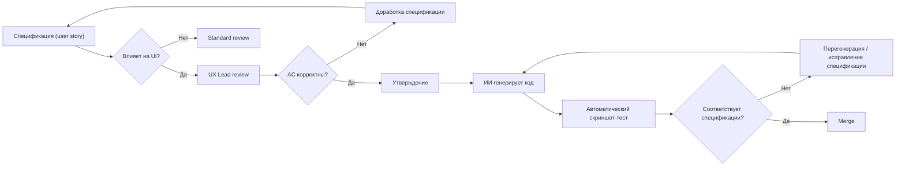

# UX Review Process (spec-driven)

| Атрибут | Значение |
|---------|----------|
| **ID** | REQ-USR.UI.ux-review-process |
| **Уровень** | USR |
| **Атрибут качества** | Usability |
| **Приоритет** | P1 |
| **Статус** | УТВЕРЖДЕНО |
| **Источник** | — |
| **Критерии приёмки** | — |

---

## Принцип

При spec-driven разработке код генерируется ИИ. UX review проверяет **спецификацию** (user stories, acceptance criteria), а не код.

## Когда требуется UX review

| Тип изменения | UX review обязателен | Что проверяется |
|---------------|----------------------|-----------------|
| **Новый UI-компонент** | ✅ Да | Acceptance criteria, визуальный эталон (Figma/Pencil) |
| **Изменение существующего UI** | ✅ Да | Изменения в acceptance criteria |
| **Изменение текстов / label** | ❌ Нет (проверка Product Owner) | — |
| **Исправление бага (не меняет UX)** | ❌ Нет | — |
| **Backend / API (не UI)** | ❌ Нет | — |

## Процесс UX review

## Автоматические проверки (заменяют ручной UX review кода)

| Проверка | Инструмент | Что проверяет |
|----------|------------|---------------|
| Скриншот-тесты | Playwright | UI соответствует acceptance criteria |
| Visual regression | Playwright + Pixelmatch | Изменения UI не имеют регрессий |
| Accessibility (авто) | axe-core | WCAG A/AA violations |
| Лейблы и тексты | Скрипт проверки | Все тексты соответствуют i18n ключам |

## UX-долг

UX-долг — принятые в релиз отклонения от acceptance criteria или визуального эталона, которые не были исправлены до мержа.

### Источники UX-долга

| Источник | Пример |
|----------|--------|
| Отложенные улучшения | «Сделаем анимацию перехода в следующем спринте» |
| Компромиссы при code-freeze | «Текст кнопки неидеален, но некритично для релиза» |
| Несоответствия скриншот-тестам | «Расхождение в 2px, утверждено UX Lead как допустимое» |
| Временно скрытые фичи | Feature flag отключён, но код присутствует |

### Классификация и политика исправления

| Категория | Описание | Макс. время жизни | Release blocker |
|-----------|----------|-------------------|-----------------|
| **P0 — Критический** | Блокирует сценарий пользователя, несоответствие обязательным AC | Не более 1 релизного цикла | ✅ Да — блокирует релиз |
| **P1 — Значимый** | Заметное ухудшение UX, отклонение от SUS/SEQ целевых значений | Не более 2 релизных циклов | ✅ Да — блокирует релиз, если не запланирован в ближайшем |
| **P2 — Косметический** | Отклонение в пикселях, неоптимальный отступ, цвет | Не более 4 релизных циклов | ❌ Нет |
| **P3 — Улучшение** | Предложение по улучшению, не влияющее на acceptance criteria | Без ограничений (backlog) | ❌ Нет |

### Процесс управления UX-долгом

1. **Регистрация** — каждый выявленный случай UX-долга фиксируется в issue с меткой `ux-debt` и категорией (P0–P3).
2. **Triage** — UX Lead на weekly review назначает категорию и срок исправления.
3. **Ревью** — перед закрытием issue проводится повторный UX review.
4. **Аудит** — ежеквартально UX Lead предоставляет дашборд: количество открытых P0–P1, средний возраст долга, тренд.

## Исключения

| Сценарий | Действие |
|----------|----------|
| Hotfix (баг, блокирующий релиз) | UX review может быть постфактум, но с обязательным post-mortem |
| Прототип / экспериментальная фича | UX review не требуется, но метка `experimental` обязательна |

## Ответственность

| Роль | Ответственность |
|------|-----------------|
| **UX Lead** | Ревью acceptance criteria, утверждение визуальных эталонов |
| **Product Owner** | Утверждение user stories |
| **Tech Lead** | Обеспечение автоматических проверок в CI |

## Связанные артефакты

- `accessibility.md` — Design System Governance
- `usability-metrics.md` — SUS/SEQ метрики
- `design/frontend.pen` — дизайн-система (Pencil, единый источник)
- `preprod-release-gates.md` — UX Gate
