# Документ о концепции и границах проекта: VEDO Hub

**VEDO Hub** — открытое сообщество онтологий и инфраструктурный слой для приложений, работающих с онтологиями. Часть экосистемы **VEDO Core** (единый SaaS).

**VEDO** — **V**irtual **E**nvironment for **D**eveloping **O**ntologies (Виртуальная среда для разработки онтологий)

*GitHub для онтологий — социальный хаб, семантическое API, LLM-генерация, визуальный SPARQL.*

---

## 1. Бизнес-требования

### 1.1. Исходные данные и постановка бизнес-проблемы

Семантические технологии (OWL, RDF, SPARQL) доказали свою ценность для формализации знаний, однако их промышленное внедрение сдерживается разрозненным ландшафтом инструментов — каждый решает только свою узкую задачу, и ни один не закрывает жизненный цикл онтологии целиком. Десктопные редакторы (Protégé, TopBraid) не приспособлены для командной работы; репозитории онтологий (BioPortal, OntoBee) не имеют API для сторонних приложений; RDF-хранилища (Fuseki, GraphDB) требуют ручного развёртывания; а социальные механики (форки, ревью, DOI), ставшие стандартом в разработке ПО, в мире онтологий отсутствуют полностью.

Ниже сформулированы ключевые бизнес-проблемы через конкретные сценарии и их последствия, которые призван решить VEDO Hub.

| ID | Проблема (Сценарий) | Частотность / Масштаб | Измеримое влияние (Деньги / Время / Риски) | Текущая альтернатива |
|---|---|---|---|---|
| **P1** | **Инженер знаний Сергей** работает с корпоративной онтологией (1300 классов, 6000 аксиом). Ни один веб-инструмент не тянет такой объём — приходится использовать десктопный редактор. При открытии узла с 500 потомками интерфейс зависает на 45 секунд. При сохранении файла (RDF/XML) он перезаписывается в другом порядке элементов — Git показывает, что изменились 4000 строк, хотя добавлена одна аннотация. | Ежедневно, 10–20 раз за сессию, + каждый коммит в Git | **Потеря времени:** (45 сек × 20 раз) = 15 минут простоя в день на одного инженера. **Риск конфликтов:** Невозможность отследить реальные изменения в Git. **Когнитивная нагрузка:** Постоянное ожидание разрушает поток задач (flow-state). | Десктопный редактор (Protégé, TopBraid) с постоянным перезапуском, ручная попытка разобраться в хаотичном diff на GitHub. |
| **P2** | **Группа аналитиков** (3 человека) работает над общей онтологией для нефтегазовой компании. Семантические технологии не предусматривают командной работы «из коробки» — они вынуждены делить один файл `.owl`, пересылать его по электронной почте, вручную склеивать изменения и тратить 2 часа в день на решение конфликтов в Notepad++. | Ежедневно, при одновременной работе | **Потеря времени:** 3 чел. × 2 часа = 6 человеко-часов в день. **Риск потери данных:** Потеря правок при неаккуратном слиянии. **Задержка проектов:** Сроки вывода онтологии в продуктив сдвигаются на недели. | Обмен файлами по email, использование Google Docs для таблиц с классами, ручное копирование. |
| **P3** | **Архитектор данных** провёл ревью онтологии и нашёл логическую ошибку. Он пишет комментарий в десктопном редакторе. **Разработчик** через месяц не видит этого комментария (они хранятся локально) и проектирует API с ошибкой. | Ежемесячно, 2–3 серьёзных инцидента | **Ошибка в проектировании:** Стоимость исправления API на поздних этапах — от 500 000 ₽. **Репутационные риски:** Недоверие бизнеса к данным «цифрового двойника». | Отдельные email-обсуждения, wiki-страницы с описанием онтологии, которые быстро устаревают. |
| **P4** | **Агроном-любитель Мария** хочет создать онтологию по выращиванию томатов: сорта, болезни, почвы, сроки посадки. Она открывает Protégé и видит интерфейс с тысячей опций: метаклассы, DL-аксиомы, различие Object/Datatype/AnnotationProperty, вкладки Reasoner, SWRL, SPARQL — без малейшего понимания, с чего начать. Чтобы просто создать класс «Томат» и связать его со свойством «имеет сорт», ей нужно изучить дескриптивную логику (ALC, SROIQ), OWL-синтаксис и интерфейс редактора. Она закрывает программу через 10 минут. | Постоянно, каждый потенциальный пользователь без онтологической подготовки | **Потеря аудитории:** 90% не-экспертов отсеиваются на первом знакомстве с инструментами. **Невостребованный потенциал:** Онтологии могли бы использоваться в тысячах предметных областей (сельское хозяйство, садоводство, кулинария, хобби), но остаются уделом узких специалистов. **Рост сообщества:** Нет притока «снизу» — только онтологи с образованием. | Десктопный редактор (Protégé, TopBraid) — единственный выбор, но его порог входа непреодолим для неспециалиста. Единственная альтернатива — Excel-таблица вручную. |
| **P5** | **Биолог-исследователь Ольга** слышала, что есть био-онтологии на BioPortal. Она хочет найти готовую онтологию по растениям, чтобы не создавать с нуля. BioPortal находит 20 онтологий по запросу «plant» — но у каждой нет простого, понятного просмотрщика: нужно либо скачать .owl и открыть в десктопном редакторе, либо разбираться в сырых списках классов. Ни одна онтология не показывает свою структуру как красивый, кликабельный граф прямо в браузере. Поделиться онтологией с коллегой тоже проблема: можно только отправить файл .owl, который коллега тоже не сможет нормально посмотреть без специального ПО. | Каждый день, любой пользователь, пытающийся найти или показать онтологию | **Потеря видимости:** Онтологии существуют, но их невозможно найти и оценить — они «зарыты» в сырых репозиториях. **Барьер распространения:** Чтобы поделиться онтологией, нужно передать файл и инструкцию, как его открыть. **Отсутствие сообщества:** Нет места, где онтологии живут, обсуждаются, рейтингуются — каждый репозиторий изолирован. | BioPortal — устаревший интерфейс без нормального просмотрщика. OntoBee — только SPARQL-запросы. Всё остальное — поиск по Google и скачивание .owl файлов. |
| **P6** | **ИТ-директор** хочет внедрить онтологии на предприятии. Сотрудники (аналитики, разработчики) жалуются, что стек семантических технологий сложен: нужно учить синтаксис OWL, RDF, SPARQL, разбираться в логике дескрипций, настраивать RDF-хранилище. Нет инструмента, который скрыл бы эту сложность. | Постоянно, при внедрении | **Высокий порог входа:** Месяцы на обучение. **Сопротивление внедрению:** Риск провала проекта цифровой трансформации. | Дорогостоящие курсы, привлечение внешних консультантов-онтологов (от 5000 $/день). |
| **P7** | **Системный интегратор** пытается подключить онтологию к корпоративной базе данных. Чтобы настроить маппинг (таблица → класс, столбец → свойство), ему нужно писать код на Java или Python. При изменении модели интеграцию приходится переписывать. | Ежемесячно, несколько циклов доработки | **Трудоёмкость интеграции:** 40–80 часов на одну интеграцию. **Жёсткость:** Малейшее изменение модели ломает интеграцию. | «Велосипеды» на OWL API, использование Jena Framework, требующие высокой квалификации. |
| **P8** | **DevOps-инженер** пытается развернуть окружение для работы с онтологией: поднять Fuseki, настроить мониторинг, резервное копирование. Для тестов нужно поднимать ещё одно окружение. Это занимает неделю. | При каждом новом проекте | **Time-to-market:** Задержка запуска проекта на 1–2 недели. **Ресурсы:** Затраты на обслуживание собственного RDF-хранилища. | Ручное развёртывание Apache Jena Fuseki, написание Docker-файлов и скриптов бэкапов. |
| **P9** | **DevOps, инженер поддержки или администратор онтологий** вынужден администрировать VEDO Hub через разрозненные инструменты: `kubectl`, `helm`, `neo4j-admin`, `psql`, S3-клиенты, Grafana/Loki/Tempo/Prometheus. Нет единого интерфейса для бэкапов, миграций, диагностики, восстановления и air-gapped подготовки. | При каждом обновлении, инциденте, восстановлении или переносе онтологии между окружениями | **MTTD:** Инженер тратит время на ручную корреляцию trace/logs/metrics. **Риск ошибки:** Неправильная команда или неполный rollback может привести к потере данных. **Air-gap:** Подготовка offline-инсталляции без единого чек-листа повышает риск неполного пакета. | Ручная работа в Grafana, Loki, Tempo, Prometheus, `kubectl`, `helm`, `neo4j-admin`, `psql` и отдельных backup/migration scripts. |
| **P10** | **DevOps-инженер Павел** в 3 часа ночи по местному времени видит P0-инцидент (недоступен API Gateway). Ему не у кого спросить, что делать, runbook описывает только базовые шаги, а тикет в поддержку остаётся без ответа до утра. Система простаивает 4 часа. **Пользователи не могут сохранить результаты работы.** | 1 раз в квартал (Premium-клиент) | **Финансовые потери:** 4 часа простоя × стоимость простоя (тысячи долларов). **Потеря данных:** Риск несохранённых изменений. **Риск оттока:** Клиент пересматривает контракт. | Чат с разработчиками (не 24/7), надежда на утро, ручной поиск по документации. |
| **P11** | **Продукт-менеджер Вера** хочет узнать, какие функции онтологии наиболее востребованы и где пользователи испытывают трудности. Сейчас она полагается на эпизодические разговоры с клиентами и догадки. **Функция X, на которую потратили 2 месяца разработки, никому не нужна.** | Ежеквартально, при планировании релизов | **Потеря времени:** 20% разработки уходит на невостребованные функции. **Задержка рыночных фич:** Требуется 3 месяца, чтобы понять реальные потребности. **Неоптимальный UX:** Пользователи находят обходные пути, но не сообщают о них. | Ручные опросы (низкий отклик), анализ тикетов поддержки (запаздывает на 2–4 недели), интуитивные догадки. |
| **P12** | **Аналитик Елена** работает над онтологией логистики. У неё есть: спецификация в DOCX, справочник контрагентов в XLSX, API-спецификация в JSON, техзадание в PDF. Она хочет построить онтологию, но вынуждена вручную вычитывать каждый документ и создавать классы по одному. **80% времени уходит на перенос знаний из документов в онтологию.** | Каждый проект (2–4 недели начального анализа) | **Потеря времени:** 80% времени аналитика уходит на ручной перенос из документов в онтологию. **Риск пропуска сущностей:** В 100-страничном техзадании легко пропустить важные классы и связи. | Ручное создание классов при чтении документа; Excel-таблицы как промежуточный формат. |
| **P13** | **Администратор платформы Дмитрий** настраивает VEDO Hub для организации с 15 командами и 80 проектами онтологий. Все проекты свалены в плоский список без иерархической структуры. Чтобы выдать доступ отделу R&D (5 команд, 30 проектов) для 12 сотрудников, ему нужно зайти в каждый проект отдельно и добавить каждого участника — **360 ручных операций**. При реорганизации отдела (переименование, разделение, слияние команд) он вынужден заново настраивать доступ для каждого проекта с нуля. Роль, выданная на уровне департамента, не наследуется вложенными проектами — нет иерархического RBAC. Невозможно посмотреть все проекты отдела на одном экране или настроить общие политики для группы проектов. | При onboarding каждого нового сотрудника (от 6 до 60 ручных операций), реорганизации команд (пересмотр доступа для 30–80 проектов), масштабировании (каждый новый проект требует индивидуальной настройки доступа) | **Потеря времени:** 360 операций × 2 мин = **12 часов** только на первичную настройку доступа для одной команды из 12 человек. При 15 командах — **180 часов** ручной работы. **Риск безопасности:** При переводе сотрудника между отделами легко забыть отозвать старые права в отдельных проектах — появляются «зомби-права» (до 15% аккаунтов в крупных организациях). **Блокировка роста:** Администраторы избегают создания новых проектов из-за накладных расходов на управление доступом — скорость создания проектов падает в 3–5 раз. | Ручная настройка прав в каждом проекте через UI, Excel-таблица для отслеживания «кто к чему имеет доступ», скрипты автоматизации через API (требуют разработки). |

**Итоговая бизнес-проблема (формулировка для Vision Statement):**

> **Когда экосистема семантических технологий фрагментирована: десктопные редакторы перегружены опциями и отпугивают 90% не-экспертов, онтологии невозможно найти, нормально просмотреть или поделиться без специального ПО; команды работают через файловый обмен без версионирования, а Enterprise-клиенты не имеют гарантированной поддержки — бизнес и сообщество теряют время, деньги и конкурентные преимущества, которые могли бы дать онтологии.**

### 1.2. Возможности бизнеса

Внедрение VEDO Hub позволит:

- **Для инженера знаний:** Работать с онтологиями до 1 млн аксиом: открытие класса с 1000 дочерних элементов за < 1 сек, экспорт в Turtle за 10 сек для 100 000 триплетов (см. G1). Использовать Git-подобное управление версиями (коммиты, ветки, слияние, diff) для отслеживания каждого изменения.
- **Для команды:** Работать параллельно через систему веток (аналогично GitFlow) и сократить время разрешения конфликта версий с 2 часов до 10 минут, а время согласования Merge Request — до ≤ 4 часов (см. G2, G3).
- **Для архитектора:** Визуализировать связи онтологии, анализировать метрики (количество классов/свойств/объектов) и управлять качеством данных.
- **Для инженера знаний и аналитика:** Интерактивно просматривать структуру онтологии в 2D и 3D, раскрывать связи по мере навигации и подгружать только нужные порции графа для работы с онтологиями любого размера.
- **Для аналитика данных и инженера знаний:** Выполнять запросы к графу знаний на SPARQL 1.1, CYPHER или естественном языке — через визуальный конструктор, текстовый редактор или NL-режим (естественный язык → SPARQL/CYPHER через LLM), а также через MCP-сервер VEDO для внешних LLM-клиентов. Единый формат ответа для всех способов запросов.
- **Для разработчика:** Использовать единый REST API для доступа к онтологии, а также расширения для маппинга реляционных таблиц в RDF, сокращая интеграцию с 40 часов до одного запроса.
- **Для DevOps, инженера поддержки и администратора онтологий:** Использовать `vedo-cli` как единую административную утилиту для backup/restore, миграций с rollback, air-gapped подготовки, импорта/экспорта онтологий и диагностики инцидентов по `trace_id`.
- **Для поддержки и DevOps:** Круглосуточная техническая поддержка для Enterprise-клиентов с эскалацией P0-инцидентов через PagerDuty/Opsgenie. Инженер поддержки имеет доступ к runbook, `vedo-cli diagnose` и может эскалировать инцидент в L2/L3 по матрице эскалации. Поддержка работает по модели GitLab Support: портал заявок, база знаний, статус-страница и SLA для разных tiers клиентов (Community — best effort, Enterprise — 24/7 с таймерами).
- **Для продукт-менеджера и команды:** Встроенные механизмы сбора обратной связи (NPS, feedback widget, телеметрия использования функций) для приоритезации разработки на основе реальных данных, а не интуиции. Автоматическая классификация обратной связи на баги, улучшения UX, новые функции. Интеграция с roadmap и системой тикетов поддержки.
- **Для сообщества:** Открытый хаб онтологий с GitHub-подобными механиками: форки, звёзды, pull requests, профили авторов с рейтингом и графом вклада. Возможность публикации онтологий с DOI для академического цитирования. Спонсорство лучших авторов и партнёрские комиссии.
- **Для сообщества:** База знаний (на базе Antora) с поиском, обсуждениями, ответами на частые вопросы (FAQ). Публичный roadmap, куда пользователи могут добавлять голоса. Возможность peer-to-peer поддержки через форум (снижение нагрузки на платную поддержку).
- **Для разработчика приложений:** Использовать VEDO Hub как инфраструктурный слой: интегрировать через API не только сами онтологии, но и функции управления — семантический поиск, валидацию OWL, разрешение связей, SPARQL-эндпоинт, LLM-генерацию структуры, форки, версионирование.
- **Для не-IT-пользователя и аналитика:** Создание онтологии через описание на естественном языке (LLM генерирует OWL-структуру) или загрузку существующих документов (MD, TXT, PDF, DOCX, JSON, XML, CSV, XLSX) — LLM извлекает классы, свойства и связи. Визуальный drag-n-drop конструктор SPARQL-запросов без кода. Использование шаблонов.
- **Для академического сообщества:** Публикация онтологий с DOI. Цитирование в научных работах. Возможность форка и доработки существующих академических онтологий.
- **Для администратора платформы и руководителя:** Управлять проектами и командами через иерархическую структуру групп (как в GitLab): назначать роли на уровне группы с автоматическим наследованием на все вложенные проекты, настраивать доступ для команды из 12 человек на 30 проектов за одну операцию (вместо 360), проводить реорганизацию структуры без ручного пересмотра прав каждого проекта.
- **Для бизнеса:** Снизить порог входа в технологии семантического моделирования (создание онтологии за 5 минут через NLP → OWL вместо месяцев обучения), ускорить внедрение цифровых двойников, обеспечить инфраструктурный слой для приложений, работающих с онтологиями.

### 1.3. Бизнес-цели — SMART

| ID | Бизнес-цель (ответ на проблему) | SMART-декомпозиция | Метрика успеха | Срок | Какие проблемы решает | Какие функции покрывает |
|---|---|---|---|---|---|---|
| **G1** | Обеспечить молниеносную работу с онтологиями любого размера | **S**pecific: Инженеры знаний работают с онтологиями до 1 млн аксиом без зависаний и долгого ожидания.<br>**M**easurable: Открытие узла с 1000 потомков, экспорт, импорт — все операции < 1 сек (p95).<br>**A**chievable: Виртуализация списков, ленивая подгрузка, потоковая обработка.<br>**R**elevant: P1 — производительность десктопных редакторов — главная причина потери продуктивности.<br>**T**ime-bound: К концу 1 кв. | Открытие класса с 1000 потомков за < 1 сек (было 45 сек в десктопных редакторах). Экспорт 100 000 триплетов в Turtle за 10 сек. | 1 кв. | P1 | F1, F2, F4, F8 |
| **G2** | Обеспечить бесшовную командную работу и контроль качества | **S**: Инженеры работают параллельно через ветки, рецензируют изменения через Merge Request, обсуждают правки в контексте сущностей.<br>**M**: 5 инженеров работают одновременно; 95% правок без конфликтов; время разрешения конфликта — 10 мин вместо 2 ч.<br>**A**: Git-подобная модель ветвления + система комментариев + Semantic Diff.<br>**R**: P2 (ручная склейка файлов) и P3 (потеря контекста ревью) — ключевые боли команд.<br>**T**: К концу 2 кв. | 5 инженеров одновременно редактируют одну онтологию в разных ветках. Время разрешения конфликта — 10 мин (было 2 ч). Комментарии не теряются, привязаны к сущностям. | 2 кв. | P2, P3 | F3, F5 |
| **G3** | Сократить время интеграции онтологий с корпоративными ИТ-системами | **S**: Разработчик интегрирует онтологию через REST API и SPARQL endpoint без написания кастомного кода на Java/Python.<br>**M**: 100% операций онтологии доступны через API; маппинг таблицы БД на онтологию — за 30 мин.<br>**A**: REST API + SPARQL 1.1 endpoint + визуальный конструктор запросов.<br>**R**: P7 — ручная интеграция занимает 40–80 ч и ломается при изменении модели.<br>**T**: К концу 1 кв. | Маппинг реляционной таблицы на онтологию через GUI за 30 мин (было 40–80 ч кода на Java/Python). | 1 кв. | P7 | F6, F10 |
| **G4** | Стать стандартом де-факто для обмена онтологиями и инфраструктурным слоем для приложений | **S**: VEDO Hub — это не только хаб для обмена онтологиями, но и инфраструктурный слой для приложений. Сторонние приложения интегрируют через API не только сами онтологии, но и функции управления: семантический поиск, валидацию, разрешение связей, SPARQL-запросы, LLM-генерацию структуры, форки, версионирование.<br>**M**: 1000+ публичных онтологий в хабе, 50+ сторонних приложений используют API как инфраструктурный слой, 500+ активных авторов с DOI-публикациями.<br>**A**: Социальный хаб + API-инфраструктура + бесплатный тир для публичных онтологий.<br>**R**: P5 (нет сообщества для обмена), P6 (высокий порог внедрения) — онтологии остаются изолированными файлами.<br>**T**: К концу 4 кв. | 1000+ публичных онтологий, 50+ приложений через API, 500+ авторов. | 4 кв. | P4, P5, P6 | F6, F10, F13, F14, F15, F16 |
| **G5** | Снизить порог входа в семантическое моделирование | **S**: Аналитики, учёные и не-IT-пользователи создают онтологии без знания OWL — через описание на естественном языке (LLM генерирует OWL-структуру), загрузку существующих документов в любом формате (MD, TXT, PDF, DOCX, JSON, XML, CSV, XLSX) с автоматическим извлечением онтологии, и визуальный конструктор SPARQL-запросов drag-n-drop.<br>**M**: Новый пользователь создаёт онтологию из 10 классов через NL-описание за 5 минут или загружает документ и получает онтологию за 1 минуту — без чтения документации.<br>**A**: LLM-генерация OWL из текста и документов, визуальный SPARQL, шаблоны.<br>**R**: P4 (высокий порог входа), P12 (ручной перенос из документов) — главные препятствия для роста сообщества.<br>**T**: К концу 2 кв. | Новый пользователь создаёт онтологию из 10 классов через NL-описание за 5 мин или из документа за 1 мин. | 2 кв. | P4, P12 | F14, F15 |
| **G6** | Обеспечить социальные механики и академическую ценность | **S**: Онтологии в VEDO Hub — живые активы с GitHub-подобными механиками: форки, звёзды, issues, pull requests, профили авторов с рейтингом, графом вклада. DOI для цитирования. Спонсорство авторов. Партнёрские комиссии.<br>**M**: 500+ активных авторов, 200+ DOI-публикаций, 20+ спонсируемых авторов, NPS ≥ 30.<br>**A**: Встроенные социальные функции + регистрация DOI + программа спонсорства.<br>**R**: P4 (нет сообщества) и P11 (нет данных о потребностях) — онтологии остаются мёртвыми файлами, а разработка — интуитивной.<br>**T**: К концу 3 кв. | 500+ авторов, 200+ DOI, 20+ спонсируемых, NPS ≥ 30. | 3 кв. | P4, P11 | F13, F16 |
| **G7** | Обеспечить эксплуатационную надёжность и Enterprise-поддержку | **S**: DevOps и инженеры поддержки администрируют VEDO Hub через единый CLI, а Enterprise-клиенты получают гарантированную круглосуточную поддержку с SLA.<br>**M**: P0 локализуется за ≤ 10 мин; реакция на P0-тикет — ≤ 30 мин, на P1 — ≤ 2 часа (24/7 для Enterprise Custom); backup проходит verify; миграция откатывается одной командой.<br>**A**: `vedo-cli` + OpenTelemetry + матрица эскалации + 24/7 L1-поддержка.<br>**R**: P9 — разрозненные инструменты администрирования, P10 — ночной P0 без поддержки.<br>**T**: К этапу Operations, lifecycle, administration, and release gates. | P0-инцидент локализован за ≤ 10 мин. Реакция на P0-тикет — ≤ 30 мин. | Этап 8 | P9, P10 | F9, F12 |
| **G8** | Внедрить data-driven подход к развитию продукта | **S**: Продукт-менеджер принимает решения на основе реальных данных использования и обратной связи, а не интуиции.<br>**M**: Доля обратной связи, превращённой в задачи на разработку ≥ 70%. NPS ≥ 30 среди активных пользователей.<br>**A**: Телеметрия использования (opt-in), in-app NPS и виджеты отзывов, автоматическая классификация.<br>**R**: P11 — 20% разработки уходит на невостребованные функции из-за отсутствия данных.<br>**T**: К концу 2 кв. | NPS ≥ 30. ≥ 70% обратной связи превращено в задачи разработки. | 2 кв. | P11 | F7, F12, F16 |
| **G9** | Обеспечить иерархическое управление группами и проектами как в GitLab | **S**pecific: Администратор управляет организационной структурой через иерархию групп (поддержка вложенности, наследование прав, перенос проектов между группами). Каждый проект — контейнер для онтологии с независимым версионированием, участниками и настройками.<br>**M**easurable: Настройка доступа для команды из 12 человек на 30 проектов — за **≤ 2 минуты** (одна операция назначения роли на группу) вместо 12 часов. Время создания нового проекта с наследованием прав родительской группы — **≤ 10 секунд**. 100% проектов принадлежат группам (нет «бесхозных» проектов вне иерархии).<br>**A**chievable: Иерархическая модель групп (аналог GitLab Groups), наследование ролей (RBAC) от группы к подгруппам и проектам, групповые настройки видимости и политик.<br>**R**elevant: P13 — отсутствие иерархической структуры блокирует масштабирование и создаёт риски безопасности («зомби-права»).<br>**T**ime-bound: К концу 2 кв. | Настройка доступа для 12 чел. на 30 проектов за ≤ 2 мин. Создание проекта с автонаследованием прав за ≤ 10 сек. 0 «бесхозных» проектов. | 2 кв. | P13 | F17 |

### 1.4. Критерии успеха (Success Metrics)

- **[G1, G4] Функциональный:** Все функции редактора (создание классов/свойств/объектов, импорт/экспорт RDF/Turtle, поиск, SPARQL-запросы через GUI и API) стабильны и покрыты автотестами.
- **[G1] Производительностный:** При загрузке онтологии из 500 000 триплетов, любые CRUD-операции в интерфейсе выполняются с задержкой не более 1 секунды.
- **[G3] Интеграционный:** API позволяет полностью управлять онтологией через HTTP-запросы (CRUD для всех сущностей: классов, свойств, индивидов).
- **[G2] Коллаборативный:** Система поддерживает параллельную работу 5 инженеров в разных ветках; слияние веток выполняется через Merge Request с ревью.
- **[G2] Аудиторский:** Каждое изменение сущности фиксируется в журнале аудита (кто, когда, что изменил, предыдущее/новое значение) на уровне Versioning Service.
- **[G7] Эксплуатационный:** `vedo-cli` является обязательной административной утилитой экосистемы VEDO Hub для операций, требующих автоматизации, повышенных привилегий или работы в air-gapped средах.
- **[G7] Диагностический:** P0-инцидент локализуется через `vedo-cli diagnose` за ≤ 10 минут, P1-инцидент — за ≤ 30 минут, с корреляцией trace/logs/metrics в OpenTelemetry stack.
- **[G7, G8] Поддержка и обратная связь:** Для Enterprise Custom: время реакции на P0-тикет ≤ 30 минут, на P1-тикет ≤ 2 часа (24/7); TTR: P0 ≤ 2 часа, P1 ≤ 4 часа; TTD: P0 ≤ 10 минут, P1 ≤ 30 минут. NPS ≥ 30 для активных пользователей. Доля обратной связи, превращённой в задачи на разработку ≥ 70%.
- **[G9] Организационный:** Иерархия групп поддерживает до 20 уровней вложенности. Проект всегда принадлежит группе (нет проектов вне иерархии). Назначение роли на группу автоматически применяется ко всем вложенным подгруппам и проектам за ≤ 5 секунд (p95). При переносе проекта между группами права доступа пересчитываются корректно и атомарно. Время назначения доступа для 12 участников на 30 проектов через одну групповую операцию — ≤ 2 минуты.

### 1.5. Положение о концепции

**Короткая версия (на 30 секунд):**

> **VEDO Hub — это GitHub + Hugging Face для онтологий: социальный хаб, API-инфраструктура и LLM-генерация в одном продукте.**
> *   **Кому:** инженерам знаний, учёным, бизнес-аналитикам, разработчикам приложений — и любому, кто хочет создать онтологию без экспертизы.
> *   **Проблема:** онтологии — мёртвые файлы в десктопных редакторах. Нет сообщества, нет API-слоя для приложений, нет LLM-генерации, нет визуального SPARQL.
> *   **Механизм:** VEDO Hub объединяет (1) социальный хаб (форки, звёзды, PR, DOI), (2) инфраструктурное API (семантический поиск, валидация, SPARQL), (3) LLM-генерацию OWL из текста и документов, (4) визуальный drag-n-drop SPARQL.
> *   **Результат:** Онтологии становятся живыми активами с цитированием, API для интеграции, доступностью для не-IT-пользователей. Публичные онтологии — бесплатно, приватные — по подписке.

**Полная версия (для документации):**

> **Для** инженеров знаний, учёных, бизнес-аналитиков и разработчиков приложений,
> **которые** сегодня работают изолированно: онтологии хранятся в виде мёртвых файлов, нет сообщества для их обмена, нет API-слоя для интеграции онтологических сервисов в приложения, а создание онтологии требует глубоких знаний OWL и десктопных инструментов,
> **VEDO Hub**
> **является** открытым сообществом онтологий и инфраструктурным слоем — SaaS-платформой, где онтологии становятся живыми активами: их форкают, звёздят, рецензируют через Pull Request, цитируют через DOI, публикуют и потребляют через API,
> **которая** объединяет (1) социальный хаб с Git-подобным версионированием (форки, звёзды, PR, профили авторов), (2) LLM-генерацию OWL-онтологий из текста на естественном языке или загружаемых документов (MD, TXT, PDF, DOCX, JSON, XML, CSV, XLSX), (3) визуальный drag-n-drop конструктор SPARQL-запросов без кода и (4) полноценное API для управления онтологиями как сервисом (семантический поиск, валидация, разрешение связей, SPARQL-эндпоинт, LLM-генерация, форки, версионирование),
> **в отличие от** текущего состояния (десктопные редакторы для редактирования, BioPortal только для био-онтологий, разрозненные инструменты без социальных функций),
> **наш продукт** создаёт новую категорию — социальный хаб онтологий с API как инфраструктурным слоем, доступный не только экспертам, но и любому пользователю через NLP-генерацию и визуальный SPARQL, с открытым ядром (бесплатно для публичных онтологий) и подпиской для приватных.
>
> *Сообщество, API и LLM — онтологии для всех.*

### 1.6. Идеология платформы

VEDO Hub сознательно заимствует лучшие практики существующих платформ и добавляет уникальные возможности, недоступные нигде:

**От GitHub берём:**
- Pull Requests с ревью и обсуждением.
- Звёзды как метрика популярности.
- Спонсорство авторов (аналог GitHub Sponsors).
- Issues с шаблонами для багов, предложений, вопросов.
- Граф вклада и профиль автора.
- DOI для цитирования (аналог GitHub Releases + Zenodo).
- CI/CD для деплоя онтологии в просмотрщик.
- Концепция API как инфраструктурного слоя (как GitHub API для кода).

**От GitLab берём:**
- «Всё в одном» монолит: редактор, хаб, API, просмотрщик — в едином продукте.
- Открытое ядро (бесплатно для публичных онтологий).
- Встроенный Registry онтологий.
- Семантический diff при мерже (аналог GitLab Merge Request diff, но на уровне OWL).
- Иерархические группы и проекты с наследованием RBAC (аналог GitLab Groups/Projects).

**Уникальное своё:**
1. **LLM-генерация онтологии по тексту и документам** — создание строгой OWL-структуры из описания на естественном языке или из загружаемых файлов (MD, TXT, PDF, DOCX, JSON, XML, CSV, XLSX). Ни одна платформа онтологий этого не умеет.
2. **Визуальный конструктор SPARQL** — drag-n-drop-запросы к любому RDF/OWL-графу без кода, доступные любому пользователю.
3. **Семантический линтер при PR** — автоматическая проверка консистентности OWL-аксиом при Pull Request.
4. **API как полноценный сервис управления онтологиями** — не только CRUD-хранение, но семантический поиск, валидация, разрешение связей, SPARQL-эндпоинт, LLM-генерация, форки, версионирование — всё программно.

### 1.7. Бизнес-риски (Business Risks)

| Риск | Вероятность | Влияние | Смягчение |
|---|---|---|---|
| Отказ от онтологий из-за непонимания ценности | Средняя | Высокое | Бесплатный тариф для сообщества, обучающие материалы, интеграция с популярными языками (Python, Rust) |
| Конкуренция со стороны зрелых десктопных редакторов (Protégé, TopBraid) | Высокая | Среднее | Фокус на социальный хаб, LLM-генерацию, API-инфраструктуру и веб-доступность — где десктопные инструменты принципиально слабы |
| Сложность освоения семантических технологий | Средняя | Среднее | NLP → OWL генерация, визуальный SPARQL, drag-n-drop интерфейс, шаблоны — снижение порога входа |
| Сбой при обновлении онтологии через API | Низкая | Высокое | Транзакционность операций, журнал изменений (audit log), возможность отката к предыдущей версии |
| Технические риски при масштабировании | Низкая | Высокое | Использование микросервисной архитектуры и Rust для высоконагруженных компонентов |
| Недостаточный сбор обратной связи от пользователей | Средняя | Высокое | Внедрение in-app виджетов, NPS, телеметрии, автоматической классификации. Ежемесячный анализ отзывов продуктовой командой. |
| Высокие ожидания по времени реакции поддержки (24/7) со стороны Enterprise | Высокая | Высокое | Чёткие SLA в договоре (Enterprise Custom: P0 — 30 минут, P1 — 2 часа; TTR P0 — 2 часа, P1 — 4 часа), эскалационная матрица, 24/7 L1-поддержка (собственная или аутсорс), автоматическое создание инцидентов из алертов Prometheus. |
| «Шум» от пользователей Community (неконструктивные запросы, спам) | Высокая | Низкое | Модерация сообщества, чёткие шаблоны для тикетов, captcha, системы репутации, выделение L1-инженеров на triage. |

---

## 2. Рамки и ограничения проекта

### 2.1. Основные функции (по приоритету полезности)

| Приоритет | Функциональный домен | Для чего нужна (цель) | Какую пользу приносит |
|---|---|---|---|
| **1** | **F13: Социальный хаб (GitHub-стиль)** | Форки, звёзды, issues, pull requests, профили авторов с рейтингом и графом вклада, DOI для цитирования, спонсорство, партнёрские комиссии. | Онтологии — живые активы с комьюнити, академическим признанием и экономическими стимулами. |
| **2** | **F14: LLM-генерация онтологий (NLP → OWL, документ → OWL)** | Создание строгой OWL-онтологии по текстовому описанию на естественном языке или из загружаемого документа (MD, TXT, PDF, DOCX, JSON, XML, CSV, XLSX). Пользователь описывает предметную область или загружает файл — LLM генерирует классы, свойства, связи, OWL-аксиомы. | Низкий порог входа: онтологию создаёт любой пользователь без знания OWL — достаточно текстового описания или существующего документа. |
| **3** | **F15: Визуальный конструктор SPARQL (drag-n-drop)** | Визуальное построение SPARQL-запросов без кода: выбор класса субъекта, свойства, класса объекта, фильтры — система генерирует SPARQL. Drag-n-drop интерфейс. | SPARQL-запросы доступны любому пользователю, не только экспертам RDF. |
| **4** | **F16: API как инфраструктурный слой** | Полноценное API для управления онтологиями как сервисом: семантический поиск, валидация OWL-консистентности, разрешение связей, SPARQL-эндпоинт, LLM-генерация структуры, форки, версионирование — всё программно. | Сторонние приложения интегрируют VEDO Hub не как хранилище, а как сервис управления онтологиями. Платформа для платформ. |
| **5** | **F1: Просмотр и навигация по графу** | Визуализация классов, свойств, индивидов и связей в 2D/3D с ленивой подгрузкой порций графа, пагинацией и ограничением глубины просмотра. | Быстрое понимание структуры бизнес-логики, работа с онтологиями любого размера без полной загрузки графа, поиск узких мест, онбординг новых сотрудников. |
| **6** | **F2: Редактор онтологий (TBox)** | Создание/редактирование классов, свойств (объектных и дататайп), аннотаций (label, comment). | Основная работа инженера знаний по формализации предметной области. |
| **7** | **F3: Git-подобное управление версиями** | Коммиты, ветки, слияние (merge), просмотр истории, сравнение версий (diff), откат. **ПРИМЕЧАНИЕ:** Совместная работа в реальном времени (блокировки узлов) не поддерживается. Параллельная работа — только через ветки. | Безопасная командная работа, возможность отката, соответствие best-practices разработки ПО. |
| **8** | **F4: Управление индивидами (ABox)** | Просмотр и создание экземпляров классов, заполнение значений свойств. | Наполнение онтологии тестовыми данными, создание базы знаний на основе модели. |
| **9** | **F5: Комментарии и обсуждения** | Члены команды могут комментировать любые элементы онтологии (классы, свойства, индивиды) в режиме общего чата. Все комментарии сохраняются, имеют автора и временную метку, привязаны к идентификатору сущности и видны всем участникам проекта. Обсуждение изменений в контексте Merge Request. | Прозрачное обсуждение изменений, снижение потери контекста, корпоративная память о причинах принятых решений. Встроенная система рецензирования, снижение когнитивной нагрузки при ревью. |
| **10** | **F6: Интеграция через API** | Полноценный REST API для всего функционала (CRUD онтологий, экспорт/импорт, управление версиями). | Встраивание VEDO в существующие CI/CD, автоматизация импорта данных, создание кастомных интерфейсов. |
| **11** | **F7: Управление метриками** | Подсчёт количества классов, свойств, индивидов, глубины иерархии, времени выполнения запросов. | Оценка сложности и прогресса работы, мониторинг здоровья онтологии. |
| **12** | **F8: Импорт/экспорт** | Поддержка форматов Turtle (.ttl), RDF/XML, OWL (функциональный синтаксис), Excel (.xlsx). | Обмен онтологиями с внешними редакторами и системами, поддержка стандартов W3C. |
| **13** | **F9: Администрирование через `vedo-cli`** | Единая CLI-утилита для backup/restore, миграций с rollback, air-gapped подготовки, экспорта/импорта онтологий и smart diagnostics по `trace_id`. | Снижение MTTD, контроль привилегированных операций, воспроизводимость администрирования в SaaS/on-premise/air-gapped средах. |
| **14** | **F10: Гибкие запросы к графу знаний** | SPARQL 1.1: три режима — визуальный конструктор (drag-n-drop), текстовый SPARQL-редактор, NL-режим (LLM, opt-in). CYPHER: три режима — визуальный конструктор, текстовый редактор, NL-режим. MCP-сервер. | Снижает порог входа для бизнес-пользователей, сохраняет стандарт W3C для инженеров. |
| **15** | **F11: Публикация онтологий** | Публикация снэпшотов онтологии для публичного просмотра через 2D/3D-навигацию и полнотекстовый поиск без авторизации. | Возможность делиться онтологиями с внешними партнёрами и клиентами без раскрытия внутренних данных и без создания аккаунта. |
| **16** | **F12: Поддержка пользователей и сбор обратной связи** | Обеспечение каналов для запросов поддержки (тикеты, чат, база знаний), автоматический сбор обратной связи о продукте (NPS, виджеты, телеметрия), метрики удовлетворённости и использования, интеграция с roadmap и системой управления инцидентами. | **Для клиента:** Снижение времени простоя (SLA), предсказуемое разрешение проблем. **Для VEDO:** Приоритезация фич на основе данных, улучшение качества, лояльность сообщества, снижение нагрузки на L1-поддержку за счёт self-service. |
| **17** | **F17: Управление группами и проектами (GitLab-стиль)** | Иерархическая структура групп с наследованием прав (RBAC) на проекты. Создание, редактирование, удаление и перемещение групп и проектов. Назначение участников и ролей на уровне группы с автоматическим применением ко всем вложенным проектам. Групповые настройки видимости и политик. | **Для администратора:** Сокращение времени настройки доступа с часов до минут. **Для руководителя:** Структура платформы отражает организационную структуру. **Для безопасности:** Исключение «зомби-прав» за счёт централизованного RBAC. **Для роста:** Масштабирование до тысяч проектов без экспоненциального роста накладных расходов. |

### 2.2. Декомпозиция функций на 3 уровня

#### Уровень 1 — Ключевые бизнес-функции (16 доменов)

| ID | Функциональный домен | Соответствие бизнес-цели | Описание домена |
|---|---|---|---|
| **F1** | Просмотр и навигация | G1, G5 | Визуализация графа, поиск, фильтры, центровка, ленивая подгрузка, пагинация, 2D/3D режимы |
| **F2** | Редактор онтологий | G1, G5 | Работа с классами, свойствами (Object/Datatype), аннотациями |
| **F3** | Управление версиями (Git-подобное) | G2 | Коммиты, ветки, слияние, история, сравнение, откат |
| **F4** | Управление индивидами | G1 | Создание/редактирование экземпляров, заполнение данных |
| **F5** | Комментарии и обсуждения | G2 | Комментирование любых сущностей (классы, свойства, индивиды) с привязкой по GUID, история, общий чат команды |
| **F6** | Интеграция | G3, G4 | REST API, webhooks, кросс-доменные запросы (CORS) |
| **F7** | Метрики и аналитика | G8 | Счётчики (классы/свойства/объекты), графики сложности |
| **F8** | Импорт/экспорт | G1, G5 | Turtle, RDF/XML, OWL/XML, Excel (.xlsx) |
| **F9** | Администрирование через `vedo-cli` | G7 | Backup/restore, миграции, air-gap, диагностика, перенос онтологий |
| **F10** | Гибкие запросы к графу знаний | G3, G4, G5 | SPARQL 1.1 (builder + text + NL), CYPHER (builder + text + NL), MCP-сервер для внешних LLM-клиентов, introspection схемы, единый формат ответа |
| **F11** | Публикация онтологий | G4, G5 | Снэпшоты, публичная 2D/3D навигация, полнотекстовый поиск, dedicated Neo4j |
| **F12** | Поддержка и сбор обратной связи | G7, G8 | Портал поддержки, база знаний, in-app сбор обратной связи, телеметрия, публичный roadmap, статус-страница, аналитика |
| **F13** | Социальный хаб (GitHub-стиль) | G4, G6 | Форки, звёзды, issues, pull requests, профили авторов, рейтинг, граф вклада, DOI, спонсорство, партнёрские комиссии |
| **F14** | LLM-генерация онтологий (NLP → OWL, документ → OWL) | G4, G5 | Генерация OWL-онтологии из текста на естественном языке или из загружаемых документов (MD, TXT, PDF, DOCX, JSON, XML, CSV, XLSX) через LLM: классы, свойства, связи, OWL-аксиомы. Включает извлечение структуры из документов, предпросмотр и импорт с возможностью редактирования. |
| **F15** | Визуальный конструктор SPARQL | G4, G5 | Drag-n-drop построение SPARQL-запросов без кода: выбор субъекта, свойства, объекта, фильтры → генерация SPARQL |
| **F16** | API как инфраструктурный слой | G4, G6 | Программный доступ: семантический поиск, валидация OWL, разрешение связей, SPARQL-эндпоинт, LLM-генерация, форки, версионирование |
| **F17** | Управление группами и проектами (GitLab-стиль) | G2, G9 | Иерархия групп с наследованием RBAC, CRUD групп/проектов, управление участниками и ролями, групповые настройки видимости и политик |

---

#### Уровень 2 — Детализация функций (по доменам)

##### F1. Просмотр и навигация по графу

| Код | Функция | Описание |
|---|---|---|
| F1.1 | 2D/3D навигация по онтологии | Интерактивный просмотр структуры онтологии: корневые классы, дочерние классы, свойства, индивиды и связи между ними. |
| F1.2 | Пагинация и ленивая загрузка | Подгрузка порций графа по мере раскрытия узлов, прокрутки списков и перехода между уровнями, без полной загрузки крупной онтологии в клиент. |
| F1.3 | Детализация узла | Подгрузка карточки узла, свойств и связанных сущностей при наведении курсора или клике. |
| F1.4 | Гибкий поиск сложных зависимостей | Поддержка отдельного интерфейса аналитических запросов для опытных пользователей, которым нужны сложные фильтры, агрегации и обходы графа. |

##### F2. Редактор онтологий (TBox)

| Код | Функция | Описание |
|---|---|---|
| F2.1 | Управление классами | Создание/редактирование/удаление, установка родительского класса (subClassOf), множественное наследование. |
| F2.2 | Управление ObjectProperty | Создание связи между классами, настройка domain, range, характеристик (транзитивность, симметричность, инверсность). |
| F2.3 | Управление DatatypeProperty | Создание атрибутов с типом данных (string, integer, date, boolean, etc.), настройка domain. |
| F2.4 | Управление аннотациями | Редактирование rdfs:label, rdfs:comment, пользовательских аннотаций. |
| F2.5 | Дерево классов | Интерактивное дерево с поиском, фильтрацией, поддержкой drag-n-drop для изменения иерархии. |
| F2.6 | Поиск по онтологии | Быстрый поиск по названиям сущностей (классы, свойства) с автодополнением. |

##### F3. Управление версиями (Git-подобное)

| Код | Функция | Описание |
|---|---|---|
| F3.1 | Коммиты | Фиксация изменений онтологии с сообщением, хранение дельты (список добавленных/удалённых триплетов). |
| F3.2 | Ветки | Создание независимых линий разработки (например, `feature/new-module`). |
| F3.3 | Слияние (Merge) | Объединение изменений из одной ветки в другую с автоматическим разрешением конфликтов (на уровне триплетов). |
| F3.4 | История | Просмотр лога коммитов, переход к конкретному коммиту (checkout). |
| F3.5 | Сравнение версий (Semantic Diff) | Визуальное сравнение двух версий онтологии на семантическом уровне: какие классы, свойства и индивиды добавлены, удалены или изменены; для изменённых сущностей — какие именно атрибуты или связи изменились и какие значения были до/после. В отличие от построчного diff файла, Semantic Diff показывает изменения в терминах онтологии, а не в структуре сериализации. |
| F3.6 | Откат (Rollback) | Восстановление онтологии до любого предыдущего состояния (коммита). |
| F3.7 | Материализованный кэш | Актуальное состояние активной ветки хранится в оптимизированном хранилище для мгновенного чтения; дельты изменений — в хранилище, оптимизированном для последовательного хранения патчей. |

##### F4. Управление индивидами (ABox)

| Код | Функция | Описание |
|---|---|---|
| F4.1 | Создание индивида | Создание экземпляра выбранного класса с автоматической генерацией идентификатора или указанием пользовательского ID. |
| F4.2 | Редактирование индивида | Изменение значений литеральных свойств (строки, числа, даты) и ссылочных свойств (связи с другими индивидами). |
| F4.3 | Просмотр индивида | Отображение карточки индивида со всеми значениями свойств, включая унаследованные от родительских классов. |
| F4.4 | Удаление индивида | Удаление экземпляра с проверкой наличия ссылок со стороны других индивидов (предупреждение и опция каскадного удаления). |
| F4.5 | Список индивидов | Табличное представление всех индивидов выбранного класса с возможностью настройки отображаемых столбцов (свойств). |
| F4.6 | Фильтрация индивидов | Фильтрация списка индивидов по значениям любых свойств (как литеральных, так и ссылочных). |
| F4.7 | Поиск индивидов | Полнотекстовый поиск по наименованиям и идентификаторам индивидов с автодополнением. |
| F4.8 | Групповое редактирование | Массовое изменение значения выбранного свойства для отмеченных индивидов (присвоение, добавление, удаление). |
| F4.9 | Групповое удаление | Массовое удаление отмеченных индивидов с подтверждением и предварительной проверкой зависимостей. |
| F4.10 | Экспорт индивидов | Экспорт списка индивидов с их свойствами в формат xlsx (с возможностью выбора столбцов и языка). |
| F4.11 | Переход по ссылке | Быстрый переход от значения ссылочного свойства к карточке связанного индивида (Ctrl+клик). |

##### F5. Комментарии и обсуждения

| Код | Функция | Описание |
|---|---|---|
| F5.1 | Комментирование сущностей | Члены команды могут оставлять комментарии к классам, свойствам и индивидам. Комментарий привязывается к уникальному идентификатору (GUID) сущности. |
| F5.2 | Лента обсуждений (чат) | Все комментарии по проекту отображаются в виде общей хронологической ленты (режим чата), что позволяет видеть обсуждения в реальном времени. |
| F5.3 | История и контекст | Сохраняется автор, временная метка и полная история комментариев по каждой сущности. |
| F5.4 | Доступность для команды | Все члены проекта (онтологии) видят все комментарии. Ограничения доступа к комментариям наследуются от прав доступа к соответствующей сущности. |
| F5.5 | Уведомления | Пользователи получают уведомления об ответах на свои комментарии и об упоминаниях (через @username). |

##### F6. Интеграция (API)

| Код | Функция | Описание |
|---|---|---|
| F6.1 | REST API | Полный набор эндпоинтов для управления онтологиями (аналог основного функционала редактора). |
| F6.2 | Аутентификация | JWT-токены, интеграция с Keycloak. |
| F6.3 | Webhooks | Отправка HTTP-уведомлений при коммитах, создании/изменении/удалении сущностей. |
| F6.4 | Swagger / OpenAPI | Автоматически генерируемая документация API для тестирования. |

##### F10. Гибкие запросы к графу знаний

| Код | Функция | Описание |
|---|---|---|
| F10.1 | SPARQL-запросы | Три режима. **Визуальный конструктор:** пользователь выбирает класс субъекта, свойство, класс объекта или литерал, фильтры; система генерирует SPARQL-запрос. **Текстовый редактор:** подсветка синтаксиса, автодополнение префиксов, классов и свойств текущей онтологии, синтаксическая валидация без выполнения. **NL-режим (кнопка «Микрофон»):** пользователь вводит запрос на естественном языке; VEDO отправляет его LLM-провайдеру (с явным opt-in), получает сгенерированный SPARQL и подставляет в текстовый редактор для выполнения. |
| F10.2 | CYPHER-запросы | Три режима. **Визуальный конструктор:** пользователь выбирает метку узла, тип связи, целевой узел и фильтры; система генерирует CYPHER-запрос. **Текстовый редактор:** подсветка синтаксиса, автодополнение меток узлов, типов связей и свойств текущей онтологии, синтаксическая валидация. **NL-режим (кнопка «Микрофон»):** пользователь вводит запрос на естественном языке; VEDO отправляет его LLM-провайдеру (с явным opt-in), получает сгенерированный CYPHER и подставляет в текстовый редактор для выполнения. |
| F10.3 | MCP-сервер для запросов к графу знаний | VEDO предоставляет MCP-сервер с инструментами для запросов к графу знаний. LLM-клиент (Claude Desktop, Cursor и др.) через MCP вызывает инструменты VEDO; MCP-сервер принимает NL-запрос, преобразует его в SPARQL или CYPHER, выполняет и возвращает результат. MCP-сервер не требует opt-in — обработка выполняется на стороне VEDO. **Потенциал для отраслевых приложений:** кумулятивный эффект социальной платформы — MCP открывает доступ не к одной онтологии, а ко всем публичным онтологиям хаба. GraphRAG и AI-агенты получают универсальный семантический слой: кросс-доменный reasoning («Медицина» + «Страхование» + «Фарма»), доменный контекст в IDE, AI-валидация, data governance, самообслуживаемая интеграция. Сетевой эффект: каждая новая публичная онтология увеличивает ценность для всех потребителей MCP. Сценарии реализуются на стороне внешних приложений, не в ядре VEDO Hub. |
| F10.4 | Introspection онтологии | Клиент получает список классов, свойств, типов данных, меток узлов и типов связей для динамического построения конструкторов запросов (SPARQL и CYPHER) и контекста для NL-режима. |
| F10.5 | Endpoints для запросов | REST endpoint API Gateway `/api/v1/sparql` для SPARQL (SELECT/ASK) и `/api/v1/cypher` для CYPHER (MATCH/RETURN). Оба endpoint read-only, с аутентификацией и авторизацией. |
| F10.6 | Защита выполнения запросов | Endpoint применяет read-only enforcement, обязательный LIMIT, timeout, rate limiting, анализ query complexity и аудит. Для NL-режима в GUI — дополнительный фильтр: NL-запросы не отправляются LLM-провайдеру без явного opt-in пользователя с предупреждением о возможной утечке данных онтологии. |
| F10.7 | Единый формат ответа | Результаты всех типов запросов (SPARQL, CYPHER, NL) отображаются в едином формате: таблица (для SELECT/RETURN) или граф (для CONSTRUCT/MATCH-path) с экспортом в CSV, JSON, Turtle. |

##### F9. Администрирование через `vedo-cli`

| Код | Функция | Описание |
|---|---|---|
| F9.1 | Backup/restore | Создание полных backup, инкрементальных WAL/PITR backup, проверка целостности и восстановление по RTO-протоколу. |
| F9.2 | Миграции с rollback | Идемпотентное применение Neo4j/PostgreSQL миграций, pre-migration backup, integrity checks и откат одной командой при ошибке. |
| F9.3 | Air-gapped подготовка | Подготовка offline installation package, проверка images/charts/docs/configuration и проверка отсутствия runtime-зависимости от интернета. |
| F9.4 | Экспорт/импорт онтологий | Экспорт TBox в канонический Turtle, импорт в другое окружение, сравнение версий онтологии (`diff`). |
| F9.5 | Smart diagnostics | Диагностика по `trace_id`: загрузка trace из Tempo, связанных logs из Loki, metrics из Prometheus и генерация рекомендаций, опционально через LLM. |

##### F11. Публикация онтологий

| Код | Функция | Описание |
|---|---|---|
| F11.1 | Публичный просмотр | Возможность делиться онтологией с внешними партнёрами и клиентами через публичную ссылку без создания аккаунта. |
| F11.2 | Быстрая навигация | 2D/3D навигация по структуре онтологии без авторизации. |
| F11.3 | Полнотекстовый поиск | Поиск по элементам опубликованной онтологии. |

##### F12. Поддержка пользователей и сбор обратной связи

| Код | Функция | Описание |
|---|---|---|
| F12.1 | Портал поддержки (Service Desk) | Система тикетов для клиентов (Community — best effort, Enterprise — SLA с таймерами). Интеграция с PagerDuty/Opsgenie для P0/P1. Возможность для клиента видеть статус тикета, историю, приоритет. |
| F12.2 | База знаний (Knowledge Base) | Antora-документация + раздел FAQ/How-to, поиск, система голосования «помогло/не помогло». Для Enterprise — кастомизация. |
| F12.3 | In-app сбор обратной связи | Виджеты: NPS (после ключевых действий), «Оставить отзыв» (с метаданными: URL, действие, trace_id), «Сообщить о проблеме» (автоматическое создание тикета). |
| F12.4 | Телеметрия использования | Анонимный (opt-in) сбор метрик: какие функции используются, частота, время на задачу, точки выхода (drop-off). Для Enterprise — возможность полного отключения. |
| F12.5 | Публичный roadmap и голосование | Страница с планами развития, где пользователи могут голосовать за фичи и оставлять комментарии. Интеграция с системой приоритезации разработки. |
| F12.6 | Community-форум | Обсуждения, вопросы и ответы между пользователями. Модерация силами сообщества и команды VEDO. |
| F12.7 | Статус-страница (Status Page) | Публичная страница о работоспособности сервисов VEDO Hub (SaaS) и отдельных компонентов, автоматическое обновление при инцидентах. |
| F12.8 | Аналитика обратной связи | Автоматическая классификация отзывов (баг / улучшение / UX / вопрос / похвала). Дашборд с трендами удовлетворённости, топами проблем, влиянием на churn. |

##### F13. Социальный хаб (GitHub-стиль)

| Код | Функция | Описание |
|---|---|---|
| F13.1 | Форки онтологий | Создание копии (форка) публичной онтологии в своём пространстве для внесения изменений. Связь с оригиналом (upstream). |
| F13.2 | Pull Requests | Предложение изменений из форка или ветки в оригинальную онтологию. Ревью, обсуждение, слияние. Семантический diff при мерже. |
| F13.3 | Звёзды (Stars) | Отметка «нравится» / «полезно» для онтологии. Счётчик звёзд как метрика популярности. |
| F13.4 | Issues с шаблонами | Создание обсуждений / задач для онтологии. Поддержка шаблонов (баг, предложение, вопрос). |
| F13.5 | Профиль автора | Публичный профиль с рейтингом, графом вклада, количеством форков и использований, списком онтологий. |
| F13.6 | DOI для цитирования | Автоматическая регистрация DOI для опубликованных онтологий. Академическая ценность и цитируемость. |
| F13.7 | Спонсорство авторов | Финансовая поддержка лучших авторов сообщества (аналог GitHub Sponsors). |
| F13.8 | Партнёрские комиссии | Комиссионные отчисления авторам популярных онтологий за использование в сторонних приложениях через API. |
| F13.9 | CI/CD для деплоя | Автоматический деплой онтологии в просмотрщик при пуше в целевую ветку. |

##### F14. LLM-генерация онтологий (NLP → OWL)

| Код | Функция | Описание |
|---|---|---|
| F14.1 | NL-описание → OWL | Пользователь описывает предметную область на естественном языке. LLM генерирует OWL-онтологию: классы, свойства (Object/Datatype), связи, OWL-аксиомы. |
| F14.2 | Доработка и уточнение | Пользователь может уточнить описание, и LLM достроит онтологию: добавит классы, изменит иерархию, скорректирует аксиомы. |
| F14.3 | Подсказки по связям | AI-ассистент предлагает возможные связи между существующими классами на основе анализа структуры и common-patterns. |
| F14.4 | Импорт из структурированных данных → OWL | Загрузка файлов с табличной или иерархической структурой: XLSX (колонки: класс, родитель, свойство, тип), CSV (аналогично), JSON (вложенные ключи → иерархия классов), XML (теги → классы, атрибуты → свойства). LLM преобразует структуру в OWL-онтологию. |
| F14.5 | Шаблоны онтологий | Предустановленные шаблоны для типовых предметных областей (организация, продукт, процесс, глоссарий). |
| F14.6 | Извлечение онтологии из текстовых документов | Загрузка файла (MD, TXT, PDF, DOCX). Система извлекает текст с учётом форматирования (заголовки → классы, параграфы → описания, таблицы → datatype properties) и с помощью LLM генерирует структуру онтологии — классы, свойства, связи, иерархию. Пользователь видит предпросмотр с возможностью редактирования, подтверждает — система сохраняет результат в онтологию и создаёт коммит. Исходный документ сохраняется как приложение к коммиту. |
| F14.7 | Пакетная загрузка документов | Загрузка нескольких документов (разных форматов) в одну онтологию. Автоматическое объединение результатов с дедупликацией сущностей. Пользователь может просмотреть и отредактировать объединённый результат перед импортом. |
| F14.8 | Настройка промпта для LLM | Пользователь может задать кастомный system prompt для LLM при извлечении онтологии из документа. Сохранение шаблонов промптов. Позволяет адаптировать извлечение под предметную область (например, «выдели только классы, свойства игнорируй»). |

##### F15. Визуальный конструктор SPARQL (drag-n-drop)

| Код | Функция | Описание |
|---|---|---|
| F15.1 | Drag-n-drop построитель | Визуальное конструирование SPARQL-запроса: выбор класса субъекта, свойства, класса объекта или литерала, фильтры. Система генерирует SPARQL-запрос. |
| F15.2 | Выполнение и результаты | Выполнение сгенерированного SPARQL-запроса к любому RDF/OWL-графу хаба. Отображение в таблице или графе. |
| F15.3 | Сохранение запросов | Библиотека сохранённых запросов для повторного использования. Шеринг запросов с сообществом. |
| F15.4 | Экспорт результатов | Экспорт результатов запроса в CSV, JSON, Turtle. |

##### F16. API как инфраструктурный слой

| Код | Функция | Описание |
|---|---|---|
| F16.1 | CRUD онтологий через API | Полный набор эндпоинтов для создания, чтения, обновления, удаления онтологий, классов, свойств, связей. |
| F16.2 | Семантический поиск | API-эндпоинт для семантического поиска по всем публичным онтологиям хаба: текстовый и по структуре. |
| F16.3 | Валидация OWL | API-эндпоинт для проверки OWL-консистентности онтологии. Возвращает ошибки и предупреждения. |
| F16.4 | Разрешение связей | API для разрешения и построения связей между сущностями (entity resolution, link discovery). |
| F16.5 | SPARQL-эндпоинт | API-эндпоинт для выполнения SPARQL-запросов к любой онтологии хаба. |
| F16.6 | LLM-генерация через API | API-эндпоинт для генерации онтологической структуры из текста (NLP → OWL) программно. |
| F16.7 | Форки и версионирование через API | API для создания форков, веток, Pull Requests и управления версиями онтологий. |
| F16.8 | Webhooks | Уведомления об изменениях в онтологиях, коммитах, PR, форках через HTTP-колбэки. |
| F16.9 | OpenAPI / Swagger | Автоматически генерируемая документация всех API-эндпоинтов. |

##### F17. Управление группами и проектами (GitLab-стиль)

| Код | Функция | Описание |
|---|---|---|
| F17.1 | CRUD групп | Создание группы с именем, описанием, путём (URL-friendly slug), аватаром. Редактирование настроек группы. Удаление группы с проверкой наличия вложенных проектов и подгрупп (с предупреждением). Перемещение группы в другую родительскую группу. |
| F17.2 | Иерархия групп | Поддержка вложенных групп (до 20 уровней). Просмотр дерева групп. Отображение всех проектов в группе и её подгруппах (наследуемый список). |
| F17.3 | CRUD проектов | Создание проекта в группе: имя, описание, видимость (private/internal/public), шаблон онтологии. Редактирование настроек. Удаление проекта. Перенос проекта в другую группу с сохранением прав и истории. |
| F17.4 | Управление участниками и ролями | Добавление/удаление участников группы или проекта. Назначение ролей (Owner, Maintainer, Developer, Reporter, Guest — аналог GitLab). Массовое добавление участников (загрузка списка). Просмотр всех участников группы с указанием источника роли (прямая/унаследованная). |
| F17.5 | Наследование RBAC | Роль, назначенная на группу, автоматически применяется ко всем вложенным подгруппам и проектам. При переносе проекта между группами права пересчитываются. При переводе сотрудника между отделами — изменение одной роли на группе обновляет доступ ко всем проектам. |
| F17.6 | Групповые настройки видимости | Настройка уровня видимости (private/internal/public) на уровне группы, наследуемая проектами. Возможность ограничить максимальную видимость для вложенных проектов (например, группа «R&D» — все проекты не выше internal). |
| F17.7 | Аудит действий | Логирование создания/удаления/перемещения групп и проектов, изменений в составе участников и ролях. История назначения и отзыва прав для каждого участника. |

---

### Уровень 3 — Детализация (примеры)

#### F2. Редактор онтологий → F2.1 Управление классами

| Код уровня 3 | Функция | Описание |
|---|---|---|
| F2.1.1 | Создание класса | Форма с полями: Имя (ID), Читаемое название (Label), Описание (Comment), Родительский класс(ы) (Subclass of). |
| F2.1.2 | Редактирование класса | Изменение названия, описания, родительских классов. |
| F2.1.3 | Удаление класса | Cascading delete (с предупреждением) или просто отвязка от родителя. |
| F2.1.4 | Drag-n-drop в дереве | Перетаскивание класса из одного узла в другой для изменения родителя. |
| F2.1.5 | Поиск класса | Фильтрация дерева по вводу текста в реальном времени. |

#### F17. Управление группами и проектами → F17.1 CRUD групп

| Код уровня 3 | Функция | Описание |
|---|---|---|
| F17.1.1 | Создание группы | Форма с полями: Название, URL-путь (slug), Описание, Родительская группа, Видимость (private/internal/public). |
| F17.1.2 | Редактирование группы | Изменение названия, описания, пути, аватара, родительской группы. |
| F17.1.3 | Удаление группы | Каскадная проверка: есть ли проекты/подгруппы → предупреждение → подтверждение. |
| F17.1.4 | Перемещение группы | Drag-n-drop в дереве групп для изменения родителя с автоматическим пересчётом наследуемых прав. |
| F17.1.5 | Поиск группы | Фильтрация дерева групп по вводу текста в реальном времени. |

#### F17. Управление группами и проектами → F17.4 Управление участниками и ролями

| Код уровня 3 | Функция | Описание |
|---|---|---|
| F17.4.1 | Добавление участника | Форма: пользователь (поиск по имени/email), роль (Guest/Reporter/Developer/Maintainer/Owner), срок действия (опционально). |
| F17.4.2 | Изменение роли | Выбор новой роли из выпадающего списка с отображением списка разрешений для каждой роли. |
| F17.4.3 | Удаление участника | Отзыв доступа с проверкой: есть ли у участника доступ через другие группы (предупреждение о возможном сохранении доступа). |
| F17.4.4 | Массовое добавление | Загрузка CSV-файла: email, роль. Предпросмотр и подтверждение. |
| F17.4.5 | Просмотр источника роли | Для каждого участника в проекте отображается: роль (прямая/унаследованная), источник (имя группы, от которой унаследована роль), дата назначения. |

---

### 2.3 — Диаграмма дерева функций (Mermaid)

```mermaid
flowchart LR
    Root["VEDO Hub (Сообщество онтологий)"]

    Root --> F1["F1: Просмотр и навигация"]
    Root --> F2["F2: Редактор онтологий (TBox)"]
    Root --> F3["F3: Git-подобное управление версиями"]
    Root --> F4["F4: Управление индивидами (ABox)"]
    Root --> F5["F5: Комментарии и обсуждения"]
    Root --> F6["F6: REST API"]
    Root --> F7["F7: Метрики и аналитика"]
    Root --> F8["F8: Импорт/экспорт"]
    Root --> F9["F9: vedo-cli администрирование"]
    Root --> F10["F10: Гибкие запросы к графу"]
    Root --> F11["F11: Публикация онтологий"]
    Root --> F12["F12: Поддержка и обратная связь"]
    Root --> F13["F13: Социальный хаб (GitHub-стиль)"]
    Root --> F14["F14: LLM-генерация (NLP → OWL)"]
    Root --> F15["F15: Визуальный конструктор SPARQL"]
    Root --> F16["F16: API как инфраструктурный слой"]
    Root --> F17["F17: Управление группами и проектами (GitLab-стиль)"]

    %% F1: Просмотр и навигация
    F1 --> F1_1["F1.1 2D/3D навигация"]
    F1 --> F1_2["F1.2 Пагинация и ленивая загрузка"]
    F1 --> F1_3["F1.3 Детализация узла"]
    F1 --> F1_4["F1.4 Гибкий поиск сложных зависимостей"]

    %% F2: Редактор онтологий
    F2 --> F2_1["F2.1 Классы"]
    F2 --> F2_2["F2.2 Object Properties"]
    F2 --> F2_3["F2.3 Datatype Properties"]
    F2 --> F2_4["F2.4 Аннотации"]
    F2 --> F2_5["F2.5 Дерево классов"]
    F2 --> F2_6["F2.6 Поиск по онтологии"]
    
    F2_1 --> F2_1_1["F2.1.1 Создание"]
    F2_1 --> F2_1_2["F2.1.2 Редактирование"]
    F2_1 --> F2_1_3["F2.1.3 Удаление"]
    F2_1 --> F2_1_4["F2.1.4 Drag-n-drop иерархии"]
    F2_1 --> F2_1_5["F2.1.5 Поиск класса"]
    
    F2_2 --> F2_2_1["F2.2.1 Domain/Range"]
    F2_2 --> F2_2_2["F2.2.2 Характеристики"]

    %% F3: Git-подобное управление версиями
    F3 --> F3_1["F3.1 Коммиты"]
    F3 --> F3_2["F3.2 Ветки"]
    F3 --> F3_3["F3.3 Слияние (Merge)"]
    F3 --> F3_4["F3.4 История"]
    F3 --> F3_5["F3.5 Сравнение версий (Diff)"]
    F3 --> F3_6["F3.6 Откат (Rollback)"]
    F3 --> F3_7["F3.7 Материализованный кэш"]

    %% F4: Управление индивидами
    F4 --> F4_1["F4.1 Создание индивида"]
    F4 --> F4_2["F4.2 Редактирование индивида"]
    F4 --> F4_3["F4.3 Просмотр индивида"]
    F4 --> F4_4["F4.4 Удаление индивида"]
    F4 --> F4_5["F4.5 Список индивидов"]
    F4 --> F4_6["F4.6 Фильтрация индивидов"]
    F4 --> F4_7["F4.7 Поиск индивидов"]
    F4 --> F4_8["F4.8 Групповое редактирование"]
    F4 --> F4_9["F4.9 Групповое удаление"]
    F4 --> F4_10["F4.10 Экспорт индивидов"]
    F4 --> F4_11["F4.11 Переход по ссылке"]

    %% F5: Комментарии и обсуждения
    F5 --> F5_1["F5.1 Комментирование сущностей"]
    F5 --> F5_2["F5.2 Лента обсуждений (чат)"]
    F5 --> F5_3["F5.3 История и контекст"]
    F5 --> F5_4["F5.4 Доступность для команды"]
    F5 --> F5_5["F5.5 Уведомления"]

    %% F6: REST API
    F6 --> F6_1["F6.1 REST API для онтологий"]
    F6 --> F6_2["F6.2 JWT-аутентификация"]
    F6 --> F6_3["F6.3 Webhooks"]
    F6 --> F6_4["F6.4 Swagger-документация"]

    %% F7: Метрики и аналитика
    F7 --> F7_1["F7.1 Счётчики элементов"]
    F7 --> F7_2["F7.2 Графики сложности"]

    %% F8: Импорт/экспорт
    F8 --> F8_1["F8.1 Импорт/экспорт xlsx"]
    F8 --> F8_2["F8.2 Экспорт docx"]
    F8 --> F8_3["F8.3 Импорт/экспорт OWL"]
    F8 --> F8_4["F8.4 Импорт/экспорт XML"]
    F8 --> F8_5["F8.5 Конструктор форм"]
    F8 --> F8_6["F8.6 Отчёты"]

    %% F9: vedo-cli администрирование
    F9 --> F9_1["F9.1 Backup/restore"]
    F9 --> F9_2["F9.2 Миграции и rollback"]
    F9 --> F9_3["F9.3 Air-gap package"]
    F9 --> F9_4["F9.4 Import/export/diff"]
    F9 --> F9_5["F9.5 Diagnose trace_id"]

    %% F10: Гибкие запросы к графу
    F10 --> F10_1["F10.1 SPARQL-запросы"]
    F10 --> F10_2["F10.2 CYPHER-запросы"]
    F10 --> F10_3["F10.3 MCP-сервер запросов"]
    F10 --> F10_4["F10.4 Introspection"]
    F10 --> F10_5["F10.5 Endpoints"]
    F10 --> F10_6["F10.6 Защита выполнения"]
    F10 --> F10_7["F10.7 Единый формат ответа"]

    %% F11: Публикация онтологий
    F11 --> F11_1["F11.1 Публичный просмотр"]
    F11 --> F11_2["F11.2 Быстрая навигация"]
    F11 --> F11_3["F11.3 Полнотекстовый поиск"]

    %% F12: Поддержка и обратная связь
    F12 --> F12_1["F12.1 Портал поддержки"]
    F12 --> F12_2["F12.2 База знаний"]
    F12 --> F12_3["F12.3 In-app сбор обратной связи"]
    F12 --> F12_4["F12.4 Телеметрия использования"]
    F12 --> F12_5["F12.5 Публичный roadmap и голосование"]
    F12 --> F12_6["F12.6 Community-форум"]
    F12 --> F12_7["F12.7 Статус-страница"]
    F12 --> F12_8["F12.8 Аналитика обратной связи"]

    %% F13: Социальный хаб (GitHub-стиль)
    F13 --> F13_1["F13.1 Форки онтологий"]
    F13 --> F13_2["F13.2 Pull Requests"]
    F13 --> F13_3["F13.3 Звёзды (Stars)"]
    F13 --> F13_4["F13.4 Issues с шаблонами"]
    F13 --> F13_5["F13.5 Профиль автора"]
    F13 --> F13_6["F13.6 DOI для цитирования"]
    F13 --> F13_7["F13.7 Спонсорство авторов"]
    F13 --> F13_8["F13.8 Партнёрские комиссии"]
    F13 --> F13_9["F13.9 CI/CD для деплоя"]

    %% F14: LLM-генерация онтологий
    F14 --> F14_1["F14.1 NL-описание → OWL"]
    F14 --> F14_2["F14.2 Доработка и уточнение"]
    F14 --> F14_3["F14.3 Подсказки по связям"]
    F14 --> F14_4["F14.4 Импорт структур. данных → OWL"]
    F14 --> F14_5["F14.5 Шаблоны онтологий"]
    F14 --> F14_6["F14.6 Извлечение из текстовых документов"]
    F14 --> F14_7["F14.7 Пакетная загрузка документов"]
    F14 --> F14_8["F14.8 Настройка промпта"]

    %% F15: Визуальный конструктор SPARQL
    F15 --> F15_1["F15.1 Drag-n-drop построитель"]
    F15 --> F15_2["F15.2 Выполнение и результаты"]
    F15 --> F15_3["F15.3 Сохранение запросов"]
    F15 --> F15_4["F15.4 Экспорт результатов"]

    %% F16: API как инфраструктурный слой
    F16 --> F16_1["F16.1 CRUD онтологий через API"]
    F16 --> F16_2["F16.2 Семантический поиск"]
    F16 --> F16_3["F16.3 Валидация OWL"]
    F16 --> F16_4["F16.4 Разрешение связей"]
    F16 --> F16_5["F16.5 SPARQL-эндпоинт"]
    F16 --> F16_6["F16.6 LLM-генерация через API"]
    F16 --> F16_7["F16.7 Форки и версионирование через API"]
    F16 --> F16_8["F16.8 Webhooks"]
    F16 --> F16_9["F16.9 OpenAPI / Swagger"]

    %% F17: Управление группами и проектами (GitLab-стиль)
    F17 --> F17_1["F17.1 CRUD групп"]
    F17 --> F17_2["F17.2 Иерархия групп"]
    F17 --> F17_3["F17.3 CRUD проектов"]
    F17 --> F17_4["F17.4 Участники и роли"]
    F17 --> F17_5["F17.5 Наследование RBAC"]
    F17 --> F17_6["F17.6 Групповые настройки видимости"]
    F17 --> F17_7["F17.7 Аудит действий"]
```



---

### 2.4. Основные события предметной области

| Событие | Триггер | Источник | Получатель | Действие системы |
|---|---|---|---|---|
| `ClassCreated` | Нажатие "Сохранить" в форме класса | Интерфейс | VEDO Hub | Создать узел в графе с типом `owl:Class`, сохранить коммит. |
| `ClassHierarchyChanged` | Drag-n-drop класса | Интерфейс | VEDO Hub | Обновить значение `rdfs:subClassOf`, сохранить коммит. |
| `CommitCreated` | Нажатие "Commit" | Интерфейс / API | VEDO Hub | Зафиксировать дельту изменений (список добавленных/удалённых триплетов), создать объект Commit, отправить webhook. |
| `BranchMerged` | Завершение слияния веток | Интерфейс | VEDO Hub | Создать новый коммит слияния, обновить указатель ветки. |
| `CommentAdded` | Добавление комментария к сущности (классу, свойству, индивиду) | Интерфейс | VEDO Hub | Создать объект комментария, привязать к GUID сущности, добавить в ленту обсуждений, отправить уведомление участникам (при упоминании или ответе). |
| `OntologyExported` | Запрос на экспорт | Интерфейс / API | VEDO Hub | Сериализовать граф (Turtle/RDF/XML), отдать файл. |
| `OntologyImported` | Загрузка файла | Интерфейс / API | VEDO Hub | Распарсить файл, загрузить/обновить сущности в графе, создать коммит. |
| `BackupCreated` | `vedo-cli backup create --full` или расписание | `vedo-cli` / scheduler | VEDO Hub | Создать backup TBox/ABox/Version Store/LFS, сохранить ID backup и выполнить verify. |
| `MigrationApplied` | `vedo-cli migrate apply` | `vedo-cli` | VEDO Hub | Выполнить идемпотентные Neo4j/PostgreSQL миграции, записать audit log и статус версии. |
| `IncidentDiagnosed` | `vedo-cli diagnose trace --id <trace_id>` | `vedo-cli` | OpenTelemetry stack | Получить trace/logs/metrics, локализовать ошибочный span и сформировать рекомендации. |
| `SnapshotCreated` | Нажатие "Создать снэпшот" | Интерфейс / API | Publisher Service | Создать read-only копию TBox+ABox в dedicated Neo4j, записать метаданные. |
| `OntologyPublished` | Публикация снэпшота | Интерфейс / API | Publisher Service | Опубликовать снэпшот, сделать его доступным в Browse UI. |
| `SupportTicketCreated` | Заполнение формы на портале поддержки / in-app виджет «Сообщить о проблеме» | Клиент / Feedback widget | Support Portal | Создать тикет, присвоить priority по severity (P0-P3), отправить уведомление в PagerDuty/Slack для P0/P1, автоматически приложить метаданные (логи, trace_id, URL). |
| `TicketEscalated` | Истечение времени реакции SLA (L1 не ответил за 30 минут для P0 или за 2 часа для P1 в Enterprise Custom) | Support Portal | PagerDuty / L2 SRE | Эскалация на следующий уровень поддержки, обновление статуса тикета, уведомление CSM. |
| `NaturalLanguageQueryExecuted` | Отправка NL-запроса через кнопку «Микрофон» в GUI Query Builder | Интерфейс | LLM Provider | VEDO запрашивает согласие пользователя (opt-in), отправляет NL-запрос LLM-провайдеру, получает сгенерированный SPARQL/CYPHER и подставляет в текстовый редактор. Факт обращения к внешнему LLM фиксируется в аудит-логе. |
| `FeedbackReceived` | Отправка формы NPS / «Оставить отзыв» | Feedback widget | Аналитическая система | Классификация feedback (баг / идея / вопрос / похвала), обновление дашборда метрик удовлетворённости, создание задачи (issue) при необходимости, связь с тикетом, если есть trace_id. |
| `IncidentPublished` | Создание инцидента на основе P0/P1 алерта | Prometheus Alertmanager | Status Page API | Автоматическое обновление публичной статус-страницы, создание внутреннего инцидента (postmortem). |
| `OntologyForked` | Нажатие «Форкнуть» на странице онтологии | Интерфейс | VEDO Hub | Создать копию онтологии в пространстве пользователя, зафиксировать связь с оригиналом (upstream URL), создать корневой коммит. |
| `PullRequestCreated` | Завершение создания PR из форка/ветки | Интерфейс / API | VEDO Hub | Создать объект PR с семантическим diff (список добавленных/удалённых/изменённых классов, свойств, аксиом), уведомить автора оригинальной онтологии. |
| `OntologyStarred` | Нажатие «Звезда» на странице онтологии | Интерфейс | VEDO Hub | Увеличить счётчик звёзд онтологии, обновить рейтинг автора. |
| `DOIRegistered` | Публикация новой версии онтологии | VEDO Hub | DOI Registry | Сгенерировать DOI для онтологии, отправить метаданные в регистрационное агентство, добавить DOI в профиль автора. |
| `OntologyGeneratedFromNL` | Отправка NL-описания для генерации OWL | Интерфейс | LLM Provider | Отправить текст LLM-провайдеру, получить сгенерированную OWL-структуру (классы, свойства, аксиомы), отобразить пользователю для подтверждения. |
| `OntologyExtractedFromDocument` | Загрузка документа и подтверждение импорта | Интерфейс | VEDO Hub | Система извлекает содержимое документа, отправляет LLM-провайдеру на анализ, получает структуру онтологии (классы, свойства, связи), показывает предпросмотр пользователю. После подтверждения система создаёт сущности в графе, фиксирует коммит и сохраняет исходный документ как приложение к коммиту. |
| `SparqlQueryBuilt` | Drag-n-drop построение запроса в визуальном конструкторе | Интерфейс | VEDO Hub | Сгенерировать SPARQL-запрос на основе выбранных пользователем элементов (субъект → свойство → объект → фильтры). |
| `GroupCreated` | Создание группы через UI или API | Интерфейс / API | VEDO Hub | Создать группу с заданными параметрами (имя, путь slug, родитель, видимость), записать в audit log, обновить дерево групп. |
| `ProjectCreated` | Создание проекта в группе | Интерфейс / API | VEDO Hub | Создать проект с наследованием настроек и прав родительской группы, инициализировать Git-like репозиторий, записать audit log. |
| `MemberAddedToGroup` | Назначение роли участнику на уровне группы | Интерфейс / API | VEDO Hub | Добавить участника с указанной ролью в группу, каскадно применить роль ко всем вложенным подгруппам и проектам, записать в audit log, отправить уведомление участнику. |
| `MemberRemovedFromGroup` | Отзыв роли у участника на уровне группы | Интерфейс / API | VEDO Hub | Отозвать роль участника в группе, каскадно отозвать во всех вложенных подгруппах и проектах (с проверкой: не сохранён ли доступ через другую группу), записать в audit log. |
| `ProjectMovedToGroup` | Перенос проекта в другую группу | Интерфейс / API | VEDO Hub | Переместить проект в целевую группу, пересчитать наследуемые права (удалить права от старой родительской иерархии, применить от новой), записать в audit log. |

### 2.5. Объем первоначально запланированной версии (MVP)

**Цель MVP:** доказать минимально рабочую ценность VEDO Hub как платформы, где команда может создать проект онтологии в группе, назначить участников и роли, стартовать с шаблона или загруженного документа, получить первичную OWL-структуру, отредактировать TBox/ABox, просмотреть иерархию и полный 2D-граф связей, зафиксировать изменения в истории, увидеть базовый Semantic Diff и работать с онтологией через REST API и MCP-сервер.

**Принцип отсечения scope для MVP:** в MVP входит только то, что необходимо для сквозной демонстрации цепочки:

```text
группа → проект → участники → шаблон/документ → генерация онтологии → редактирование TBox/ABox → просмотр графа → commit/history/diff → REST API/MCP
```

Все функции, не участвующие в этой цепочке напрямую, закладываются как GUI/API-заглушки (`planned`, `501 Not Implemented`, disabled UI), но не реализуются полноценно в MVP.

#### Сквозной MVP-сценарий

1. `Owner` создаёт группу.
2. `Owner` создаёт проект онтологии внутри группы.
3. `Owner` выбирает способ старта проекта:
   - пустая онтология;
   - предустановленный шаблон;
   - загрузка документа.
4. `Owner` добавляет участников и назначает роли.
5. `Analyst` загружает `DOCX`, `PDF`, `XLSX`, `JSON`, `MD` или `TXT`.
6. VEDO извлекает классы, свойства, связи и базовую иерархию.
7. `Analyst` просматривает результат и подтверждает импорт.
8. Система создаёт или обновляет онтологию и фиксирует initial commit.
9. Пользователь вручную редактирует TBox/ABox.
10. Пользователь просматривает:
    - иерархию классов;
    - TBox-граф;
    - ABox-граф.
11. Пользователь создаёт commit.
12. `Architect` просматривает базовый Semantic Diff между версиями.
13. Внешняя система работает с онтологией через REST API.
14. AI/IDE/LLM-клиент работает с онтологией через MCP-сервер.

#### MVP-ядро по функциональным доменам

##### F17. Управление группами, проектами и участниками

**Входит в MVP:**

- CRUD групп:
  - создание группы;
  - просмотр группы;
  - редактирование `name`, `description`, `slug`;
  - удаление группы с проверкой вложенных проектов и подгрупп.
- Базовая иерархия групп:
  - группа может содержать подгруппы;
  - ограничение MVP: до 5 уровней вложенности.
- CRUD проектов:
  - создание проекта внутри группы;
  - просмотр проекта;
  - редактирование имени, описания и видимости;
  - удаление проекта;
  - перенос проекта в другую группу.
- Управление участниками:
  - добавление участника в группу или проект;
  - удаление участника;
  - изменение роли.
- Базовые роли:
  - `Guest`;
  - `Reporter`;
  - `Developer`;
  - `Maintainer`;
  - `Owner`.
- Наследование RBAC:
  - роль, назначенная на группу, применяется к вложенным подгруппам и проектам.
- Базовая видимость:
  - `private`;
  - `internal`;
  - `public`.
- Audit log для:
  - создания, удаления и перемещения групп;
  - создания, удаления и перемещения проектов;
  - изменения состава участников;
  - изменения ролей.

**Обоснование:** F17 — базовая модель владения и доступа. Без групп, проектов и участников продукт превращается в одиночный редактор онтологий, а не в GitLab-подобную платформу.

**Не входит в MVP:** массовое добавление участников через CSV, сложные политики доступа, approval rules, branch protection, group-level notifications, ограничение максимальной видимости вложенных проектов.

##### F14. Генерация онтологии из документов и шаблонов

**Входит в MVP:**

- Создание онтологии из текста на естественном языке (`NL → OWL`):
  - классы;
  - свойства;
  - связи;
  - базовая иерархия;
  - `label` / `comment`, если могут быть извлечены.
- Загрузка документов для генерации онтологии:
  - `TXT`;
  - `MD`;
  - `DOCX`;
  - `PDF` — только текстовый PDF, без OCR;
  - `XLSX`;
  - `JSON`.
- Предпросмотр результата перед сохранением:
  - найденные классы;
  - найденные свойства;
  - найденные связи;
  - предупреждения о неоднозначностях.
- Подтверждение импорта:
  - пользователь подтверждает результат;
  - система создаёт или обновляет онтологию;
  - создаётся commit;
  - исходный документ сохраняется как artifact проекта или приложение к commit.
- Создание проекта из предустановленного шаблона:
  - пустая онтология;
  - «Глоссарий»;
  - «Организация»;
  - «Процесс»;
  - «Продукт / каталог».
- Шаблон создаёт:
  - стартовые классы;
  - свойства;
  - связи;
  - аннотации;
  - initial commit `Initialize from template`.

**Обоснование:** F14 закрывает ключевой сценарий снижения порога входа: пользователь приходит не с готовым OWL/RDF-файлом, а с реальными документами (`DOCX`, `PDF`, `XLSX`, `JSON`). Шаблоны нужны как обучающий старт для освоения редактора, но не должны превращаться в отдельный marketplace или редактор шаблонов.

**Не входит в MVP:** использование шаблона как контекста для документов, marketplace шаблонов, пользовательские шаблоны, редактор шаблонов, версионирование шаблонов, batch upload документов, кастомные prompts, OCR для PDF, XML/CSV как отдельные форматы, сложная дедупликация между несколькими документами.

##### F2. Редактор онтологий (TBox)

**Входит в MVP:**

- CRUD классов.
- Управление иерархией классов:
  - назначение родительского класса;
  - множественное наследование, если поддерживается моделью;
  - drag-n-drop в дереве классов.
- CRUD `ObjectProperty`:
  - `id`;
  - `label`;
  - `comment`;
  - `domain`;
  - `range`.
- CRUD `DatatypeProperty`:
  - `id`;
  - `label`;
  - `comment`;
  - `domain`;
  - XSD-тип.
- CRUD аннотаций:
  - `rdfs:label`;
  - `rdfs:comment`;
  - пользовательские аннотации.
- Поиск по TBox:
  - классы;
  - свойства;
  - аннотации;
  - автодополнение.

**Обоснование:** документная генерация создаёт черновик онтологии, но MVP должен позволять пользователю вручную довести результат до рабочего состояния.

**Не входит в MVP:** `equivalentClass`, `intersectionOf`, `unionOf`, `complementOf`, характеристики свойств (`transitive`, `symmetric`, `functional`, `inverse`), полноценный visual graph editor для создания связей drag-n-drop.

##### F4. Минимальное управление индивидами (ABox)

**Входит в MVP:**

- создание индивида;
- просмотр индивида;
- редактирование значений свойств;
- удаление индивида;
- список индивидов выбранного класса;
- простой поиск по `id` / `label`.

**Обоснование:** MVP должен показать, что VEDO работает не только со схемой (TBox), но и с экземплярами (ABox). Если индивиды можно создавать, их должно быть возможно найти, открыть и изменить.

**Не входит в MVP:** batch edit, batch delete, сложная фильтрация, экспорт индивидов, настраиваемые табличные представления.

##### F1. Просмотр и навигация по графу

**Входит в MVP:** разделение интерфейса на три представления.

1. **Class Hierarchy View** — дерево классов:
   - показывает только `subClassOf`-иерархию;
   - поддерживает поиск и фильтрацию;
   - поддерживает drag-n-drop изменения родителя;
   - показывает карточку класса.

2. **TBox Graph View** — граф схемы:
   - отображает все связи TBox, а не только иерархию классов;
   - узлы: классы и свойства;
   - связи: `subClassOf`, `domain`, `range`, `ObjectProperty`, `DatatypeProperty`;
   - цель: показать полную структуру модели предметной области.

3. **ABox Graph View** — граф экземпляров:
   - узлы: individuals и классы как типы individuals;
   - связи: `rdf:type`, object property assertions;
   - datatype property values отображаются в карточке, не обязательно как отдельные узлы.

**Обоснование:** дерево классов и граф связей — разные когнитивные представления. MVP должен явно разделить иерархию классов, TBox-граф и ABox-граф, чтобы пользователь не путал классы, свойства и индивиды.

**Не входит в MVP:** 3D-граф, WebGL, визуализация больших графов, advanced graph layout, path finding, graph analytics, combined TBox+ABox mega-view.

##### F3. Базовое версионирование и Semantic Diff

**Входит в MVP:**

- создание commit;
- commit message;
- commit history;
- rollback;
- создание и переключение веток;
- basic merge;
- basic Semantic Diff.

**Basic merge:**

- fast-forward merge;
- merge без конфликтов;
- если конфликт есть — merge блокируется с понятным сообщением;
- ручное разрешение конфликтов выносится за пределы MVP.

**Basic Semantic Diff показывает:**

- по TBox:
  - добавленные/удалённые классы;
  - изменения `label` / `comment`;
  - изменение родителя `subClassOf`;
  - добавленные/удалённые свойства;
  - изменения `domain` / `range`.
- по ABox:
  - добавленные/удалённые индивиды;
  - изменения значений свойств;
  - изменения связей между individuals.

**Обоснование:** ветки без merge являются тупиковой функцией, а версия без Semantic Diff не решает ключевую проблему хаотичного OWL/RDF diff. Поэтому MVP включает минимальный merge и минимальный семантический diff, но без сложного conflict resolution.

**Не входит в MVP:** visual graph diff, ручное разрешение конфликтов, Merge/Pull Request workflow, branch protection, approval rules, semantic reasoning diff, OWL axiom equivalence detection.

##### MCP-сервер для работы с онтологией

**Входит в MVP:** минимальный MCP-сервер с безопасными инструментами чтения, поиска, запросов и базового редактирования онтологии.

**Read tools:**

- `list_groups`;
- `list_projects`;
- `get_project`;
- `list_classes`;
- `get_class`;
- `list_properties`;
- `get_property`;
- `search_ontology`;
- `list_individuals`;
- `get_individual`;
- `get_commit_history`;
- `get_semantic_diff`.

**Query tools:**

- `run_sparql_readonly`.

Ограничения для запросов:

- только read-only SPARQL;
- обязательный `LIMIT`;
- timeout;
- audit log.

**Write tools:**

- `create_class`;
- `update_class`;
- `delete_class`;
- `create_object_property`;
- `update_object_property`;
- `create_datatype_property`;
- `update_datatype_property`;
- `create_individual`;
- `update_individual`;
- `create_commit`.

**Обоснование:** MCP-сервер — приоритетный способ дать LLM/IDE/AI-агентам контролируемый доступ к онтологии. Он должен использовать тот же RBAC, audit log и ограничения безопасности, что UI и REST API.

**Не входит в MVP:** NL → SPARQL внутри VEDO, agentic workflows, auto-merge, destructive operations без подтверждения, запуск document extraction через MCP, управление пользователями через MCP, admin operations через MCP.

##### F6/F16. REST API, Auth и OpenAPI

**Входит в MVP:**

- JWT-аутентификация через Keycloak;
- базовая авторизация через роли группы/проекта;
- REST API для:
  - groups CRUD;
  - projects CRUD;
  - members/roles CRUD;
  - classes CRUD;
  - object properties CRUD;
  - datatype properties CRUD;
  - annotations CRUD;
  - individuals CRUD;
  - commits/history;
  - Semantic Diff;
  - read-only SPARQL endpoint;
  - базовый поиск.
- MCP-compatible service layer;
- OpenAPI-документация.

**Обоснование:** GUI и MCP должны строиться поверх тех же доменных операций, что REST API. API не может быть только read-only, если MVP включает редактор, группы, проекты, роли и версионирование.

**Не входит в MVP:** LLM generation API, publishing API, full webhook subscriptions, API versioning policy, backward compatibility guarantees, API coverage gate.

##### F5. Комментарии и обсуждения

**Входит в MVP минимально:**

- комментарии к классам;
- комментарии к свойствам;
- комментарии к индивидам;
- общая лента комментариев проекта;
- автор и timestamp;
- упоминания `@username`;
- уведомления об ответах.

**Обоснование:** комментарии нужны как минимальная командная память о причинах изменений, но полноценный review workflow переносится за пределы MVP.

**Не входит в MVP:** комментарии в Merge/Pull Request, threaded discussions, resolve/unresolve discussions, approval workflow.

##### F15. Минимальная работа со SPARQL

**Входит в MVP минимально:**

- простой текстовый SPARQL editor;
- выполнение read-only SPARQL;
- отображение результата в таблице;
- базовые ограничения выполнения (`LIMIT`, timeout).

**Опционально, если не угрожает срокам:** простой визуальный SPARQL builder: субъект → свойство → объект → простые фильтры.

**Обоснование:** SPARQL нужен для проверки и демонстрации данных, но не должен конкурировать с приоритетными функциями F14, F17, F1, F2, F3 и MCP.

**Не входит в MVP:** сохранение запросов, шеринг запросов, экспорт результатов, сложные graph patterns, NL-query mode, CYPHER visual builder.

##### F9. Минимальное администрирование через `vedo-cli`

**Входит в MVP минимально:**

- health/status diagnostics;
- применение миграций БД;
- базовый backup;
- restore из backup.

**Обоснование:** минимальные операционные команды нужны для разработки, демо и безопасного восстановления, но полный Enterprise toolchain должен быть вынесен за пределы MVP.

**Не входит в MVP:** WAL/PITR, air-gapped package, smart diagnostics по `trace_id`, LLM-рекомендации по инцидентам, сложный diff окружений, полный operational toolchain.

#### GUI/API-заглушки будущих функций

Нереализованные функции должны быть заложены сразу как stubs, чтобы стабилизировать навигационную структуру продукта и API-контракт.

**GUI stubs:**

- Publishing;
- Pull/Merge Requests;
- Advanced Semantic Diff;
- Conflict Resolution;
- MCP Advanced Workflows;
- NL Query;
- Visual CYPHER Builder;
- OWL Validation;
- Reasoner;
- Metrics;
- Import/Export OWL/RDF;
- Template Marketplace;
- Support Portal;
- Status Page.

Поведение GUI stubs:

- пункт меню виден;
- действие disabled или read-only;
- tooltip/status: `Planned after MVP`;
- ссылка на roadmap или описание будущей функции.

**API stubs:**

Будущие endpoints могут быть описаны в OpenAPI, но должны явно возвращать `501 Not Implemented` или иметь расширение `x-vedo-status: planned`.

Примеры stub endpoints:

```text
POST /api/v1/projects/{id}/merge-requests       501
POST /api/v1/projects/{id}/publish              501
POST /api/v1/projects/{id}/validate/owl         501
POST /api/v1/projects/{id}/reasoner/run         501
GET  /api/v1/projects/{id}/metrics              501
POST /api/v1/import/owl                         501
POST /api/v1/export/owl                         501
POST /api/v1/query/nl                           501
POST /api/v1/cypher                             501
```

#### Не входит в MVP

Полностью за пределами MVP:

- DOI;
- sponsorship;
- partner commissions;
- полноценный Pull/Merge Request workflow;
- advanced conflict resolution;
- visual graph diff;
- OWL reasoner;
- OWL validation API;
- OWL/RDF import/export;
- publishing;
- public browse UI;
- metrics and analytics;
- telemetry;
- NPS;
- full support portal;
- PagerDuty/Opsgenie;
- air-gap;
- PITR;
- template marketplace;
- custom templates;
- batch document upload;
- OCR;
- NL-query mode;
- CYPHER visual builder.

#### Итоговый MVP-перечень для перегенерации Roadmap

| Функция | MVP-статус | Минимальное ядро |
|---|---:|---|
| F17 Groups/Projects/Members | Да | CRUD, RBAC, роли, наследование, audit |
| F14 Documents/Templates → Ontology | Да | `DOCX`/`PDF`/`XLSX`/`JSON`/`MD`/`TXT`, preview, commit |
| F2 TBox Editor | Да | CRUD classes/properties/annotations, search |
| F4 ABox Editor | Да | CRUD individuals, list, simple search |
| F1 Navigation | Да | Class tree, TBox graph, ABox graph |
| F3 Versioning | Да | Commit/history/rollback/branch/basic merge/basic Semantic Diff |
| MCP Server | Да | Read/search/query + safe TBox/ABox write tools |
| F6/F16 API/Auth | Да | Keycloak/JWT, RBAC, core REST, OpenAPI, stubs |
| F5 Comments | Минимально | Комментарии к сущностям, проектная лента |
| F15 SPARQL | Минимально | Text editor, read-only execution, table results |
| F9 `vedo-cli` | Минимально | Health, migrations, basic backup/restore |
| F7 Metrics | Нет | GUI/API stub |
| F8 Import/Export OWL/RDF | Нет | GUI/API stub |
| F10 Advanced Queries | Нет | NL/CYPHER/advanced query — stubs; MCP остаётся в MVP |
| F11 Publishing | Нет | GUI/API stub |
| F12 Support | Нет | GUI stub / минимальная форма обратной связи вне критического пути |
| F13 Social Hub | Нет | GUI/API stubs для profile/stars/issues/fork или минимальный read-only placeholder |


### 2.6. Объем последующих версий (Roadmap)

**Этап 2 (AI-ассистент и снижение порога входа):**
- NL → OWL генерация онтологии: пользователь вводит текстовое описание, LLM генерирует классы, свойства, OWL-аксиомы с возможностью доработки и уточнения.
- AI-ассистент: достройка онтологии, подсказки по связям на основе анализа структуры и common-patterns.
- Извлечение онтологии из документов: загрузка MD, TXT, PDF, DOCX, JSON, XML, CSV, XLSX → LLM-извлечение классов/свойств/связей с предпросмотром и возможностью редактирования перед импортом. Сохранение исходного файла как приложения к коммиту.
- Пакетная загрузка: обработка нескольких документов в одну онтологию с автоматической дедупликацией сущностей.
- Настройка промпта: возможность задать кастомный system prompt для LLM при извлечении.
- Шаблоны онтологий для типовых предметных областей (организация, продукт, процесс, глоссарий).
- Визуальный конструктор SPARQL с drag-n-drop: выбор субъекта, свойства, объекта, фильтры — система генерирует SPARQL.
- Визуальный конструктор CYPHER с drag-n-drop: выбор метки узла, типа связи, целевого узла.
- NL-режим для запросов к графу знаний (кнопка «Микрофон») с явным opt-in.
- MCP-сервер для внешних LLM-клиентов (инструменты запросов к графу знаний).
- Introspection онтологии для построения конструкторов запросов и контекста NL-режима.
- Защита выполнения запросов: read-only enforcement, LIMIT, timeout, rate limiting, анализ сложности, аудит.
- Единый формат ответа (таблица/граф) с экспортом в CSV, JSON, Turtle.
- Библиотека сохранённых запросов с возможностью шеринга.

**Этап 3 (социальный хаб и коллаборация):**
- Поддержка сложных OWL-конструкций (эквивалентность классов, пересечение, объединение, дополнение).
- Редактирование характеристик свойств (транзитивность, симметричность, функциональность, инверсность).
- Визуальный редактор графа с возможностью создавать/редактировать связи перетаскиванием.
- Pull Requests с семантическим diff и ревью (аналог GitHub).
- DOI-регистрация для публикуемых онтологий.
- Community-форум, публичный roadmap с голосованием.
- Телеметрия использования (opt-in).

**Этап 4 (инфраструктурный слой и API):**
- Валидация OWL-консистентности через API (семантический линтер при PR).
- Разрешение связей через API (entity resolution).
- LLM-генерация через API (NLP → OWL программно).
- Форки и версионирование через API.
- Webhooks для автоматизации CI/CD (при коммите → собрать онтологию → обновить базу знаний).

**Этап 5 (Enterprise, масштабирование и монетизация):**
- Графовая визуализация с поддержкой больших данных (виртуализация, WebGL).
- Расширенная аналитика онтологии (глубина иерархии, коэффициент ветвления, процент покрытия данными).
- Enterprise-тир: выделенные эндпоинты API, on-premise развёртывание API-слоя, SLA.
- Плагины для синхронизации с GitHub/GitLab.
- Партнёрские комиссии для популярных онтологий.
- Спонсорство авторов (GitHub Sponsors-style).

### 2.7. Ограничения и исключения

| № | Исключение / Ограничение | Причина |
|---|---|---|
| 1 | **Совместное редактирование в реальном времени (блокировки узлов).** VEDO Hub НЕ поддерживает pessimistic locks и real-time коллаборацию в одной ветке. | Параллельная работа реализована через Git-подобные ветки, а не через синхронные блокировки. Это архитектурное решение, обеспечивающее простоту и совместимость. |
| 2 | **Машина логического вывода (Reasoner).** Реализация собственного Pellet/HermiT не планируется. | Это отдельный исследовательский проект. MVP фокусируется на редактировании. Предусмотрен API для подключения внешних reasoner-ов. |
| 3 | **Поддержка SWRL-правил** в интерфейсе редактора. | Сложность графического конструирования правил. Будет реализовано на этапе 4 как экспорт/импорт текстовых правил. |
| 4 | **Редактирование онтологии через мобильное приложение**. | Нет прагматической ценности. |
| 5 | **Хранение больших бинарных данных** (файлов, изображений) как значений свойств. | Не является ядерной функцией. Для этого есть специализированные BLOB-хранилища. |
| 6 | **Полная поддержка OWL Full**. | В MVP только OWL DL (Description Logic) как компромисс между выразительностью и вычислимостью. |
| 7 | **Сложные CI/CD-пайплайны** с оркестрацией контейнеров и тестовыми средами. | CI/CD вторичен и урезан. Только деплой онтологии в просмотрщик при пуше. |

### 2.8. Конкурентный анализ и позиционирование

VEDO Hub создаёт новую категорию продукта — **социальный хаб онтологий с API как инфраструктурным слоем**. Ни один из существующих продуктов не сочетает все четыре ключевые возможности.

Ниже — сравнение продуктов по нашим бизнес-целям (G1–G9).

| Бизнес-цель | WebProtégé | BioPortal | OntoBee | TopBraid | PoolParty | **VEDO Hub** |
|---|---|---|---|---|---|---|
| **G1: Производительность** | △ — в браузере подвисает | ✔ — оптимизирован | ✔ — быстрый SPARQL | ✔ — десктоп, но медленный | ✔ — enterprise | **★ — <1 с на 1M аксиом** |
| **G2: Командная работа** | ✘ — нет | ✘ — просмотр | ✘ — запросы | ✔ — базовое | ✘ — нет | **★ — ветки, PR, semantic diff** |
| **G3: Интеграция** | ✘ — нет API | ✔ — REST поиск | ✔ — SPARQL | ✔ — API+SPARQL | ✔ — API+SPARQL | **★ — полное API (CRUD+валид+LLM+SPARQL)** |
| **G4: Экосистема и хаб** | ✘ — редактор | ✔ — репозиторий | ✔ — хаб | ✘ — десктоп | ✘ — enterprise | **★ — открытый хаб + API-инфраструктура** |
| **G5: Низкий порог входа** | △ — веб, но OWL | ✘ — нет | ✘ — нет | ✘ — OWL+десктоп | ✘ — обучение | **★ — NLP→OWL, документ→OWL, визуальный SPARQL** |
| **G6: Социальные механики** | ✘ — нет | △ — DOI | △ — DOI | ✘ — нет | ✘ — нет | **★ — форки, звёзды, PR, DOI, спонсорство** |
| **G7: Enterprise-поддержка** | ✘ — Open Source | ✘ — академический | ✘ — Open Source | ✔ — коммерческая | ✔ — коммерческая | **★ — vedo-cli, 24/7 SLA, on-premise** |
| **G8: Data-driven развитие** | ✘ — нет | ✘ — нет | ✘ — нет | ✘ — нет | ✘ — нет | **★ — NPS, телеметрия, roadmap** |
| **G9: Иерархия групп и проектов** | ✘ — нет | △ — категории | ✘ — нет | ✔ — workspace | ✔ — иерархия | **★ — группы с наследованием RBAC (GitLab-стиль)** |

**Итого:** ни один конкурент не закрывает более 3 из 9 целей на уровне ✔ или выше. VEDO Hub — единственный продукт, нацеленный на все 9 бизнес-целей одновременно.

### 2.9. Модель монетизации

| Тир | Цена | Публичные онтологии | Приватные онтологии | API-доступ | Поддержка |
|---|---|---|---|---|---|
| **Community (Free)** | Бесплатно | ✔ (неограниченно) | ✘ | Ограниченный лимит запросов | Best effort |
| **Pro** | Подписка | ✔ | ✔ (до 5 приватных) | Расширенные лимиты | Email-поддержка |
| **Team** | Подписка | ✔ | ✔ (неограниченно) | Высокие лимиты | Приоритетная |
| **Enterprise** | Договорная | ✔ | ✔ (неограниченно) | Выделенные эндпоинты, on-premise опция | 24/7 с SLA |

**Дополнительные источники дохода:**
- DOI-регистрация для публикаций (бесплатно для авторов, компенсация через спонсорство).
- Партнёрские комиссии с популярных онтологий.
- Спонсорство лучших авторов (как GitHub Sponsors).

---

## 3. Бизнес-контекст

### 3.1. Профили заинтересованных лиц

| Профиль | Ценность | Отношение | Ключевые функции | Основные ограничения |
|---|---|---|---|---|
| **Инженер знаний / Онтолог** | Быстрый отклик, управление версиями, ревью через PR, API для интеграции. | Прямой пользователь | Редактор TBox/ABox, Git-функции, PR, API, LLM-генерация. | Требует производительности и точности OWL. |
| **Учёный / Исследователь** | Публикация онтологий с DOI, цитирование, обнаружение и форк существующих работ. | Автор-публикатор | DOI-регистрация, публикация, форки, звёзды, спонсорство. | Требует академического признания и рецензирования. |
| **Бизнес-аналитик** | Создание глоссариев и таксономий без программирования, визуальный SPARQL, загрузка документов и таблиц (MD, TXT, PDF, DOCX, JSON, XML, CSV, XLSX) с автоматическим извлечением онтологии. | Конечный пользователь | NLP → OWL, импорт документов и данных, визуальный SPARQL, шаблоны. | Не знает OWL и SPARQL. Нужен NLP-интерфейс и импорт из привычных форматов. |
| **Разработчик приложений (API-интегратор)** | Интеграция онтологических сервисов через API: поиск, валидация, SPARQL, LLM-генерация, форки. | Пользователь API / Интегратор | API-инфраструктурный слой, SPARQL-эндпоинт, вебхуки. | Высокие лимиты, SLA, документация. |
| **Разработчик (Dev/Data)** | Интеграция онтологий в системы через API, автоматизация. | Пользователь API | REST API, webhooks, CLI. | Полнота и точность API-документации. |
| **ИТ-архитектор** | Моделирование систем, единый источник истины, API для корпоративных приложений. | Стратегический владелец | Просмотр графа, API, валидация, версионирование. | Стандарты предприятия, безопасность. |
| **Аналитик данных** | Визуализация, понимание структуры данных. | Конечный пользователь | Просмотр графа, визуальный SPARQL, метрики. | Только чтение. |
| **DevOps-инженер** | Лёгкость развёртывания, backup/restore, миграции. | Эксплуатация | `vedo-cli`, Helm, мониторинг. | Масштабируемость, аудит. |
| **Инженер поддержки** | Локализация инцидентов, поддержка 24/7 для Enterprise. | Поддержка | `vedo-cli diagnose`, OpenTelemetry. | SLA: P0 ≤ 10 мин. |
| **Maintainer** | Контроль качества через ревью PR. | Роль процесса | Ревью PR, управление веткой `main`. | Не управляет членством. |
| **Owner** | Управление доступом и членством. | Административная роль | Управление пользователями, ролями, настройка прав. | Не управляет рабочим процессом. |

### 3.2. Приоритеты проекта

| Измерение | Ранг | Пояснение |
|---|---|---|
| **Качество** | **Ведущий фактор** | Стабильность API, корректная сериализация, отсутствие потери данных при конкурентных правках. |
| **Производительность** | **Ведущий фактор** | Редактирование крупных онтологий без зависаний (ключевое отличие от десктопных редакторов). |
| **Сообщество** | **Ведущий фактор** | Социальные механики и API-инфраструктура — главное конкурентное преимущество. |
| **Функции** | Ограничение (MVP) | Только OWL DL, без Reasoner, но с Git-функциями. |
| **Интеграционная надежность** | Критический фактор | API должен быть стабильным и предсказуемым. Webhooks должны доставляться гарантированно. |
| **Безопасность** | Критический фактор | Разграничение прав по GitLab-like модели Group/Ontology/Members: Owner управляет членством, Maintainer управляет рабочим процессом, Viewer/Editor задают базовый доступ. |
